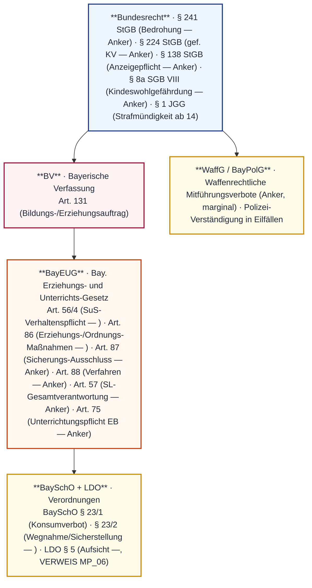
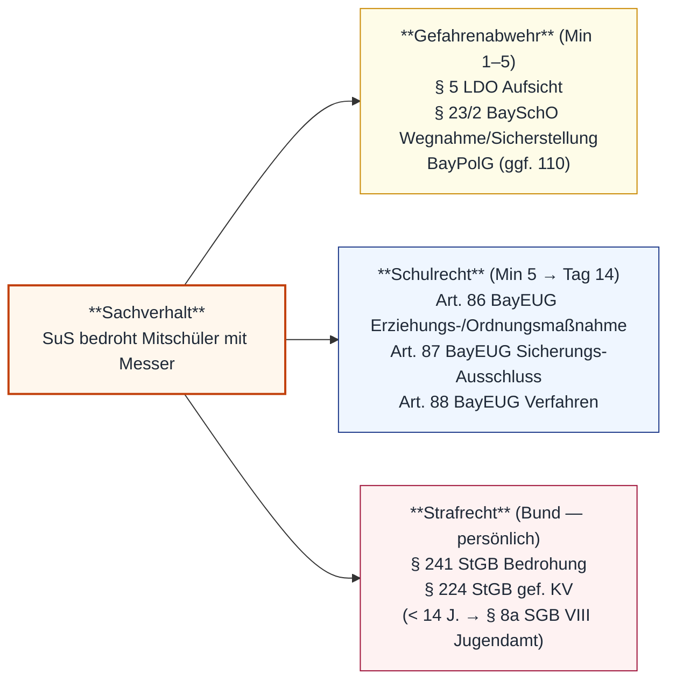

# MP_01 — Messer im Unterricht · Beschlagnahme + Strafrechts-Schnittstelle

ZALGM § 16 Nr. 1 · 2. Staatsexamen MS Bayern · Schwerpunkt 1.1 Sofortige Gefahrenabwehr · 1.2 Sicherstellung gefährlicher Gegenstände (§ 23/2 BaySchO) · 1.3 Erziehungs-/Ordnungs-/Sicherungsmaßnahmen (Art. 86–88 BayEUG) · 1.4 Strafrechts-Schnittstelle (§ 241 · § 224 StGB) · 1.5 Anzeigeberechtigt vs. -pflichtig.

## In aller Kürze

Bedrohung mit Messer im Unterricht ist ein **Drei-Pfad-Vorfall** in **drei Zeitfenstern**: **Phase 1 (Min 1–5)** = Gefahrenabwehr (Deeskalation + § 5 LDO Aufsichtspflicht + Sicherstellung des Messers nach **§ 23/2 BaySchO**); **Phase 2 (Min 5–30)** = Schulleitungs-Verständigung + Eltern-Mitteilung + Abwägung **Art. 87 BayEUG** Sicherungs-Ausschluss (vorläufig, bei akuter Gefahr); **Phase 3 (Tag 1–14)** = Anhörung + Ordnungsmaßnahme aus **Art. 86/2 BayEUG**-Katalog (12 Stufen) nach Verfahren **Art. 88 BayEUG**. Strafrechtlich (Bundesrecht, persönliche Strafbarkeit ab **vollendetem 14. Lebensjahr**): § 241 StGB Bedrohung + § 224 StGB gefährliche Körperverletzung (Messer = gefährliches Werkzeug). **LK = anzeigen-BERECHTIGT** (Fürsorgepflicht), **NICHT generell anzeigen-PFLICHTIG** (Ausnahme: § 138 StGB für taxative Liste schwerer Straftaten). **Bund-Land-Trennschärfe**: Strafrecht (StGB) trifft Täter persönlich; Schulrecht (BayEUG/BaySchO/LDO) löst Erziehungs-/Ordnungsmaßnahmen über Land/Schule aus. Zwei Homonym-Fallen kritisch: **„Sicherung"** = § 23 BaySchO (Gegenstand) ≠ Art. 87 BayEUG (Person); **„Anzeige"** = berechtigt ≠ pflichtig.

> **Hinweis** — Stoff-Überlapp mit MP_06 (Aufsichtspflicht-Material § 5 LDO + Art. 56/4 BayEUG + § 22 BaySchO): MP_01 vertieft den Sofort-Reaktions-/Eskalations-Pfad, MP_06 das Aufsichtspflichten-Substrat. § 5 LDO wird hier nur kurz zitiert — Voll-Verbatim siehe MP_06 A.2. Haftungsdreieck (Zivil/Disziplinar/Strafrecht) bei evtl. LK-Aufsichtsversagen → Cross-Ref MP_07 A.1.

## Norm-Kartografie (5 Ebenen)

| Ebene | Schwerpunkt-Normen MP_01 |
|---|---|
| **BV** | Art. 131 BV (Bildungs-/Erziehungsauftrag) |
| **BayEUG** | Art. 56/4 (SuS-Verhaltenspflicht — ) · Art. 86 (Erziehungs-/Ordnungsmaßnahmen —, Abs. 1+3 verbatim, Abs. 2 12-Punkte-Katalog Punkte 4-12 summarisch) · **Art. 87** (Sicherungs-Ausschluss vorläufig) · **Art. 88** (Verfahren mit Anhörung) · Art. 57 (SL-Gesamtverantwortung) · Art. 75 (EB-Unterrichtung) |
| **VO** | **BaySchO § 23/1** (Konsumverbot Alkohol/Rauschmittel — ) · **§ 23/2** (Mitführen/Wegnahme/Rückgabe — ) · **LDO § 5** (Aufsicht —, VERWEIS MP_06) |
| **Bundesrecht** | **§ 241 StGB** (Bedrohung — *Anker*) · **§ 224 StGB** (gefährliche KV — *Anker*) · **§ 138 StGB** (Anzeigepflicht-Schwelle — *Anker*) · **§ 8a SGB VIII** (Kindeswohlgefährdung — *Anker*) · **§ 1 JGG** (Strafmündigkeit ab vollendetem 14. Lj. — *Anker*) |
| **Nebenrecht** | WaffG (verbotene Waffen / Mitführungsverbote — *Anker, marginal*) · BayPolG (Polizei-Verständigung — *Anker*) |

---

# Teil A — Stoff

## A.1 Drei-Pfad-Struktur — Gefahrenabwehr / Schulrecht / Strafrecht

**Drei-Pfad-Tabelle**:

| Pfad | Rechtsgrundlage | Zeit | Adressat | Kumulativ? |
|---|---|---|---|---|
| **Gefahrenabwehr** | § 5 LDO + § 23/2 BaySchO + BayPolG-Anker | Min 1–5 | LK / SL / ggf. Polizei | ja |
| **Schulrecht** | Art. 86–88 BayEUG | Min 5 → Tag 14 | LK / SL / LK-Konferenz | ja |
| **Strafrecht** | § 241 + § 224 StGB; ab 14 J. JGG | Wochen → Monate | StA (LK = anzeigen-berechtigt) | ja |

!!! warning "⚠ Drei-Pfad-Logik — Fallen"
 - Die drei Pfade laufen **parallel/kumulativ** — keine Verdrängung.
 - **Strafrecht trifft Täter persönlich** (Schuldprinzip) — *NICHT* den Freistaat. Cross-Ref **MP_07 A.1+A.2** (Haftungsdreieck: Zivil → Freistaat-Außenhaftung; Strafrecht → persönlich).
 - **Anzeige ≠ Ordnungsmaßnahme** — zwei verschiedene Verfahren auf zwei Rechtsebenen (Bund vs. Land).
 - LK-Reaktion in **drei Zeitfenstern denken**, nicht „alles auf einmal".

---

## A.2 Sicherstellung — § 23/2 BaySchO (verbatim)

**§ 23 BaySchO** (verbatim):

> Abs. 1: ¹Der Konsum alkoholischer Getränke und sonstiger Rauschmittel ist Schülerinnen und Schülern innerhalb der Schulanlage sowie bei schulischen Veranstaltungen untersagt. ²Über Ausnahmen vom Verbot des Konsums alkoholischer Getränke ist im Einvernehmen mit dem Schulforum zu entscheiden.
> Abs. 2: ¹Das Mitbringen und Mitführen von gefährlichen Gegenständen sowie von sonstigen Gegenständen, die den Unterricht oder die Ordnung der Schule stören, ist den Schülerinnen und Schülern untersagt. ²Derartige Gegenstände können weggenommen und sichergestellt werden. ³Die Rückgabe gefährlicher Gegenstände darf bei minderjährigen Schülerinnen und Schülern nur an die Erziehungsberechtigten erfolgen.

**Direktionalität**: SuS → Mitführungs-/Konsum*verbot*; LK/SL → Wegnahme + Sicherstellung; Rückgabe → Erziehungsberechtigte (bei Minderjährigen).

**Drei-Sätze-Logik § 23/2**:

| Satz | Inhalt | Falle |
|---|---|---|
| **S. 1** | Verbot Mitbringen + Mitführen — zwei Kategorien: **gefährlich** UND **ordnungsstörend** | Beide Kategorien getrennt prüfen — Messer fällt in beide |
| **S. 2** | „**Können** weggenommen und sichergestellt werden" — Ermessen | NICHT „müssen" / „dürfen" — Ermessen, das im Gefahrenfall reduziert ist |
| **S. 3** | Rückgabe **nur an Erziehungsberechtigte** — gilt **nur für gefährliche** Gegenstände | Bei „sonstigen" Gegenständen normale Rückgabe an SuS möglich |

**§ 5 LDO Aufsichts-Schlüsselsatz** (, kurz; Vollzitat → **MP_06 A.2**):

> Insbesondere hat die Lehrkraft spätestens von Beginn des Unterrichts an im Unterrichtsraum anwesend zu sein und von diesem Zeitpunkt an während der gesamten Dauer des von ihr erteilten Unterrichts, erforderlichenfalls bis zum Weggang der Schülerinnen und Schüler, die Aufsicht zu führen.

**Cross-Ref**: § 5 LDO Aufsichts-Vollzitat + räumliche/zeitliche Reichweite + „erforderlichenfalls bis zum Weggang"-Falle siehe **MP_06 Teil A.2**. Im akuten Bedrohungsfall greift Aufsichtspflicht in verschärfter Form: **physische Präsenz** + **Deeskalation** + **ggf. Hausmeister/SL/Polizei verständigen**.

!!! warning "⚠ Fallen Sicherstellung"
 - **§ 23 BaySchO** = Sicherstellung **eines GEGENSTANDS** · **Art. 87 BayEUG** = Sicherungs-Ausschluss **einer PERSON**. Homonym-Falle „Sicherung". Wer die zwei Institute zusammenwirft, zeigt Oberflächen-Verständnis.
 - „**Können** weggenommen werden" — Ermessen; im Gefahrenfall (Bedrohung mit Messer) ist das Ermessen **auf Null reduziert** → faktische Pflicht zur Sicherstellung.
 - **Rückgabe**: bei Minderj. NUR an EB (S. 3). Bei volljährigen SuS Rückgabe an SuS möglich, ABER bei Waffen i.S.d. WaffG ggf. Polizei-Verwahrung.
 - Sonderregel S. 3 gilt NUR für „gefährliche" Gegenstände — nicht für „sonstige ordnungsstörende".

---

## A.3 Schulrechtliche Maßnahmen — Art. 86–88 BayEUG

### A.3.1 Art. 86 BayEUG — Erziehungs- + Ordnungsmaßnahmen

**Verbatim Abs. 1 + Abs. 3** (; Schlüsselsätze):

> Abs. 1: Zur Sicherung des Bildungs- und Erziehungsauftrags oder zum Schutz von Personen und Sachen können Erziehungsmaßnahmen gegenüber Schülerinnen und Schülern getroffen werden. Dazu zählt bei nicht hinreichender Beteiligung der Schülerin oder des Schülers am Unterricht auch eine Nacharbeit unter Aufsicht einer Lehrkraft. Soweit andere Erziehungsmaßnahmen nicht ausreichen, können Ordnungs- und Sicherungsmaßnahmen ergriffen werden. Maßnahmen des Hausrechts bleiben stets unberührt. Alle Maßnahmen werden nach dem Grundsatz der Verhältnismäßigkeit ausgewählt.
> Abs. 3: Unzulässig sind: 1. körperliche Züchtigung, 2. Verhängung von Ordnungsmaßnahmen gegenüber Klassen oder Gruppen als solche, 3. Ordnungsmaßnahmen nach Abs. 2 Nr. 6 und 7 gegenüber Schulpflichtigen in Berufsschulen [...], 4. Ordnungsmaßnahmen nach Abs. 2 Nr. 9 bis 12 gegenüber Schulpflichtigen in Pflichtschulen [...], 5. Ordnungsmaßnahmen auf Grund außerschulischen Verhaltens, soweit es nicht die Verwirklichung der Aufgaben der Schule gefährdet und 6. andere als die in Abs. 2 aufgeführten Ordnungsmaßnahmen.

**12-Punkte-Katalog Abs. 2** (; Punkte 1-3 verbatim, Punkte 4-12 summarisch — Detail-Pull ausstehend):

> Abs. 2 (Ordnungsmaßnahmen): 1. der schriftliche Verweis, 2. der verschärfte Verweis, 3. die Versetzung in eine Parallelklasse der gleichen Schule, 4. für die Dauer von bis zu vier Wochen Ausschluss vom Unterricht in einem Fach / von sonstigen Schulveranstaltungen / Versetzung von Ganztags- in Halbtagsklasse, 5. Ausschluss vom Unterricht für bis zu sechs Unterrichtstage, 6. bei schulischer Gefährdung Ausschluss zwei bis vier Wochen / Ausschluss von Schulveranstaltungen über vier Wochen / Versetzung in Halbtagsklasse über vier Wochen, 7. Ausschluss bis Schuljahresende bei schulischer Gefährdung, 8. Zuweisung an eine andere Schule (Pflichtschulen), 9. Androhung der Entlassung, 10. Entlassung von der Schule, 11. Ausschluss von allen Schulen einer Schulart, 12. Ausschluss von allen Schulen mehrerer Schularten nach rechtskräftiger Verurteilung.

**Subsidiarität + Zuständigkeits-Tabelle** (Auswahl Schwerpunkt-Stufen für Bedrohungs-Fälle):

| Stufe | Maßnahme (Art. 86/2) | Zuständigkeit | Indikation |
|---|---|---|---|
| 1 | Schriftlicher Verweis | LK | leichter Erstvorgang |
| 2 | Verschärfter Verweis | SL | mittelschwer |
| 5 | Ausschluss bis 6 Unterrichtstage | SL | schwere Pflichtverletzung |
| 6 | Ausschluss 2–4 Wochen / >4 Wo. Veranstaltungen / Halbtagsklasse | **Lehrerkonferenz** (bei schulischer Gefährdung) | sehr schwer (z. B. Messer-Bedrohung) |
| 9 | Androhung der Entlassung | LK-Konferenz | Wiederholung / hartnäckig |
| 10 | Entlassung | LK-Konferenz | äußerstes Mittel |

!!! warning "⚠ Fallen Art. 86 BayEUG"
 - **12 Stufen** im Katalog Abs. 2 — Punkte 4–12 (Detail-Wortlaute prüfen!).
 - **Subsidiarität**: erst Erziehungs-, dann Ordnungs-/Sicherungsmaßnahme (Abs. 1 S. 3).
 - **Kollektivstrafe verboten** (Abs. 3 Nr. 2). Klasse aus Sicherheitsgründen aus dem Raum schicken ist **Gefahrenabwehr-Maßnahme**, KEINE Ordnungsmaßnahme.
 - **Außerschulisches Verhalten** löst Ordnungsmaßnahme nur aus, wenn es Schul-Aufgaben gefährdet (Abs. 3 Nr. 5).
 - **Hausrecht bleibt unberührt** (Abs. 1 letzter Satz) — separate Rechtsgrundlage, nicht in Verhältnismäßigkeit eingebunden.
 - **Pflichtschulen-Schutz**: Maßnahmen Abs. 2 Nr. 9–12 sind ggü. Pflichtschulen-SuS unzulässig (Abs. 3 Nr. 4) — relevant für MS-Fall (Vollzeitschulpflicht!).

### A.3.2 Art. 87 BayEUG — Sicherungsmaßnahme / vorläufiger Ausschluss

> Bei akuter Gefahr für Leib oder Leben oder erheblicher Störung des Schulbetriebs kann die Schulleitung den vorläufigen Ausschluss eines SuS vom Unterricht aussprechen. Die Sicherungsmaßnahme endet, sobald über die Ordnungsmaßnahme bestandskräftig entschieden wurde.

**Direktionalität**: SL → vorläufiger Ausschluss SuS bei akuter Gefährdung.

**Falle**: Sicherungsmaßnahme (Art. 87) ≠ Sicherstellung Gegenstand (§ 23 BaySchO). Doppel-Nutzung des Worts „Sicherung" → Homonym-Falle.

### A.3.3 Art. 88 BayEUG — Verfahren

> Vor Verhängung von Ordnungsmaßnahmen sind die Schülerin oder der Schüler und die Erziehungsberechtigten zu hören. Die Maßnahme ist den Erziehungsberechtigten schriftlich rechtzeitig vor Vollzug mitzuteilen.

**Anhörungs-Schaltung**:

| Schritt | Norm | Wirkung |
|---|---|---|
| 1. Anhörung SuS + EB | Art. 88 BayEUG (sinngemäß) | Verfahrensrechte; **bei Sicherungsmaßnahme Art. 87 kann Anhörung im Eilfall nachgeholt werden** |
| 2. Verhältnismäßigkeitsprüfung | Art. 86/1 BayEUG (verbatim) | Auswahl-Maßstab |
| 3. Schriftliche Mitteilung an EB | Art. 88 BayEUG (sinngemäß) + Art. 75 BayEUG (Anker) | rechtzeitig vor Vollzug |
| 4. Zuständigkeit | Art. 86/2 BayEUG | je Stufe LK / SL / LK-Konferenz |

**Cross-Ref Verwaltungsverfahren**: Art. 28 BayVwVfG Anhörungsanker — schulrechtliche Spezialregelung in Art. 88 verdrängt für Ordnungsmaßnahmen.

---

## A.4 Strafrechts-Schnittstelle (Bund — persönlich)

### A.4.1 § 241 StGB — Bedrohung

> Wer einen Menschen mit der Begehung einer gegen ihn oder eine ihm nahestehende Person gerichteten rechtswidrigen Tat bedroht, wird mit Freiheitsstrafe bis zu einem Jahr oder mit Geldstrafe bestraft. Bei Bedrohung mit einem Verbrechen erhöhter Strafrahmen.

**Schul-Relevanz**: Bedrohung mit Messer („Stich!") trifft regelmäßig Tatbestand § 241; bei Drohung mit gefährlicher Körperverletzung (Verbrechen-Schwelle prüfen) erhöhter Strafrahmen.

### A.4.2 § 224 StGB — gefährliche Körperverletzung

> Wer die Körperverletzung u. a. mittels eines anderen gefährlichen Werkzeugs begeht, wird mit Freiheitsstrafe von 6 Monaten bis 10 Jahren bestraft. Versuch strafbar.

**Schul-Relevanz**: **Messer = klassisches gefährliches Werkzeug**. Schon die **Bedrohung** mit Messer kann § 241 verwirklichen, der **Einsatz** § 224 (Versuch ab Ansetzen). Das **Mitführen ohne konkrete Drohung** verwirklicht § 224 NICHT — aber § 23/2 BaySchO + ggf. WaffG.

### A.4.3 § 138 StGB — Anzeigepflicht (Schwelle)

> Wer von dem Vorhaben oder der Ausführung bestimmter schwerer Straftaten (Mord, Totschlag, Geiselnahme, schwere Raubtaten u. a.) glaubhaft erfährt und die Anzeige unterlässt, macht sich strafbar.

**Schul-Relevanz**: § 138 StGB löst NUR bei taxativ aufgeführten **schweren** geplanten Straftaten Anzeigepflicht aus. Eine spontane Bedrohung mit Messer im Streit fällt **regelmäßig NICHT** unter § 138.

### A.4.4 § 8a SGB VIII — Kindeswohlgefährdung (< 14 J.)

> Bei gewichtigen Anhaltspunkten für die Gefährdung des Kindeswohls hat das Jugendamt unter Hinzuziehung einer insoweit erfahrenen Fachkraft das Gefährdungsrisiko abzuschätzen. Kooperation mit Schule.

**Schul-Relevanz**: Bei strafunmündigen SuS (< 14 J., § 1 JGG) ersetzt **Jugendamt-Meldung über SL** die Strafanzeige. Schulische Ordnungsmaßnahmen aus Art. 86 BayEUG bleiben parallel anwendbar.

### A.4.5 LK = anzeigen-berechtigt vs. anzeigen-pflichtig

| Frage | Antwort | Norm |
|---|---|---|
| Ist die LK generell anzeigen-pflichtig? | **NEIN** | (kein allg. Pflicht-Tatbestand) |
| Wann ist die LK anzeigen-pflichtig? | **NUR § 138 StGB** — taxative Liste schwerer geplanter Straftaten | § 138 StGB *(Anker)* |
| Was ist die LK regulär? | **Anzeigen-berechtigt** aus Fürsorgepflicht | Praxis (Lessons Learned) |
| Wer entscheidet operativ? | **SL nach Abstimmung mit EB** | Art. 57 BayEUG *(Anker)* |
| Was bei akuter Gefahr? | Polizei verständigen (BayPolG-Anker) | BayPolG *(Anker)* |

!!! warning "⚠ Fallen Strafrechts-Schnittstelle"
 - **Strafe trifft Täter persönlich** (Schuldprinzip) — *NICHT* Freistaat. Anders als Amtshaftung (Art. 34 GG → Cross-Ref **MP_07 A.2**).
 - **Strafmündigkeit ab vollendetem 14. Lj.** (§ 1 JGG). Bei jüngeren SuS: § 8a SGB VIII + Schulrecht parallel.
 - **„Ich rufe sofort die Polizei!"** ist rechtlich falsch framed — erst Deeskalation + SL-Verständigung + Eltern; Polizei nur bei akuter Gefahr oder schwerer Tat.
 - **§ 138 StGB ≠ allgemeine Anzeigepflicht** — nur taxative Liste.
 - LK und SL können nach **Abstimmung** Strafanzeige erstatten (Fürsorge); Eltern haben **kein Vetorecht** gegen Strafanzeige.

---

## A.5 Drei Zeitfenster — Praxis-Choreographie

| Phase | Zeit | Rechtsgrundlage | Was tun? |
|---|---|---|---|
| **Phase 1** | Min 1–5 | § 5 LDO + § 23/2 BaySchO + BayPolG-Anker | Deeskalation („Stop! Leg das Messer hin!") · physisch dazwischengehen · Klasse ggf. raus (Gefahrenabwehr, KEINE Kollektivstrafe!) · Messer **nach § 23/2 BaySchO sicherstellen** · Hausmeister/SL/Polizei alarmieren |
| **Phase 2** | Min 5–30 | Art. 57 BayEUG (Anker) + Art. 75 BayEUG (Anker) + Art. 87 BayEUG (Anker) | SL **unverzüglich** informieren · EB benachrichtigen · Vorfall **dokumentieren** (Datum, Ort, Beteiligte, Zeugen, Wortlaut Drohung) · Abwägung **Art. 87 Sicherungs-Ausschluss** (akute Gefahr morgen?) · Messer dokumentiert sicher verwahren |
| **Phase 3** | Tag 1–14 | Art. 86 + 88 BayEUG | **Anhörung SuS + EB** (Art. 88) · Verhältnismäßigkeits-Abwägung · **Ordnungsmaßnahme aus Art. 86/2-Katalog** (Stufe je nach Schwere/Wiederholung/Unrechtseinsicht) · Strafanzeige ja/nein (Abstimmung SL+EB) · Sozialtraining / Konfliktmediation |

!!! tip "💡 Antwort-Schema Bedrohungs-Vorfall"
 1. **Sachverhalt** kurz benennen (drei Problemdimensionen markieren).
 2. **Phase 1 (Min 1–5)**: § 5 LDO + § 23/2 BaySchO + ggf. Polizei.
 3. **Phase 2 (Min 5–30)**: SL + EB + Art. 87-Abwägung.
 4. **Phase 3 (Tag 1–14)**: Art. 88 Anhörung → Art. 86/2 Maßnahme nach Verhältnismäßigkeit.
 5. **Strafrecht** parallel (§ 241 + § 224 StGB; LK = berechtigt, nicht pflichtig).
 6. **Pädagogische Stellungnahme**: Verhältnismäßigkeit + Opferbetreuung + Sozialtraining.

---

# Teil B — Top-8-Pflichtwissen (M01–M08)

| Karte | Inhalt |
|---|---|
| **M01** | **Drei-Pfad-Logik**: Gefahrenabwehr (§ 5 LDO + § 23/2 BaySchO) · Schulrecht (Art. 86–88 BayEUG) · Strafrecht (§ 241/§ 224 StGB). Kumulativ! |
| **M02** | **§ 23/2 BaySchO Drei-Sätze-Logik**: S. 1 Verbot (zwei Kategorien) · S. 2 „können" Wegnahme (Ermessen) · S. 3 Rückgabe NUR an EB bei minderj. SuS (gilt nur für „gefährliche", nicht „sonstige"). |
| **M03** | **Homonym-Falle „Sicherung"**: § 23 BaySchO = Gegenstand · Art. 87 BayEUG = Person. Beide separate Institute, parallel anwendbar. |
| **M04** | **Art. 86/2 BayEUG-Katalog**: 12 Stufen (1 Verweis · 2 verschärfter Verweis · 3 Parallelklasse · 4 4-Wochen-Ausschluss · 5 6-Tage-Ausschluss · 6 2-4-Wo. bei schul. Gefährdung · 7 Schuljahresende · 8 andere Schule · 9 Androhung Entlassung · 10 Entlassung · 11 Schulart-Ausschluss · 12 Mehr-Schularten-Ausschluss). Punkte 4-12. |
| **M05** | **Subsidiarität + Verhältnismäßigkeit (Art. 86/1)**: erst Erziehungs-, dann Ordnungs-/Sicherungsmaßnahme. Hausrecht bleibt unberührt. |
| **M06** | **Kollektivstrafverbot (Art. 86/3 Nr. 2)**: Klasse aus Raum schicken zur Gefahrenabwehr ist KEINE Ordnungsmaßnahme — kein Verstoß. Aber: Ordnungsmaßnahmen ggü. „Klassen oder Gruppen als solche" sind unzulässig. |
| **M07** | **LK = anzeigen-berechtigt, NICHT anzeigen-pflichtig**: Ausnahme § 138 StGB (taxative Liste schwerer geplanter Straftaten). Strafanzeige nach Abstimmung SL+EB. |
| **M08** | **Strafmündigkeit ab vollendetem 14. Lj.** (§ 1 JGG). Bei < 14 J.: § 8a SGB VIII Jugendamt + Schulrecht parallel. Strafrecht trifft Täter persönlich (Schuldprinzip) — NICHT Freistaat (Cross-Ref MP_07). |

---

# Teil C — Falle-Atlas (FA01–FA10)

| FA | Falle | Korrektur |
|---|---|---|
| **FA01** | „§ 23 BaySchO und Art. 87 BayEUG sind beide Sicherungsmaßnahmen" | **NEIN**. § 23 BaySchO sichert Gegenstand · Art. 87 BayEUG schließt Person vorläufig vom Unterricht aus. Zwei separate Institute, parallel anwendbar. |
| **FA02** | „LK ist anzeigen-pflichtig bei Bedrohung" | **NEIN**. LK ist regulär anzeigen-**berechtigt** (Fürsorge). § 138 StGB greift NUR bei taxativ aufgeführten schweren geplanten Straftaten. |
| **FA03** | „Klasse aus dem Raum schicken ist Kollektivstrafe" | **NEIN**. Gefahrenabwehr-Maßnahme nach § 5 LDO — keine Ordnungsmaßnahme iSd Art. 86. Art. 86/3 Nr. 2 verbietet nur Ordnungsmaßnahmen gegen die Gruppe als solche. |
| **FA04** | „Ausschluss 2–4 Wochen entscheidet die Schulleitung" | **NEIN**. Art. 86/2 Nr. 6 bei schulischer Gefährdung = **Lehrerkonferenz** (Anker; Detail-Wortlaut ). |
| **FA05** | „Bei Strafunmündigen reicht Strafanzeige" | **NEIN**. Unter 14 J. ist die Anzeige nutzlos (§ 1 JGG). Stattdessen **§ 8a SGB VIII Jugendamt-Meldung** (über SL) + Schulrecht-Maßnahmen. |
| **FA06** | „Rückgabe des Messers an SuS, wenn EB einverstanden" | **NEIN** für minderjährige SuS. § 23/2 S. 3: Rückgabe „**nur an** Erziehungsberechtigte". Direktion an SuS verboten. |
| **FA07** | „§ 23/2 BaySchO ist eine Beschlagnahme" | **VORSICHT** Begriffsverwirrung. § 23 BaySchO spricht von „**Wegnahme** + **Sicherstellung**" (verwaltungsrechtlich). „Beschlagnahme" ist strafprozessualer Begriff (§§ 94 ff. StPO) — separate Rechtsgrundlage durch Polizei/StA. |
| **FA08** | „Strafe trifft den Freistaat" | **NEIN**. Schuldprinzip — Strafe trifft Täter persönlich. Anders als Amtshaftung (Art. 34 GG → Freistaat-Außenhaftung; Cross-Ref **MP_07 A.2**). |
| **FA09** | „Anhörung kann vollständig nachgeholt werden" | **VORSICHT**. Bei Ordnungsmaßnahme (Art. 86/2 + Art. 88) ist Anhörung **vorab** Pflicht. Bei Sicherungsmaßnahme (Art. 87) im Eilfall nachholbar. Verfahrensfehler bei Vermischung. |
| **FA10** | „Bei volljährigen SuS gibt es keine Ordnungsmaßnahmen" | **NEIN**. Art. 86 gilt unabhängig vom Alter (Schul-bezogenes Pflichtenheft); aber Art. 86/3 Nr. 4 schützt **Pflichtschulen-SuS** vor Ausschlüssen Nr. 9–12. |

---

# Teil D — Fallbeispiele

## Fall 1 — Hauptfall: 7. Klasse, Messer, Drohung

**Sachverhalt**: Schüler Max (7. Klasse, 13 J.) bringt feststehendes Messer mit in den Unterricht. Bei Streit mit Mitschüler Tim hält er Tim das Messer vor und sagt „Wenn du noch mal so was sagst, stech ich dich!".

**Lösung**:

1. **Phase 1 (Min 1–5)** — Gefahrenabwehr nach § 5 LDO + § 23/2 BaySchO:
 - Zwischen Max und Tim treten, ruhig + bestimmt: „Stop! Leg das Messer sofort hin!".
 - Klasse ggf. aus Raum schicken (Gefahrenabwehr, keine Kollektivstrafe).
 - Messer **sicherstellen nach § 23/2 BaySchO** (Ermessen auf Null reduziert wegen akuter Gefahr).
 - SL/Hausmeister verständigen; bei Eskalation Polizei (110).
2. **Phase 2 (Min 5–30)** — SL + EB:
 - SL-Information unverzüglich (Art. 57-Anker).
 - EB benachrichtigen (Art. 75-Anker).
 - Dokumentation (Wortlaut, Zeugen, Beteiligte).
 - Abwägung Art. 87 Sicherungs-Ausschluss: bei fortgesetzter akuter Gefährdung **vorläufiger Ausschluss bis Bestand der Ordnungsmaßnahme**.
3. **Phase 3 (Tag 1–14)** — Schulrecht-Maßnahme:
 - **Anhörung** SuS + EB (Art. 88-Anker).
 - Verhältnismäßigkeits-Abwägung (Art. 86/1 verbatim).
 - Realistische Stufe bei Erst-Vorgang + Bedrohung: **Art. 86/2 Nr. 5** (Ausschluss bis 6 Unterrichtstage durch SL); bei schul. Gefährdung **Nr. 6** (2–4 Wochen, Lehrerkonferenz).
4. **Strafrecht parallel**:
 - Max ist 13 → **strafunmündig** (§ 1 JGG). Statt Strafanzeige: **§ 8a SGB VIII Jugendamt-Meldung** über SL.
 - § 241 StGB Bedrohung formal erfüllt; § 224 StGB nur bei Versuchsbeginn.
5. **Pädagogische Stellungnahme**:
 - Opferbetreuung Tim · Klassengespräch (altersgerecht, ohne Stigmatisierung) · EB-Gespräche beider Seiten · Sozialtraining + Konfliktmediation.

**Antwortkette**: § 5 LDO + § 23/2 BaySchO Sicherstellung → Art. 87 Abwägung Sicherungs-Ausschluss → Art. 88 Anhörung → Art. 86/2 Nr. 5/6 Maßnahme → § 8a SGB VIII Jugendamt (wegen Strafunmündigkeit) → Sozialtraining.

---

## Fall 2 — Variante: Schüler ist 14 (strafmündig)

**Sachverhalt**: Wie Fall 1, aber Max ist 14 (Jahrgangsstufen-Wiederholer).

**Lösung-Anpassung**:

1. **Strafrecht aktiv**: Max ist nach § 1 JGG strafmündig. § 241 StGB Bedrohung trifft Max persönlich (Schuldprinzip). Bei Versuchsbeginn ggf. § 224 StGB.
2. **LK = anzeigen-berechtigt**, NICHT anzeigen-pflichtig (§ 138 StGB nicht einschlägig). Strafanzeige durch SL nach Abstimmung mit EB möglich.
3. **§ 8a SGB VIII** kann parallel greifen (Jugendhilfe + Strafrecht schließen sich nicht aus).
4. **Schulrecht** identisch (Art. 86/2 Stufe nach Schwere).

**Antwortkette**: Strafmündigkeit § 1 JGG → § 241 StGB Bedrohung → LK anzeigen-berechtigt → SL/EB-Abstimmung → Schulrecht-Maßnahme parallel (Art. 86/2 Nr. 5/6).

---

## Fall 3 — Variante: Sicherungsmaßnahme-Homonym

**Sachverhalt**: SL ordnet nach dem Vorfall die „Sicherungsmaßnahme" an, dass Max nicht zurück in den Unterricht darf, bis das Verfahren abgeschlossen ist.

**Lösung**:

1. **Zwei Institute trennen**:
 - **§ 23/2 BaySchO** = Sicherstellung des **Messers** (Gegenstand). Bereits Phase 1 erfolgt.
 - **Art. 87 BayEUG** = Sicherungs-Ausschluss der **Person** Max — vorläufig, bis Ordnungsmaßnahme entschieden.
2. **Voraussetzung Art. 87** (Anker): akute Gefahr für Leib/Leben oder erhebliche Schulbetriebsstörung. Bei Messer-Bedrohung mit Wiederholungsgefahr regelmäßig erfüllt.
3. **Anhörung** kann nachgeholt werden (Eilfall) — siehe Art. 88 BayEUG-Anker.
4. **Endpunkt**: Sicherungsmaßnahme endet, sobald Ordnungsmaßnahme bestandskräftig ist (Art. 87 BayEUG-Anker).

**Antwortkette**: § 23/2 BaySchO (Gegenstand) ≠ Art. 87 BayEUG (Person) → akute Gefahr als Voraussetzung → Anhörung nachholbar → Endpunkt Bestandskraft Ordnungsmaßnahme.

---

## Fall 4 — Variante: Anzeigepflicht-Fehlframing

**Sachverhalt**: Eine Kollegin sagt sofort: „Wir müssen Strafanzeige erstatten, sonst machen wir uns selbst strafbar!".

**Lösung**:

1. **§ 138 StGB** löst Anzeigepflicht NUR bei taxativ aufgeführten schweren Straftaten aus (Mord, Totschlag, Geiselnahme, schwere Raubtaten u. a.). Eine spontane Bedrohung mit Messer im Streit fällt **regelmäßig NICHT** unter § 138.
2. **LK ist regulär anzeigen-berechtigt** aus Fürsorgepflicht — NICHT anzeigen-pflichtig.
3. **Operative Entscheidung**: SL trifft die Anzeige-Entscheidung nach Abstimmung mit EB (Art. 57 BayEUG-Anker).
4. **Bei strafunmündigem SuS** (< 14 J.): Anzeige nutzlos → § 8a SGB VIII Jugendamt-Meldung.

**Antwortkette**: § 138 StGB (taxative Liste, hier nicht einschlägig) → LK anzeigen-berechtigt (NICHT pflichtig) → SL/EB-Abstimmung → Bei < 14 J. § 8a SGB VIII statt Strafanzeige.

---

# Glossar / Abkürzungen

*[BaySchO]: Bayerische Schulordnung
*[BayEUG]: Bayerisches Erziehungs- und Unterrichts-Gesetz
*[LDO]: Lehrerdienstordnung
*[StGB]: Strafgesetzbuch
*[StPO]: Strafprozessordnung
*[SGB VIII]: Sozialgesetzbuch Achtes Buch — Kinder- und Jugendhilfe
*[JGG]: Jugendgerichtsgesetz
*[WaffG]: Waffengesetz (Bundesgesetz)
*[BayPolG]: Bayerisches Polizeiaufgabengesetz
*[BayVwVfG]: Bayerisches Verwaltungsverfahrensgesetz
*[GG]: Grundgesetz
*[BV]: Bayerische Verfassung
*[KV]: Körperverletzung
*[EB]: Erziehungsberechtigte
*[SL]: Schulleitung / Schulleiter:in
*[LK]: Lehrkraft
*[SuS]: Schülerinnen und Schüler
*[KL]: Klassenleitung
*[StA]: Staatsanwaltschaft
*[§ 23 BaySchO]: BaySchO § 23 — Verbote (Alkohol/Rauschmittel) + Wegnahme/Sicherstellung gefährlicher Gegenstände
*[§ 23/2 BaySchO]: BaySchO § 23 Abs. 2 — Mitführen + Wegnahme + Rückgabe gefährlicher Gegenstände bei Minderj. nur an EB
*[Art. 56/4 BayEUG]: BayEUG Art. 56 Abs. 4 — SuS-Verhaltenspflicht
*[Art. 86 BayEUG]: BayEUG Art. 86 — Erziehungs- und Ordnungsmaßnahmen (Abs. 1+3 verbatim, Abs. 2 12-Punkte-Katalog )
*[Art. 87 BayEUG]: BayEUG Art. 87 — Sicherungsmaßnahme / vorläufiger Ausschluss (Anker; )
*[Art. 88 BayEUG]: BayEUG Art. 88 — Verfahren bei Ordnungsmaßnahmen (Anker; )
*[Art. 57 BayEUG]: BayEUG Art. 57 — SL-Gesamtverantwortung (Anker; )
*[Art. 75 BayEUG]: BayEUG Art. 75 — Unterrichtungspflicht ggü. EB (Anker; )
*[§ 5 LDO]: LDO § 5 — Aufsichtspflicht (, VERWEIS MP_06 A.2)
*[§ 241 StGB]: StGB § 241 — Bedrohung (Bund-Anker; )
*[§ 224 StGB]: StGB § 224 — gefährliche Körperverletzung (Bund-Anker; )
*[§ 138 StGB]: StGB § 138 — Anzeigepflicht geplanter schwerer Straftaten (Bund-Anker; )
*[§ 8a SGB VIII]: SGB VIII § 8a — Schutzauftrag bei Kindeswohlgefährdung (Bund-Anker; )
*[§ 1 JGG]: JGG § 1 — Strafmündigkeit ab vollendetem 14. Lebensjahr (Bund-Anker; )
*[Sicherungsmaßnahme]: Art. 87 BayEUG — vorläufiger Ausschluss einer Person (NICHT zu verwechseln mit Sicherstellung eines Gegenstands § 23/2 BaySchO!)
*[Sicherstellung]: § 23/2 BaySchO — Wegnahme + Sicherstellung eines Gegenstands (NICHT zu verwechseln mit Art. 87 Sicherungs-Ausschluss Person)
*[Anzeigeberechtigt]: LK ist regulär berechtigt zur Strafanzeige aus Fürsorgepflicht — NICHT generell anzeigepflichtig
*[Anzeigepflichtig]: NUR § 138 StGB — taxative Liste schwerer geplanter Straftaten
*[Strafmündigkeit]: § 1 JGG — ab vollendetem 14. Lebensjahr
