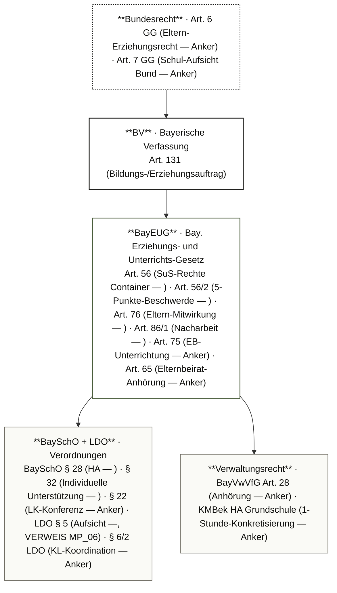
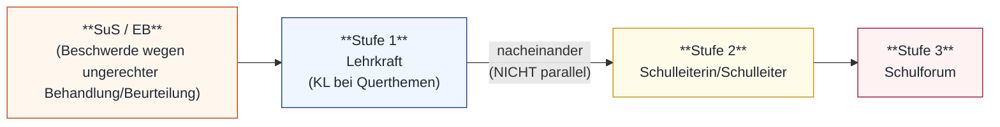

# MP_02 — Hausaufgaben + Beschwerde-Verfahren

ZALGM § 16 Nr. 2 · 2. Staatsexamen MS Bayern · Schwerpunkt 2.1 § 28 BaySchO Drei-Sätze-Logik · 2.2 MS-Spezifik (KEINE feste Stundenzahl) · 2.3 Beschwerde-Eskalations-Kette Art. 56/2 Nr. 5 BayEUG · 2.4 Eltern-Mitwirkungspflicht Art. 76 BayEUG · 2.5 HA ≠ LNW (Drift-Falle).

## In aller Kürze

Hausaufgaben sind nach **§ 28 BaySchO** ein notwendiger und verbindlicher Teil der Unterrichts- und Erziehungsarbeit — Stellpflicht der LK + **Drei-Sätze-Logik Abs. 1**: (1) gestellt werden, sodass sie bei „durchschnittlichem Leistungsvermögen in angemessener Zeit" bearbeitbar sind; (2) **Lehrerkonferenz legt vor Schuljahresbeginn die Grundsätze fest**; (3) **Sonntage, Feiertage UND Ferien sind freizuhalten** (drei Kategorien!). **MS-Spezifik**: KEINE feste Stundenzahl — das „bis zu einer Stunde"-Limit gilt **nur Grundschule + GS-Stufe Förderschulen** (§ 28/2 S. 1). HA-**Differenzierung** steht in **§ 32/2 Nr. 6 BaySchO** — NICHT in § 28 selbst. Beschwerde-Eskalation von SuS/EB: **Art. 56/2 Nr. 5 BayEUG** — „**nacheinander**" Lehrkraft → SL → Schulforum (NICHT parallel). Eltern haben **Mitwirkungspflicht Art. 76 BayEUG** — „achten auf" UND „unterstützen". **HA ≠ Leistungsnachweis** — Benotungsverbot folgt aus LNW-Definition (Art. 52 BayEUG) + Lehrplan-Vorgaben, NICHT direkt aus § 28 (Drift-Falle!). Bei systematisch nicht erledigten HA: Erziehungsmaßnahme „**Nacharbeit unter Aufsicht einer Lehrkraft**" nach **Art. 86/1 BayEUG** — eskaliert über EB-Mitteilung (Art. 75-Anker) zur Ordnungsmaßnahme nach Verhältnismäßigkeit.

> **Hinweis** — Stoff-Überlapp mit MP_05 (SuS-Rechte/Pflichten Container Art. 56) + MP_06 (LK-Dienstpflichten LDO + § 14/4 LDO Drittauskunft als Notenauskunft-Anker). MP_02 vertieft den HA-Spezialpfad + KL-Beschwerde-Bearbeitung; SuS-Rechte-Vollzitat siehe MP_05; LDO § 14/4-Drittauskunfts-Stoff (Notenauskunfts-Falle) siehe MP_06 A.3.

## Norm-Kartografie (5 Ebenen)

| Ebene | Schwerpunkt-Normen MP_02 |
|---|---|
| **BV** | Art. 131 BV (Bildungs-/Erziehungsauftrag) |
| **BayEUG** | Art. 56 (Container — ) · **Art. 56/2** (5-Punkte SuS-Rechte / Beschwerde-Eskalation — ) · **Art. 76** (Eltern-Mitwirkung — ) · **Art. 86/1** (Erziehungsmaßnahmen incl. Nacharbeit — ) · Art. 52 (LNW-Definition für HA-Abgrenzung — Anker, partial in Repo) · Art. 75 (EB-Unterrichtung — Anker) · Art. 64/65 (Elternbeirat — Anker) · Art. 57 (SL-Gesamtverantwortung — Anker) |
| **VO** | **BaySchO § 28** (HA Abs. 1+2 —; Abs. 3-6 partial) · **§ 32/2 Nr. 6** (HA-Differenzierung — ) · § 22 BaySchO (LK-Konferenz — Anker) · **LDO § 5** (Aufsicht für Nacharbeit —, VERWEIS MP_06) |
| **Verwaltungsrecht** | BayVwVfG Art. 28 (Anhörung — Anker) · KMBek HA Grundschule (1-Stunde-Konkretisierung — Anker) |
| **Bundesrecht** | Art. 6 GG (Eltern-Erziehungsrecht — Anker) · Art. 7 GG (Schul-Aufsicht — Anker) |

---

# Teil A — Stoff

## A.1 Was sind Hausaufgaben — § 28 BaySchO

**§ 28 BaySchO Abs. 1 + Abs. 2** (verbatim):

> Abs. 1: ¹Um den Lehrstoff einzuüben und die Schülerinnen und Schüler zu eigener Tätigkeit anzuregen, werden Hausaufgaben gestellt, die bei durchschnittlichem Leistungsvermögen in angemessener Zeit unter Berücksichtigung der Anforderungen des Nachmittagsunterrichts sowie der Inanspruchnahme durch die praktische Ausbildung an beruflichen Schulen bearbeitet werden können. ²Die Lehrerkonferenz legt vor Unterrichtsbeginn des Schuljahres die Grundsätze für die Hausaufgaben fest. ³Sonntage, Feiertage und Ferien sind von Hausaufgaben freizuhalten.
> Abs. 2 (Auszug Sätze 1–2): ¹An Grundschulen und Grundschulstufen der Förderschulen gilt eine Zeit von bis zu einer Stunde als angemessen. ²An Förderschulen ist auch die individuelle Leistungsfähigkeit der einzelnen Schülerin oder des einzelnen Schülers zu berücksichtigen.

**§ 28/2 S. 3 BaySchO** — schulart-spezifischer Verbots-Anker für GS + GS-Stufe FöS (sinnerhaltende Wiedergabe):

An Tagen mit verpflichtendem Nachmittagsunterricht dürfen an Grundschulen und Förderschulen **keine schriftlichen Hausaufgaben** für den nächsten Tag gestellt werden; eine Abweichung ist nur im Einvernehmen mit dem Elternbeirat zulässig. Schul-Adressat ausschließlich GS + GS-Stufe FöS (NICHT Mittelschule).

> *Detail-Hinweis*: Abs. 3–6 (HA-Detail-Bestimmungen für weiterführende Schularten) — *; Detail-Wortlaut-Pull ausstehend*.

**Drei-Sätze-Logik § 28/1** (Kernstruktur):

| Satz | Inhalt | Direktionalität | Falle |
|---|---|---|---|
| **S. 1** | Zweck (Lehrstoff einüben + eigener Tätigkeit anregen) + **Maßstab** (durchschnittliches Leistungsvermögen, angemessene Zeit, Berücksichtigung NM-Unterricht + praktische Ausbildung) | LK → HA an SuS (Pflicht) | Maßstab ist „durchschnittliches Leistungsvermögen" (Wortlaut!), NICHT „individuelle Bearbeitbarkeit" |
| **S. 2** | **LK-Konferenz** legt vor Schuljahresbeginn die Grundsätze fest | LK-Konferenz → schulinterne Norm | LK-Konferenz-Beschluss ist PFLICHT (nicht optional) |
| **S. 3** | **Sonntage UND Feiertage UND Ferien** freihalten | Schule → Pause-Pflicht | Drei Kategorien (Wortlaut!) — Wochenend-HA bis Sonntag = Verstoß |

!!! tip "💡 Drei-Sätze-Logik als Antwort-Schema"
 1. **Zweck + Maßstab** (S. 1) — HA sind Einübung + Eigentätigkeit; Maßstab durchschnittlich-bearbeitbar.
 2. **LK-Konferenz-Grundsätze** (S. 2) — schulinterne Norm vor Schuljahresbeginn; bei systemischen HA-Konflikten zentraler Hebel.
 3. **Sonntage/Feiertage/Ferien frei** (S. 3) — drei Kategorien, kein Spielraum.

**Verbindlichkeitsgrad**:

| Frage | Antwort | Norm |
|---|---|---|
| Müssen HA gestellt werden? | **JA** — Stellpflicht der LK aus § 28/1 S. 1 | § 28/1 BaySchO |
| Sind HA ein LNW? | **NEIN** — gilt aus LNW-Definition (Art. 52 BayEUG) + Lehrplan, NICHT aus § 28 selbst | Cross-Ref Art. 52 BayEUG (Anker) + MP_05 |
| Müssen HA benotet werden? | **NEIN** — Benotungs-VERBOT aus LNW-Definition + Lehrplan; HA dienen Einübung, nicht Leistungsbewertung | Cross-Ref Art. 52 (Anker) + Lehrplan |
| Welche Zeitobergrenze gilt? | **GS + GS-Stufe FöS**: bis zu 1 Stunde (§ 28/2 S. 1); **MS**: keine feste Obergrenze | § 28/2 BaySchO + KMBek-Anker |

---

## A.2 Angemessene Zeit — GS vs. MS-Spezifik + Differenzierung

### A.2.1 Maßstab-Tabelle „angemessene Zeit"

| Schulart | Zeitobergrenze | Norm | Falle |
|---|---|---|---|
| **Grundschule + GS-Stufe Förderschulen** | „bis zu **einer Stunde**" als angemessen | § 28/2 S. 1 BaySchO | „bis zu" = Obergrenze, NICHT Mindestwert |
| **Mittelschule** | KEINE feste Obergrenze; Maßstab „angemessen" + LK-Konferenz-Grundsätze | § 28/1 S. 1+2 BaySchO | NIEMALS GS-Limit auf MS übertragen |
| **Förderschulen** (auch nicht GS-Stufe) | individuelle Leistungsfähigkeit berücksichtigen | § 28/2 S. 2 BaySchO | individuelles Kriterium ergänzt das Durchschnitts-Kriterium |
| **Mit verpflichtendem NM-Unterricht (GS+FöS)** | KEINE schriftlichen HA für nächsten Tag | § 28/2 S. 3 BaySchO | Abweichung nur im Einvernehmen mit Elternbeirat |

**Drei-Stunden-Fall in 7. Klasse MS** (Hauptfall): grenzwertig — deutet auf eines von zwei Problemen:

1. **Individuelles Problem**: SuS braucht mehr Zeit (Förderbedarf, Konzentration, LRS, ADHS). → § 32 BaySchO Differenzierung.
2. **Systemisches Problem**: HA-Gestaltung zu umfangreich oder didaktisch ungeeignet. → LK-Konferenz-Grundsätze prüfen + ggf. neu beschließen.

### A.2.2 § 32 BaySchO — HA-Differenzierung (Nr. 6 im 7-Maßnahmen-Katalog)

**§ 32 BaySchO** (verbatim):

> Abs. 1: ¹Individuelle Unterstützung wird durch pädagogische, didaktisch-methodische und schulorganisatorische Maßnahmen sowie die Verwendung technischer Hilfen gewährt, soweit nicht die Leistungsfeststellung berührt wird. ²Sie kommt insbesondere in Betracht bei Entwicklungsstörungen schulischer Fertigkeiten, bei Behinderungen, in sonderpädagogischen Förderschwerpunkten sowie bei chronischen oder schweren Erkrankungen.
> Abs. 2: Zulässig sind insbesondere folgende Maßnahmen: 1. besondere Arbeitsmittel zuzulassen oder bereitzustellen, 2. geeignete Räumlichkeiten auszuwählen und auszustatten, 3. Pausenregelungen individuell für die Betroffenen zu gestalten, 4. Hand- und Lautzeichen sowie feste Symbole einzusetzen, 5. Arbeitsanweisungen den Betroffenen individuell zu erläutern, 6. bei den Hausaufgaben unter Berücksichtigung der schulartspezifischen Anforderung zu differenzieren, 7. verstärkt Formen der Visualisierung und Verbalisierung zu nutzen.

**Schlüssel-Insights**:

- **HA-Differenzierung steht in § 32/2 Nr. 6 BaySchO**, NICHT in § 28!
- Schranke (Abs. 1 S. 1): „**soweit nicht die Leistungsfeststellung berührt wird**" — Abgrenzung zu Nachteilsausgleich (§ 33 BaySchO).
- 7-Maßnahmen-Katalog Abs. 2 (Differenzierung = Nr. 6, schulart-spezifisch).

!!! warning "⚠ Fallen Angemessene Zeit + Differenzierung"
 - **MS hat KEINE 1-Stunde-Obergrenze**. Wer das aus § 28/2 S. 1 ableitet, verwechselt Schularten.
 - **§ 28 ≠ § 32**: HA-Differenzierung steht in **§ 32/2 Nr. 6**, NICHT in § 28.
 - **Schranke § 32/1 S. 1**: Differenzierung gilt NUR, „soweit nicht die Leistungsfeststellung berührt wird" — bei LNW kein Differenzierungs-Spielraum (sondern ggf. Nachteilsausgleich nach § 33).
 - „Bis zu einer Stunde" ist **Obergrenze**, NICHT Mindestwert (§ 28/2 S. 1 für GS).
 - Maßstab im Wortlaut: **„durchschnittliches Leistungsvermögen"** — NICHT „individuelle Bearbeitbarkeit".

---

## A.3 Beschwerde-Eskalations-Kette — Art. 56/2 Nr. 5 BayEUG

### A.3.1 Verbatim — Art. 56/2 BayEUG (5 SuS-Rechte)

**Art. 56/2 BayEUG** (verbatim):

> Die Schülerinnen und Schüler haben das Recht, entsprechend ihrem Alter und ihrer Stellung innerhalb des Schulverhältnisses 1. sich am Schulleben zu beteiligen, 2. im Rahmen der Schulordnung und der Lehrpläne an der Gestaltung des Unterrichts mitzuwirken, 3. über wesentliche Angelegenheiten des Schulbetriebs hinreichend unterrichtet zu werden, 4. Auskunft über ihren Leistungsstand und Hinweise auf eine Förderung zu erhalten, 5. bei als ungerecht empfundener Behandlung oder Beurteilung sich nacheinander an Lehrkräfte, an die Schulleiterin oder den Schulleiter und an das Schulforum zu wenden.

**Drei-Stufen-Beschwerde-Kette** (Nr. 5):

**5-Punkte-Tabelle Art. 56/2** (kompakt):

| Nr. | Recht | Schul-Relevanz HA-Fall |
|---|---|---|
| 1 | sich am Schulleben beteiligen | (Hintergrund) |
| 2 | im Rahmen Schulordnung + Lehrpläne mitwirken | (Hintergrund) |
| 3 | hinreichend unterrichtet werden über wesentliche Angelegenheiten | EB-Unterrichtung Cross-Ref Art. 75-Anker |
| 4 | Auskunft über Leistungsstand + Hinweise auf Förderung | bei HA-Problemen relevant: Leistungsstand-Auskunft + Förderhinweise |
| **5** | **bei als ungerecht empfundener Behandlung/Beurteilung nacheinander LK → SL → Schulforum** | **Kern Beschwerde-Eskalation** |

!!! warning "⚠ Falle Beschwerde-Kette"
 - „**Nacheinander**" ist Wortlaut — NICHT „parallel an alle drei Stellen gleichzeitig".
 - Maßstab: „**entsprechend ihrem Alter und ihrer Stellung innerhalb des Schulverhältnisses**" — kein 1:1-Rechte-Übertrag von Erwachsenen.
 - Punkt 4 = „Auskunft über Leistungsstand UND Hinweise auf Förderung" — beides!
 - Bei HA-Beschwerde der Mutter: das ist **kein** Art. 56/2 Nr. 5-Verfahren der SuS, sondern **Eltern-Mitwirkung Art. 76** + ggf. Elternbeirat (Art. 64/65-Anker).

### A.3.2 KL-Bearbeitungs-Stufenplan (Praxis)

| Stufe | Was tun? | Norm |
|---|---|---|
| **1. Sondierungsgespräch Mutter** | Arbeitsplatz, Ablenkungen, Beginn-Zeit, Block-Arbeit, Lernbeeinträchtigungen, Zeit-pro-Fach | Art. 76 BayEUG (Eltern-Mitwirkung) + § 14 LDO Verschwiegenheit (Cross-Ref MP_06) |
| **2. Austausch Fach-LK** | Welche Aufgaben? Koordination? Häufung Abgabetermine? | LDO § 6/2 Anker (KL-Koordination) + § 22 BaySchO Anker (LK-Konferenz-Forum) |
| **3. LK-Konferenz** | LK-Konferenz-Grundsätze prüfen + ggf. neu beschließen | § 28/1 S. 2 BaySchO |
| **4. Elternbeirat** | bei Klassen-/Schul-Klima-Berührung | Art. 64/65 BayEUG-Anker |
| **5. Schulleitung** | bei systemischer Klärung | Art. 57 BayEUG-Anker (SL-Gesamtverantwortung) |

---

## A.4 Erziehungsmaßnahmen bei HA-Verstößen — Art. 86/1 BayEUG (Nacharbeit)

**Art. 86/1 BayEUG** (verbatim; Nacharbeit-Schlüsselsatz):

> Zur Sicherung des Bildungs- und Erziehungsauftrags oder zum Schutz von Personen und Sachen können Erziehungsmaßnahmen gegenüber Schülerinnen und Schülern getroffen werden. Dazu zählt bei nicht hinreichender Beteiligung der Schülerin oder des Schülers am Unterricht auch eine Nacharbeit unter Aufsicht einer Lehrkraft. Soweit andere Erziehungsmaßnahmen nicht ausreichen, können Ordnungs- und Sicherungsmaßnahmen ergriffen werden. Maßnahmen des Hausrechts bleiben stets unberührt. Alle Maßnahmen werden nach dem Grundsatz der Verhältnismäßigkeit ausgewählt.

**§ 5 LDO** (verbatim; Schlüsselsatz für Nacharbeit-Beaufsichtigung):

> Insbesondere hat die Lehrkraft spätestens von Beginn des Unterrichts an im Unterrichtsraum anwesend zu sein und von diesem Zeitpunkt an während der gesamten Dauer des von ihr erteilten Unterrichts, erforderlichenfalls bis zum Weggang der Schülerinnen und Schüler, die Aufsicht zu führen.

**Eskalations-Pfad bei systematisch nicht erledigten HA**:

| Schritt | Maßnahme | Norm |
|---|---|---|
| 1 | LK-Gespräch + Mutter-Information | (informell) |
| 2 | **Erziehungsmaßnahme: Nacharbeit unter Aufsicht** | Art. 86/1 BayEUG + § 5 LDO Aufsicht |
| 3 | EB-Mitteilung (schriftlich) | Art. 75 BayEUG-Anker |
| 4 | LK-Konferenz-Grundsätze prüfen | § 28/1 S. 2 BaySchO |
| 5 | Bei fortgesetzter Pflichtverletzung: Ordnungsmaßnahme aus Art. 86/2-Katalog mit Verhältnismäßigkeit (Art. 86/1 letzter Satz) + Anhörung (Art. 88-Anker) | Art. 86/2 + 88 BayEUG (Cross-Ref MP_01 + MP_05) |

!!! warning "⚠ Fallen Erziehungsmaßnahmen bei HA"
 - **Nacharbeit** = Erziehungsmaßnahme (Art. 86/1) — NICHT Ordnungsmaßnahme.
 - Nacharbeit „**unter Aufsicht einer Lehrkraft**" — Aufsichtspflicht § 5 LDO greift.
 - **Subsidiarität**: erst Erziehungs-, dann Ordnungs-/Sicherungsmaßnahme.
 - Bei Eskalation Ordnungsmaßnahme: **Verfahren Art. 88 BayEUG** (Anker) — Anhörung + EB-Mitteilung.
 - **Art. 76 BayEUG** = Eltern-Pflicht zur Unterstützung der Erziehungsarbeit. Bei dauerhaftem Eltern-Boykott der HA-Erfüllung: Mitteilung SL + ggf. Jugendamt-Anker.

---

## A.5 HA ≠ LNW — Drift-Falle (Benotungs-Verbot folgt aus LNW-Definition)

### A.5.1 Drift-Aufklärung

| Aussage | Wahr/Falsch | Begründung |
|---|---|---|
| „§ 28 BaySchO verbietet HA-Benotung" | **FALSCH** (Drift-Falle) | § 28 sagt zur Benotung NICHTS. Wortlaut nur: Stellpflicht + Maßstab + LK-Konferenz-Grundsätze + Sonn-/Feiertage/Ferien frei |
| „HA dürfen nicht benotet werden" | **WAHR** | Folgt aus **LNW-Definition** (Art. 52 BayEUG-Anker + Lehrplan-Vorgaben) — HA dienen der Einübung, nicht der Leistungsbewertung |
| „Schlechte Note in HA als Sanktion zulässig" | **FALSCH** | Verstoß gegen LNW-Definitions-Pfad. Stattdessen: Erziehungsmaßnahme „Nacharbeit unter Aufsicht" (Art. 86/1 verbatim) |
| „Fehlt die HA dauerhaft, ist Ordnungsmaßnahme zulässig" | **WAHR** | Art. 86/2 BayEUG-Katalog (mit Subsidiarität + Verhältnismäßigkeit + Anhörung Art. 88-Anker) |

### A.5.2 Cross-Ref Notenauskunfts-Falle (MP_06)

Bei Mutter-Gespräch mit Notenbezug (z. B. „Die anderen Kinder schaffen das doch auch!"): **§ 14/4 LDO** Drittauskunfts-Logik (Cross-Ref **MP_06 A.3**) — KEIN „Notengeheimnis" ggü. SuS/EB selbst, ABER kein **vergleichender** Bezug auf andere SuS namentlich. Lara-Note geht andere Eltern nichts an.

!!! warning "⚠ Drift-Falle HA ≠ LNW"
 - **§ 28 BaySchO sagt zur Benotung NICHTS** — Verbot folgt aus LNW-Definitions-Pfad.
 - „HA dürfen nicht benotet werden" ist korrekt, aber Begründung MUSS über Art. 52 BayEUG-Anker + Lehrplan laufen.
 - „**Lieblingsfalle der Schulräte**" — verdeckt im Fallcover (Mutter-beschwert-sich, Häufung vor Zwischenzeugnis, etc.).
 - Erziehungsmaßnahme Nacharbeit (Art. 86/1) ist erlaubt; HA-Benotung als Sanktion NICHT.
 - Notenauskunft ggü. EB ist Recht aus Art. 56/2 Nr. 4 BayEUG + § 14/4 LDO-Drittauskunfts-Schranke (Cross-Ref MP_06).

---

# Teil B — Top-8-Pflichtwissen (H01–H08)

| Karte | Inhalt |
|---|---|
| **H01** | **§ 28/1 BaySchO Drei-Sätze-Logik**: (1) Stellpflicht + Maßstab „durchschnittlich-bearbeitbar" · (2) **LK-Konferenz** legt Grundsätze vor Schuljahresbeginn fest · (3) **Sonntage UND Feiertage UND Ferien** freihalten (drei Kategorien!). |
| **H02** | **MS hat KEINE feste HA-Stundenobergrenze**. „bis zu einer Stunde" gilt NUR GS + GS-Stufe FöS (§ 28/2 S. 1). Maßstab MS: „angemessen" + LK-Konferenz-Grundsätze. |
| **H03** | **HA-Differenzierung steht in § 32/2 Nr. 6 BaySchO** — NICHT in § 28! Schranke § 32/1 S. 1: „soweit nicht die Leistungsfeststellung berührt wird" (Abgrenzung Nachteilsausgleich § 33). |
| **H04** | **Beschwerde-Eskalation Art. 56/2 Nr. 5 BayEUG**: SuS/EB → **nacheinander** Lehrkraft → Schulleitung → Schulforum. NICHT parallel! |
| **H05** | **Eltern-Mitwirkungspflicht Art. 76 BayEUG**: „achten auf" UND „unterstützen" — zwei verschiedene Pflichten. Bei minderj. Schulpflichtigen Pflicht zu regelmäßiger Unterrichts-Teilnahme. |
| **H06** | **Erziehungsmaßnahme Nacharbeit Art. 86/1 BayEUG**: bei nicht hinreichender Beteiligung am Unterricht „auch eine Nacharbeit unter Aufsicht einer Lehrkraft". Aufsicht greift § 5 LDO (Cross-Ref MP_06). Subsidiarität: erst Erziehungs-, dann Ordnungsmaßnahme. |
| **H07** | **HA ≠ LNW (Drift-Falle)**: § 28 sagt zur Benotung NICHTS. Verbot folgt aus **LNW-Definition** (Art. 52 BayEUG-Anker) + Lehrplan. Schlechte HA-Note als Sanktion = unzulässig. |
| **H08** | **KL-Stufenplan bei HA-Beschwerde**: 1. Sondierung Mutter · 2. Austausch Fach-LK · 3. LK-Konferenz-Grundsätze · 4. Elternbeirat · 5. SL. KL-Koordinationspflicht aus LDO § 6/2 (Anker). |

---

# Teil C — Falle-Atlas (FA01–FA10)

| FA | Falle | Korrektur |
|---|---|---|
| **FA01** | „§ 28 BaySchO verbietet HA-Benotung" | **NEIN** (Drift-Falle). § 28 sagt zur Benotung NICHTS. Verbot folgt aus LNW-Definition (Art. 52 BayEUG-Anker) + Lehrplan. |
| **FA02** | „MS hat 1-Stunde-Obergrenze für HA" | **NEIN**. „bis zu einer Stunde" gilt NUR GS + GS-Stufe FöS (§ 28/2 S. 1). MS hat keine feste Stundenzahl. |
| **FA03** | „HA-Differenzierung steht in § 28 BaySchO" | **NEIN**. Steht in **§ 32/2 Nr. 6 BaySchO**! § 28 selbst regelt nur Zweck + Maßstab + LK-Konferenz-Grundsätze + Sonn-/Feiertage/Ferien. |
| **FA04** | „Beschwerde gleichzeitig an LK + SL + Schulforum" | **NEIN**. Art. 56/2 Nr. 5 sagt **„nacheinander"** — sequenziell, NICHT parallel. |
| **FA05** | „Sonntage sind frei, aber Samstage nicht" | **VORSICHT**. § 28/1 S. 3: drei Kategorien (Sonntage UND Feiertage UND Ferien). Samstage **nicht** explizit geschützt — aber „angemessene Zeit" (S. 1) als Schranke. Wochenend-HA bis Sonntag-Belastung = Verstoß. |
| **FA06** | „LK-Konferenz-Grundsätze sind optional" | **NEIN**. § 28/1 S. 2: „**legt** vor Unterrichtsbeginn des Schuljahres die Grundsätze … **fest**" (Pflicht). |
| **FA07** | „Schlechte Note in HA als Sanktion zulässig" | **NEIN**. HA ≠ LNW (Art. 52 BayEUG-Anker + Lehrplan). Stattdessen **Nacharbeit unter Aufsicht** (Art. 86/1 verbatim). |
| **FA08** | „Das ist Sache der Fachlehrkraft, KL hat damit nichts zu tun" | **NEIN**. **LDO § 6/2 KL-Koordinationspflicht** (Anker) + LDO § 3/3 LK-Kooperationspflicht (Anker). „Nicht mein Problem" ist dienstrechtlich problematisch — Cross-Ref MP_06. |
| **FA09** | „Eltern können HA-Erledigung verweigern, wenn sie übertrieben finden" | **NEIN**. Art. 76 BayEUG: Eltern-**Mitwirkungspflicht** (Pflichtgesetz). Bei systematischem Eltern-Boykott: Mitteilung SL + Art. 75 BayEUG-Anker EB-Unterrichtung + ggf. Jugendamt. |
| **FA10** | „Elternbeirat entscheidet die Beschwerde der einzelnen Mutter" | **NEIN** (Art. 64/65-Anker). Elternbeirat ist Mitwirkungs-/Anhörungsorgan für **allgemeine** Fragen — kein Individual-Beschwerde-Mandat. Individual-Beschwerde-Pfad = Art. 56/2 Nr. 5 (LK → SL → Schulforum). |

---

# Teil D — Fallbeispiele

## Fall 1 — Hauptfall: 7. Klasse, 3 Stunden HA, Mutter beschwert sich

**Sachverhalt**: Mutter beschwert sich bei der Klassenleitung, ihr Kind in der 7. Klasse Mittelschule sitze jeden Nachmittag drei Stunden an den HA und werde trotzdem nicht fertig.

**Lösung**:

1. **Rechtslage** (§ 28 BaySchO Drei-Sätze-Logik):
 - § 28/1 S. 1: Maßstab „durchschnittliches Leistungsvermögen + angemessene Zeit + Berücksichtigung NM-Unterricht/praktische Ausbildung".
 - § 28/1 S. 2: LK-Konferenz-Grundsätze vor Schuljahresbeginn.
 - § 28/1 S. 3: Sonntage/Feiertage/Ferien frei.
 - § 28/2 S. 1: 1-Stunde-Obergrenze gilt NUR GS + GS-Stufe FöS — nicht 7. Klasse MS.
 - **3 Stunden in 7. Klasse MS = grenzwertig** — entweder individuelles oder systemisches Problem.
2. **KL-Stufenplan** (siehe A.3.2):
 - Stufe 1: Sondierungsgespräch Mutter (Arbeitsplatz · Ablenkungen · Block-Arbeit · Lernbeeinträchtigungen · Zeit-pro-Fach).
 - Stufe 2: Austausch Fach-LK (Welche Aufgaben? Koordination? Häufung?). KL-Koordinationspflicht LDO § 6/2-Anker.
 - Stufe 3: LK-Konferenz — § 28/1 S. 2 Grundsätze prüfen, ggf. überarbeiten.
 - Stufe 4: Elternbeirat (Art. 64/65-Anker) bei Klassen-/Schul-Klima-Berührung.
 - Stufe 5: Schulleitung (Art. 57-Anker) bei systemischer Klärung.
3. **Differenzierung möglich** — § 32/2 Nr. 6 BaySchO: HA-Differenzierung als individuelle Unterstützung; aber Schranke „soweit nicht Leistungsfeststellung berührt".
4. **Eltern-Mitwirkungspflicht** Art. 76 BayEUG: gemeinsame Erziehungspartnerschaft. Beschwerde = Kooperationsangebot, kein Angriff.
5. **Pädagogische Stellungnahme**: Vertrauen halten · Ursachen klären · Lösung gemeinsam tragen · ggf. Schulpsychologie bei LRS/Rechenschwäche-Verdacht (Cross-Ref MP_08).

**Antwortkette**: § 28/1 Drei-Sätze-Logik → MS hat keine feste Obergrenze → KL-Stufenplan (Sondierung → Fach-LK → LK-Konferenz → Elternbeirat → SL) → § 32/2 Nr. 6 Differenzierung → Art. 76 Eltern-Mitwirkung.

---

## Fall 2 — Variante: Kollegen-LK weigert sich („nicht mein Problem")

**Sachverhalt**: Wie Fall 1, aber der Mathematik-Kollege sagt der KL: „Das ist nicht mein Problem, ich hab ja meine Aufgaben gestellt."

**Lösung**:

1. **LDO § 6/2 KL-Koordinationspflicht** (Anker; Cross-Ref MP_06): KL ist verpflichtet, mit Fach-LK zu koordinieren.
2. **LDO § 3/3 LK-Kooperationspflicht** (Anker; Cross-Ref MP_06): jede LK muss sich an LK-Konferenz-Grundsätze halten + ihre HA pädagogisch verantworten.
3. **§ 28/1 S. 2 BaySchO**: LK-Konferenz-Grundsätze sind verbindlich für alle LK — kein „mein Fach, mein Königreich".
4. **Bei dauerhafter Weigerung**: SL informieren; im Extremfall **Disziplinar-Tatbestand** (§ 47 BeamtStG-Anker; Cross-Ref MP_07 — aber MP_02 vertieft hier nicht weiter).

**Antwortkette**: LDO § 6/2 KL-Koordinationspflicht → LDO § 3/3 LK-Kooperationspflicht → § 28/1 S. 2 BaySchO LK-Konferenz-Grundsätze → bei dauerhafter Weigerung SL + ggf. Disziplinar-Schiene MP_07.

---

## Fall 3 — Variante: Lehrer benotet nicht gemachte HA mit „6"

**Sachverhalt**: Ein Fach-LK sanktioniert nicht erledigte HA mit der Note „6".

**Lösung**:

1. **HA ≠ LNW** — Drift-Falle aufklären:
 - § 28 BaySchO sagt zur Benotung NICHTS.
 - Verbot folgt aus **LNW-Definition** (Art. 52 BayEUG-Anker) + Lehrplan-Vorgaben — HA dienen Einübung, nicht Leistungsbewertung.
 - Cross-Ref MP_05 (LNW-Grundsatz Art. 52) + MP_06 § 14/4 LDO Drittauskunfts-Logik.
2. **Stattdessen erlaubt** (Art. 86/1 BayEUG verbatim):
 - **Nacharbeit unter Aufsicht** einer Lehrkraft — § 5 LDO greift.
 - **Mitteilung an EB** (Art. 75 BayEUG-Anker).
 - Bei fortgesetzter Pflichtverletzung: **Ordnungsmaßnahme** mit Verhältnismäßigkeitsprüfung (Art. 86/2 + 88-Anker).
3. **KL-Reaktion**: Fach-LK auf Drift hinweisen + LK-Konferenz-Grundsätze klarstellen + ggf. SL-Information.

**Antwortkette**: HA ≠ LNW (Art. 52 BayEUG-Anker) → § 28 sagt zur Benotung nichts → Nacharbeit Art. 86/1 verbatim ist erlaubte Erziehungsmaßnahme → bei Fortsetzung Ordnungsmaßnahme nach Verhältnismäßigkeit.

---

## Fall 4 — Variante: Sonntags-Hausaufgaben

**Sachverhalt**: Eine LK gibt am Freitag HA, die unweigerlich Sonntags-Arbeit erfordern (umfangreiche Recherche-Aufgabe für Montag).

**Lösung**:

1. **§ 28/1 S. 3 BaySchO** (verbatim): „Sonntage, Feiertage und Ferien sind von Hausaufgaben freizuhalten." — drei Kategorien, kein Spielraum.
2. **Verstoß** liegt vor, wenn HA so umfangreich gestellt werden, dass sie nicht **vor Sonntag** bearbeitbar sind.
3. **Eltern-/SuS-Beschwerde** möglich nach Art. 56/2 Nr. 5 BayEUG (SuS) bzw. Art. 76 BayEUG (Eltern-Mitwirkung).
4. **KL-Reaktion**: Fach-LK informieren; LK-Konferenz-Grundsätze prüfen (§ 28/1 S. 2).
5. **„Lieblingsfalle der Schulräte"** — Prüfer hören gezielt auf diesen Detailpunkt.

**Antwortkette**: § 28/1 S. 3 verbatim drei Kategorien → Verstoß bei Sonntags-Pflicht-Belastung → Beschwerde-Eskalation Art. 56/2 Nr. 5 + Art. 76 → LK-Konferenz-Grundsätze.

---

# Glossar / Abkürzungen

*[BaySchO]: Bayerische Schulordnung
*[BayEUG]: Bayerisches Erziehungs- und Unterrichts-Gesetz
*[LDO]: Lehrerdienstordnung
*[GG]: Grundgesetz
*[BV]: Bayerische Verfassung
*[BayVwVfG]: Bayerisches Verwaltungsverfahrensgesetz
*[KMBek]: KM-Bekanntmachung
*[LNW]: Leistungsnachweis
*[HA]: Hausaufgaben
*[GS]: Grundschule
*[FöS]: Förderschule
*[MS]: Mittelschule
*[SuS]: Schülerinnen und Schüler
*[EB]: Erziehungsberechtigte
*[KL]: Klassenleitung
*[LK]: Lehrkraft
*[SL]: Schulleitung / Schulleiter:in
*[LRS]: Lese-Rechtschreib-Schwäche
*[NM-Unterricht]: Nachmittagsunterricht
*[§ 28 BaySchO]: BaySchO § 28 — Hausaufgaben (Abs. 1+2; Drei-Sätze-Logik in Abs. 1: Stellpflicht + LK-Konferenz-Grundsätze + Sonntage/Feiertage/Ferien frei)
*[§ 32 BaySchO]: BaySchO § 32 — Individuelle Unterstützung (; HA-Differenzierung in Abs. 2 Nr. 6)
*[§ 32/2 Nr. 6 BaySchO]: BaySchO § 32 Abs. 2 Nr. 6 — HA-Differenzierung schulartspezifisch
*[§ 22 BaySchO]: BaySchO § 22 — Lehrerkonferenz (Anker)
*[§ 41 BaySchO]: BaySchO § 41 — Schülerakte (Cross-Ref MP_09)
*[Art. 56/2 BayEUG]: BayEUG Art. 56 Abs. 2 — SuS-Rechte (5 Punkte: Beteiligung · Mitwirkung · Information · Auskunft Leistungsstand · Beschwerde nacheinander LK → SL → Schulforum)
*[Art. 56 BayEUG]: BayEUG Art. 56 — SuS-Rechte und -Pflichten (Container; Abs. 2-5, Abs. 1+6 )
*[Art. 76 BayEUG]: BayEUG Art. 76 — Eltern-Mitwirkungspflicht (; „achten auf" + „unterstützen")
*[Art. 86 BayEUG]: BayEUG Art. 86 — Erziehungs- und Ordnungsmaßnahmen (Abs. 1+3; Nacharbeit-Schlüsselsatz Abs. 1)
*[Art. 86/1 BayEUG]: BayEUG Art. 86 Abs. 1 — Erziehungsmaßnahmen + Subsidiarität + Verhältnismäßigkeit (; Nacharbeit „unter Aufsicht einer Lehrkraft")
*[Art. 75 BayEUG]: BayEUG Art. 75 — Unterrichtungspflicht ggü. EB (Anker; )
*[Art. 65 BayEUG]: BayEUG Art. 65 — Elternbeirat-Anhörung (Anker; )
*[Art. 64 BayEUG]: BayEUG Art. 64 — Elternbeirat-Aufgaben (Anker; )
*[Art. 57 BayEUG]: BayEUG Art. 57 — SL-Gesamtverantwortung (Anker; )
*[Art. 52 BayEUG]: BayEUG Art. 52 — LNW-Definition (Anker für HA ≠ LNW-Pfad)
*[Art. 88 BayEUG]: BayEUG Art. 88 — Verfahren bei Ordnungsmaßnahmen (Anker; ) — Cross-Ref MP_01
*[§ 5 LDO]: LDO § 5 — Aufsichtspflicht (; Vollzitat siehe MP_06 A.2)
*[§ 6 LDO]: LDO § 6 — KL-Pflichten + Koordination (Anker)
*[§ 6/2 LDO]: LDO § 6 Abs. 2 — KL-Koordinationspflicht (Anker)
*[§ 14 LDO]: LDO § 14 — Verschwiegenheit (Cross-Ref MP_06)
*[§ 14/4 LDO]: LDO § 14 Abs. 4 — Auskunftsverbot ggü. Dritten (Drittauskunfts-Logik; Cross-Ref MP_06 A.3 — KEIN „Notengeheimnis")
*[BayVwVfG Art. 28]: BayVwVfG Art. 28 — Anhörung im Verwaltungsverfahren (Anker; )
*[Nacharbeit]: Erziehungsmaßnahme nach Art. 86/1 BayEUG — „Nacharbeit unter Aufsicht einer Lehrkraft" bei nicht hinreichender Beteiligung am Unterricht
*[durchschnittliches Leistungsvermögen]: Maßstab in § 28/1 S. 1 BaySchO (Wortlaut!) — NICHT „individuelle Bearbeitbarkeit"
*[LK-Konferenz-Grundsätze]: § 28/1 S. 2 BaySchO — Lehrerkonferenz legt vor Schuljahresbeginn die Grundsätze für HA fest (Pflicht!)
*[Beschwerde-Eskalations-Kette]: Art. 56/2 Nr. 5 BayEUG — SuS/EB beschweren sich nacheinander LK → SL → Schulforum (NICHT parallel)
