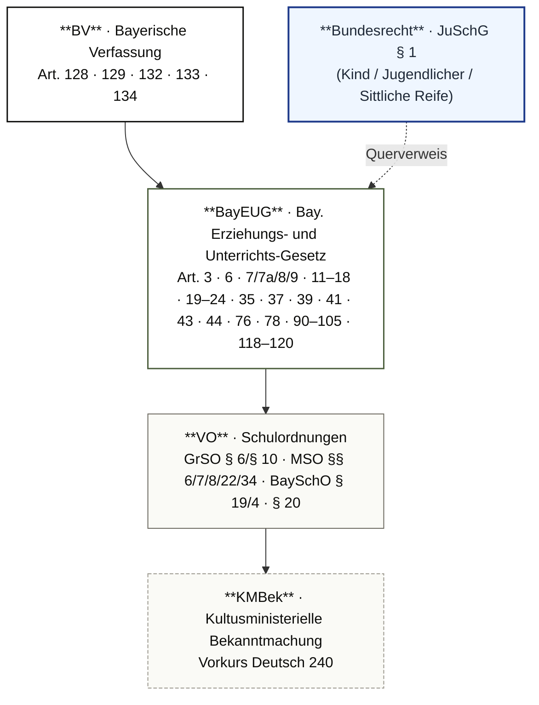

# MP_03 — Gliederung des Bildungssystems · Bildungswege

ZALGM § 16 Nr. 2 · 2. Staatsexamen MS Bayern.

## In aller Kürze

Das bayerische Schulwesen ist **gegliedert und durchlässig zugleich**: Jede Schulart hat ein eigenes Bildungsprofil entsprechend Anlage und Neigung der SuS, **Wechsel sind an allen Schnittstellen möglich**. Verfassungsanker: BV Art. 128/132 (Bildungsanspruch nach Anlagen/Leistung) + Art. 133 (öffentliche Anstalten als Bildungsträger). Schulpflicht (Art. 35 BayEUG): Beginn Vollendung 6. Lj., 12 Jahre Gesamtdauer. Übertritts-Schwellen GS→Sek I (Mai-ÜZ, D/M/HSU): Gym ≤ 2,33 · RS ≤ 2,66 · MS alle übrigen.

## Norm-Kartografie (5 Ebenen)



| Ebene | Schwerpunkt-Normen |
|---|---|
| **BV** | Art. 128 (Bildungsanspruch) · 129 (Schulpflicht/Unentgeltlichkeit) · 132 (Anlagen-/Leistungsprinzip) · 133 (Bildungsträger) · 134 (Privatschulen) |
| **BayEUG** | Art. 3 (öff./privat) · 6 (Schularten) · 7/7a/8/9 (GS/MS/RS/Gym) · 11–18 (berufliche) · 19–24 (FöS) · 35 (Schulpflicht) · 37 (Stichtag/Korridor) · 39 (BS-Pflicht) · 41 (FöS-Lernort) · 43 (Schulartwechsel) · 44 (Elternwahlrecht) · 76 (Eltern-Mitwirkung) · 78 (Beratung) · 90–105 (Privatschulen) · 118–120 (Schulzwang) — |
| **VO** | GrSO § 6/§ 10 (Übertritt/Probearbeiten) · MSO § 6 (Gelenkklasse) · § 7 (M-Zug-Aufnahme) · § 8 (Durchlässigkeit MS↔M-Zug) · § 22 (Praxisklasse-Abschluss) · § 34 (Quabi) · BaySchO § 19/4 (Distanzunterricht) · § 20 (Eltern-Meldepflicht) |
| **KMBek** | Vorkurs Deutsch 240 |
| **Bundesrecht** | JuSchG § 1 (Kind/Jugendliche/Sittliche Reife) |

---

# Teil A — Stoff

## A.1 Schulwesen / Schularten (Art. 6 BayEUG · BV Art. 132)

**Verfassungsrahmen** (BV Art. 128/132/133/134):

- **Art. 128 BV**: Bildungsanspruch jedes Bewohners — entsprechend **Anlagen + innerer Berufung**.
- **Art. 132 BV**: „Mannigfaltigkeit der Lebensberufe"; Maßstab = **Anlagen + Neigungen + Leistung + innere Berufung**, NICHT wirtschaftl./gesellschaftl. Stellung der Eltern.
- **Art. 133 Abs. 1 BV**: Bildung durch öffentliche Anstalten; **Staat + Gemeinde** wirken zusammen; anerkannte Religions-/Weltanschauungsgemeinschaften sind Bildungsträger.
- **Art. 134 Abs. 1 BV**: Privatschulen bedürfen **staatlicher Genehmigung**.

**Träger-Differenzierung (Art. 3 BayEUG)**:

| Träger | Unterschied | Lehrpläne / Stundentafeln / Zeugnisse |
|---|---|---|
| öff. **staatlich** | Dienstherr LK = Freistaat Bayern | KM (identisch) |
| öff. **kommunal** | Dienstherr LK = Gemeinde / Landkreis | KM (identisch) |
| **privat** | Genehmigung (Ersatzschule) oder Anerkennung (Ergänzungsschule) | siehe unten |

**Privatschulen** (Art. 90–105 BayEUG ·; Verfassungsanker BV Art. 134 ):

| Typ | Rechtsgrund | Schulpflicht-Erfüllung | Zeugnis-Berechtigungen |
|---|---|---|---|
| **Staatlich genehmigte Ersatzschule** | Art. 91–101; vergleichbare Bildungsziele, eigenes päd. Konzept (Montessori, Waldorf) | erfüllt | NICHT identisch — externe Prüfung nötig |
| **Staatlich anerkannte Ersatzschule** | dauerhafte öff.-Standard-Konformität | erfüllt | identisch zu öff. Schulen |
| **Ergänzungsschule** | Art. 102–104; KEIN Pendant zu öff. Schulen (z.B. Dolmetscherschule) | i.d.R. NICHT erfüllt | keine öff. Berechtigungen |

**Schularten-Katalog (Art. 6 BayEUG)** — dreigliedrig (Art. 7–24):

- **Allgemein bildend**: GS (Art. 7, Jgst. 1–4) · MS (Art. 7a, 5–9/M-Zug 5–10) · RS (Art. 8, 5–10) · Gym (Art. 9, 5–13 G9) · Abendrealschule/-gymnasium · Kolleg.
- **Beruflich** (Art. 11–18): BS · BFS · WS · FS · FOS · BOS · FA.
- **Förderschulen** (Art. 19–24): 7 Förderschwerpunkte (Art. 20/1 ); Grund-/Mittel-/Berufsschulstufe.
- **Schulen für Kranke** (Art. 41/2 ).

**Elternwahlrecht (Art. 44 BayEUG)**: Eltern wählen Schulart / Ausbildungsrichtung / Fachrichtung — **gebunden an Eignung + Leistung**.

!!! warning "⚠ Fallen Schulwesen"
 - **„Die GS ist die erste und gemeinsame Schule" — nicht absolut**: Ausnahmen sind Förderschule ab Jgst. 1, vorschulische Einrichtungen (SVE).
 - **Genehmigte ≠ anerkannte Ersatzschule** — nur die anerkannte vergibt selbständig öff.-anerkannte Zeugnisse.
 - **Elternwahlrecht ist nicht absolut** — Vorbehalt Eignung/Leistung (Art. 44 BayEUG).

## A.2 Kindergarten → Grundschule

**Rechtsrahmen**: Art. 7 BayEUG, BayKiBiG, Lehrplan PLUS.

**Kooperations-Maßnahmen KiGa↔GS**: gemeinsame Konferenzen · gegenseitige Besuche/Hospitationen · KiGa-Kinder besuchen GS · Elternabend zur Einschulung · gemeinsame Feste · Infobriefe.

**Vorkurs Deutsch 240** (KMBek KWMBl 2011 S. 240): **240 Stunden über 1,5 Schuljahre** — vorletztes + letztes KiTa-Jahr — für Kinder mit Sprachförderbedarf. Je Hälfte KiGa und GS.

**SVE** (Schulvorbereitende Einrichtung) — Teil der Förderschule, sonderpäd. Anbahnung vor Jgst. 1.

!!! warning "⚠ Falle Vorkurs"
 Vorkurs Deutsch 240 = **240 h über 1,5 Schuljahre** — NICHT 1 Jahr, NICHT 2 Jahre. „Lieblings-Falle" der Schulräte.

## A.3 Einschulung & Schulpflicht (Art. 35–39 BayEUG · BV Art. 129)

**Schulpflicht-Norm-Kette**:

- **BV Art. 129/1**: „Alle Kinder zum Besuch der Volksschule und Berufsschule verpflichtet."
- **BV Art. 129/2**: Unterricht **unentgeltlich**.
- **BayEUG Art. 35**: Schulpflicht bei altersgemäßer Voraussetzung + **gewöhnlichem Aufenthalt Bayern**. Dauer: **12 Jahre** = **9 Vollzeit + 3 Berufsschule**.

**Stichtag + Korridor (Art. 37 BayEUG)**:

| Geburtsdatum | Regelung |
|---|---|
| **bis 30.09.** | regulär schulpflichtig im Folgesommer |
| **01.07.–30.09.** | **Einschulungskorridor** seit SJ 2019/2020: Eltern entscheiden Einschulung oder Zurückstellung um 1 Jahr |
| **01.10.–31.12.** | „Kann-Kinder" — freiwillig auf Eltern-Antrag |
| **nach 31.12.** | freiwillig nur mit **schulpsychologischem Gutachten** zwingend |

**Zurückstellung** (Art. 37): bei körperlich/geistig/sozial nicht reifen Kindern → SL-Entscheidung nach ärztlicher/schulpsychologischer Begutachtung.

**Schuleingangsuntersuchung**: Pflicht durch Gesundheitsamt.

**Schulaufnahmeverfahren**: SL entscheidet Aufnahme · **Sprengelprinzip** · Gastschulantrag bei Ausnahme.

**Schulpflicht Migrationshintergrund**:

- Beginn: **3 Monate nach Zuzug** aus Ausland (bei Aufenthaltsgestattung/-erlaubnis/Duldung/vollziehbarer Ausreisepflicht).
- Einweisung: **Altersgleichheits-Prinzip** (Jahrgangsstufe wie altersgleiche Dauer-in-Bayern-SuS).
- **Bis zu 2 Jgst. tiefer** einweisen zulässig **nur** bei **allgemein mangelndem Bildungsstand**, NICHT sprachlich.
- Keine Verlängerung der Schulpflicht durch tiefere Einweisung.

**Berufsschulpflicht (Art. 39 BayEUG)**: nach Vollzeitschulpflicht; **3 BS-Jahre** (Spanne 2–3½), spätestens Ende des Schuljahres, in dem SuS **21. Lebensjahr** vollendet. Ausnahmen: mittlerer Abschluss + kein Ausbildungsverhältnis · Hochschulzugang · BVJ/BGJ · Beamten-Vorbereitungsdienst · FSJ/FÖJ · Bundeswehr.

**Schulpflicht-Überwachung & Sanktion**:

- **Art. 76 BayEUG + § 20 BaySchO **: Eltern + Schule überwachen gemeinsam.
- **Art. 119 BayEUG**: **Ordnungswidrigkeit** + Geldbuße bei Unterlassung Anmeldung.
- **Art. 118 BayEUG — Schulzwang**: Wortlaut sagt „**auf Antrag der Schule** von der Kreisverwaltungsbehörde durch ihre **Beauftragten** zwangsweise der Schule zugeführt" — Akteur ist „die Schule" (der Antragsweg läuft über die SL, aber Wortlaut differenziert nicht zwischen SL und Schule).
- **Art. 120 BayEUG**: Grundrechtseinschränkung Freiheit/Wohnung zugunsten Schulpflicht.

**Distanzunterricht (BaySchO § 19/4)** — verpflichtend seit SJ 2020/2021. **Aktive Teilnahmepflicht** (Art. 56/4 S. 3 BayEUG): virtuelle Anwesenheitskontrolle + Rückmeldung. Bei Verweigerung: Beratungs-/Unterstützungs-/Sanktionsplan, Erziehungs-/Ordnungsmaßnahmen.

*Spiegelfall siehe MP_05 — SuS-Pflichten-Trias (Art. 56/4 BayEUG); Schulpflicht-Direktionalität Eltern → SuS bedingt das in MP_05 (Block A.1) entfaltete Pflichtenspektrum (Teilnahme · Verhalten · Mitwirkung sonderpäd. Gutachten · Bild/Ton-Distanzunterricht).*

**Verhinderung / Beurlaubung / Befreiung**:

| Stufe | Voraussetzung |
|---|---|
| **Verhinderung** | zwingende Gründe (Krankheit) — Eltern-Meldepflicht § 20/1 BaySchO |
| **Beurlaubung** | dringende Ausnahmefälle / religiöse Pflichten / Erholungsaufenthalte / Schwangerschaft |
| **Befreiung** | von einzelnen Fächern (ganz/teilweise, zeitlich begrenzt) |

!!! warning "⚠ Fallen Schulpflicht"
 - **Schulpflicht ≠ Schulzwang**: Schulpflicht = Grundpflicht (Art. 35 + § 20 + Art. 76); Schulzwang = Sanktion (Art. 118/119/120). Kein Synonym!
 - **Migration**: Tiefer-Einweisung **NUR bei allgemeinem Bildungsstand-Defizit**, nicht sprachlich.
 - **BS-Pflicht-Ende**: Schuljahr in dem 21. Lj. vollendet — NICHT „bis 18. Lj." oder „4 Jahre".
 - **Distanzunterricht**: aktive Teilnahmepflicht, mündliche LNW grundsätzlich möglich.
 <!-- pre-audit-2026-05-01: "Kind (0–13) / Jugendlicher (14–17)" → Drift gegen JuSchG § 1 Wortlaut ("noch nicht 14 Jahre alt" / "14, aber noch nicht 18 Jahre alt"). -->
 - **JuSchG § 1** (, „Lieblingsbegriff Schulräte"). Wortlaut Kind: `Kinder Personen, die noch nicht 14 Jahre alt sind`. Wortlaut Jugendliche: `Jugendliche Personen, die 14, aber noch nicht 18 Jahre alt sind`. „Sittliche Reife" als zusätzliches Tatbestands-Merkmal — oft übersehen.

## A.4 Übertritt (Art. 43/44 BayEUG · GrSO § 6/§ 10 · MSO § 6/7/8)

**Rechtsgrundlage**: Art. 43 BayEUG (Schulartwechsel) · Art. 44 (Elternwahlrecht) · GrSO/MSO/RSO/GSO/WSO Schulart-spezifisch.

=== "GS 4 → Sek I"

 **Mai-ÜZ, nur D/M/HSU zählen.**

 | Ziel | Schwelle | Probeunterricht |
 |---|---|---|
 | **Gymnasium** | ≤ **2,33** | ab 2,34: PU 3 Tage D/M; bestanden = mind. **1×3 + 1×4**; Elternwille bei 2× Note 4 |
 | **Realschule** | ≤ **2,66** | analog |
 | **Mittelschule** | alle übrigen ||

 Eltern können **unabhängig vom Schnitt** Probeunterricht beantragen.

 **Probearbeiten** (GrSO § 10 — ): Wortlaut Abs. 3 S. 2: „In der Jahrgangsstufe 4 sollen bis zum Erhalt des Übertrittszeugnisses in den Fächern Deutsch, Mathematik und Heimat- und Sachunterricht **18 Probearbeiten** abgehalten werden" (Gesamtzahl explizit + Bezug zum ÜZ explizit). Verteilung 10/4/4 ist Sekundärliteratur-Auslegung; Wortlaut nennt nur die Gesamtzahl 18. Festlegung durch **Lehrerkonferenz** (§ 10 Abs. 1 S. 1 GrSO: „Die Lehrerkonferenz trifft vor Unterrichtsbeginn des Schuljahres grundsätzliche Festlegungen zur Erhebung von Leistungsnachweisen einschließlich prüfungsfreier Lernphasen"). Wortlaut Abs. 1 S. 3 zur probearbeitenfreien Zeit: „In der Jahrgangsstufe 4 sollen in der Zeit vom Unterrichtsbeginn bis zum Erhalt des Übertrittszeugnisses **jeweils** in den Fächern Deutsch, Mathematik und Heimat- und Sachunterricht rhythmisiert mindestens vier Unterrichtswochen von bewerteten Probearbeiten freigehalten werden". Das **„jeweils"** wird in der Praxis fach-distributiv gelesen (also pro Fach 4 U.-Wochen) — die Auslegung ist jedoch in der Sekundärliteratur uneinheitlich (auch eine kollektive Lesart wird vertreten); im Zweifelsfall die Lehrerkonferenz-Festlegung der konkreten Schule heranziehen.

=== "MS 5 → Gym/RS"

 **„Gelenkklasse" — Jahreszeugnis.**

 | Ziel | Schwelle | Anmerkung |
 |---|---|---|
 | **Gymnasium** | D+M ≤ **2,0** | uneingeschränkt; sonst Härtefall LK-Konferenz |
 | **Realschule** | D+M ≤ **2,5** | uneingeschränkt |
 | **Staatl. genehmigte Schulen** || einheitlicher Probeunterricht |

=== "MS 5–9 → höhere Jgst."

 **Wechsel ins Gym/RS außerhalb Gelenkklasse.**

 - **Aufnahmeprüfung** in letzten Tagen der Sommerferien + Probezeit.
 - **RS** alternativ: Durchschnitt D+M+E **≤ 2,0** im Jahreszeugnis.

=== "MS → M-Zug"

 **MSO § 7 · Mittlere-Reife-Klassen.**

 | Ziel | Schwelle D+M+E | Bedingung |
 |---|---|---|
 | **M7** | ≤ **2,66** | uneingeschränkt aus 6. Klasse Jahreszeugnis |
 | **M8 / M9** | ≤ **2,33** | analog |
 | **M10** | Quali + ≤ **2,33** | + Quali-Zeugnis aus 9. Klasse |

 Sonst Antrag + Aufnahmeprüfung. **Rückkehr MS↔M-Zug jederzeit** (MSO § 8/3).

=== "MS → Wirtschaftsschule"

 **4-stufige WS, Jgst. 7.**

 - Aus 6./7. Klasse MS: Zwischen-/Jahreszeugnis D+M+E **≤ 2,66** uneingeschränkt.
 - Alternativ M-Zug-Vorrückungserlaubnis aus 7.
 - Sonst **Probeunterricht** (3 Tage).

!!! warning "⚠ Fallen Übertritt"
 - **Schwelle verwechseln**: Gym ≤ **2,33** (NICHT 2,5/3,0); RS ≤ **2,66**; nur **D/M/HSU**, nicht alle Fächer.
 - **Elternwillen-Regel**: gilt **NACH** Probeunterricht bei 2× Note 4, NICHT vorab.
 - **Übertritt-Dokument**: nicht nur Jgst. 4 ÜZ — **Gelenkklasse Jgst. 5 MS** (Jahreszeugnis) ebenfalls.
 - **Probearbeiten-Verteilung**: durch **LK-Konferenz** (nicht einzelne LK).

## A.5 Vorrücken / Wiederholen / Überspringen

**Vorrückungsfächer (MS)**: Kernfächer D/M/E + Pflichtfach nach Jgst.

**Vorrücken auf Probe**: knappes Notenbild → SL-Entscheidung.

**Freiwilliges/Pflichtwiederholen**: Antrag/Zwang; Wiederholungsfrist beachten.

**Überspringen**: Antrag mit Leistungsnachweis · SL-Genehmigung.

Verkürzung Vollzeitschulpflicht durch Überspringen möglich; **keine Verlängerung** durch Streckung.

## A.6 Mittelschul-Abschlüsse (MSO §§ 19–34)

**Vier Abschlüsse**:

| Abschluss | Norm | Bestehensformel |
|---|---|---|
| **ESA** (Erfolgreicher MS-Abschluss) — Ende 9. | MSO §§ 19 ff. | Durchschnitt Vorrückungsfächer ≥ **4,00** + max. **3 Fächer schlechter als 4** (Note 6 = 2× Note 5) |
| **Quali** (qualifizierender MS-Abschluss) — freiwillig Ende 9. | MSO §§ 26 ff. | **50 % Jahresfortgang + 50 % Prüfung**; Fächer D/M/E/PCB/GSE/AWT + Projektprüfung |
| **MSA** (Mittlerer Schulabschluss M10) | MSO §§ 30 ff. | schriftl./mündl./prakt. Prüfungen |
<!-- TODO Audit 2026-05-01: Verbatim-Aufschlüsselung MSO § 22 Abs. 2: D/DaZ schriftlich (75 Min.) + mündlich (15 Min.); M schriftlich (60 Min.); Fächerverbund schriftlich (45 Min.); Projektprüfung. Gesamt 90 Min für D/DaZ kombiniert ist faktisch korrekt, verschleiert aber die schriftl./mdl.-Trennung. Bestehen: Durchschnitt ≤ 4,0; Projektprüfungsnote zählt doppelt. Manuell prüfen ob Auflösung gewünscht. -->
| **Praxisklasse-Abschluss** | **MSO § 22** | theorieentlastete Prüfung: D/DaZ 90 Min (75 schriftl. + 15 mdl.) + M 60 Min + Fächerverbund 45 Min + Projekt AWT (Projektnote zählt doppelt; Bestehen ≤ 4,0) |
| **Quabi** (Qualifizierter beruflicher Bildungsabschluss) | **MSO § 34** | Quali + Berufsausbildungsabschluss |

**Drei Aufstiegswege MS → Hochschulreife**:

```mermaid
flowchart LR
 MS["MS 5"]:::start
 A1["M7<br/>D+M+E ≤ 2,66"]:::path-a
 A2["M10 + MSA"]:::path-a
 A3["FOS 11/12"]:::end-a
 AF["Fachabi"]:::goal

 B1["ESA Ende 9."]:::path-b
 B2["Quali<br/>50/50 + Projekt"]:::path-b
 B3["Berufsausbildung + BS"]:::path-b
 B4["Quabi MSO § 34"]:::path-b
 B5["FOS 11/12"]:::end-b

 C1["WS 4-stufig<br/>Jgst. 7"]:::path-c
 C2["Mittlerer Abschluss"]:::path-c
 C3["FOS 11/12"]:::end-c

 MS -->|Weg A: M-Zug| A1 --> A2 --> A3 --> AF
 MS -->|Weg B: Quali+BS+FOS| B1 --> B2 --> B3 --> B4 --> B5 --> AF
 MS -->|Weg C: WS| C1 --> C2 --> C3 --> AF

 classDef start fill:#fff7ed,stroke:#c2410c,stroke-width:2px,color:#1f2937
 classDef path-a fill:#fefce8,stroke:#ca8a04,color:#1f2937
 classDef path-b fill:#f7fee7,stroke:#65a30d,color:#1f2937
 classDef path-c fill:#eff6ff,stroke:#1e3a8a,color:#1f2937
 classDef end-a fill:#fefce8,stroke:#ca8a04,color:#1f2937
 classDef end-b fill:#f7fee7,stroke:#65a30d,color:#1f2937
 classDef end-c fill:#eff6ff,stroke:#1e3a8a,color:#1f2937
 classDef goal fill:#fef2f2,stroke:#9f1239,stroke-width:3px,color:#1f2937
```

1. **Weg A — M-Zug**: MS 5 → M7 → M10 + MSA → FOS 11/12 → Fachabi.
2. **Weg B — Quali + BS + FOS**: ESA + Quali → Berufsausbildung + BS → Quabi (mittlerer Abschluss) → FOS 11/12 → Fachabi.
3. **Weg C — Wirtschaftsschule**: MS 6./7. → 4-stufige WS → mittlerer Abschluss → FOS.

**Beratungspflicht (Art. 78 BayEUG)**: Schule + jede LK haben **Eltern + SuS in Schullaufbahn-Fragen zu beraten** + Hilfe bei Bildungsmöglichkeitswahl entsprechend Anlagen/Fähigkeiten.

!!! warning "⚠ Falle Abschlüsse"
 **Quali ≠ MSA**: Quali = freiwillige externe Prüfung Ende 9. (50/50); MSA = M10-Abschluss mit eigenen Prüfungsformaten. Genauigkeit der Benennung wird bewertet!

---

# Teil B — Top-10-Pflichtwissen

7-Tage-Endspurt-Cheat-Sheet · Karten-IDs verlinken auf das Anki-Lerndeck.

<div class="grid cards" markdown>

-:material-numeric-1-circle: __Schwellen GS→Sek I__

 Gym ≤ **2,33** · RS ≤ **2,66** · MS alle übrigen.
 Nur **D/M/HSU** zählen.

-:material-numeric-2-circle: __Probeunterricht-Bestehen__

 Mind. **1×3 + 1×4** in D/M.
 Elternwillen-Regel NUR bei **2× Note 4** NACH PU.

-:material-numeric-3-circle: __Schulpflicht__

 Beginn: Vollendung **6. Lj.** · Stichtag **30.09.**
 Dauer: **12 J.** = 9 Vollzeit + 3 BS.

-:material-numeric-4-circle: __Einschulungskorridor__

 **01.07.–30.09.** seit SJ 2019/2020.
 Nach 31.12. nur mit schulpsych. Gutachten.

-:material-numeric-5-circle: __Schulpflicht ≠ Schulzwang__

 Pflicht: Art. 35 + 76 BayEUG.
 Sanktion: Art. 118 → Kreisverwaltungsbehörde.

-:material-numeric-6-circle: __M-Zug-Aufnahme__

 M7 ≤ **2,66** (D+M+E) · M8/M9/M10 ≤ **2,33**.
 Rückkehr MS↔M-Zug jederzeit (MSO § 8/3).

-:material-numeric-7-circle: __Vorkurs Deutsch 240__

 **240 h über 1,5 Schuljahre**.
 Vorletztes + letztes KiTa-Jahr.

-:material-numeric-8-circle: __Migration-Schulpflicht__

 **3 Monate** nach Zuzug.
 Tiefer-Einweisung NUR bei allg. Bildungsstand-Defizit.

-:material-numeric-9-circle: __Drei MS-Abschlüsse__

 ESA (Vorrückungsfächer ≥ 4,00) · Quali (50/50 + Projekt) · MSA (M10).

-:material-numeric-10-circle: __3 Aufstiegswege__

 M-Zug · Quali+BS+FOS · WS.
 Alle führen zu Fachabi via FOS.

</div>

---

# Teil C — Falle-Atlas

| ID | Falle | Korrekte Auflösung |
|---|---|---|
| FA01 | „Die GS ist die erste und gemeinsame Schule" — absolut? | NEIN — Ausnahmen: FöS ab Jgst. 1, SVE. |
| FA02 | Schwellen GS→Sek I auswendig? | Gym ≤ 2,33 · RS ≤ 2,66; **nur D/M/HSU**. NICHT 2,5/3,0. |
| FA03 | Probearbeiten-Verteilung Jgst. 4? | **Lehrerkonferenz** legt Grundsätze fest (GrSO § 10 Abs. 1 S. 1); **18 Probearbeiten** bis zum ÜZ in D/M/HSU (Wortlaut Abs. 3 S. 2; Verteilung 10/4/4 nur Sekundärliteratur); **mindestens 4 Unterrichtswochen probearbeitenfrei** — Wortlaut Abs. 1 S. 3: „**jeweils** in den Fächern Deutsch, Mathematik und Heimat- und Sachunterricht … mindestens vier Unterrichtswochen". Das „jeweils" wird in der Praxis fach-distributiv gelesen; die Auslegung ist sekundärliterarisch uneinheitlich. **In der Prüfung: Wortlaut zitieren, Auslegung als offen kennzeichnen.** |
| FA04 | Elternwahlrecht absolut? | NEIN — gebunden an Eignung/Leistung (Art. 44 BayEUG + Art. 132 BV). |
| FA05 | Übertritts-Dokument nur Jgst. 4? | NEIN — auch Gelenkklasse Jgst. 5 MS (Jahreszeugnis); D+M ≤ 2,0 Gym, ≤ 2,5 RS. |
| FA06 | Elternwillen bei Note 4? | gilt NACH PU bei **2× Note 4** in D/M, NICHT vorab. |
| FA07 | Vorkurs Deutsch — Dauer? | **240 h über 1,5 Schuljahre** (vorletztes + letztes KiTa-Jahr). NICHT 1 oder 2 Jahre. |
| FA08 | Schulpflicht = Schulzwang? | NEIN — Pflicht (Art. 35+76) ↔ Sanktion (Art. 118 → Kreisverwaltung). |
| FA09 | BS-Pflicht-Ende? | SJ in dem 21. Lj. vollendet (3 BS-Jahre). NICHT „bis 18. Lj." oder „4 Jahre". |
| FA10 | Migration tiefer-einweisen — Begründung? | **NUR allgem. Bildungsstand-Defizit**, NICHT sprachlich; max. 2 Jgst. tiefer. |
| FA11 | Quali = MSA? | NEIN — Quali Ende 9. (50/50 + Projekt); MSA = M10-Abschluss. |
<!-- pre-audit-2026-05-01: "Kind (0–13) / Jugendlicher (14–17)" → Drift gegen JuSchG § 1 Wortlaut. -->
| FA12 | JuSchG § 1 / sittliche Reife? | Definitionsquelle Kind: `Kinder Personen, die noch nicht 14 Jahre alt sind` (Wortlaut). Definition Jugendliche separat: `Jugendliche Personen, die 14, aber noch nicht 18 Jahre alt sind` (Wortlaut). „Sittliche Reife" = altersangemessene Einschätzungsfähigkeit. „Lieblingsbegriff" Schulräte. |

---

# Teil D — Fallbeispiele (Anwendung)

??? example "Fall **Lara** — Schnitt 2,67 Mutter fordert Nachbenotung (Hauptfall)"
 **Sachverhalt**: 4. Klasse GS. Lara hat im Übertrittszeugnis einen Schnitt von **2,67 in D/M/HSU**. Die Mutter fordert **Nachbenotung** der letzten Probearbeiten (damit der Schnitt auf 2,66 fällt) und besteht zusätzlich darauf, dass Lara den **Probeunterricht am Gymnasium** antreten darf.

 **Knackpunkte**:

 1. **Realschul-PU steht zu** — Schnitt 2,67 verfehlt 2,66 knapp; PU 3 Tage D/M.
 2. **Gym-PU auf Eltern-Antrag** — unabhängig vom Schnitt möglich, aber Erfolgsaussicht bei 2,67 gering (Bestanden = mind. 1×3 + 1×4 in D/M).
 3. **Nachbenotung NICHT möglich** — Beurteilungsentscheidung der LK (Art. 52 BayEUG); Änderung nur bei Verfahrensfehler / offensichtlichem Beurteilungsirrtum.
 4. **Beratungspflicht** Art. 78: KL muss objektive Optionen aufzeigen.

 **Antwortkette**: Gesprächstermin → Einsicht ins Probearbeiten-Portfolio (transparent) → Rechtslage darlegen (Schnitt 2,67 → RS-PU steht zu, Gym-PU auf Antrag) → **Durchlässigkeits-Perspektive** öffnen (M-Zug → M10+MSA → FOS → Fachabi) → bei Eskalation: SL einbeziehen, formaler Widerspruchsweg gegen ÜZ (Verwaltungsakt).

??? example "Fall **Sildi** — „Die GS ist die erste Schule"-Aussage"
 **Sachverhalt**: Eltern in der Beratungsstunde behaupten, Sildi (6) müsse zwingend zuerst die Grundschule besuchen.

 **Knackpunkte**:

 1. **Aussage „GS = erste und gemeinsame Schule" nicht absolut**.
 2. **Ausnahmen**: Förderschule ab Jgst. 1 (sonderpäd. Bedarf via Art. 41 BayEUG); SVE als vorschulische sonderpäd. Anbahnung.
 3. **Sildi-Konkret**: ohne sonderpäd. Bedarf → GS regulär; mit Bedarf → Eltern wählen Lernort.

 **Antwortkette**: Aussage entkräften → Art. 41/1 BayEUG (Eltern-Lernort) erläutern → bei sonderpäd. Verdacht: Beratungsstelle/MSD-Anfrage (↔ Block 8).

??? example "Fall **Jonas** — Schulpflicht-Verweigerung der Eltern"
 **Sachverhalt**: Eltern weigern sich, ihren 7-jährigen Sohn Jonas zur Schule anzumelden, mit der Begründung „häuslicher Unterricht reicht".

 **Knackpunkte**:

 1. **Schulpflicht in Bayern absolut** (Art. 35 + BV Art. 129) — Homeschooling NICHT zulässig.
 2. **Eskalations-Kette**: Art. 76 BayEUG (Eltern-Mitwirkungspflicht) → § 20 BaySchO (Meldepflicht) → Art. 119 (Ordnungswidrigkeit + Geldbuße) → Art. 118 Schulzwang (SL-Antrag bei Kreisverwaltung) → Art. 120 (Grundrechtseinschränkung Freiheit/Wohnung).
 3. **Schulpflicht ≠ Schulzwang** — Pflicht entsteht kraft Gesetz, Schulzwang ist Sanktionsmechanismus.

 **Antwortkette**: Elterngespräch + Beratung → SL informieren → Ordnungswidrigkeit-Anzeige → bei fortgesetzter Verweigerung: Schulzwang-Antrag SL bei Kreisverwaltungsbehörde.

??? example "Fall **Familie Demir** — Schulpflicht nach Zuzug"
 **Sachverhalt**: Familie Demir zog vor 2 Wochen aus Syrien zu (Aufenthaltsgestattung). Tochter Aylin (10) soll in 5. Klasse MS eingewiesen werden, hat aber kein Deutsch.

 **Knackpunkte**:

 1. **Schulpflicht beginnt 3 Monate nach Zuzug** — bei Aufenthaltsgestattung/-erlaubnis/Duldung/Ausreisepflicht.
 2. **Altersgleichheits-Prinzip**: Aylin (10) → Jgst. 5 entsprechend Dauer-in-Bayern-SuS gleichen Alters.
 3. **Tiefer-Einweisung NUR bei allgem. Bildungsstand-Defizit** (Falle): Sprachliche Defizite alleine **NICHT** ausreichend für tiefere Jgst.
 4. **Vorkurs Deutsch / DaZ-Förderung** parallel zur Jgst. 5; keine Verlängerung der Schulpflicht durch tiefere Einweisung.

 **Antwortkette**: Ankunfts-Datum prüfen → 3-Monats-Frist abwarten/anwenden → Bildungsstand-Diagnostik (allgem. Wissen, nicht Deutsch) → Einweisung Jgst. 5 + DaZ-Begleitprogramm → ggf. SVE/Sprachintensiv anbieten.

??? example "Fall **Yusuf** — Probeunterricht-Anspruch + Note-4-Eltern­wille"
 **Sachverhalt**: Yusuf (4. Klasse) hat ÜZ-Schnitt 2,80 D/M/HSU. Eltern beantragen Probeunterricht am Gymnasium. Yusuf erreicht im PU **2× Note 4** in D und M.

 **Knackpunkte**:

 1. **Eltern-Antragsrecht PU**: unabhängig vom Schnitt zulässig.
 2. **Bestanden = mind. 1×3 + 1×4** — Yusuf hat 2× Note 4, also nicht regulär bestanden.
 3. **Elternwillen-Regel (FA06)**: bei **2× Note 4** kann der Elternwille die Aufnahme bewirken — gilt **NACH** PU, nicht vorab.
 4. Pädagogisch: Erfolgsprognose Gym bei Schnitt 2,80 + 2×4 schwierig — Beratungspflicht Art. 78.

 **Antwortkette**: PU-Ergebnis dokumentieren → Eltern über Elternwillen-Option informieren (klar, ohne Druck) → Hinweis auf Durchlässigkeit (RS, MS-M-Zug als Alternativen) → Eltern-Entscheidung respektieren.

??? example "Fall **Nina** — Übertritt MS Jgst. 5 → Gymnasium (Gelenkklasse)"
 **Sachverhalt**: Nina ist in MS Jgst. 5; Jahreszeugnis D+M = 1,8. Eltern fragen nach Wechsel ans Gymnasium.

 **Knackpunkte**:

 1. **Gelenkklasse Jgst. 5 MS**: D+M ≤ 2,0 → Gym uneingeschränkt; D+M ≤ 2,5 → RS uneingeschränkt.
 2. **Nina erfüllt 2,0-Schwelle** — Gym-Wechsel ohne Probeunterricht möglich.
 3. **Anmeldung** erfolgt direkt am aufnehmenden Gym; Härtefall-Regelung ist hier nicht einschlägig.

 **Antwortkette**: Jahreszeugnis prüfen → 2,0-Schwelle bestätigen → Eltern beraten (Gym-Anforderung vs. RS-Alternative bei Schnitt knapper) → Anmeldung am aufnehmenden Gym koordinieren.

??? example "Fall **Tobias** — Klassenwiederholung bei Quali-Vorbereitung"
 **Sachverhalt**: Tobias (9. Kl. MS) liegt knapp unter Vorrückungsschwelle. Eltern wollen freiwilliges Wiederholen der 9. Klasse zur Quali-Verbesserung.

 **Knackpunkte**:

 1. **Freiwilliges Wiederholen** möglich — Antrag der Eltern; SL-Genehmigung.
 2. **Quali ist freiwillige externe Prüfung** Ende 9. — keine Vorrückungs-Voraussetzung.
 3. **ESA-Bestehensformel**: Vorrückungsfächer-Schnitt ≥ 4,00 + max. 3 Fächer < 4 (Note 6 = 2× Note 5).
 4. Beratungspflicht Art. 78: Erfolgsaussichten bei Wiederholung realistisch einschätzen.

 **Antwortkette**: Notenbild prüfen → ESA-Schwelle erreicht? → bei nicht erreicht: freiwilliges Wiederholen sinnvoll; bei knapp erreicht + Quali-Wunsch: Wiederholen Pro/Contra (Pro: bessere Quali-Chance; Contra: 1 Jahr Lebenszeit) → Eltern-Entscheidung.

??? example "Fall **Mira** — Wechsel WS → MS oder M-Zug"
 **Sachverhalt**: Mira besucht 7. Klasse 4-stufige Wirtschaftsschule, möchte aber zurück an die MS in den M-Zug wechseln.

 **Knackpunkte**:

 1. **Wechsel an Schnittstellen jederzeit möglich** — durchlässiges System.
 2. **MSO § 7 M-Zug-Aufnahme**: M7 ≤ 2,66 D+M+E (uneingeschränkt aus 6. Klasse Jahreszeugnis); für M8 aus 7. WS: ≤ 2,33 oder Aufnahmeprüfung.
 3. **Beratungspflicht** Art. 78 — Mira's Notenbild vergleichend bewerten.

 **Antwortkette**: WS-Jahreszeugnis prüfen → M-Zug-Schnittwerte abgleichen → Anmeldung an aufnehmender MS → ggf. Aufnahmeprüfung → bei Nicht-Erfüllung: regulär MS Jgst. 7 (kein M-Zug) als Alternative.

??? example "Fall **Theo** — JuSchG-Frage in mündlicher Prüfung (Querverweis)"
 **Sachverhalt**: Schulrätin fragt: „Definieren Sie nach **JuSchG § 1** die Begriffe Kind und Jugendlicher und erläutern Sie ‚sittliche Reife'."

 **Knackpunkte**:

 <!-- pre-audit-2026-05-01: "unter 14 Jahren" / "14 bis unter 18" → Drift gegen JuSchG § 1 Wortlaut ("noch nicht 14 Jahre alt" / "14, aber noch nicht 18 Jahre alt"). -->
 1. **JuSchG § 1** (Wortlaut). Kind: `Kinder Personen, die noch nicht 14 Jahre alt sind`. Jugendliche: `Jugendliche Personen, die 14, aber noch nicht 18 Jahre alt sind`. Personensorgeberechtigte/Erziehungsbeauftragte sind in Nr. 3 + 4 separat definiert.
 2. **„Sittliche Reife"**: altersangemessene Einschätzungsfähigkeit — Maßstab für JuSchG-Anwendung (z.B. Kinozugang, Klassenfahrt-Themen).
 3. **Reviewer-Hinweis**: „Lieblingsbegriff Schulräte" — Standardfrage MS-Schulrecht.
 4. **Querverweis Block 10.4** — JuSchG-Anwendung bei Klassenfahrten / Filmfreigaben.

 **Antwortkette**: Definitionen abrufen → sittliche Reife konkret machen (Beispiel Klassenfahrt) → Querverweis Block 10.4 / Block 6 (Aufsicht) signalisieren.

??? example "Fall **Lina** — Distanzunterrichts-Verweigerung"
 **Sachverhalt**: Lina (8. Kl. MS) loggt sich seit 3 Wochen nicht mehr in den Distanzunterricht ein. Mutter sagt: „Sie ist halt müde."

 **Knackpunkte**:

 1. **Distanzunterricht-Pflicht** seit SJ 2020/2021 (BaySchO § 19/4): aktive Teilnahmepflicht (Art. 56/4 S. 3).
 2. **Eltern-Meldepflicht** § 20/1 BaySchO bei Verhinderung.
 3. **Sanktionsplan**: Beratung-Unterstützung-Sanktion-Plan der Schule (SL, Schulpsych, Beratungs-LK, KL-Kontrollanrufe). Bei fortgesetzter Verweigerung: **Erziehungs-/Ordnungsmaßnahmen** (↔ Block 5/6).
 4. **Schulpflicht-Eskalation**: Art. 119 (Ordnungswidrigkeit) → Art. 118 (Schulzwang) bei Beharrlichkeit.

 **Antwortkette**: Eltern-Mutter-Gespräch + Beratungsangebot → KL-Kontrollanrufe + Eltern-Meldepflicht einfordern → Beratungslehrkraft / Schulpsych einbinden → SL informieren → bei Verweigerung: ordnungsbehördliche Schritte.

---

# Querverweise

- **Lara/Yusuf-PU ↔ Block 4** — LNW-Bewertung; pädagogischer Beurteilungsspielraum (Art. 52 BayEUG).
- **Sildi-FA01 ↔ Block 8** — FöS-Lernort-Entscheidung Art. 41 BayEUG.
- **Demir-Migration ↔ Block 10.x** — Spezialthemen Inklusion / DaZ.
- **Theo-JuSchG ↔ Block 10.4** — Klassenfahrt + sittliche Reife.
- **Lina-Distanzunterricht ↔ Block 5/6** — Erziehungs-/Ordnungsmaßnahmen + Aufsichtspflicht.
- **Tobias-Wiederholen ↔ Block 4** — Notenfeststellung; ESA-Bestehensformel.
- **Schulpflicht-Direktionalität ↔ MP_05** (Block A.1 SuS-Pflichten) — Art. 56/4 BayEUG entfaltet die Pflichten, die aus der in MP_03 gesetzten Schulpflicht (Art. 35) hervorgehen.
- **Übertritts-LNW + Notenauskunft ↔ MP_05** (Block A.3 Auskunfts-Anspruch) — der pädagogische Beurteilungsspielraum (Art. 52 BayEUG) korrespondiert mit dem subjektiven SuS-Recht auf Notenauskunft (Art. 56/2 BayEUG, Hannah-Falle in MP_05).

---

# Quellen

- **BV**: Art. 128 (Bildungsanspruch) · 129 (Schulpflicht/Unentgeltlichkeit) · 132 (Anlagen-/Leistungs-Prinzip) · 133 (Bildungsträger) · 134 (Privatschulen).
- **BayEUG**: Art. 3, 6, 7, 7a, 8, 9, 11–18, 19–24, 35, 37, 39, 41, 43, 44, 52, 56/4, 76, 78, 90–105, 118, 119, 120.
- **Schulordnungen**: GrSO § 6 (ÜZ) · § 10 (Probearbeiten Jgst. 4) · MSO §§ 6 (Gelenkklasse) · 7 (M-Zug) · 8 (Durchlässigkeit) · 22 (Praxisklasse-Abschluss) · 34 (Quabi) · BaySchO § 19/4 (Distanzunterricht) · § 20 (Eltern-Meldepflicht).
- **KMBek**: Vorkurs Deutsch 240.
- **Bundesrecht**: JuSchG § 1 (Kind/Jugendliche/sittliche Reife).

*[BV]: Bayerische Verfassung
*[BayEUG]: Bayerisches Gesetz über das Erziehungs- und Unterrichtswesen
*[GrSO]: Schulordnung für die Grundschulen
*[MSO]: Schulordnung für die Mittelschulen
*[BaySchO]: Bayerische Schulordnung
*[ÜZ]: Übertrittszeugnis (Mai, Jgst. 4)
*[ESA]: Erfolgreicher Mittelschulabschluss
*[MSA]: Mittlerer Schulabschluss
*[Quali]: Qualifizierender Mittelschulabschluss
*[Quabi]: Qualifizierter beruflicher Bildungsabschluss
*[FOS]: Fachoberschule
*[BOS]: Berufsoberschule
*[BS]: Berufsschule
*[BFS]: Berufsfachschule
*[WS]: Wirtschaftsschule
*[FöS]: Förderschule
*[SVE]: Schulvorbereitende Einrichtung
*[KMBek]: Kultusministerielle Bekanntmachung
*[D/M/HSU]: Deutsch / Mathematik / Heimat- und Sachunterricht
*[Art. 35]: BayEUG Art. 35 — Beginn der Schulpflicht
*[Art. 37]: BayEUG Art. 37 — Stichtag und Einschulungskorridor
*[Art. 41]: BayEUG Art. 41 — Schulpflicht bei sonderpäd. Förderbedarf
*[Art. 43]: BayEUG Art. 43 — Wechsel der Schulart
*[Art. 44]: BayEUG Art. 44 — Elternwahlrecht
*[Art. 76]: BayEUG Art. 76 — Pflichten der Erziehungsberechtigten
*[Art. 78]: BayEUG Art. 78 — Schulberatung
*[Art. 118]: BayEUG Art. 118 — Schulzwang
*[Art. 119]: BayEUG Art. 119 — Ordnungswidrigkeit Schulpflicht
*[Art. 120]: BayEUG Art. 120 — Grundrechtseinschränkung zugunsten Schulpflicht
*[BVerwG]: Bundesverwaltungsgericht
*[KL]: Klassenleitung
*[SL]: Schulleitung
*[LK]: Lehrkraft
*[SuS]: Schülerinnen und Schüler
*[ÜZ]: Übertrittszeugnis
*[PU]: Probeunterricht
*[LNW]: Leistungsnachweis

--8<-- "includes/normen-glossar.md"
