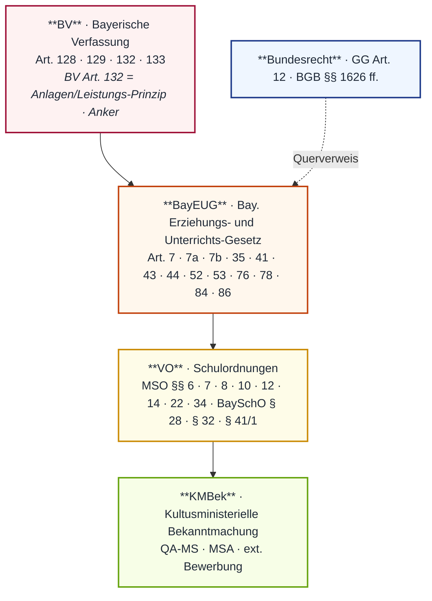
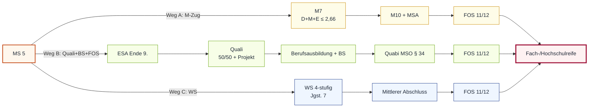

# MP_04 — Schulartenrecht · Schullaufbahn-Steuerung

ZALGM § 16 Nr. 4 · 2. Staatsexamen MS Bayern.

## In aller Kürze

Schullaufbahn-Steuerung ist eine **Trias aus SuS-Leistung, Eltern-Wahl und Schul-Beratung**: Eltern entscheiden Schulart und -wechsel (Art. 44 BayEUG · Elternwahlrecht), gebunden an **Eignung und Leistung** (Art. 44 + BV Art. 132 — Anlagen/Leistungs-Prinzip). Die Schule **berät** strukturell (Art. 78 BayEUG ), die Lehrerkonferenz **entscheidet** über Vorrücken/Wiederholung (Art. 53 BayEUG; MS-Konkretion: § 12 MSO LNW + MSO §§ 19 ff. ESA-Bestehensformel ). Vorrücken-Anker = Leistung in Vorrückungsfächern; Beratungs-Pflicht (Art. 78) reicht von Probeunterrichts-Beratung bis zu drei MS-Aufstiegswegen Richtung Hochschulreife. **Vier MS-Abschlüsse**: ESA, Quali, MSA (M10), Praxisklassen-Abschluss (§ 22 MSO ) + Quabi (§ 34 MSO ).

## Norm-Kartografie (5 Ebenen)

| Ebene | Schwerpunkt-Normen |
|---|---|
| **BV** | Art. 128 (Bildungsanspruch) · 129 (Schulpflicht/Unentgeltlichkeit) · **132 (Anlagen+Leistung+innere Berufung)** · 133 (Bildungsträger)|
| **BayEUG** | Art. 7/7a/7b (MS/M-Zug/bes. Schulart) · **35 (Schulpflicht)** · **41 (FöS-Lernort)** · 43 (Schulartwechsel) · 44 (Elternwahlrecht) · **52/1 + 52/3 (LNW + Zeugnis)** · 53 (Vorrücken/Wiederholung — KERN-NORM) · **76 (Eltern-Mitwirkung)** · **78 (Schulberatung)** · 84 ( — Werbung/Vertrieb; **NICHT Abschluss-Anker**) · **86 (Erziehungs-/Ordnungsmaßnahmen, )** |
| **VO** | **MSO § 12/1+/2+/3+/4 (LNW Mittelschule)** · **§ 14 (individueller Förderplan)** · § 22 (Praxisklassen-Abschluss, **) · § 34 (Quabi, **) · § 6 / § 7 / § 8 / § 10 (Gelenkklasse / M-Zug / Durchlässigkeit / Schülerpflichten) · **BaySchO § 28 (Hausaufgaben)** · **§ 32 (Individuelle Unterstützung)** · **§ 41/1 (Schülerakte-Einsicht; Verweis MP_09)** · GrSO § 6 / § 10 (GS-Übertritt — Stoff MP_03) |
| **KMBek** | QA-Mittelschule (Quali) · MSA Mittelschule · ext. Bewerbung — *(KMBek-Volltext nicht öffentlich strukturiert verfügbar. 12 (Berufswahl-Anker, MP_04-randständig) · BGB §§ 1626 ff. (Sorgerecht — Eltern-Antragsrecht) — ** |

---

# Teil A — Stoff

## A.1 Schullaufbahn-Akteure + Entscheidungs-Trias (SuS · EB · Schule)

**Verfassungsanker (BV Art. 132)** — Bildungsweg-Maßstab: **Anlagen + Neigungen + Leistung + innere Berufung**, NICHT wirtschaftliche/gesellschaftliche Stellung der Eltern.

**Direktionalitäten der Trias**:

| Akteur | Funktion | Norm-Anker |
|---|---|---|
| **SuS** | Leistung erbringen · Mitwirkung an sonderpäd. Gutachten · regelm. Teilnahme | Art. 56/4 BayEUG (vgl. MP_05 A.1) |
| **Erziehungsberechtigte** | Anmeldung · Wahl der Schulart (Vorbehalt Eignung) · Mitwirkungspflicht · Lernort-Wahl bei FöS | **Art. 76 BayEUG** + Art. 41/1 + Art. 44 ** |
| **Schule** | LNW-Erhebung · Beratung · Vorrückens-/Wiederholens-Entscheidung · Förderplan · ggf. Schulartwechsel-Verfahren | **Art. 52 + 78 + 86 BayEUG** + § 12 MSO + § 14 MSO |

**Eltern-Mitwirkungspflicht (Art. 76 BayEUG)**:

> Abs. 1: Die Erziehungsberechtigten sind verpflichtet, auf die gewissenhafte Erfüllung der schulischen Pflichten einschließlich der Verpflichtung nach Art. 56 Abs. 4 Satz 5 und der von der Schule gestellten Anforderungen durch die Schülerinnen und Schüler zu achten und die Erziehungsarbeit der Schule zu unterstützen.
> Abs. 2: Die Erziehungsberechtigten müssen insbesondere dafür sorgen, dass minderjährige Schulpflichtige am Unterricht regelmäßig teilnehmen und die sonstigen verbindlichen Schulveranstaltungen besuchen.

**Beratungs-Pflicht (Art. 78 BayEUG)** — Schule + Schulaufsicht **beraten** Eltern + SuS in Schullaufbahn-Fragen, geben Hilfen entsprechend Anlagen + Fähigkeiten. Beratung ist STRUKTURELL — keine Schulwahl-Entscheidung der LK.

**Elternwahlrecht (Art. 44 BayEUG)**: Eltern wählen Schulart/Ausbildungsrichtung/Fachrichtung — **gebunden an Eignung + Leistung**. Spezial-Aufnahmeprüfungen (z.B. Gym-Probeunterricht GS 4) sind zulässig.

**Lernort-Entscheidung bei sonderpäd. Förderbedarf (Art. 41 BayEUG)** — Auszug:

> Abs. 1: Schulpflichtige mit sonderpädagogischem Förderbedarf erfüllen ihre Schulpflicht durch den Besuch der allgemeinen Schule oder der Förderschule. […] Die Erziehungsberechtigten entscheiden, an welchem der im Einzelfall rechtlich und tatsächlich zur Verfügung stehenden schulischen Lernorte ihr Kind unterrichtet werden soll […].
> Abs. 6: Kommt keine einvernehmliche Aufnahme zustande, entscheidet die zuständige Schulaufsichtsbehörde nach Anhörung der Erziehungsberechtigten und der betroffenen Schulen über den schulischen Lernort.

!!! warning "⚠ Fallen Trias"
 - **Eltern-Wahl Lernort (Art. 41/1)**: Erziehungsberechtigte (NICHT Schule) — bei Volljährigkeit + Einsichtsfähigkeit: SuS selbst.
 - **Beratungs-Pflicht ≠ Schulwahl-Entscheidung der LK**: Schule berät; Eltern wählen (Art. 44).
 - **Förderschul-Aufnahme** setzt sonderpäd. Gutachten voraus (Art. 41/4 BayEUG ).
 - **Elternwahlrecht ist NICHT absolut** — Vorbehalt Eignung/Leistung (BV Art. 132 + Art. 44 BayEUG).

## A.2 Vorrücken / Wiederholung (Art. 53 BayEUG · § 12 MSO)

**Rechtsanker**: **Art. 53 BayEUG (Vorrücken/Wiederholen — KERN-NORM)**. Detail-Regelungen in den Schulordnungen. Für die Mittelschule: **§ 12 MSO** als LNW-Grundlagen-Anker.

### LNW-Grundsatz (Art. 52/1 BayEUG)

> Zum Nachweis des Leistungsstands erbringen die Schülerinnen und Schüler in angemessenen Zeitabständen entsprechend der Art des Fachs schriftliche, mündliche und praktische Leistungen. Art, Zahl, Umfang, Schwierigkeit und Gewichtung der Leistungsnachweise richten sich nach den Erfordernissen der jeweiligen Schulart und Jahrgangsstufe sowie der einzelnen Fächer. Die Art und Weise der Erhebung der Nachweise des Leistungsstandes ist den Schülerinnen und Schülern vorher bekannt zu geben; die Bewertung der Leistungen ist den Schülerinnen und Schülern mit Notenstufe und der Begründung für die Benotung zu eröffnen. Leistungsnachweise dienen der Leistungsbewertung und als Beratungsgrundlage.

**Direktionalität**: SuS → LNW erbringen · LK → vorher bekannt geben + mit Notenstufe + Begründung eröffnen.

### Notenstufen Art. 52/2 BayEUG (Auszug verbatim · )

| Note | Bezeichnung | Definition (Wortlaut) |
|---|---|---|
| 1 | sehr gut | „Leistung entspricht den Anforderungen **in besonderem Maße**" |
| 2 | gut | „Leistung entspricht **voll** den Anforderungen" |
| 3 | befriedigend | „Leistung entspricht **im Allgemeinen** den Anforderungen" |
| 4 | ausreichend | „Leistung weist zwar Mängel auf, entspricht aber **im Ganzen noch** den Anforderungen" |
| 5 | mangelhaft | „Leistung entspricht nicht den Anforderungen, lässt jedoch erkennen, dass trotz deutlicher Verständnislücken die notwendigen **Grundkenntnisse vorhanden** sind" |
| 6 | ungenügend | „Leistung entspricht nicht den Anforderungen und lässt selbst die notwendigen Grundkenntnisse **nicht erkennen**" |

### Zeugnis-Bewertung (Art. 52/3 BayEUG)

> Unter Berücksichtigung der einzelnen schriftlichen, mündlichen und praktischen Leistungen werden Zeugnisse erteilt. Hierbei werden die gesamten Leistungen einer Schülerin oder eines Schülers unter Wahrung der Gleichbehandlung aller Schülerinnen und Schüler in pädagogischer Verantwortung der Lehrkraft bewertet. Daneben sollen Bemerkungen oder Bewertungen nach Abs. 2 Satz 1 oder in anderer Form über Anlagen, Mitarbeit und Verhalten der Schülerin oder des Schülers in das Zeugnis aufgenommen werden.

### LNW-Festlegungen Lehrerkonferenz (§ 12/1 MSO)

> Die Lehrerkonferenz trifft vor Unterrichtsbeginn des Schuljahres grundsätzliche Festlegungen zur Erhebung von Leistungsnachweisen einschließlich prüfungsfreier Lernphasen. Die Festlegungen sind den Schülerinnen und Schülern sowie ihren Erziehungsberechtigten bekannt zu geben.

### Vorrückungs-Logik MS (KMBek/MSO §§ 19 ff.)

**Vorrückungsfächer MS**: Kernfächer D/M/E + Pflichtfach nach Jgst. *(Detailliste in MSO §§ 19 ff. — )*

**Bestehensformel ESA** (Erfolgreicher Mittelschulabschluss — *MSO §§ 19 ff. *): Durchschnitt Vorrückungsfächer ≥ **4,00** + max. **3 Fächer schlechter als 4** (Note 6 zählt wie 2× Note 5).

**Vorrücken auf Probe**: knappes Notenbild → Lehrerkonferenz/SL-Entscheidung **.

**Freiwilliges/Pflichtwiederholen**: Antrag der Eltern bzw. Lehrerkonferenz-Beschluss; Wiederholungsfristen sind in MSO §§ 19 ff. geregelt **.

**Überspringen**: Antrag mit Leistungsnachweis · SL-Genehmigung **. **Verkürzung** der Vollzeitschulpflicht durch Überspringen möglich; **keine Verlängerung** durch Streckung (Art. 35/2 BayEUG: „zwölf Jahre, soweit dieses Gesetz nichts anderes bestimmt").

!!! warning "⚠ Fallen Vorrücken/Wiederholung"
 - **Art. 53 BayEUG ist KERN-NORM** — aber im Source-Repo (Anker). Detail-Werte müssen aus MSO §§ 19 ff. (ebenfalls ) entnommen werden
 - **Notenstufen-Definitionen exakt**: „in besonderem Maße" / „voll" / „im Allgemeinen" / „im Ganzen noch" — präzise zitieren.
 - **„Mitarbeitsnote" gibt es nicht eigenständig** (Art. 52/3): Zeugnis-Bewertung der **Gesamtleistungen**, daneben **soll**-Bemerkungen über „Anlagen, Mitarbeit und Verhalten" (Trias).
 - **„Beratungsgrundlage" (Art. 52/1 letzter Satz)**: LNW dienen Bewertung UND Beratung — beides nennen.

## A.3 Übertritt zwischen Schularten (Art. 7/7a/7b/43/44 BayEUG · MSO §§ 6/7/8)

**Verfassungs- + Gesetzes-Anker**: BV Art. 132 (Anlagen/Leistung) + Art. 44 BayEUG (Elternwahl) + Art. 43 BayEUG (Schulartwechsel).

**Schularten-Definitionen**:
- **Art. 7 BayEUG** — Mittelschule (Aufgaben)
- **Art. 7a BayEUG** — Mittlere-Reife-Klassen (M-Zug) — (KERN-NORM für M-Zug-Übertritt!)
- **Art. 7b BayEUG** — Schulen besonderer Art (Modellprojekte; NICHT mit „Profil Inklusion" Art. 30a/4 verwechseln)

### Übertritts-Schwellen (Übersicht; Wortlaut-Quelle )

=== "GS 4 → Sek I (Spiegel-Stoff MP_03 A.4)"

 **Mai-ÜZ Jgst. 4, nur D/M/HSU zählen.** *(GrSO § 6 + § 10 —; Detailbehandlung in MP_03 A.4)*

 | Ziel | Schwelle | Probeunterricht |
 |---|---|---|
 | **Gymnasium** | ≤ **2,33** | ab 2,34 PU 3 Tage D/M; bestanden = mind. 1×3 + 1×4 |
 | **Realschule** | ≤ **2,66** | analog |
 | **Mittelschule** | alle übrigen ||

 Eltern-Antragsrecht PU unabhängig vom Schnitt. **Elternwillen-Regel**: bei 2× Note 4 NACH PU.

=== "MS 5 → Gym/RS (Gelenkklasse · § 6 MSO)"

 **Jahreszeugnis Jgst. 5 MS.**

 | Ziel | Schwelle (Jahreszeugnis Jgst. 5) | Anmerkung |
 |---|---|---|
 | **Gymnasium** | D+M ≤ **2,0** | uneingeschränkt; sonst Härtefall LK-Konferenz |
 | **Realschule** | D+M ≤ **2,5** | uneingeschränkt |

=== "MS → M-Zug (Mittlere-Reife-Klasse · § 7 MSO)"

 | Ziel-Klasse | Schwelle D+M+E | Bedingung |
 |---|---|---|
 | **M7** | ≤ **2,66** | uneingeschränkt aus 6. Klasse Jahreszeugnis |
 | **M8 / M9** | ≤ **2,33** | analog |
 | **M10** | + ≤ **2,33** | + Quali-Zeugnis aus 9. Klasse |

 **Rückkehr MS↔M-Zug jederzeit** (§ 8 MSO ).

=== "MS 5–9 → Gym/RS außerhalb Gelenkklasse"

 **: Aufnahmeprüfung in den letzten Tagen der Sommerferien + Probezeit. RS-Alternative: D+M+E ≤ 2,0 im Jahreszeugnis.

=== "MS → Wirtschaftsschule (4-stufige WS, Jgst. 7)"

 **: aus 6./7. Klasse MS Jahreszeugnis D+M+E ≤ 2,66 uneingeschränkt; alternativ M-Zug-Vorrückungserlaubnis aus 7.; sonst Probeunterricht (3 Tage).

### Aufstiegswege MS → Hochschulreife

!!! warning "⚠ Fallen Übertritt"
 - **GS-ÜZ-Schwellen ≠ Gelenkklassen-Schwellen**: GS 4 = Gym 2,33 / RS 2,66 (D/M/HSU); MS 5 = Gym 2,0 / RS 2,5 (D+M).
 - **M-Zug-Schwellen NICHT alle gleich**: M7 ≤ 2,66 · M8/M9/M10 ≤ 2,33 (D+M+E).
 - **Übertritts-Dokument nicht nur Jgst. 4**: Gelenkklasse Jgst. 5 MS (Jahreszeugnis) + Jgst. 6 für M-Zug ebenfalls.
 - **Art. 7a BayEUG (M-Zug) ≠ Art. 7b BayEUG (Schule besonderer Art)** ≠ Art. 30a/4 (Profil Inklusion ) — drei verschiedene Anker.

*Spiegelfall siehe MP_03 A.4 — Übertritts-Schwellen GS→Sek I + Probeunterricht-Logik dort detailliert (Lara/Yusuf-Fälle MP_03).*

## A.4 Probearbeiten / LNW-Anteile (§§ 12/2 + 12/3 + 12/4 MSO · § 28 BaySchO)

**Rechtsanker MS-LNW**: **§ 12 MSO Container** ( → Volltexte unter § 12/1, /2, /3, /4 ). *Container — Volltext via § 12/1, § 12/2, § 12/3, § 12/4.*

### Ankündigung schriftlicher LNW (§ 12/2 MSO)

> Schriftliche Leistungsnachweise können je nach Art und Umfang angekündigt werden; sie müssen angekündigt werden, wenn größere Lernabschnitte bearbeitet werden sollen. Der Termin eines angekündigten schriftlichen Leistungsnachweises muss spätestens eine Woche vorher bekannt gegeben werden. An einem Tag darf nur ein angekündigter schriftlicher Leistungsnachweis, in der Woche sollen nicht mehr als zwei angekündigte schriftliche Leistungsnachweise gefordert werden. Kann der Leistungsstand einer Schülerin oder eines Schülers wegen nicht zu vertretender Versäumnisse nicht hinreichend beurteilt werden, so kann die Lehrkraft das Nachholen von angekündigten Leistungsnachweisen anordnen oder eine Ersatzprüfung anberaumen. Der Schülerin oder dem Schüler und den Erziehungsberechtigten ist der Nachtermin spätestens eine Woche vorher, der Termin der Ersatzprüfung spätestens zwei Wochen vorher mitzuteilen. Mit dem Termin ist der Prüfungsstoff bekannt zu geben. Die Ersatzprüfung kann in einem Fach nur einmal im Schulhalbjahr stattfinden und sie kann sich über den gesamten bis dahin behandelten Unterrichtsstoff des Schuljahres erstrecken.

**Direktionalität**: LK → Ankündigung an SuS.

**Werte (verbatim)**: Ankündigungs-Frist **1 Woche** vorher · max. **1/Tag** · max. **2/Woche** (angekündigt!) · Nachtermin **1 Woche** · Ersatzprüfung **2 Wochen** vorher · Ersatzprüfung **1×/Halbjahr** · gesamter bisheriger Stoff.

### LNW-Rückgabe (§ 12/3 MSO — KRITISCHE Direktionalitäts-Falle!)

> Schriftliche und praktische Leistungsnachweise sind den Schülerinnen und Schülern innerhalb einer angemessenen Frist zurückzugeben und mit ihnen zu besprechen. Schriftliche Leistungsnachweise werden den Schülerinnen und Schülern zur Kenntnisnahme durch die Erziehungsberechtigten mit nach Hause gegeben oder in anderer geeigneter Weise zugänglich gemacht. Die schriftlichen Leistungsnachweise sind innerhalb einer Woche unverändert an die Schule zurückzugeben. In begründeten Fällen kann die Herausgabe von Leistungsnachweisen unterbleiben.

!!! danger "⚠ KRITISCH: ZWEI Direktionalitäten in einem Absatz"
 - **(a) LK → SuS = "angemessene Frist"** (KEIN konkreter Wert!)
 - **(b) SuS → Schule = "innerhalb einer Woche unverändert"**
 - „2 Wochen LK→SuS" wäre **FALSCH** — Wortlaut sagt „**angemessene Frist**".
 - Eltern-Kenntnisnahme ist **Zwischenschritt** (SuS → Eltern → Schule) — nicht direkt SuS→Schule.
 - „**Unverändert**" = keine Manipulation der Korrektur durch SuS oder EB.

### Projektprüfung Jgst. 9 Regelklasse (§ 12/4 MSO)

> In der Jahrgangsstufe 9 findet für die Schülerinnen und Schüler einer Regelklasse eine Projektprüfung mit schriftlichen, mündlichen und praktischen Lerninhalten des Fachs Wirtschaft und Beruf sowie des jeweiligen in dieser Jahrgangsstufe besuchten berufsorientierenden Wahlpflichtfachs statt. Die Arbeitszeit beträgt in der Durchführungsphase der Projektprüfung im Fach Technik 240 Minuten, im Fach Wirtschaft und Kommunikation 120 Minuten und im Fach Ernährung und Soziales 150 Minuten. Die Schulleiterin oder der Schulleiter kann für notwendige Phasen der Kommunikation der Gruppenmitglieder untereinander einen Zeitzuschlag von bis zu 20 Minuten gewähren und die Arbeitszeit in den übrigen Teilen der Projektprüfung bestimmen. In der Projektprüfung wird aus den erbrachten Leistungen eine Gesamtnote gebildet.

**Direktionalität**: Schule führt Projektprüfung durch (**Jgst. 9 Regelklasse — NICHT M-Zug**).

**Arbeitszeiten (verbatim)**: Technik **240 Min.** · Wirtschaft+Kommunikation **120 Min.** · Ernährung+Soziales **150 Min.** · SL-Zeitzuschlag bis **20 Min.** für Gruppen-Kommunikation.

### Hausaufgaben (§ 28 BaySchO)

> Abs. 1: ¹Um den Lehrstoff einzuüben und die Schülerinnen und Schüler zu eigener Tätigkeit anzuregen, werden Hausaufgaben gestellt, die bei durchschnittlichem Leistungsvermögen in angemessener Zeit unter Berücksichtigung der Anforderungen des Nachmittagsunterrichts sowie der Inanspruchnahme durch die praktische Ausbildung an beruflichen Schulen bearbeitet werden können. ²Die Lehrerkonferenz legt vor Unterrichtsbeginn des Schuljahres die Grundsätze für die Hausaufgaben fest. ³Sonntage, Feiertage und Ferien sind von Hausaufgaben freizuhalten.
> Abs. 2: ¹An Grundschulen und Grundschulstufen der Förderschulen gilt eine Zeit von bis zu einer Stunde als angemessen. ²An Förderschulen ist auch die individuelle Leistungsfähigkeit der einzelnen Schülerin oder des einzelnen Schülers zu berücksichtigen. ³An Tagen mit verpflichtendem Nachmittagsunterricht werden an Grundschulen und Förderschulen keine schriftlichen Hausaufgaben für den nächsten Tag gestellt; hiervon kann im Einvernehmen mit dem Elternbeirat abgewichen werden.

**Maßstab (verbatim)**: „**durchschnittliches Leistungsvermögen**" + Berücksichtigung **Nachmittagsunterricht** + **berufliche Praktika**. Sonntage/Feiertage/**Ferien** freizuhalten — **drei** Kategorien!

!!! warning "⚠ Fallen LNW + HA"
 - **§ 12/3 MSO Direktionalitäts-Falle** (siehe oben, KRITISCH).
 - **HA dürfen NICHT als LNW genutzt werden** — folgt aus Lehrplan/Grundsätzen, nicht aus § 28 selbst.
 - **HA-Differenzierung** steht in **§ 32/2 Nr. 6 BaySchO** (Individuelle Unterstützung — NICHT in § 28 selbst).
 - **GS-Richtwert HA: „bis zu einer Stunde"** (Obergrenze, NICHT „eine Stunde" als Mindestwert).
 - **Projektprüfung NUR Regelklasse** Jgst. 9 — NICHT M-Zug.
 - **„Beratungsgrundlage" (Art. 52/1) ↔ „Auskunfts-Anspruch" SuS (Art. 56/2 Nr. 4)** — siehe MP_05 A.3 Hannah-Falle.

## A.5 Abschlüsse Mittelschule (Quali · MSA · Praxisklassen-Abschluss · Quabi · ext. Bewerbung)

**Rechtsrahmen**: **Art. 7 BayEUG** (MS-Aufgaben) verweist auf MSO §§ 19 ff. (Quali) · §§ 30 ff. (MSA M10) · § 22 (Praxisklassen-Abschluss) · § 34 (Quabi). Im Source-Repo verbatim verfügbar: **§ 22 MSO + § 34 MSO ( mit Auszügen)**. Quali + MSA = **KMBek-Anker**.

### Vier MS-Abschlüsse + Quabi (Übersicht)

| Abschluss | Norm | Bestehensformel / Voraussetzung |
|---|---|---|
| **ESA** (Erfolgreicher MS-Abschluss) — Ende 9. | MSO §§ 19 ff. ** | Vorrückungsfächer-Schnitt ≥ **4,00** + max. **3 Fächer schlechter als 4** (Note 6 = 2× Note 5) |
| **Quali** (qualifizierender MS-Abschluss) — freiwillig Ende 9. | MSO §§ 26 ff. + KMBek QA-MS ** | **50 % Jahresfortgang + 50 % Prüfung**; Fächer D/M/E + PCB/GSE/AWT + **Projektprüfung** |
| **MSA** (Mittlerer Schulabschluss M10) | MSO §§ 30 ff. + KMBek MSA ** | schriftl./mündl./prakt. Prüfungen am Ende M10 |
| **Praxisklassen-Abschluss** | **§ 22 MSO** ** | theorieentlastete Prüfung; Bestehen ≤ **4,0**; Projektnote **doppelt** |
| **Quabi** (qualifizierter beruflicher Bildungsabschluss) | **§ 34 MSO** ** | Quali + Berufsabschluss (Notendurchschnitt mind. **3,0**) + Englisch „ausreichend" |

### § 22 MSO — Praxisklassen-Abschluss 

> Abs. 1 (Auszug, verbatim): Schüler ab dem 9. Schulbesuchsjahr in Praxisklassen oder Deutschklassen können den erfolgreichen Abschluss der Mittelschule mit dem Bestehen einer theorieentlasteten Abschlussprüfung erlangen.
> Abs. 2 (Auszug, verbatim): Die Prüfung besteht aus: 1. Deutsch/DaZ schriftlich (75 Min.) + mündlich (15 Min.); 2. Mathematik schriftlich (60 Min.); 3. Fächerverbund schriftlich (45 Min.); 4. Projektprüfung. Bestehen erfordert Durchschnittsnote 4,0 oder besser; Projektprüfungsnote zählt doppelt.

**Werte (verbatim)**: D/DaZ 75 schriftl. + 15 mdl. Min. · M 60 Min. · Fächerverbund 45 Min. · **Projektprüfungsnote zählt DOPPELT** · Durchschnitt **≤ 4,0**.

### § 34 MSO — Quabi 

> Abs. 1 (Auszug, verbatim): Für den qualifizierten beruflichen Bildungsabschluss [Quabi] ist ein Berufsabschluss mit Notendurchschnitt von mindestens 3,0 erforderlich. Teilnoten werden gleich gewichtet, wenn im Zeugnis keine Gesamtnote festgesetzt ist.
> Abs. 2 (Auszug, verbatim): Englischkenntnisse werden durch die Note "ausreichend" nachgewiesen — über MS-Abschlusszeugnis, Jahreszeugnis Klasse 9/10 (Gym/RS/WS), nachgewiesene Englischkenntnisse für mittleren Schulabschluss oder BS/BFS-Zeugnis.

**Werte (verbatim)**: Berufsabschluss Notendurchschnitt mindestens **3,0** · Englisch-Note „**ausreichend**" (= Note 4).

### Externe Bewerbung Quali / MSA (KMBek)

SuS, die nicht als Regelschüler an einer MS sind (z.B. wechselnde Schulart, Privatschule, Sonderfälle), können Quali bzw. MSA über **externe Bewerbung** erlangen — Termine + Modalitäten via KMBek-Anker (*nicht öffentlich strukturiert verfügbar.

### Förderung bei Lernschwierigkeiten

**§ 14 MSO — Individueller Förderplan**:

> ¹Die Lernziele der Schülerinnen und Schüler, die auf Grund ihres sonderpädagogischen Förderbedarfs voraussichtlich die Lernziele der Mittelschule nicht erreichen, sind in einem individuellen Förderplan festzuschreiben; ansonsten kann ein Förderplan bei Bedarf erstellt werden.
> ²Der Förderplan enthält Aussagen über die Ziele der Förderung, die wesentlichen Fördermaßnahmen und die vorgesehenen Leistungserhebungen.
> ³Die Lernziele im Förderplan sind mindestens jährlich fortzuschreiben.
> ⁴Die Erstellung des Förderplans erfolgt unter Einbeziehung der Mobilen Sonderpädagogischen Dienste.
> ⁵Der Förderplan soll mit den Erziehungsberechtigten erörtert werden.

**§ 32 BaySchO — Individuelle Unterstützung** — 7-Maßnahmen-Katalog Abs. 2: 1. besondere Arbeitsmittel · 2. Räumlichkeiten · 3. Pausenregelungen · 4. Hand-/Lautzeichen + Symbole · 5. individuelle Arbeitsanweisungen · 6. **HA-Differenzierung** · 7. Visualisierung+Verbalisierung. KRITISCH: gilt nur „**soweit nicht die Leistungsfeststellung berührt wird**" — Abgrenzung zu Nachteilsausgleich (§ 33 BaySchO).

**Schullaufbahn-Sanktionen (Art. 86 BayEUG · )**: Erziehungsmaßnahmen ZUERST, dann Ordnungsmaßnahmen. Schullaufbahn-relevante OM in Abs. 2 (Punkt 8 = Zuweisung an andere Schule; Punkt 9 = Androhung Entlassung; Punkt 10 = Entlassung; Punkt 11+12 = Schulart-Ausschluss).

> Abs. 1: Zur Sicherung des Bildungs- und Erziehungsauftrags oder zum Schutz von Personen und Sachen können Erziehungsmaßnahmen gegenüber Schülerinnen und Schülern getroffen werden. […] Soweit andere Erziehungsmaßnahmen nicht ausreichen, können Ordnungs- und Sicherungsmaßnahmen ergriffen werden. Maßnahmen des Hausrechts bleiben stets unberührt. Alle Maßnahmen werden nach dem Grundsatz der Verhältnismäßigkeit ausgewählt.

!!! warning "⚠ Fallen Abschlüsse"
 - **Quali ≠ MSA ≠ Quabi**: Quali = freiwillige Ende-9-Prüfung (50/50 + Projekt); MSA = M10-Abschluss; Quabi = Quali + Berufsabschluss + Englisch.
 - **Praxisklassen-Abschluss: 9. Schulbesuchsjahr** (NICHT zwingend Jgst. 9 wegen Wiederholern).
 - **§ 22 MSO Projektnote DOPPELT** in Praxisklassen-Bestehen.
 - **§ 34 MSO Quabi: „mindestens 3,0"** = ≤ 3,0 (NICHT besser als 3,0).
 - **§ 14 MSO Förderplan**: Festschreibungs-Pflicht greift, wenn Lernziele der Mittelschule voraussichtlich nicht erreicht werden; in den übrigen Konstellationen ist ein Förderplan „bei Bedarf" zulässig (Wortlaut Satz 1).
 - **Art. 84 BayEUG ist verbatim Werbung/Vertrieb** — Schullaufbahn-Abschluss-Anker = Art. 84/85 BayEUG sind eine **andere -Ref** (Detail in MSO).

---

# Teil B — Top-8-Pflichtwissen

7-Tage-Endspurt-Cheat-Sheet · Karten-IDs verlinken auf das Anki-Lerndeck.

-:material-numeric-1-circle: __S01 · Rückgabe-Direktionalität (§ 12/3 MSO)__

 LK → SuS = **„angemessene Frist"** (kein Wert!)
 SuS → Schule = **„einer Woche unverändert"**.
 *KRITISCH-Falle.*

-:material-numeric-2-circle: __S02 · Ankündigungs-Werte (§ 12/2 MSO)__

 **1 Woche** vorher · max. **1/Tag** · max. **2/Woche** angek.
 Nachtermin 1 W. · Ersatzprüfung 2 W. · 1×/Halbjahr.

-:material-numeric-3-circle: __S03 · Notenstufen (Art. 52/2 BayEUG)__

 Wortlaut exakt: „in besonderem Maße" · „voll" ·
 „im Allgemeinen" · „im Ganzen noch" · „Grundkenntnisse vorhanden".

-:material-numeric-4-circle: __S04 · Förderplan (§ 14 MSO)__

 Pflicht NUR bei nicht erreichten MS-Lernzielen.
 MSD-Pflicht · jährlich fortzuschreiben · Erörterung Eltern „soll".

-:material-numeric-5-circle: __S05 · M-Zug-Schwellen (§ 7 MSO)__

 M7 ≤ **2,66** (D+M+E) · M8/M9/M10 ≤ **2,33**.
 M10 zus. Quali-Vor. · Rückkehr MS↔M-Zug jederzeit.

-:material-numeric-6-circle: __S06 · Praxisklassen-Abschluss (§ 22 MSO)__

 9. **Schulbesuchsjahr** · D 75+15 / M 60 / FV 45 + Projekt.
 Projektnote **doppelt** · Bestehen ≤ 4,0.

-:material-numeric-7-circle: __S07 · Quabi (§ 34 MSO)__

 Berufsabschluss **mind. 3,0** + Englisch „ausreichend" + Quali.
 Quabi ≠ Quali ≠ MSA — präzise trennen!

-:material-numeric-8-circle: __S08 · Beratungs-Trias (Art. 78 · Art. 44 · BV 132)__

 Schule **berät**, Eltern **wählen** (gebunden Eignung/Leistung).
 BV Art. 132: Anlagen + Leistung + innere Berufung.

---

# Teil C — Falle-Atlas

| ID | Falle | Korrekte Auflösung |
|---|---|---|
| FA01 | **§ 12/3 MSO** Rückgabefrist als feste Wochen-Zahl? | **NEIN** — Wortlaut sagt **„angemessene Frist"** (LK→SuS) bzw. **„einer Woche unverändert"** (SuS→Schule). Zwei Direktionalitäten! Kein konkreter Wochen-Wert für die LK→SuS-Frist im Wortlaut. |
| FA02 | „Mitarbeitsnote" als eigenständige Note? | **NEIN** — Art. 52/3 BayEUG: Zeugnis-Bewertung der **Gesamtleistungen**; daneben SOLL-Bemerkungen über **Anlagen, Mitarbeit und Verhalten** (Trias). |
| FA03 | Probearbeiten Jgst. 4 = „10/4/4 D/M/HSU" verbatim? | **NEIN** — GrSO § 10 sagt verbatim nur **„insgesamt 18"** + **„mind. 4 Wochen probearbeiten-frei"** in den drei genannten Fächern; Verteilung 10/4/4 ist Sekundärliteratur. |
| FA04 | Projektprüfung § 12/4 MSO auch für M-Zug? | **NEIN** — Wortlaut „**Regelklasse** Jgst. 9". M-Zug hat eigene MSA-Prüfung. |
| FA05 | Förderplan immer Pflicht? | **NEIN** — § 14 MSO Satz 1: Festschreibungs-Pflicht greift, wenn die SuS aufgrund sonderpäd. Förderbedarfs die MS-Lernziele voraussichtlich nicht erreichen; in den übrigen Konstellationen ist ein Förderplan „bei Bedarf" zulässig. |
| FA06 | Quali = Quabi? | **NEIN** — Quali = freiwillige Ende-9-Prüfung (50/50 + Projekt); Quabi = qualifizierter beruflicher Bildungsabschluss = Quali + Berufsabschluss (mind. 3,0) + Englisch (§ 34 MSO). |
| FA07 | Praxisklassen-Abschluss = Jgst. 9? | **NICHT zwingend** — § 22 MSO: „**9. Schulbesuchsjahr**" (wg. Wiederholern). |
| FA08 | Art. 84 BayEUG = Abschluss-Regelung? | **NEIN** — Art. 84 BayEUG ist **Werbung/Vertrieb** (politische Werbung verboten). Abschluss-Anker (Art. 84/85 BayEUG) sind -Refs; konkrete Abschluss-Werte stehen in MSO §§ 19 ff. bzw. § 22, § 34 MSO ( verbatim). |
| FA09 | M-Zug-Schwellen alle = 2,33? | **NEIN** — M7 ≤ **2,66** · M8/M9/M10 ≤ **2,33** (§ 7 MSO ). |
| FA10 | Elternwahlrecht Art. 44 BayEUG absolut? | **NEIN** — gebunden an **Eignung + Leistung** (BV Art. 132 + Art. 44 BayEUG). Spezial-Aufnahmeprüfungen (PU, M-Zug-Aufnahme) zulässig. |

---

# Teil D — Fallbeispiele

??? example "Fall **Sara** — § 12/3 MSO LNW-Rückgabe-Frist (Hauptfall · KRITISCH)"
 **Sachverhalt**: Sara (8. Kl. MS) hat eine Mathe-Schulaufgabe geschrieben. Die Mutter ruft nach gut anderthalb Wochen an: „Wo bleibt die Schulaufgabe?" Die LK antwortet, sie habe „noch reichlich Zeit zum Korrigieren — die Frist sei nicht starr".

 **Knackpunkte**:

 1. **§ 12/3 MSO Direktionalitäts-Falle**: Die LK→SuS-Frist ist **„angemessen"** (KEIN konkreter Wert!) — „2 Wochen" wäre als verbatim falsch. Der LK steht eine angemessene Frist zu, die situations-/fach-/umfangs-abhängig ist.
 2. **SuS→Schule = „einer Woche unverändert"**: nach Rückgabe + Eltern-Kenntnisnahme.
 3. **„Unverändert"**: keine Manipulation der Korrektur durch SuS oder EB.
 4. **Eltern-Kenntnisnahme** ist Zwischenschritt (SuS → Eltern → Schule).
 5. **Beratungs-Pflicht (Art. 78)**: Mutter sachlich aufklären über Direktionalitäten.

 **Antwortkette**: Direktionalitäten klären → konkrete Korrekturfortschritte transparent kommunizieren → Bei Verzögerung: SL informieren (nicht in Anwesenheit der Mutter eskalieren).

??? example "Fall **Tarek** — Praxisklassen-Übergang (§ 22 MSO)"
 **Sachverhalt**: Tarek besucht das **9. Schulbesuchsjahr** in einer Praxisklasse (er hat in Jgst. 6 wiederholt). Die Mutter fragt: „Kann er trotzdem den MS-Abschluss machen?"

 **Knackpunkte**:

 1. **§ 22/1 MSO**: „Schüler ab dem **9. Schulbesuchsjahr** in Praxisklassen oder Deutschklassen können den erfolgreichen Abschluss der Mittelschule mit dem Bestehen einer theorieentlasteten Abschlussprüfung erlangen."
 2. **9. Schulbesuchsjahr ≠ Jgst. 9** (wegen Wiederholung) — Tarek erfüllt den Anker.
 3. **Prüfungsstruktur § 22/2**: D/DaZ schriftl. **75 Min.** + mündl. **15 Min.** · M schriftl. **60 Min.** · Fächerverbund schriftl. **45 Min.** · Projektprüfung. Bestehen Durchschnitt ≤ **4,0** · **Projektnote zählt doppelt**.
 4. **Beratungs-Pflicht Art. 78**: weitere Optionen (ESA über Regelweg) realistisch einschätzen + Aufstiegsweg via Quabi (§ 34 MSO) oder Berufsausbildung.

 **Antwortkette**: Schulbesuchsjahr-Stand prüfen (idR Schülerakte → MP_09 § 41/1 BaySchO) → Theorieentlastete Prüfung erläutern → Projektnoten-Doppelgewichtung als Strategie nutzen → ggf. zusätzlich Quabi-Perspektive über Berufsausbildung.

??? example "Fall **Leonie** — Quabi-Voraussetzung (§ 34 MSO)"
 **Sachverhalt**: Leonie hat den Quali in Jgst. 9 mit 2,5 bestanden. Sie hat anschließend eine **Berufsausbildung** zur Friseurin abgeschlossen mit Berufsabschluss-Notendurchschnitt **2,8**. Englisch-Note in der BS-Abschlussprüfung: **3**. Sie fragt: „Bin ich quabi-berechtigt?"

 **Knackpunkte**:

 1. **§ 34/1 MSO**: „Berufsabschluss mit Notendurchschnitt von **mindestens 3,0**" → Leonie hat 2,8 ≤ 3,0 ✓.
 2. **§ 34/2 MSO**: „Englischkenntnisse durch Note **ausreichend**" (= Note 4 als Mindest-Note) → Leonie hat 3 (besser) ✓.
 3. **Quali als Vorbedingung** ✓ (KMBek QA-MS, ).
 4. **Quabi ≠ MSA**: Quabi öffnet Aufstieg, MSA wäre M10 gewesen.

 **Antwortkette**: Voraussetzungen prüfen (Quali ✓ · Berufsabschluss-Note ≤ 3,0 ✓ · Englisch ≥ „ausreichend" ✓) → Antrag stellen (Schule bzw. KMBek-Verfahren) → Durchlässigkeits-Perspektive: Quabi → BS+FOS-Brücke → Fachabi (vgl. Aufstiegsweg B in A.3).

??? example "Fall **Arda** — Förderplan-Pflicht (§ 14 MSO)"
 **Sachverhalt**: Arda (Jgst. 7 MS) zeigt erhebliche Lese-Rechtschreib-Schwierigkeiten + Konzentrationsprobleme. Eltern erwarten „endlich einen Förderplan", die LK fragt sich, ob ein Förderplan zwingend ist.

 **Knackpunkte**:

 1. **§ 14 MSO Pflicht-Tatbestand**: nur wenn SuS „auf Grund ihres sonderpädagogischen Förderbedarfs voraussichtlich die Lernziele der Mittelschule **nicht erreichen**" — sonst optional („**bei Bedarf**").
 2. **Diagnostik-Vorstufe**: sonderpäd. Gutachten (Art. 41/4 BayEUG ) für Förderbedarfs-Feststellung.
 3. **Inhalt Förderplan (§ 14 S. 2)**: drei Pflicht-Inhalte = Ziele · Fördermaßnahmen · Leistungserhebungen.
 4. **MSD-Einbeziehung Pflicht** bei Erstellung (§ 14 S. 4); Erörterung mit EB **„soll"** (§ 14 S. 5 — nicht „muss").
 5. **Fortschreibung mind. jährlich** (§ 14 S. 3).
 6. **§ 32 BaySchO Individuelle Unterstützung** parallel zulässig — ABER nur „**soweit nicht die Leistungsfeststellung berührt wird**" (Abgrenzung Nachteilsausgleich).

 **Antwortkette**: Sonderpäd. Verdacht → MSD-Anbindung → ggf. Gutachten Art. 41 → bei voraussichtl. Nicht-Erreichen der MS-Ziele: Förderplan PFLICHT mit MSD; sonst „bei Bedarf" zulässig + Individuelle Unterstützung § 32 BaySchO als Sofort-Maßnahme.

??? example "Fall **Familie Çelik** — M-Zug-Wechsel (§ 7 MSO + Art. 78 BayEUG)"
 **Sachverhalt**: Aylin (Jgst. 6 MS) hat im Jahreszeugnis D **2** · M **3** · E **2** = 2,33 D+M+E. Eltern wollen, dass Aylin in M7 wechselt.

 **Knackpunkte**:

 1. **§ 7 MSO M7-Schwelle**: ≤ **2,66** (D+M+E) → Aylin (2,33) erfüllt uneingeschränkt aus Jgst. 6 Jahreszeugnis ✓.
 2. **Art. 78 BayEUG Beratungs-Pflicht**: Schule muss Eltern + SuS in Schullaufbahn-Fragen beraten — entsprechend „**Anlagen und Fähigkeiten**".
 3. **§ 8 MSO Durchlässigkeit**: Rückkehr M-Zug → Regelklasse jederzeit möglich, falls M-Zug-Anforderungen nicht passen.
 4. **Art. 44 BayEUG Elternwahlrecht**: Eltern entscheiden, gebunden an Eignung/Leistung (Schwelle erfüllt → Wahl frei).

 **Antwortkette**: Notenbild prüfen → Schwelle bestätigen → Beratung über M-Zug-Anforderungen + Aufstiegsweg (M7 → M10 + MSA → FOS 11/12 → Fachabi) → Anmeldung am M-Zug; Hinweis auf § 8-Rückkehrmöglichkeit als Sicherheitsnetz.

---

# Querverweise

- **Trias SuS/EB/Schule (A.1) ↔ MP_05 A.1** — SuS-Pflichten (Art. 56/4 BayEUG ) entfalten die Schullaufbahn-Pflichtenseite, die hier in MP_04 als Eltern-Wahl-Komplement dargestellt ist.
- **LNW-Rückgabe (§ 12/3 MSO, A.4) + Notenauskunft ↔ MP_05 A.3** — Auskunfts-Anspruch SuS (Art. 56/2 Nr. 4 BayEUG, Hannah-Falle) korrespondiert mit dem in A.4 verbatim verankerten LNW-Erhebungs-Pflichten der LK (Art. 52/1 BayEUG).
- **§ 41 BaySchO Schülerakte (A.5 Praxisklassen-Schulbesuchsjahr-Diagnose) ↔ MP_09 A.2** — § 41/1 BaySchO Einsichtsrecht ab Vollendung 14. Lj. ist die Datenschutz-Schiene für Schullaufbahn-Daten.
- **Übertritt GS 4 → Sek I (A.3) ↔ MP_03 A.4** — D/M/HSU-Schwellen (Gym 2,33 / RS 2,66) + Probeunterrichts-Logik im MP_03-Skript ausführlich behandelt (Lara/Yusuf-Fälle); MP_04 A.3 enthält nur die Schnittstelle zur MS-Übertritts-Logik.
- **Ordnungsmaßnahmen Art. 86 BayEUG (A.5 Schullaufbahn-Sanktionen) ↔ MP_05 A.4** — OM-Katalog Abs. 2 Punkt 8-12 (Schulart-Ausschluss) sind Schullaufbahn-Endpunkt; Verfahrensregeln in MP_05.

---

# Quellen

- **BV**: Art. 128 (Bildungsanspruch) · 129 (Schulpflicht/Unentgeltlichkeit) · **132 (Anlagen + Leistung + innere Berufung)** · 133 (Bildungsträger).
- **BayEUG**: Art. 7/7a/7b/35/41/43/44/52/53/76/78/84/86. *( im Source-Repo: Art. 35 · 41 · 52/1 · 52/3 · 76 · 78 · 84 (Werbung) · 86;: Art. 7 · 7a · 7b · 43 · 44 · 53)*
- **Schulordnungen**: **MSO § 12/1+/2+/3+/4 · § 14** ** · § 22 · § 34 ** · § 6 · § 7 · § 8 · § 10 ** · **BaySchO § 28 · § 32 · § 41/1** ** · GrSO § 6 · § 10 **.
- **KMBek**: QA-Mittelschule (Quali) · MSA Mittelschule · ext. Bewerbung. *(KMBek-Volltext nicht öffentlich strukturiert verfügbar. 12 · BGB §§ 1626 ff. **

*[BV]: Bayerische Verfassung
*[BayEUG]: Bayerisches Gesetz über das Erziehungs- und Unterrichtswesen
*[MSO]: Schulordnung für die Mittelschulen
*[BaySchO]: Bayerische Schulordnung
*[GrSO]: Schulordnung für die Grundschulen
*[KMBek]: Kultusministerielle Bekanntmachung
*[ÜZ]: Übertrittszeugnis (Mai, Jgst. 4)
*[ESA]: Erfolgreicher Mittelschulabschluss
*[Quali]: Qualifizierender Mittelschulabschluss
*[MSA]: Mittlerer Schulabschluss
*[Quabi]: Qualifizierter beruflicher Bildungsabschluss
*[FOS]: Fachoberschule
*[BOS]: Berufsoberschule
*[BS]: Berufsschule
*[BFS]: Berufsfachschule
*[WS]: Wirtschaftsschule
*[FöS]: Förderschule
*[MSD]: Mobiler Sonderpädagogischer Dienst
*[LNW]: Leistungsnachweis
*[OM]: Ordnungsmaßnahme
*[D/M/HSU]: Deutsch / Mathematik / Heimat- und Sachunterricht
*[D+M+E]: Deutsch + Mathematik + Englisch (Schwellen-Mittel)
*[Art. 35]: BayEUG Art. 35 — Schulpflicht
*[Art. 41]: BayEUG Art. 41 — Schulpflicht bei sonderpäd. Förderbedarf
*[Art. 44]: BayEUG Art. 44 — Elternwahlrecht
*[Art. 52]: BayEUG Art. 52 — Leistungsnachweise + Notenstufen + Zeugnis
*[Art. 53]: BayEUG Art. 53 — Vorrücken/Wiederholen
*[Art. 76]: BayEUG Art. 76 — Pflichten der Erziehungsberechtigten
*[Art. 78]: BayEUG Art. 78 — Schulberatung
*[Art. 84]: BayEUG Art. 84 — Werbung/Vertrieb in der Schule (NICHT Abschluss!)
*[Art. 86]: BayEUG Art. 86 — Erziehungs-/Ordnungsmaßnahmen
*[§ 12 MSO]: Mittelschulordnung § 12 — Leistungsnachweise
*[§ 14 MSO]: Mittelschulordnung § 14 — Individueller Förderplan
*[§ 22 MSO]: Mittelschulordnung § 22 — Praxisklassen-Abschluss
*[§ 34 MSO]: Mittelschulordnung § 34 — Quabi
*[§ 28 BaySchO]: BaySchO § 28 — Hausaufgaben
*[§ 32 BaySchO]: BaySchO § 32 — Individuelle Unterstützung
*[§ 41/1 BaySchO]: BaySchO § 41 Abs. 1 — Schülerakte-Einsichtsrecht
*[SL]: Schulleitung
*[LK]: Lehrkraft
*[KL]: Klassenleitung
*[SuS]: Schülerinnen und Schüler
*[EB]: Erziehungsberechtigte

--8<-- "includes/normen-glossar.md"
