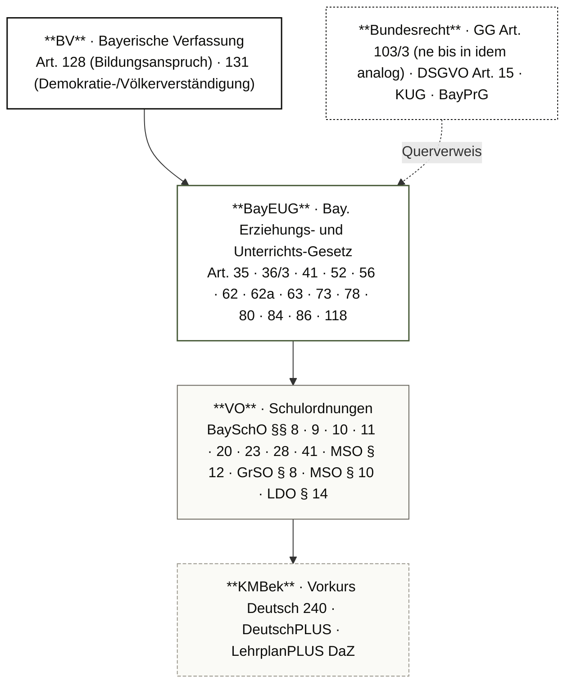
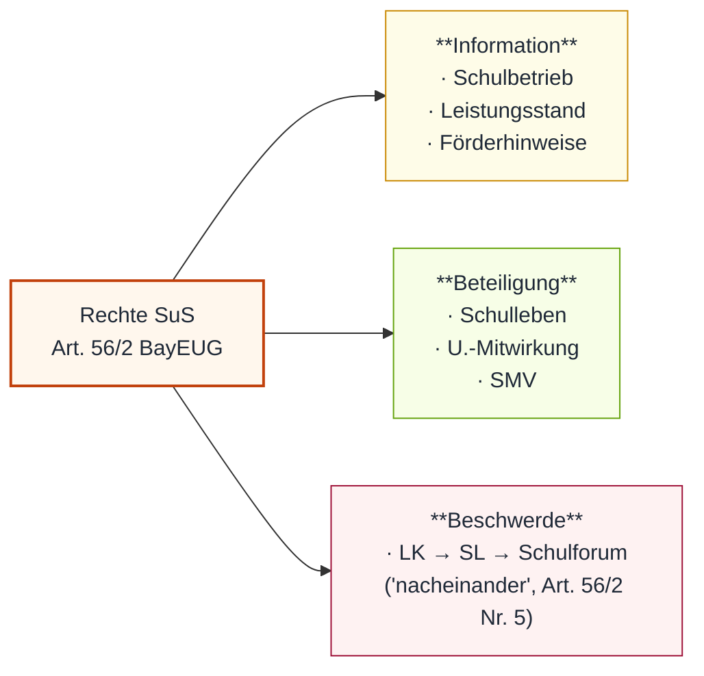
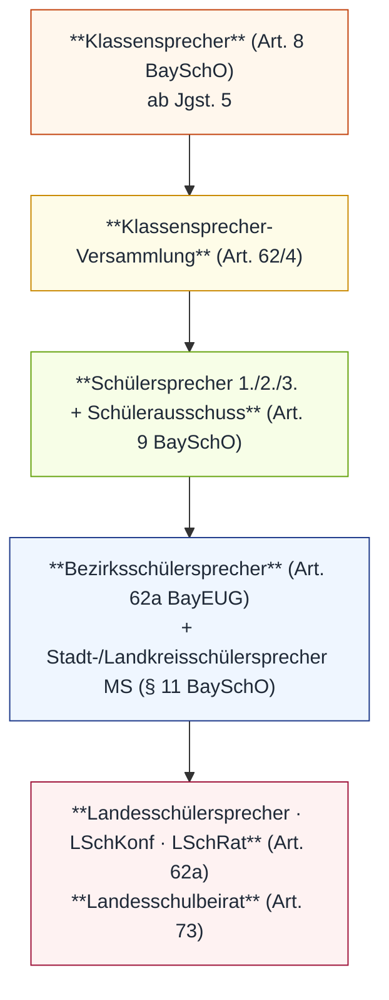

# MP_05 — Rechte und Pflichten der Schüler:innen

ZALGM § 16 · 2. Staatsexamen MS Bayern · Schwerpunkt 5.1 · 5.4 ndM · 5.6 SMV.

## In aller Kürze

Das Verhältnis SuS ↔ Schule ist ein **rechtliches Doppelprinzip**: SuS haben **Rechte** (Information · Beteiligung · Beschwerde, Art. 56/2 BayEUG), die durch **Pflichten** (Mitwirkung · Verhalten · Schulpflicht, Art. 56/4) korrespondieren. Die LK ist **nicht Inhaber von Verfügungsmacht über Verhaltenssteuerung**, sondern in einem rechtsstaatlichen Rahmen tätig — mit klar getrennten Sanktionspfaden (Art. 52 Mitarbeitsnote ↔ Art. 86 Erziehungs-/Ordnungsmaßnahme). Sonderregeln gelten für **SuS mit ndM** (§ 8 GrSO/§ 10 MSO Deutschklasse, Art. 36/3 Jgst.-Einweisung NUR bei Bildungsstand-Defizit, NICHT sprachlich) und für die **SMV** als verfasste Mitwirkungsform (Art. 62 BayEUG, BV Art. 131 Demokratie-Auftrag).

## Norm-Kartografie (5 Ebenen)

| Ebene | Schwerpunkt-Normen |
|---|---|
| **BV** | Art. 128 (Bildungsanspruch) · 131 (Demokratie-Auftrag SMV/ndM) |
| **BayEUG** | Art. 35 (Schulpflicht) · 36/3 (Jgst.-Einweisung ndM) · 41 (Mitwirkungspflicht Gutachten) · 52 (Leistungsbewertung) · 56 (R/P SuS) · 62/62a/63/73 (SMV) · 78 (Beratung) · 84 (Politik-Verbot) · 86 (EOM) · 118 (Schulzwang) |
| **VO** | BaySchO §§ 8/9/11 (SMV-Organe) · 10 (Verbindungs-LK + Schülerzeitung) · 23 (Verbote/Wegnahme) · 28 (HA) · 41 (Schülerakte) · MSO § 12/3 (LNW-Rückgabe) · § 8 GrSO / § 10 MSO (Deutschklasse) · LDO § 14 (Verschwiegenheits- + Auskunftspflicht) |
| **KMBek** | Vorkurs Deutsch 240 · DeutschPLUS-Differenzierung/-Kurse · LehrplanPLUS DaZ |
| **Bundesrecht** | GG Art. 103/3 (ne bis in idem analog) · DSGVO Art. 15 (Auskunftsrecht) · KUG (Persönlichkeitsrecht Bild) · BayPrG (Schülerzeitung als Druckwerk) |

---

# Teil A — Stoff

## A.1 Rechte der SuS (Art. 56 BayEUG)

**Rechts-Trias (Art. 56/2 BayEUG)**:

- **Informationsrechte**: über wesentl. Schulangelegenheiten · Auskunft über Leistungsstand · Förderhinweise. Bei Minderjährigen gelten Info-Rechte **auch für Erziehungsberechtigte**.
- **Beteiligungsrechte**: Teilnahme am Schulleben, Mitwirkung an U.-Gestaltung im Rahmen von Schulordnung + Lehrplan.
- **Beschwerderecht**: Wortlaut Art. 56/2 Nr. 5 BayEUG — „bei als ungerecht empfundener Behandlung oder Beurteilung sich **nacheinander** an Lehrkräfte, an die Schulleiterin oder den Schulleiter und an das Schulforum zu wenden". Das Adverb „nacheinander" gibt eine **gestufte Reihenfolge** vor (LK → SL → Schulforum). Praktische Lockerung: bei Beurteilungs-Konflikten kann eine Eskalationsstufe übersprungen werden, wenn die jeweilige Ebene befangen ist — der Wortlaut nennt aber keine pauschale Wahlfreiheit.
<!-- pre-audit-2026-05-01: "...keine politische Agitation; abhängig von Alter, Reife, Interesse." → Drift gegen Art. 56/3 BayEUG (Wortlaut: nur "sachlicher Zusammenhang" als unterrichtsbez. Schranke; KEIN Alter/Reife-Vorbehalt). -->
- **Freie Meinungsäußerung** (Art. 56/3): „im Unterricht ist der sachliche Zusammenhang zu wahren" — Wortlaut nennt **„Alle Schülerinnen und Schüler"**; **sachlicher Zusammenhang ist die einzige unterrichtsbezogene Schranke** (KEIN Alter/Reife-Vorbehalt).
- **Fürsorge-Rechte**: Schulgesundheit · Unfallverhütung · Lernmittelfreiheit · Kostenfreiheit Schulweg.

**Verfahrensrechte**:

| Recht | Norm | Detail |
|---|---|---|
| **Schülerakte einsehen** | § 41/1 BaySchO | **ab Vollendung des 14. Lebensjahres** (Wortlaut) |
| **LNW-Rückgabe** | MSO § 12/3 | **LK→SuS**: „angemessene Frist" (KEIN konkreter Wert!); **SuS→Schule**: „innerhalb einer Woche unverändert" zurück; Benotung + Besprechung + Herausgabe zur Eltern-Kenntnisnahme |

**Notenauskunft** (Reviewer-D-Pflichtfrage F5 / Master-Fehlerliste K13):

- Subjektives öff. Recht aus **Art. 56/2 + Art. 52/1 BayEUG + DSGVO Art. 15 + BV Art. 128**.
- **Keine Einschränkung** auf Notenarten — schriftlich, mündlich, praktisch alle.
- **4-Stufen-Verhältnismäßigkeitsprüfung**: legitimes Ziel · Geeignetheit · Erforderlichkeit · Angemessenheit → i.d.R. Auskunftspflicht.
- **Falle**: Vergleich mit Noten anderer SuS ist nicht zulässig — die Auskunftspflicht bezieht sich nur auf die eigenen Leistungen der/des einzelnen SuS (datenschutzrechtliche Bindung an die individuelle Person, BaySchO § 39 i.V.m. DSGVO Art. 6/1; LDO § 14 normiert nur die Verschwiegenheitspflicht der Lehrkraft, KEIN „Notengeheimnis" oder explizites Vergleichsverbot — der häufig kursierende „§ 14/4 LDO Notengeheimnis"-Anker ist Drift; § 14 Abs. 4 LDO regelt vielmehr, an WEN die Schule Schülerinformationen geben darf — primär Erziehungsberechtigte).

!!! warning "⚠ Falle Beschwerderecht"
 Wortlaut Art. 56/2 Nr. 5 sagt **„nacheinander"** (LK → SL → Schulforum) — also durchaus eine vorgegebene Reihenfolge. Pragmatische Lockerung: bei Befangenheit der unteren Ebene kann übersprungen werden; die LK darf trotzdem nicht „erst zu mir, dann SL" als Bedingung pauschal vorschreiben.

## A.2 Pflichten der SuS (Art. 56/4 BayEUG)

**Verhaltensgrundnorm**: SuS müssen sich so verhalten, dass „die Aufgabe der Schule erfüllt und das Bildungsziel erreicht werden kann" (Art. 56/4 S. 1).

**Konkrete Pflichten** (Art. 56/4):

- **Aktive Mitwirkungspflicht** — Anwesenheit allein genügt **nicht** (Präzedenz Passive Verweigerung).
- **Verhüllungsverbot Gesicht** in Schule + schul. Veranstaltungen; schulbedingte Ausnahmen möglich (z.B. Schutzkleidung); SL-Härtefallausnahme bei unbilliger Härte.
- Regelmäßige Teilnahme U. + verbindliche Schulveranstaltungen (Anwesenheitspflicht aus Art. 35 + 56/4).
- **Distanzunterricht** (Art. 56/4 S. 3): Übertragung eigenes Bild + Ton bei Video, **wenn LK aus päd. Gründen fordert + Technik vorhanden**.
- Unterlassen aller Schulbetrieb-/Ordnungs-störenden Handlungen.
- **Mitwirkungspflicht an sonderpäd. Gutachten** (Art. 41/4 S. 2 + Abs. 6).

**Spezielle Verbote**:

| Bereich | Norm | Regelung |
|---|---|---|
| **Handy / digitale Endgeräte** | Art. 56/5 | Wortlaut Satz 1: „Die Verwendung von digitalen Endgeräten ist für Schülerinnen und Schüler nur zulässig 1. im Unterricht und bei sonstigen Schulveranstaltungen, soweit die Aufsicht führende Person dies gestattet, 2. im Übrigen im Schulgebäude und auf dem Schulgelände, soweit dies die Schulleitung im Einvernehmen mit dem Schulforum allgemein oder die Aufsicht führende Person im Einzelfall gestattet". Satz 3: „Satz 1 Nr. 2 gilt nicht für Grundschulen und Grundschulstufen an Förderschulen". Satz 4: „Bei unzulässiger Verwendung kann das digitale Endgerät vorübergehend einbehalten werden". **Kein absolutes Verbot.** |
| **Rauchen** | Art. 3 GSG | in Schulen + auf Gelände **verboten** |
| **Alkohol/Rauschmittel** | § 23/1 BaySchO | Konsum innerhalb Schulanlage + bei schul. Veranstaltungen untersagt |
| **Gefährliche/störende Gegenstände** | § 23/2 BaySchO | Mitbringen/Mitführen untersagt; **Wegnahme + Sicherstellung** zulässig; **Rückgabe bei Minderjährigen NUR an Erziehungsberechtigte** |
| **Politik/Parteinahme** | Art. 84 BayEUG | Abs. 2: „Politische Werbung im Rahmen von Schulveranstaltungen oder auf dem Schulgelände ist nicht zulässig". Abs. 3 Abzeichen: zulässig, **wenn dadurch nicht Schulfriede, geordneter Schulbetrieb, Bildungs-/Erziehungsauftrag, persönliche Ehre oder Erziehung zur Toleranz gefährdet wird** (5 Schutzgüter); im Zweifelsfall entscheidet die SL. |

**Mitarbeitsnote ↔ Verhaltenssanktion** (Master-Fehlerliste M20 + Reviewer-D F6):

- **Mitarbeitsnote (Art. 52/3)**: NUR fachbezogen — **NICHT** als Verhaltenssanktion.
- Verweigerung = fehlende Leistung bewertbar; das **Verweigern selbst** ist KEIN Notenkriterium.
- Verhaltenssanktion separat über Art. 86 (Erziehungs-/Ordnungsmaßnahme).
- **Doppelsanktion**-Prüfschema (Art. 103/3 GG analog, ne bis in idem):
 1. identisches Verhalten?
 2. zwei Sanktionen?
 3. verschiedene Rechtsgüter?
- **Identische** mündl. Note + Verweis für **identisches** Verhalten → unzulässig.

!!! warning "⚠ Fallen Pflichten"
 - **Handy nicht absolut verboten** — Aufsichts-/SL-Genehmigung möglich.
 - **Filmen einer LK**: Persönlichkeitsrecht + KUG-Verstoß → Beschlagnahme nach § 23/2 BaySchO + Ordnungsmaßnahme.
 - **Rückgabe gefährlicher Gegenstände** bei Minderjährigen NUR an Eltern.
 - **Mitarbeitsnote als Verhaltens-Strafe = Fachfehler.**

## A.3 SuS mit nichtdeutscher Muttersprache (ndM)

**Schulpflicht-Universalität** (Art. 35 BayEUG): alle K/J mit Wohnsitz/gewöhnl. Aufenthalt Bayern — **ohne Rücksicht auf Staatsangehörigkeit** — auch wenn nach Heimatrecht nicht schulpflichtig.

**Deutschklasse — Kernnorm** (§ 8 GrSO / § 10 MSO, identisch):

- SuS mit ndM + keinen/geringen Deutschkenntnissen besuchen **zunächst Deutschklasse**, sofern Schulamt + Aufwandsträger eine gebildet haben (sonst Gastschulverhältnis).
- **Ziel**: Vorbereitung Regelklasse altersgleicher Jgst.
- **Inhalt**: intensivierte Sprachförderung + Werteerziehung + kulturelle Bildung.
- **Dauer**: i.d.R. **1 Schuljahr**, **spätestens 2 Schulbesuchsjahre**.
- Auf Elternantrag: SL kann Regelklasse-Besuch gestatten, wenn Folgeerwartung.

**Jgst.-Einweisung (Art. 36/3 BayEUG)**:

- SL stellt Jgst. fest auf Grundlage Art. 35 (Alter + bisherige Schullaufbahn).
- Entscheidung nach Leistungsstand über konkrete Klasse.
- **Tiefere Einstufung bis 2 Jgst.** zulässig **NUR bei mangelndem Bildungsstand** — **NICHT wegen sprachlicher Probleme** (Falle).

**Vier Fördermaßnahmen** (StMUK · *KMBek-Skeleton — KMBek-Volltext nicht öffentlich strukturiert verfügbar*):

1. **Vorkurs Deutsch 240** — 1,5 J. vor Einschulung, 240 WStd, KiGa+GS gemeinsam.
2. **Deutschklassen** — siehe oben (§ 8 GrSO / § 10 MSO).
3. **DeutschPLUS-Differenzierung** — innerhalb Regel-U.
4. **DeutschPLUS-Kurse** — additiv.

**DaZ** (Deutsch als Zweitsprache): LehrplanPLUS für alle weiterführenden Schularten; Noten kommen ins Zeugnis.

**Interkulturelle Erziehung**: GG + **BV Art. 131** („Geist der Demokratie", „Völkerversöhnung"); LehrplanPLUS MS = „interkultureller Begegnungsort". LK-Rolle: reversible Sprachhaltung · positive Konfliktlösung · repressionsfrei demokratisch.

!!! warning "⚠ Falle ndM"
 Tiefere Jgst.-Einstufung (bis 2 Jgst.) NUR bei mangelndem **Bildungsstand**, NICHT bei sprachlichen Defiziten allein. Wer „kein Deutsch" als Begründung für Tiefer-Einweisung nennt, verstößt gegen Art. 36/3 S. 4 BayEUG.

## A.4 SMV — Schülermitverantwortung (Art. 62–63 BayEUG)

**Rechtsgrundlage**: Art. 62/62a/63/73 BayEUG + Art. 8/9/10/11 BaySchO.
**Legitimation**: SMV = Instrument der Demokratie-Einübung, gestützt auf **BV Art. 131 + Art. 2 BayEUG**.

**Aufgaben (Art. 62/1)**:

- Gemeinsame Veranstaltungen.
- Übernahme von Ordnungsaufgaben.
- Wahrnehmung schulischer Interessen.
- Mithilfe bei Konfliktlösung.
- Unterstützung durch SL + LK + Elternbeirat.

**6 Rechte (Art. 62 Abs. 1 Satz 4 BayEUG)** — Wortlaut-Reihenfolge:

| # | Wortlaut-Stichwort | Wortlaut-Auszug |
|---|---|---|
| 1 | **Information** | „in allen sie betreffenden Angelegenheiten durch die Schule informiert zu werden" |
| 2 | **Wünsche und Anregungen übermitteln** | „Wünsche und Anregungen der Schülerinnen und Schüler an Lehrkräfte, die Leiterin oder den Leiter der Schule und den Elternbeirat zu übermitteln" |
| 3 | **Hilfe und Vermittlung auf Antrag** | „auf Antrag der betroffenen Schülerinnen und Schüler ihre Hilfe und Vermittlung einzusetzen, wenn diese glauben, es sei ihnen Unrecht geschehen" |
| 4 | **Beschwerden allgemeiner Art** | „Beschwerden allgemeiner Art bei Lehrkräften, bei der Leiterin oder beim Leiter der Schule und im Schulforum vorzubringen" |
| 5 | **Mitwirkung Hausordnung / besondere Veranstaltungen / Schulforum** | „bei der Aufstellung und Durchführung der Hausordnung, der Organisation und Betreuung von besonderen Veranstaltungen und im Schulforum mitzuwirken" |
| 6 | **Anregungen + Vorschläge zu Kursen/Schulveranstaltungen + Unterricht** | „zur Gestaltung von Kursen und Schulveranstaltungen und im Rahmen der Lehrpläne zum Unterricht Anregungen zu geben und Vorschläge zu unterbreiten" |

**Organe-Hierarchie**:

**Wahl-Modus**:

| Organ | Wann |
|---|---|
| **Klassensprecher** (§ 8 BaySchO Abs. 1 + Art. 62 Abs. 3 BayEUG) | „**innerhalb von vier Wochen** nach Unterrichtsbeginn" (Wortlaut § 8/1 S. 3); ab Jgst. 5 Pflicht (Art. 62/3 Wortlaut), in Jgst. 1–4 entscheidet die SL im Einvernehmen mit dem Elternbeirat; Wahlverfahren durch Schülerausschuss im Einvernehmen mit SL (§ 8/1 S. 1 Wortlaut). |
| **Schülersprecher (3) + Schülerausschuss** (§ 9 BaySchO) | „**innerhalb von zwei Wochen** nach der Wahl der Klassensprecherinnen und Klassensprecher" (Wortlaut § 9/1 S. 2); Wahl durch Klassensprecher (Art. 62/5 Wortlaut), Schulforum kann das Wahlrecht auf alle SuS ausdehnen. |

**Verbindungslehrkraft (Art. 62 Abs. 7 BayEUG)**:

- **Wählbar** (Art. 62/7 Satz 1 Wortlaut): „Lehrkräfte, die an der Schule mit **mindestens der Hälfte der Unterrichtspflichtzeit unbefristet beschäftigt** sind, sowie Förderlehrerinnen oder Förderlehrer unter entsprechenden Voraussetzungen".
- **NICHT wählbar: LAA** — Status „auf Widerruf" erfüllt das Unbefristet-Kriterium nicht (⚠ klassische LAA-Selbstbetroffenheits-Falle).
- **Wahl** durch Klassensprecherinnen + Klassensprecher und ihre Stellvertreter (Schulforum kann beschließen, dass alle SuS wählen) — Wortlaut.
- **Amtszeit**: „für jeweils ein Schuljahr" (Wortlaut).
- **Aufgaben** (Wortlaut Sätze 3–4): „pflegen die Verbindung zwischen Schulleiterin oder Schulleiter und Lehrkräften einerseits und den Schülerinnen und Schülern andererseits. Sie beraten die Einrichtungen der Schülermitverantwortung und vermitteln bei Beschwerden".
- Wahlverfahren-Detail: § 10 Abs. 1 BaySchO — „Über das Wahlverfahren … entscheidet der Schülerausschuss im Einvernehmen mit der Schulleiterin oder dem Schulleiter".

**Schülerzeitung (Art. 63 BayEUG)** — zwei Erscheinungsformen (Wortlaut Abs. 1 Satz 4: „Die Redaktion … hat das Wahlrecht, ob die Schülerzeitung als **Einrichtung der Schule** im Rahmen der Schülermitverantwortung **oder als Druckwerk im Sinn des Bayerischen Pressegesetzes (BayPrG)** erscheint"):

| Modus | Folge (Wortlaut Art. 63 BayEUG) |
|---|---|
| **Einrichtung der Schule** (SMV-Rahmen) | Abs. 5 Wortlaut: „kann die Schulleiterin oder der Schulleiter die Verteilung auf dem Schulgelände, und für den Fall, dass die Schülerzeitung als Einrichtung der Schule im Rahmen der Schülermitverantwortung erscheint, **auch die Herausgabe untersagen**". |
| **Druckwerk nach BayPrG** (Presserecht) | Abs. 2 Wortlaut: „Die **Haftung der Erziehungsberechtigten** für minderjährige Schülerinnen und Schüler bleibt unberührt". Abs. 5: SL kann **nur die Verteilung auf dem Schulgelände** untersagen, **NICHT** die Herausgabe insgesamt. |

Vorlauf-Pflicht (Art. 63 Abs. 4 Wortlaut): „**Soll die Schülerzeitung auf dem Schulgelände verteilt werden**, ist der Schulleiterin oder dem Schulleiter rechtzeitig vor Drucklegung ein Exemplar zur Kenntnis zu geben." Bei Einwendungen → Stellungnahme der Redaktion + Vorlage beim Schulforum → gütliche Einigung; scheitert sie, kann das **Schulforum** die Verteilung auf dem Schulgelände untersagen.

**Grenzen SMV**:

- Kein politisches Mandat (keine Stellungnahmen zu allg. innen-/außenpolit. Fragen).
- Kein Ort parteipolitischer Agitation.
- SMV-Veranstaltungen unter Schulaufsicht (§ 10 BaySchO) — engl. organisator. Zusammenhang mit Schulbetrieb → Aufsichtspflicht + Versicherungsschutz.

!!! warning "⚠ Fallen SMV"
 - **Klassensprecher ab Jgst. 5** — in 1–4 keine Pflicht.
 - **LAA NICHT wählbar** als Verbindungs-LK (Status auf Widerruf).
 - **Presserechtliche Schülerzeitung**: SL-Eingriff begrenzt; Eltern-Haftung bleibt.

---

# Teil B — Top-8-Pflichtwissen

7-Tage-Endspurt-Cheat-Sheet · Karten-IDs verlinken auf das Anki-Lerndeck.

-:material-numeric-1-circle: __K07 · Notenauskunft__

 Subjektives öff. Recht — alle Notenarten.
 4-Stufen-Verhältnismäßigkeit.
 Vergleich mit anderen unzulässig (datenschutzrechtl. Bindung; § 14 LDO ≠ „Notengeheimnis").
 *Art. 56/2 + 52/1 + DSGVO 15*

-:material-numeric-2-circle: __K10 · Pflichten Art. 56/4__

 Verhalten · Verhüllung · Teilnahme · Distanz-U. · Mitwirkung Gutachten.

-:material-numeric-3-circle: __K12 · Passive Verweigerung__

 Aktive Mitwirkung Pflicht.
 Mitarbeitsnote ≠ Verhaltenssanktion.
 Ne-bis-in-idem (Art. 103/3 GG analog).

-:material-numeric-4-circle: __K15 · Handy-Falle__

 Kein absolutes Verbot.
 Filmen LK = KUG + § 23/2 → Beschlagnahme.
 Rückgabe nur an Eltern.

-:material-numeric-5-circle: __K20 · Deutschklasse__

 Kernnorm § 8 GrSO / § 10 MSO.
 Ziel: Regelklasse altersgleich.
 Auf Elternantrag Regelklasse möglich.

-:material-numeric-6-circle: __K22 · Jgst.-Einweisung ndM__

 Tiefer-Einstufung NUR bei Bildungsstand.
 NICHT bei sprachlichen Defiziten.
 Max. 2 Jgst. tiefer (Art. 36/3 S. 4).

-:material-numeric-7-circle: __K30 · Verbindungs-LK__

 ½ Regelstundenmaß + unbefristet.
 **LAA NICHT wählbar.**
 Amtszeit 1 SJ.

-:material-numeric-8-circle: __K33 · Schülerzeitung__

 Zwei Modi: Schul-Einrichtung ODER Druckwerk BayPrG.
 Bei BayPrG: Eltern-Haftung bleibt; SL nur Verteilung untersagen.

🃏 **Direkt zur Karte im Lerndeck**: [K07](https://weitergehts.online/lerndecks/schulrecht-mp05-rechte-pflichten/?card=K07) · [K10](https://weitergehts.online/lerndecks/schulrecht-mp05-rechte-pflichten/?card=K10) · [K12](https://weitergehts.online/lerndecks/schulrecht-mp05-rechte-pflichten/?card=K12) · [K15](https://weitergehts.online/lerndecks/schulrecht-mp05-rechte-pflichten/?card=K15) · [K20](https://weitergehts.online/lerndecks/schulrecht-mp05-rechte-pflichten/?card=K20) · [K22](https://weitergehts.online/lerndecks/schulrecht-mp05-rechte-pflichten/?card=K22) · [K30](https://weitergehts.online/lerndecks/schulrecht-mp05-rechte-pflichten/?card=K30) · [K33](https://weitergehts.online/lerndecks/schulrecht-mp05-rechte-pflichten/?card=K33)

---

# Teil C — Falle-Atlas

| ID | Falle | Korrekte Auflösung |
|---|---|---|
| FA01 | Rechte überwiegen formal — Pflichten-Katalog ignorieren? | NEIN — Pflichten-Katalog Art. 56/4 ist **explizit**, KMK-1973-Hintergrund. |
| FA02 | Handy in Schule generell verboten? | NEIN — abhängig an Aufsicht/SL-Genehmigung; **kein absolutes Verbot**. |
| FA03 | Filmen einer LK durch SuS → folgenlos? | NEIN — Persönlichkeitsrecht + KUG-Verstoß → Beschlagnahme § 23/2 BaySchO + Ordnungsmaßnahme Art. 86. |
| FA04 | Notenauskunft nur für schriftliche Noten? | NEIN — alle Notenarten (schriftl. + mdl. + prakt.). |
| FA05 | Vergleich mit Noten anderer SuS auf Schüler-Anfrage? | NEIN — die Auskunftspflicht ist personenbezogen (datenschutzrechtl. Bindung; LDO § 14 normiert Verschwiegenheits-/Auskunftspflicht der LK, KEIN explizites „Notengeheimnis"). |
| FA06 | Mündliche Note für „Stören" zulässig? | NEIN — Mitarbeitsnote NUR fachbezogen (Art. 52/3); Verhalten separat über Art. 86. |
| FA07 | Mündliche Note **und** Verweis für identisches Verhalten? | NEIN — Doppelsanktion analog Art. 103/3 GG (ne bis in idem). |
| FA08 | Tiefere Jgst.-Einstufung für ndM-SuS wegen schwacher Deutschkenntnisse? | NEIN — Tiefer-Einstufung NUR bei mangelndem Bildungsstand (Art. 36/3 S. 4). |
| FA09 | LAA als Verbindungslehrkraft wählbar? | NEIN — Status „auf Widerruf" ≠ unbefristet. |
| FA10 | SL kann presserechtliche Schülerzeitung herausgeben verbieten? | NEIN — Eltern-Haftung bleibt; SL nur Verteilung **auf Schulgelände** bei Rechtsverstoß. |

**Interaktiv-Modus** (Click-to-Reveal — zum Selbst-Abprüfen):

FA02 · Ist das Handy-Verbot in der Schule absolut?

NEIN. **Art. 56/5 BayEUG** — Wortlaut: „Die Verwendung von digitalen Endgeräten ist für Schülerinnen und Schüler nur zulässig 1. im Unterricht und bei sonstigen Schulveranstaltungen, soweit die Aufsicht führende Person dies gestattet, 2. im Übrigen im Schulgebäude und auf dem Schulgelände, soweit dies die Schulleitung im Einvernehmen mit dem Schulforum allgemein oder die Aufsicht führende Person im Einzelfall gestattet" — **kein absolutes Verbot**. Satz 3: GS/GS-Stufe an FöS sind von Nr. 2 ausgenommen.

FA07 · Mündliche Note + Verweis für identisches Verhalten?

UNZULÄSSIG. Doppelsanktion analog **Art. 103/3 GG** (ne bis in idem). Prüfschema: (1) identisches Verhalten? (2) zwei Sanktionen? (3) verschiedene Rechtsgüter? — Bei identischem Verhalten + zwei Sanktionen + gleiches Rechtsgut: **rechtswidrig**.

FA08 · ndM-SuS in tiefere Jgst. wegen schwacher Deutschkenntnisse?

UNZULÄSSIG. **Art. 36/3 S. 4 BayEUG**: Tiefer-Einstufung bis 2 Jgst. NUR bei mangelndem **Bildungsstand**, NICHT wegen sprachlicher Defizite. DaZ-Förderung + Deutschklasse sind die einschlägigen Wege.

FA09 · Kann ein LAA Verbindungslehrkraft werden?

NEIN. **Art. 62/7 BayEUG**: wählbar nur LK + FL, mind. ½ Regelstundenmaß **+ unbefristet** an der Schule beschäftigt. LAA-Status „auf Widerruf" erfüllt das Unbefristet-Kriterium nicht.

---

# Teil D — Fallbeispiele (Anwendung)

??? example "Fall **Hannah** — Notenauskunft + Vergleichsverbot (Hauptfall)"
 **Sachverhalt**: Hannah (13, 7. Kl. MS) verlangt im Sprechstundengespräch Auskunft über **alle** Noten in Mathematik (schriftlich, mündlich, praktisch). Die Mathe-LK lehnt ab: „Das ist meine pädagogische Beurteilungsautonomie." Hannah fragt zusätzlich, was Lara aus der Parallelklasse für die letzte Probe hatte.

 **Knackpunkte**:

 1. **Notenauskunft = subjektives öffentliches Recht** — Art. 56/2 + Art. 52/1 BayEUG + DSGVO Art. 15 + BV Art. 128. **Alle** Notenarten umfasst.
 2. **4-Stufen-Verhältnismäßigkeitsprüfung** ergibt regelmäßig Auskunftspflicht — die LK-Autonomie betrifft die Bewertung selbst, nicht die Auskunft.
 3. **Vergleich mit Lara unzulässig** — Auskunftspflicht ist personenbezogen (datenschutzrechtl. Bindung an die individuelle Schülerin, BaySchO § 39 i.V.m. DSGVO Art. 6/1; LDO § 14 normiert die Verschwiegenheits- + Auskunftspflicht der Lehrkraft, **kein explizites „Notengeheimnis"** — der häufig kursierende Anker „§ 14/4 LDO Notengeheimnis" ist eine Drift, § 14 Abs. 4 regelt, WEM die Schule Schülerinformationen geben darf).

 **Antwortkette**: Anspruch anerkennen → Termin vereinbaren → strukturiertes Einzelgespräch mit Belegen + Förderhinweisen → Doku im Klassenbuch. Lara-Frage höflich aber bestimmt zurückweisen mit Verweis auf datenschutzrechtliche Personenbindung (eigene Daten ↔ Daten Dritter).

??? example "Fall **Tobias** — Passive Verweigerung + Doppelsanktion"
 **Sachverhalt**: Tobias (8. Kl. MS) dreht sich seit zwei Wochen demonstrativ mit dem Rücken zur Tafel. Auf LK-Ansprache antwortet er: „Meine Schulpflicht erfülle ich durch Anwesenheit." Die LK vergibt eine schlechte mündliche Note in Mathe **und** stellt einen schriftlichen Verweis aus.

 **Knackpunkte**:

 1. **Aktive Mitwirkungspflicht** (Art. 56/4) — Anwesenheit allein genügt **nicht**.
 2. **Mitarbeitsnote NUR fachbezogen** (Art. 52/3) — die LK darf die fachliche Verweigerung als fehlende Leistung bewerten, **NICHT** das Verweigern selbst als „Verhaltensnote".
 3. **Doppelsanktion-Analyse** (Art. 103/3 GG analog): identisches Verhalten + zwei Sanktionen + gleiches Rechtsgut → **unzulässig**.

 **Antwortkette**: Mündliche Note nur, soweit konkrete fachliche Mitarbeit fehlt → korrekte Begründung im Notenbuch. Verweis als Erziehungsmaßnahme nach Art. 86 separat erteilen, **mit anderem Begründungsfokus** (Verhalten, nicht fachliche Leistung). Stufenmodell beachten: päd. → organisator. → diszipl. → präventiv.

??? example "Fall **Uschi** — Filmen der LK"
 **Sachverhalt**: Eine Schülerin filmt heimlich die LK im Unterricht und postet das Video auf TikTok.

 **Knackpunkte**:

 1. **Persönlichkeitsrecht + KUG**-Verstoß (Recht am eigenen Bild).
 2. **Beschlagnahme nach § 23/2 BaySchO** — Sicherstellung des Geräts; Rückgabe bei Minderjährigen NUR an Erziehungsberechtigte.
 3. **Ordnungsmaßnahme Art. 86** wegen Schulbetrieb-Störung + Persönlichkeitsverletzung.
 4. **Lösch-Anspruch**: Eltern-Gespräch mit Aufforderung zur Löschung; bei Verweigerung zivilrechtliche Ansprüche der LK.

 **Antwortkette**: Sofort-Beschlagnahme im U. → SL informieren → Eltern-Gespräch (Rückgabe nur an Eltern) → Lösch-Aufforderung → Erziehungs-/Ordnungsmaßnahme → ggf. zivil-/strafrechtliche Anzeige (Persönlichkeitsrecht).

??? example "Fall **Aischa** — Deutschklasse und Regelklasse"
 **Sachverhalt**: Aischa (10) zog vor 4 Wochen aus Syrien nach Bayern. Sie spricht **kein Deutsch**, hat aber in Syrien die 4. Klasse mit guten Noten abgeschlossen. Die SL möchte sie in eine 3. Klasse einweisen, da sie „mit dem Stoff der 5. nicht mitkommt".

 **Knackpunkte**:

 1. **Deutschklasse-Pflicht** (§ 10 MSO) — Aischa kommt **zunächst in eine Deutschklasse**, sofern verfügbar.
 2. **Tiefere Jgst.-Einstufung NUR bei mangelndem Bildungsstand** (Art. 36/3 S. 4) — sprachliche Defizite reichen NICHT. Ihr syrisches Zeugnis dokumentiert den Bildungsstand.
 3. **Altersgleichheits-Prinzip**: Aischa (10) → Jgst. 5 (analog zu altersgleichen Dauer-in-Bayern-SuS).
 4. **Auf Elternantrag** kann SL Regelklassen-Besuch gestatten, wenn Folgeerwartung.

 **Antwortkette**: Anmeldung → Bildungsstand-Diagnostik (NICHT Deutsch-Test allein) → Deutschklasse Jgst. 5 + DaZ + DeutschPLUS-Programm → nach 1 SJ (max. 2) Übergang Regelklasse 5/6.

??? example "Fall **Ben** — Klassensprecher-Wahl in 3. Klasse"
 **Sachverhalt**: An einer GS möchte die KL der 3. Klasse einen Klassensprecher wählen lassen, weil das den Klassenrat unterstützen soll.

 **Knackpunkte**:

 1. **Klassensprecher-Pflicht ab Jgst. 5** (§ 8 BaySchO).
 2. In Jgst. 1–4: **keine Pflicht** — formelles SMV-Organ entfällt.
 3. Pädagogisch zulässig: informelle „Klassenchef"-/„Klassenrat"-Strukturen, aber **keine** offizielle Klassensprecher-Funktion mit § 8 BaySchO-Rechten.

 **Antwortkette**: Eltern + SL aufklären → informelle Mitwirkungs-Form etablieren (ohne Klassensprecher-Etikett) → bei Übergang Jgst. 5: offizielle Klassensprecher-Wahl 4 Wochen nach U.-Beginn.

??? example "Fall **Frau Becker (LAA)** — Verbindungslehrkraft-Wahl"
 **Sachverhalt**: Frau Becker (LAA, 1. Dienstjahr) wird von der Klassensprecher-Versammlung als Verbindungslehrkraft vorgeschlagen.

 **Knackpunkte**:

 1. **NICHT wählbar**: LAA — Status auf Widerruf, nicht **unbefristet** (Art. 62/7 BayEUG).
 2. **Wählbar**: jede LK + FL mit mind. ½ Regelstundenmaß + unbefristet.
 3. SL muss vor der Wahl die Wählbarkeit verifizieren.

 **Antwortkette**: Frau Becker freundlich aufklären → SL informiert Klassensprecher-Versammlung über Wählbarkeits-Voraussetzungen → Wahl muss wählbarem Kandidaten gelten → ggf. neue Vorschlagsrunde.

??? example "Fall **Schülerzeitung** — SL will Ausgabe stoppen"
 **Sachverhalt**: Die Redaktion der Schülerzeitung „Frischluft" druckt einen kritischen Artikel über die Mensa-Qualität. Die SL möchte vor Erscheinen die Ausgabe stoppen.

 **Knackpunkte**:

 1. **Erscheinungsform klären**:
 - Als **Einrichtung der Schule** (SMV-Rahmen) → SL kann bei Rechtsverstoß intervenieren, Verteilung untersagen.
 - Als **Druckwerk nach BayPrG** → Eltern-Haftung; SL kann **NICHT** Herausgabe insgesamt verbieten, nur Verteilung **auf Schulgelände** bei Rechtsverstoß.
 2. **Vorabprüfung**: SL erhält Exemplar rechtzeitig vor Drucklegung.
 3. Bei Einwänden → **Schulforum** zur gütlichen Einigung; sonst Schulforum kann Verteilung untersagen (in der Schul-Einrichtungs-Variante).
 4. Mensa-Kritik allein ist **kein Rechtsverstoß** — Meinungsfreiheit Art. 5 GG + Art. 110 BV greift.

 **Antwortkette**: Erscheinungsform feststellen → bei BayPrG-Druckwerk: kein SL-Vorabverbot möglich → Schulforum-Diskussion über Mensa-Qualität → faktische Lösung.

??? example "Fall **Yusra** — Schülerakte-Einsicht mit 13"
 **Sachverhalt**: Yusra (13, 7. Kl. MS) verlangt Einsicht in ihre Schülerakte, weil sie wegen einer Notenauseinandersetzung „alles wissen" möchte.

 **Knackpunkte**:

 1. **§ 41/1 BaySchO**: Einsicht **ab Vollendung des 14. Lebensjahres** (Wortlaut).
 2. Yusra ist 13 — Einsicht steht ihr noch NICHT direkt zu.
 3. **Eltern-Recht** als Vertretung Minderjähriger besteht weiterhin (Art. 76 BayEUG).
 4. Notenauskunft als getrenntes Recht (Art. 56/2): bleibt davon unberührt — Notengespräch jederzeit möglich.

 **Antwortkette**: Yusra erklären, dass Akte-Einsicht ab 14 ihr persönliches Recht wird; jetzt: Eltern können Einsicht beantragen. Parallel Notenauskunft-Recht direkt anbieten, das ist altersunabhängig.

??? example "Fall **Klausur-Rückgabe verzögert**"
 **Sachverhalt**: Eine Klausur in Mathematik wurde am 14.10. geschrieben. Bis zum 15.11. (4 Wochen später) hat die LK die Klausuren noch nicht zurückgegeben. Der Elternbeirat fragt nach.

 **Knackpunkte**:

 1. **MSO § 12/3** (zwei Direktionalitäten — Wortlaut präzise!):
 - **LK → SuS**: Rückgabe „innerhalb einer **angemessenen Frist**" (KEIN konkreter Wert im Wortlaut — Würdigung im Einzelfall).
 - **SuS → Schule**: Rückgabe „innerhalb **einer Woche** **unverändert**" nach Eltern-Kenntnisnahme.
 2. **4 Wochen LK-seitige Rückgabe-Verzögerung** überschreitet die „angemessene Frist" deutlich (Würdigung anhand Klausur-Aufwand, Belastung, Krankheit etc.).
 3. SL muss Mahnung an LK aussprechen → Korrektur-Pflicht ist Dienstpflicht (LDO).

 **Antwortkette**: KL/SL ansprechen → LK-Gespräch (Gründe? Belastung? Krankheit?) → Termin für Rückgabe binnen kurzer Frist fixieren → SL-Aufforderung in extremer Verzögerung. Eltern-Antwort: Wortlaut-Direktionalität transparent kommunizieren („angemessene Frist" für LK-Rückgabe; SuS-seitige 1-Wochen-Frist für „unverändert"-Zurückgabe); Verzögerung muss begründet sein.

??? example "Fall **Tom** — Politik-Plakat in der Schule"
 **Sachverhalt**: Tom (9. Kl. MS) hängt im Klassenzimmer ein Wahlplakat einer Partei auf, mit der Begründung „Meinungsfreiheit Art. 5 GG".

 **Knackpunkte**:

 1. **Art. 84 Abs. 2 BayEUG**: „Politische Werbung im Rahmen von Schulveranstaltungen oder auf dem Schulgelände ist nicht zulässig" — gilt für beide Bezugsräume (Veranstaltung **und** Schulgelände).
 2. **Art. 56/3 BayEUG**: Meinungsäußerung mit Grenze „Wahrung sachlichen Zusammenhangs".
 3. **Schule als parteipolitisch neutraler Raum** — verfassungsrechtlich begründet (Schulfrieden, Anvertrauten-Schutz).
 4. Diskussion politischer Themen im U. ist möglich (Beutelsbacher Konsens), aber kein Plakat-Kampagnen.

 **Antwortkette**: Plakat entfernen → Tom rechtliche Lage erklären (Art. 84) → Diskurs im GPG-U. anbieten → Beutelsbacher Konsens als Rahmen.

---

# Querverweise

- **Mitarbeitsnote ↔ EOM ↔ MP_06** (Block 5.3) — Trennung Art. 52/3 ↔ Art. 86 ist Schnittstelle.
- **§ 23 BaySchO Wegnahme ↔ MP_06** — Sicherstellung getrennt von Art. 86/87.
- **Schulpflicht ↔ MP_03 (Block 2)** — Art. 35 BayEUG; Schulzwang Art. 118.
- **HA-Pflicht ↔ Seminar-Hausaufgaben** — § 28 BaySchO als SuS-Pflicht.
- **ndM-Vorkurs Deutsch 240 ↔ MP_03** (Block 2.2) — Übergang KiGa→GS.
- **Sonderpäd. Mitwirkungspflicht ↔ MP_08** (Block 8.2) — Art. 41/4 + 6 BayEUG.

---

# Quellen

- **BV**: Art. 128 (Bildungsanspruch) · 131 (Demokratie + Völkerverständigung).
- **BayEUG**: Art. 35 (Schulpflicht) · 36/3 (Jgst.-Einweisung ndM) · 41 (Mitwirkungspflicht Gutachten) · 52 (Leistungsbewertung) · 56 (R/P SuS, Abs. 2/3/4/5) · 62/62a/63/73 (SMV) · 78 (Beratung) · 80 · 84 (Politik-Verbot) · 86 (EOM) · 118 (Schulzwang).
- **Schulordnungen**: BaySchO §§ 8 · 9 · 10 (Verbindungs-LK + Schülerzeitung) · 11 (Bezirksschülersprecher) · 20 · 23 (Verbote/Wegnahme) · 28 (HA) · 41 (Schülerakte) · MSO § 12/3 (LNW-Rückgabe) · § 8 GrSO / § 10 MSO (Deutschklasse) · LDO § 14 (Verschwiegenheits-/Auskunftspflicht — Abs. 4 regelt Adressaten der Schülerinformation, NICHT „Notengeheimnis").
- **KMBek**: Vorkurs Deutsch 240 · DeutschPLUS-Differenzierung/-Kurse · LehrplanPLUS DaZ.
- **Bundesrecht**: GG Art. 103/3 (ne bis in idem analog) · DSGVO Art. 15 (Auskunftsrecht) · KUG (Bild-Persönlichkeitsrecht) · BayPrG (Schülerzeitung als Druckwerk) · Art. 3 GSG (Rauchverbot).

*[BV]: Bayerische Verfassung
*[BayEUG]: Bayerisches Gesetz über das Erziehungs- und Unterrichtswesen
*[BaySchO]: Bayerische Schulordnung
*[GrSO]: Schulordnung für die Grundschulen
*[MSO]: Mittelschulordnung
*[LDO]: Lehrerdienstordnung
*[GSG]: Gesundheitsschutzgesetz Bayern
*[KMBek]: Kultusministerielle Bekanntmachung
*[DSGVO]: Datenschutzgrundverordnung
*[KUG]: Kunsturhebergesetz
*[BayPrG]: Bayerisches Pressegesetz
*[ndM]: nichtdeutsche Muttersprache
*[DaZ]: Deutsch als Zweitsprache
*[SMV]: Schülermitverantwortung
*[LAA]: Lehramtsanwärter:in
*[LK]: Lehrkraft
*[FL]: Förderlehrkraft
*[KL]: Klassenleitung
*[SL]: Schulleitung
*[SuS]: Schülerinnen und Schüler
*[EB]: Elternbeirat
*[EOM]: Erziehungs- und Ordnungsmaßnahmen
*[LNW]: Leistungsnachweis
*[Reg.bez.]: Regierungsbezirk
*[StMUK]: Staatsministerium für Unterricht und Kultus
*[GG]: Grundgesetz
*[Art. 56/2]: BayEUG Art. 56 Abs. 2 — Rechte SuS (Trias)
*[Art. 56/4]: BayEUG Art. 56 Abs. 4 — Pflichten SuS
*[Art. 52/3]: BayEUG Art. 52 Abs. 3 — Mitarbeitsnote
*[Art. 36/3]: BayEUG Art. 36 Abs. 3 — Jgst.-Einweisung
*[Art. 62/7]: BayEUG Art. 62 Abs. 7 — Verbindungslehrkraft
*[Art. 84]: BayEUG Art. 84 — politische Werbung verboten
*[Art. 86]: BayEUG Art. 86 — Erziehungs-/Ordnungsmaßnahmen
*[§ 14/4 LDO]: Lehrerdienstordnung § 14 (Verschwiegenheits- + Auskunftspflicht) — Abs. 4 regelt, WEM die Schule Schülerinformationen geben darf (primär Erziehungsberechtigte). Kein explizites „Notengeheimnis"-Konstrukt im Wortlaut.
*[§ 23/2 BaySchO]: BaySchO § 23 Abs. 2 — Wegnahme/Sicherstellung
*[§ 8 GrSO]: GrSO § 8 — Deutschklasse Grundschule
*[§ 10 MSO]: MSO § 10 — Deutschklasse Mittelschule
*[§ 41/1 BaySchO]: BaySchO § 41 Abs. 1 — Schülerakte ab Vollendung des 14. Lebensjahres (Wortlaut).
*[Vorkurs Deutsch 240]: 1,5 Schuljahre, 240 WStd, KiGa+GS gemeinsam

--8<-- "includes/normen-glossar.md"
