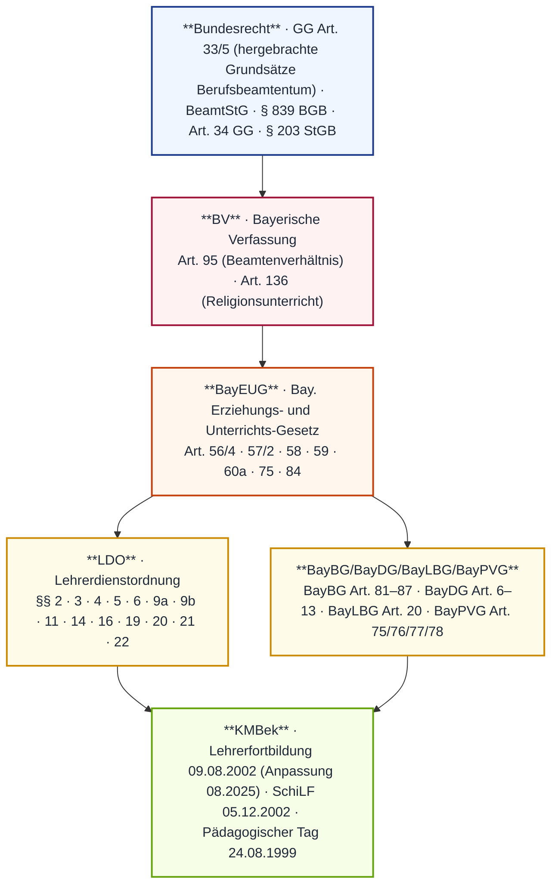
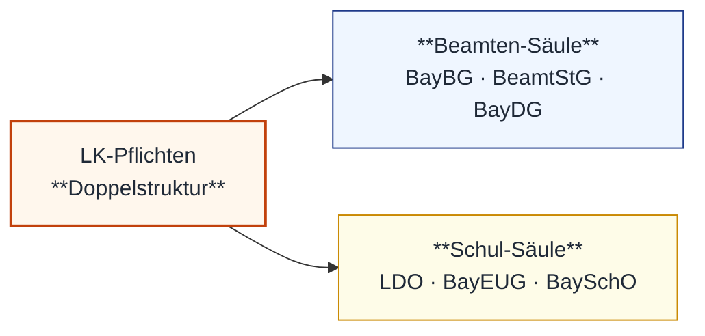
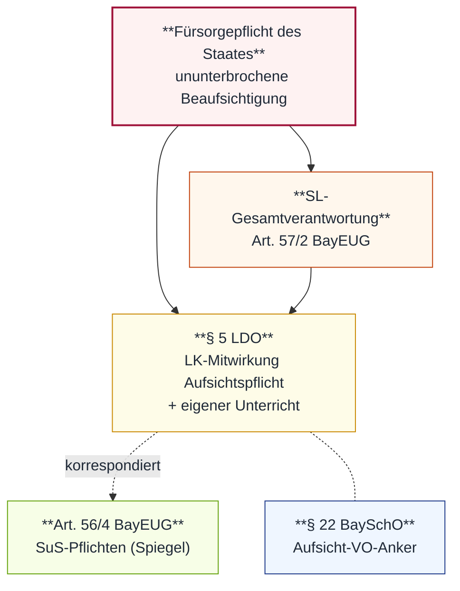

# MP_06 — Rechte und Pflichten der Lehrkräfte

ZALGM § 17 · 2. Staatsexamen MS Bayern · Schwerpunkt 6.1 Überblick R/P · 6.2 Aufsichtspflicht (Hochfrequenz) · 6.3 Amtliches Schriftwesen · 6.4a/b R/P+Fortbildung KMBek 08.2025 · 6.5 Personalvertretung.

## In aller Kürze

Der LK-Pflichtenkanon ist eine **Doppelstruktur**: einerseits **beamtenrechtliche** Pflichten (BayBG/BeamtStG — Dienstleistung, Treue, Verschwiegenheit, Amtsführung), andererseits **schul-/dienstrechtliche LK-Pflichten** (LDO — Unterricht, Erziehung, Aufsicht, Beratung, KL-Aufgaben, Konferenz, Fortbildung). **Aufsicht (§ 5 LDO + Art. 56/4 BayEUG + § 22 BaySchO + Art. 57/2 BayEUG)** ist Hochfrequenz-Thema mit drei Sanktionspfaden im Haftungsdreieck (zivil/Amtshaftung Art. 34 GG · Disziplinar BayDG Art. 6/7 · Strafrecht). Die **Auskunfts-/Verschwiegenheits-Trias (§ 14 LDO)** trennt Verschwiegenheit (post-dienstlich), Presse-Hoheit der SL und das Auskunftsverbot ggü. Dritten von der Notenauskunft an SuS/EB. **Fortbildung (§ 9a/2 LDO + Art. 20 BayLBG)** = 12 Tage / 4 Jahre, mind. 1/3 SchiLF. **Personalvertretung (BayPVG Art. 75/76)** mit Mitbestimmung (Zustimmungspflicht) ↔ Mitwirkung (geringere Beteiligungsstufe); Beamt:innen haben Gewerkschafts-, aber **kein Streikrecht**.

## Norm-Kartografie (5 Ebenen)

| Ebene | Schwerpunkt-Normen |
|---|---|
| **BV** | Art. 95 (Beamtenverhältnis Bayern) · Art. 136/3+4 (ReliU-Bevollmächtigung + Schriftform-Ablehnung). Berufsbeamtentum-Grundsätze primär in **GG Art. 33/5** verankert |
| **BayEUG** | Art. 56/4 (SuS-Pflichten als Spiegel der LK-Aufsicht) · 57/2 (SL-Gesamtverantwortung) · 58 (Lehrerkonferenz) · 59 (Lehrkräfte) · 60a · 75 (Auskunft an EB) · 84 (Werbeverbot) |
| **VO** | LDO §§ 2 · 3 · 4 · 5 · 6 · 9a · 9b · 11 · 14 · 16 · 19 · 20 · 21 · 22 · BaySchO § 22 (Aufsicht-Anker) · §§ 37–41 (Schriftwesen) |
| **Beamtenrecht Bayern** | BayBG Art. 81–87 (Nebentätigkeit/Mehrarbeit) · BayDG Art. 6–13 (Maßnahmenkatalog: 5 Stufen Lebenszeit + 2 Stufen Ruhestand; Dienstvergehens-Tatbestand in § 47 BeamtStG) · BayLBG Art. 20 (Fortbildung) · BayPVG Art. 75/76/77/78 (Beteiligungsformen) |
| **KMBek** | Lehrerfortbildung 09.08.2002 (KWMBl I S. 260) · SchiLF 05.12.2002 · Pädagogischer Tag 24.08.1999 · Anpassung 08.2025 (12 FB-Tage / 4 Jahre, ≈ 60 h, mind. 1/3 SchiLF) |
| **Bundesrecht** | GG Art. 33/5 (hergebrachte Grundsätze Berufsbeamtentum, Streikverbot) · BeamtStG §§ 3 · 7 · 8 · 33–48 · § 839 BGB i.V.m. Art. 34 GG (Amtshaftung) · § 203 StGB (Berufsgeheimnis Schulpsych.) |

---

# Teil A — Stoff

## A.1 Pflichten-Doppelstruktur (Beamtenstatus ↔ LK-spezifisch)

**Zwei-Säulen-Tabelle (K S. 170)**:

| Pflichten aus **Beamtenstatus** (BayBG/BeamtStG) | **Besondere LK-Pflichten** (LDO/BayEUG) |
|---|---|
| Dienstleistungspflicht | **Unterricht + Erziehung** (§ 2 LDO + Art. 59 BayEUG) inkl. **Aufsicht** (§ 5 LDO) |
| Pflicht zur ordnungsgemäßen Amtsführung | Verwaltungstätigkeit (§ 9b LDO) |
| Politische Treuepflicht | Vermittlung SuS ↔ Schule (Art. 59/3 BayEUG) |
| Weisungsgebundenheit (§ 35 BeamtStG) | **Beratungspflicht** (§ 6/3 LDO + § 14 LDO) |
| Eigenverantwortlichkeit | Zusammenarbeit Erziehungsberechtigte (§ 6 LDO) |
| Verhalten im/außerhalb Dienst | Teilnahme LK-Konferenz (§ 20 LDO + Art. 58 BayEUG) |
| **Amtsverschwiegenheit** (§ 37 BeamtStG) | Teilnahme Wandertage/Skikurse (§ 4 LDO) |
| Annahmeverbot von Geschenken | Pflichten als Klassenleitung (§ 6 LDO) |
| | **Fortbildungspflicht** (§ 9a/2 LDO + Art. 20 BayLBG) |
| | **Aufsicht** (§ 5 LDO) — eigener § |

**§ 9a LDO — Allgemeine Dienstpflichten** (verbatim):

> Allgemeine Dienstpflichten der Lehrkraft
> Abs. 1: Die Lehrkraft ist verpflichtet, ihre Arbeitskraft dem Dienst als Lehrkraft zu widmen. Dies verlangt erzieherischen Einsatz der Lehrkraft auch außerhalb des Unterrichts. Bei teilzeitbeschäftigten Lehrkräften soll der verminderte Umfang der Unterrichtspflichtzeit bei der Heranziehung zu Unterrichtsvertretungen und außerunterrichtlichen Verpflichtungen berücksichtigt werden, soweit dies mit pädagogischen Erfordernissen vereinbar ist, die ordnungsgemäße Erledigung der Dienstgeschäfte nicht beeinträchtigt wird und schulrechtliche Bestimmungen nicht entgegenstehen.
> Abs. 2: Die Lehrkräfte sind verpflichtet, sich selbst fortzubilden und an dienstlichen Fortbildungsveranstaltungen teilzunehmen (vgl. Art. 66 Abs. 2 des Leistungslaufbahngesetzes, Art. 20 des Bayerischen Lehrerbildungsgesetzes und die Bekanntmachung des Bayerischen Staatsministeriums für Unterricht und Kultus zur Lehrerfortbildung in Bayern vom 9. August 2002 (KWMBl I S. 260) in der jeweils gültigen Fassung).
> Abs. 3: Die Lehrkraft hat ihre Unterrichtszeiten einzuhalten. Sie ist verpflichtet, auch außerhalb ihres planmäßigen Unterrichts, zur Übernahme von Vertretungen und – unbeschadet ihres Urlaubsanspruchs – in den Ferien aus dienstlichen Gründen in zumutbarem Umfang zur Verfügung zu stehen; die Anwesenheit in der Schule kann angeordnet werden; darüber sind die Lehrkräfte frühzeitig zu informieren.
> Abs. 4: Bei Bedarf kann die Lehrkraft auch für den Unterricht in Fächern eingesetzt werden, für die sie keine Prüfung abgelegt hat. Dieser fachfremde Unterricht wird – was Fachkenntnisse und Fachdidaktik betrifft – bei der Beurteilung der Lehrkraft nicht zu deren Nachteil herangezogen.
> Abs. 5: Durch Anordnung der Schulaufsichtsbehörden kann eine Lehrkraft verpflichtet werden, an mehreren Schulen Unterricht zu erteilen.
> Abs. 6: Die Lehrkräfte sind verpflichtet, im Rahmen der Zuständigkeit der Schule, an der sie tätig sind, Hausunterricht zu erteilen (§ 4 der Verordnung über den Hausunterricht vom 29. August 1989, GVBl S. 455, ber. S. 702, in der jeweils geltenden Fassung).
> Abs. 7: Lehrkräfte der Förderschulen sind verpflichtet, die Aufgaben der Förderschulen in allen in Art. 19 Abs. 2 BayEUG genannten Tätigkeitsbereichen wahrzunehmen.
> Abs. 8: In der Schule und auf dem Schulgelände (mit Ausnahme von dort gelegenen Wohnungen) darf nicht geraucht werden. Bei schulischen Veranstaltungen außerhalb des Schulgeländes sollen die Lehrkräfte und das sonstige schulische Personal auf das Rauchen verzichten.

**§ 9b LDO — Außerunterrichtliche Dienstpflichten** (verbatim, 10-Punkte-Katalog):

> Außerunterrichtliche Dienstpflichten
> Zur Wahrnehmung des Bildungs- und Erziehungsauftrags der Schule hat die Lehrkraft über den planmäßigen Unterricht und die damit in Zusammenhang stehenden dienstlichen Verpflichtungen hinaus in angemessenem Umfang außerunterrichtliche Aufgaben wahrzunehmen. Die außerunterrichtlichen Aufgaben richten sich auch nach dem Profil der Schule (z.B. Ganztagsangebote, Inklusion); dazu zählen aber neben den Verpflichtungen aus § 4 Abs. 1 insbesondere die nachfolgenden Aufgaben:
> – die Vorbereitung des neuen Schuljahres,
> – die Erledigung von Verwaltungsgeschäften,
> – die Teilnahme an dienstlichen Besprechungen,
> – die Mitwirkung an der Aus- und Fortbildung der staatlichen Lehrkräfte und an staatlichen Prüfungen,
> – die Weiterentwicklung und Sicherung der fachlichen und pädagogischen Qualität der Schule,
> – die Planung, Durchführung und Evaluation von Maßnahmen im Rahmen der inneren Schulentwicklung,
> – die Zusammenarbeit mit anderen Schulen und Schularten,
> – die ständige Weiterentwicklung der Zusammenarbeit mit den Erziehungsberechtigten sowie des Kontakts zu den Ausbildenden, Arbeitgeber- und Arbeitnehmervertretern der Beschäftigungsbetriebe,
> – die Zusammenarbeit mit außerschulischen Partnern,
> – die Gestaltung des Schullebens.
> Die Schulleitung hat darauf zu achten, dass die außerunterrichtlichen Aufgaben unter Berücksichtigung der individuellen dienstlichen Belastung möglichst gleichmäßig auf alle Lehrkräfte verteilt werden.

**Art. 59 BayEUG — Lehrkräfte** (verbatim Abs. 1+2):

> Abs. 1: Die Lehrkräfte tragen die unmittelbare pädagogische Verantwortung für den Unterricht und die Erziehung der Schülerinnen und Schüler. Gegenüber dem ihnen zugeordneten sonstigen pädagogischen Personal sind sie weisungsberechtigt. Die Art. 111 bis 114 und die dienstrechtlichen Vorschriften bleiben unberührt. Art. 60a Abs. 2 gilt entsprechend.
> Abs. 2: Die Lehrkräfte haben den in Art. 1 und 2 niedergelegten Bildungs- und Erziehungsauftrag sowie die Lehrpläne und Richtlinien für den Unterricht und die Erziehung zu beachten. Erteilen Lehrkräfte Distanzunterricht im Wege einer Videoübertragung und liegen die technischen Voraussetzungen vor, sind sie in der Regel zur Übertragung des eigenen Bildes und Tones verpflichtet. Sie müssen die verfassungsrechtlichen Grundwerte glaubhaft vermitteln. Äußere Symbole und Kleidungsstücke, die eine religiöse oder weltanschauliche Überzeugung ausdrücken, dürfen von Lehrkräften im Unterricht nicht getragen werden, sofern die Symbole oder Kleidungsstücke bei den Schülerinnen und Schülern oder den Eltern auch als Ausdruck einer Haltung verstanden werden können, die mit den verfassungsrechtlichen Grundwerten und Bildungszielen der Verfassung einschließlich den christlich-abendländischen Bildungs- und Kulturwerten nicht vereinbar ist. Art. 84 Abs. 2 bleibt unberührt. Für Lehrkräfte im Vorbereitungsdienst können im Einzelfall Ausnahmen von der Bestimmung des Satzes 4 zugelassen werden.

!!! warning "⚠ Fallen § 9a/9b + Art. 59"
 - § 9a/3 S. 2: Verfügbarkeit „in **zumutbarem** Umfang" + frühzeitige Information — KEINE schrankenlose Verfügbarkeit.
 - § 9a/4: Fachfremder U. NICHT zum Nachteil bei Beurteilung — explizit geschützt.
 - § 9a/8: Rauchverbot **absolut** auf Schulgelände (außer Wohnungen); außerhalb nur „sollen verzichten".
 - § 9b: 10-Punkte-Katalog ist **„insbesondere"-Liste** — NICHT abschließend; Verteilung „möglichst gleichmäßig **unter Berücksichtigung** individueller Belastung" — keine starre Gleichverteilung.
 - Art. 59/2 S. 4: Symbol-Verbot **konditional** („sofern auch als Haltung verstanden werden können") — KEIN absolutes Verbot.

## A.2 Aufsichtspflicht (Hochfrequenz)

**§ 5 LDO — Aufsichtspflicht** (verbatim):

> Aufsichtspflicht
> Abs. 1: Die Lehrkraft ist verpflichtet, bei der Wahrnehmung der Aufsichtspflicht der Schule mitzuwirken. Dabei kann sie auch zur Aufsicht außerhalb ihres Unterrichts herangezogen werden. Insbesondere hat die Lehrkraft spätestens von Beginn des Unterrichts an im Unterrichtsraum anwesend zu sein und von diesem Zeitpunkt an während der gesamten Dauer des von ihr erteilten Unterrichts, erforderlichenfalls bis zum Weggang der Schülerinnen und Schüler, die Aufsicht zu führen. Ist die Lehrkraft gezwungen, den Unterrichtsraum während dieser Zeit zu verlassen, so trifft sie, im Verhinderungsfall die Schulleiterin oder der Schulleiter, aufgrund der gegebenen Umstände die notwendigen und möglichen Maßnahmen.
> Abs. 2: Eine besondere Einteilung der Lehrkräfte zur Wahrnehmung der Aufsichtspflicht der Schule erfolgt durch die Schulleiterin oder den Schulleiter. Die für die Aufsicht ergehenden allgemeinen Regelungen und Einzelanweisungen sind zu beachten.
> Abs. 3: Bei sonstigen schulischen Veranstaltungen gelten die Abs. 1 und 2 entsprechend. Beginnt oder endet eine schulische Veranstaltung außerhalb der Schule, so beginnt und endet dort auch die Aufsichtspflicht der Lehrkraft. Der Treff- und Endpunkt soll möglichst in der Nähe erreichbarer und zumutbarer Verkehrsmittel liegen. Für Schülerinnen und Schüler der Jahrgangsstufen eins bis vier muss der Treff- und Endpunkt auf jeden Fall innerhalb des Schulsprengels liegen.
> Abs. 4: Wenn im Rahmen des stundenplanmäßigen Unterrichts andere Personen (z.B. aus dem Gesundheitsbereich, dem Bereich der beruflichen Orientierung oder von der Polizei) mitwirken, soll eine Lehrkraft anwesend sein.

**§ 22 BaySchO — Beaufsichtigung** (verbatim):

> Abs. 1: 1Die Aufsichtspflicht der Schule erstreckt sich auf die Zeit, in der die Schülerinnen und Schüler am Unterricht oder an sonstigen Schulveranstaltungen teilnehmen, einschließlich einer angemessenen Zeit vor Beginn und nach Beendigung des Unterrichts oder der Schulveranstaltungen. 2An Grundschulen sowie Grundschulstufen an Förderschulen gelten als angemessene Zeit vor Beginn des Unterrichts 15 Minuten, als angemessene Zeit nach Beendigung des Unterrichts gilt die Zeit bis zum Verlassen des Schulgeländes. 3Bei Bedarf erfolgt eine Beaufsichtigung an diesen Schulen eine halbe Stunde vor dem regelmäßigen Unterrichtsbeginn.
> Abs. 2: 1Der Umfang der Aufsichtspflicht richtet sich nach der geistigen und charakterlichen Reife der zu beaufsichtigenden Schülerinnen und Schüler. 2Schülerinnen und Schülern kann gestattet werden, während der unterrichtsfreien Zeit die Schulanlage zu verlassen, ausgenommen an Grundschulen und Grundschulstufen an Förderschulen. 3Die Grundsätze werden mit dem Schulforum abgestimmt.
> Abs. 3: 1Während der Teilnahme an der praktischen und fachpraktischen Ausbildung an beruflichen Schulen obliegt die Aufsicht den Praxisanleiterinnen und -anleitern bzw. den Ausbilderinnen und Ausbildern. 2Deren Anordnungen ist Folge zu leisten. 3Während der Teilnahme am Distanzunterricht außerhalb der Schule verbleibt die Aufsicht bei den Erziehungsberechtigten.

**Charakteristika guter Aufsicht** (K S. 176): umsichtig — kontinuierlich — vorausschauend — aktiv — präventiv. **Vorbildwirkung LK** bedeutsam.

**Gerichtliche Nachprüfung — Vier Leitfragen** (K S. 176):

1. War Gefahr **erkennbar**?
2. Welche Verhaltensregeln waren **festgelegt**?
3. Wurde die Einhaltung **kontrolliert**?
4. Wurde Nichteinhaltung mit **konsequenten Maßnahmen** beantwortet?

**Zeitliche Reichweite** (K S. 176–177):

| Phase | Reichweite |
|---|---|
| **15 Min vor U.-Beginn** | Aufsicht-Beginn — **normativ GS + GS-Stufe FöS**; an MS „angemessene Zeit" (§ 5/1 LDO ohne fixe Vorgabe, Praxis ebenfalls ~15 Min) |
| **Während U.** | LK **spätestens von Beginn an** im Raum + gesamte Dauer eigener U. |
| **Nach U.** | „angemessene Zeit nach U. bis Weggang aus Schulanlage" — **erforderlichenfalls bis zum Weggang** SuS (geht ggf. über Stundenende hinaus) |
| **Pausen + Stundenwechsel** | nach SL-Einteilung (§ 5/2 LDO, schriftlich festgelegt) |
| **Mittagspause Sonderregel** | 60–90 Min: Beförderungspflicht (Heimtransport) ODER Beaufsichtigungspflicht (Aufwandsträger) |
| **Außerschul. Veranstaltung** | Treff-/Endpunkt = Aufsicht-Beginn/-Ende; Jgst. 1–4 **muss** im Schulsprengel liegen (§ 5/3 LDO) |

**Räumliche Reichweite** (K S. 177):

- Schulanlage (Unterricht + Pausen + Freistunden).
- Sonstige schul. Veranstaltungen innerhalb/außerhalb (§ 4 LDO).
- Freiwillige Arbeitsgemeinschaften, SMV-Veranstaltungen, Schulgarten, genehmigte PC-Übung.
- Wandertage, Studienfahrten, Reisen, Theaterbesuche (sofern als Schulveranstaltung erklärt).
- Betriebspraktika.
- **NICHT** Schulweg selbst (Eltern); ABER **Schulbus + Wartezeiten** = **Gemeinde/Schulverband** (Aufwandsträger) — nicht Schule.

*Förderlehrkraft-Aufsicht (FL nach Art. 60 BayEUG, eigenverantwortlich) und MSD-/ELECOK-Konstellationen siehe MP_08 (Block A.2/A.4); Hertha-Falle (FS gE → Regelschule, Sachaufwandsträger-Zustimmung Art. 30a/4 BayEUG) ebenfalls in MP_08 verankert.*

**Haftungsdreieck** (K S. 178–179):

| Haftungsart | Anspruchsgrundlage | Wer haftet? |
|---|---|---|
| **Zivil/Amtshaftung** | § 839 BGB i.V.m. Art. 34 GG | Grundsätzlich **Freistaat Bayern**; **Rückgriff** auf LK NUR bei **Vorsatz + grober Fahrlässigkeit** |
| **Disziplinarrecht** | BayDG Art. 6 ff. | LK persönlich — **5-Stufen-Maßnahmenkatalog** (Lebenszeit) + **2 Stufen** (Ruhestand) |
| **Strafrecht** | StGB (Körperverletzung, fahrlässige Tötung, § 203 StGB Berufsgeheimnis) | LK persönlich |

**Dienstvergehen + Maßnahmenkatalog** (verbatim · gesetze-bayern.de):

> **§ 47 BeamtStG (Bundesrecht)** definiert das Dienstvergehen — **Art. 6 BayDG enthält NICHT die Tatbestandsdefinition**, sondern den Maßnahmenkatalog. Tatbestand (§ 47/1 BeamtStG): schuldhafte Pflichtverletzung; außerdienstliches Verhalten erfasst, wenn es nach den Umständen des Einzelfalls in besonderem Maße geeignet ist, das Vertrauen in einer für ihr Amt bedeutsamen Weise zu beeinträchtigen.

> **Art. 6 Abs. 1 BayDG — 5-Stufen-Katalog (Lebenszeitbeamte)**:
> 1. Verweis (Art. 7)
> 2. Geldbuße (Art. 8)
> 3. Kürzung der Dienstbezüge (Art. 9)
> 4. Zurückstufung (Art. 10)
> 5. Entfernung aus dem Beamtenverhältnis (Art. 11)
>
> **Art. 6 Abs. 2 BayDG — Ruhestandsbeamte (zusätzlich, parallel)**:
> – Kürzung des Ruhegehalts (Art. 12)
> – Aberkennung des Ruhegehalts (Art. 13)
>
> **Art. 6 Abs. 3–5 BayDG — Sonderregeln**: Ehrenbeamte (nur Verweis · Geldbuße · Entfernung); Beamte auf Zeit (Verweis · Geldbuße · Kürzung · Entfernung); Probe-/Widerrufsbeamte (NUR Verweis + Geldbuße).

**Verschuldensformen — Faustregel** (K S. 178–179):

- **Einfache Fahrlässigkeit**: „Das kann vorkommen!" — keine Haftungsfreistellung von Pflichtverletzung, aber **kein Rückgriff** des Freistaats.
- **Grobe Fahrlässigkeit**: „Das darf nicht vorkommen!" — verkehrsübliche Sorgfalt in besonders schwerem Maße verletzt; einfachste Überlegungen nicht angestellt.
- **Vorsatz + grobe Fahrlässigkeit** → **Rückgriff Freistaat → LK** möglich (Art. 34 S. 2 GG).

**Prüfungsfälle** (K S. 176):

- **„Büchertasche ans Pult"** = falsch. Aufsicht erfordert **unmittelbare physische Präsenz**; Tasche als Symbol-Vertretung verletzt § 5/1 LDO.
- **„13:02 LK-Parkplatz"** = Aufsichtspflichtverletzung — angemessene Zeit nach U. bis Weggang SuS aus Schulanlage nicht eingehalten.

!!! warning "⚠ Fallen Aufsicht"
 - **15 Min vor U.-Beginn** (GS normativ, MS Praxis), NICHT „ab Klingel".
 - § 5/1 S. 3: **„spätestens** von Beginn des Unterrichts an" im Raum — NICHT „pünktlich".
 - § 5/1 S. 3: Aufsicht „**erforderlichenfalls bis zum Weggang**" — geht ggf. über Stundenende hinaus.
 - § 5/3: Jgst. 1–4 Treff-/Endpunkt **muss** im Schulsprengel liegen — NICHT nur „soll".
 - § 5/4: Bei Externen-Mitwirkung „**soll**" eine LK anwesend sein — Soll-Vorschrift, nicht absolute Pflicht.
 - **Schulweg ≠ Aufsicht Schule** (Eltern); **Schulbus + Wartezeit** = Gemeinde/Schulverband (nicht LK).
 - Rückgriff Freistaat → LK NUR bei **Vorsatz + grober Fahrlässigkeit**.

## A.3 Auskunfts- und Schweigepflicht

**§ 14 LDO — Verschwiegenheitspflicht** (verbatim, alle 4 Absätze):

> Verschwiegenheitspflicht
> Abs. 1: Die Lehrkraft hat, auch nach Beendigung des Dienstverhältnisses, über die ihr bei ihrer dienstlichen Tätigkeit bekannt gewordenen Angelegenheiten Verschwiegenheit zu bewahren. Dies gilt nicht für Mitteilungen im dienstlichen Verkehr oder über Tatsachen, die offenkundig sind oder ihrer Bedeutung nach keiner Geheimhaltung bedürfen. Spannungen und Gegensätze innerhalb der Schule erfordern vertrauliche Behandlung.
> Abs. 2: Auskünfte an Presse, Rundfunk und Fernsehen erteilt nur die Schulleiterin oder der Schulleiter oder die von ihr oder ihm beauftragte Lehrkraft.
> Abs. 3: Bis zur endgültigen Festlegung der Zeugnisnoten nach den für die einzelnen Schularten geltenden Bestimmungen dürfen Schülerinnen und Schülern oder Erziehungsberechtigten keine Auskünfte über das Vorrücken oder über Zeugnisnoten erteilt werden. § 6 Abs. 3 bleibt unberührt.
> Abs. 4: Die Schule ist nicht berechtigt, anderen Personen als den Erziehungsberechtigten Auskunft über Schülerinnen und Schüler und ihre Leistungen zu geben. Von dieser Regel kann jedoch abgewichen werden, wenn die Erziehungsberechtigten ausdrücklich zustimmen oder wenn anzunehmen ist, dass sich die Auskunft für die Schülerinnen und Schüler und die Erziehungsberechtigten nur günstig auswirkt und die Zustimmung der Erziehungsberechtigten erwartet werden kann. Die Auskunftspflicht gegenüber den Ausbildenden oder Arbeitgebern nach den schulrechtlichen Bestimmungen für die Berufsschulen bleibt hiervon unberührt. Für Auskünfte an frühere Erziehungsberechtigte volljähriger Schüler gelten Art. 75 Abs. 1 und 88 Abs. 4 Satz 1 Ziff. 3 BayEUG. Die Erteilung von Auskünften über Schülerinnen und Schüler an Behörden außerhalb der Schulaufsicht richtet sich nach den dafür ergangenen besonderen Bestimmungen.

**MUSS- vs. DARF-NICHT-Auskunft** (K S. 174–175):

| **MUSS — LK-Auskunftspflicht** | **DARF NICHT — LK-Auskunftsverbot** |
|---|---|
| Eltern frühzeitig **schriftlich** informieren bei auffallendem Leistungsabsinken (§ 6/3 LDO, mit Empfangsbestätigung) | Daten/Unterlagen über SuS/Eltern an außerschul. Stellen weitergeben (ohne Rechtsanspruch) |
| SuS Auskunft über Leistungsstand + Förderhinweise | Familienverhältnisse weitergeben |
| Beratung über weiteren Bildungsweg bei Nicht-Erreichen Klassenziel | Diskriminierende Äußerungen über einzelne SuS |
| Bewertete Probearbeiten **baldmöglichst** zur Einsicht zurückgeben | Bei Elternanfragen **andere SuS namentlich zum Vergleich** nennen |
| Als Zeug:in/SV vor StA nach Genehmigung Dienstvorgesetzte:r — **Zeugnisverweigerungsrecht** steht zu | **Auskünfte an Presse/Rundfunk/TV** — NUR SL bzw. beauftragte LK (§ 14/2 LDO) |
| | Auskünfte über Vorrücken/Zeugnisnoten **vor endgültiger Festlegung** (§ 14/3 LDO) |
| | Über Spannungen/Gegensätze in der Schule sprechen (§ 14/1 S. 3 — Vertraulichkeit) |
| | **Auch nach Dienstende** dienstl. bekannt gewordene Angelegenheiten preisgeben (§ 14/1 — nachwirkende Amtsverschwiegenheit) |

**Drift-Falle (M-Liste)**: § 14/4 LDO regelt das **Auskunftsverbot ggü. Dritten** — NICHT „Notengeheimnis als Vergleichsverbot ggü. SuS". Die Notenauskunft an SuS/EB selbst ist subjektives öff. Recht (Art. 56/2 BayEUG + Art. 52/1 + DSGVO Art. 15 + BV Art. 128); das Verbot, Noten anderer SuS namentlich zum Vergleich zu nennen, leitet sich aus der **Auskunfts-an-Dritte-Logik** ab (Lara-Note geht andere SuS nicht an).

*Spiegelfall siehe MP_05 — „Hannah-Notenauskunft" (LK-Pflicht ↔ SuS-Anspruch nach Art. 56/2 BayEUG); die Schulpflicht-Kette (Eltern → SuS → LK) ist in MP_03 (Block A.3 Schulpflicht) verortet.*

**Auskunft an Dritte — Ausnahmen** (§ 14/4 LDO):

1. **Ausdrückliche Zustimmung** der Erziehungsberechtigten ODER
2. **Günstige Auswirkung** + **Zustimmungs-Vermutung** (anzunehmen, dass EB zustimmen würden) ODER
3. **Auskunftspflicht ggü. Ausbildenden/Arbeitgebern** (BS, schulrechtliche Bestimmungen).
4. Volljährige Schüler: Art. 75/1 + 88/4 S. 1 Nr. 3 BayEUG.
5. Behörden außerhalb der Schulaufsicht: nach besonderen Bestimmungen.

!!! warning "⚠ Fallen § 14 LDO"
 - **§ 14/4 ≠ Notengeheimnis als Vergleichsverbot**: regelt Auskunft AN DRITTE; Vergleich mit anderen SuS folgt aus Drittauskunfts-Logik.
 - **§ 14/3**: VOR Festlegung der Zeugnisnoten **keine** Auskunft über Vorrücken/Noten an SuS oder EB (§ 6/3 LDO bleibt unberührt — Pflicht zur frühzeitigen schriftlichen Warnung).
 - **§ 14/2**: Presse/Rundfunk/TV NUR durch SL oder beauftragte LK — nicht „spontan auf dem Pausenhof".
 - **§ 14/1**: Verschwiegenheit auch **nach** Beendigung des Dienstverhältnisses.
 - **§ 14/1 S. 3**: Spannungen/Gegensätze innerhalb der Schule erfordern **vertrauliche Behandlung** — nicht in Lehrerzimmer-Klatsch.

## A.4 Fortbildungspflicht

**Rechtsgrundlage** (Drei-Anker):

- **Art. 20 BayLBG** (Bayerisches Lehrerbildungsgesetz): Pflicht zur Selbst- und Veranstaltungs-Fortbildung.
- **§ 9a Abs. 2 LDO** (Verbatim s. A.1): Pflicht zur Selbst-Fortbildung + Teilnahme an dienstlichen FB-Veranstaltungen.
- **KMBek 09.08.2002** (KWMBl I S. 260) „Lehrerfortbildung in Bayern" + **KMBek 05.12.2002** (SchiLF) + **KMS 24.08.1999** (Pädagogischer Tag); aktualisierte Konkretisierung in der Anpassung 08.2025.

**Konkretisierung Umfang** (KMBek-Anker, K S. 173 + B9.6.2):

| Parameter | Wert |
|---|---|
| **Tage / 4 Jahre** | **12 FB-Tage** |
| **Stunden** | **≈ 60 Zeitstunden** à 5 h (Richtwert) |
| **SchiLF-Anteil** | **mind. 1/3** schulinterne Lehrerfortbildung |
| **Formate** | Präsenz · Online · kollegiale Hospitation · Pädagogischer Tag · SchiLF |
| **Träger** | staatliche FB-Ebenen + anerkannte nichtstaatliche Träger (sofern verfassungsgemäß) |

**6 Zielfelder** (K S. 173): Unterrichten · Erziehen · Beurteilen · Diagnostizieren · Fördern · Beraten.

**Doppelfunktion Fortbildung** (B9.6.2):

- **Unterrichtsentwicklung**: Erhalt + Aktualisierung päd./fachl./didakt./method. Kenntnisse.
- **Personal-/Organisationsentwicklung**: Begleitung berufl. Entwicklung, Prävention berufsimmanenter Probleme, Führungskräfte-Ausbildung.

**Organisationsebenen** (B9.6.2):

| Ebene | Träger | Zielgruppe |
|---|---|---|
| **Zentral** | **ALP Dillingen** | alle Schularten/Fächer (außer Sport/RL) |
| **Zentral Religion** | Institut Gars (kath.) · Heilsbronn (evang.) | RL-LK |
| **Zentral Sport** | Landesstelle Schulsport **Gunzenhausen** | Sport-LK |
| **Regional** | **Bezirksregierungen** | GS/MS/FöS/BS-LK |
| **Lokal** | **Staatliche Schulämter** | GS/MS/FöS |
| **SchiLF** | **Schulen selbst** | eigenes Kollegium |

**Kostenerstattung** (B9.6.2): Unterkunft/Verpflegung i.d.R. unentgeltlich · Fahrtkosten DB 2. Klasse · Fortbildungsmaßnahme: Übernahme.

**Anmeldungs-Portal**: **FIBS** („Fortbildung in bayerischen Schulen") — zentrale Online-Anmeldung.

**Individuelle Planung**: im Rahmen des **Mitarbeitergesprächs** SL ↔ LK.

*Inklusions-FB ist Schnittstelle zu MP_08 (MSD/ELECOK/FL): die in MP_08 (Block A.4) skizzierten Kooperationsformen mit MSD und Förderzentren erfordern entsprechende LK-Fortbildung im Bereich der 7 Förderschwerpunkte (Art. 20 BayEUG).*

!!! warning "⚠ Fallen Fortbildung"
 - **Mind. 1/3 SchiLF** ist Pflicht-Anteil — kein Verbleib auf externen Veranstaltungen allein.
 - LK kann auch **in Ferien** zu dienstlichen FB-Veranstaltungen herangezogen werden (§ 9a/3 S. 2 LDO „in zumutbarem Umfang") — keine schrankenlose Ferien-Inanspruchnahme.
 - KMBek 09.08.2002 in der **jeweils gültigen Fassung** — keine starre Quelle (Anpassung 08.2025 beachten).

## A.5 Personalvertretung (BayPVG)

**Rechtsgrundlage**: **Bayerisches Personalvertretungsgesetz (BayPVG)** für öffentlichen Dienst (Beamt:innen + Angestellte). **BetrVG** gilt **nicht** für Schule. Art. 12 Abs. 1 i.V.m. Art. 75/76 BayPVG → Personalrat in staatlichen Dienststellen.

**Art. 75 BayPVG — Mitbestimmung in Personal- und Sozialangelegenheiten** (verbatim):

> Mitbestimmung in Personal- und Sozialangelegenheiten
> Abs. 1: Der Personalrat hat, soweit eine gesetzliche oder tarifliche Regelung nicht besteht, in Personalangelegenheiten mitzubestimmen über Einstellung, Anstellung, Beförderung, Übertragung höherwertiger Tätigkeiten, höhere oder niedrigere Eingruppierung, Versetzung von einer Dienststelle zur anderen, Abordnung von Beamten von einer Dienststelle zur anderen für eine Dauer von mehr als drei Monaten, Übertragung eines anderen Dienstpostens, Versetzung in den Ruhestand auf eigenen Antrag bei Vorliegen einer der in Art. 64 BayBG genannten Voraussetzungen, Hinausschiebung des Eintritts in den Ruhestand, Geltendmachung von Ersatzansprüchen gegen einen Beschäftigten und in weiteren Personalmaßnahmen.
> Abs. 2: Der Personalrat kann seine Zustimmung verweigern, wenn die Maßnahme gegen ein Gesetz, eine Verordnung, einen Tarifvertrag, eine Dienstvereinbarung, gerichtliche Entscheidung oder Verwaltungsanordnung verstößt, oder wenn die durch Tatsachen begründete Besorgnis besteht, dass durch die Maßnahme der oder die Beschäftigte oder andere Beschäftigte benachteiligt werden, ohne dass dies aus dienstlichen oder persönlichen Gründen gerechtfertigt ist, oder wenn der Dienststellenfrieden gestört wird.
> Abs. 3: Der Personalrat hat in sozialen Angelegenheiten mitzubestimmen, soweit eine gesetzliche oder tarifliche Regelung nicht besteht, insbesondere bei Gewährung von Unterstützungen, Vorschüssen, Darlehen sowie Wohnungs- und Pachtland-Zuweisung.
> Abs. 4: Der Personalrat hat ferner Mitbestimmungsrechte bei Beginn und Ende der täglichen Arbeitszeit, Pausen und Verteilung der Arbeitszeit, Aufstellung des Urlaubsplans, Lohngestaltung, Errichtung/Verwaltung/Auflösung von Sozialeinrichtungen, Berufsausbildung, Bestellung Betriebsärzte, Maßnahmen zur Verhütung von Dienst- und Arbeitsunfällen, Vorschlagswesen, Inhalt von Personalfragebogen, Beurteilungsrichtlinien und Sozialplänen.

**Art. 76 BayPVG — Mitwirkung in Personal-, Sozial- und Organisationsangelegenheiten** (verbatim):

> Mitwirkung in Personal-, Sozial- und Organisationsangelegenheiten
> Abs. 1: Der Personalrat wirkt mit in sozialen und persönlichen Angelegenheiten bei:
> 1. Vorbereitung von Verwaltungsanordnungen einer Dienststelle für die innerdienstlichen sozialen oder persönlichen Angelegenheiten der Beschäftigten ihres Geschäftsbereichs;
> 2. Regelung der Ordnung in der Dienststelle und des Verhaltens der Beschäftigten;
> 3. Erlaß von Disziplinarverfügungen und bei Erhebung der Disziplinarklage gegen einen Beamten, wenn dem Disziplinarverfahren eine auf den gleichen Tatbestand gestützte Disziplinarverfügung nicht vorausgegangen ist;
> 4. Verlängerung der Probezeit;
> 5. Entlassung von Beamten auf Probe oder auf Widerruf oder bei Entlassung aus einem öffentlich-rechtlichen Ausbildungsverhältnis, wenn die Entlassung nicht vom Beschäftigten selbst beantragt wurde;
> 6. vorzeitiger Versetzung in den Ruhestand, Versagung der vorzeitigen Versetzung in den Ruhestand und bei Feststellung der begrenzten Dienstfähigkeit;
> 7. allgemeinen Fragen der Fortbildung der Beschäftigten;
> 8. Aufstellung von Grundsätzen für die Auswahl von Teilnehmern an Fortbildungsveranstaltungen;
> 9. Bestellung und Abberufung von Beauftragten nach § 181 SGB IX und von Gleichstellungsbeauftragten sowie Ansprechpartnern;
> 10. Maßnahmen zur Förderung der Familienfreundlichkeit der Arbeitsbedingungen;
> 11. Versagung oder Widerruf der Teilnahme eines Beschäftigten an allen bereits eingeführten Arbeitsformen außerhalb der Dienststelle.
> Satz 1 Nr. 2 gilt nicht für Polizei, Berufsfeuerwehr und Strafvollzug im Fall eines Notstands. In den Fällen von Satz 1 Nr. 3 bis 6 wird der Personalrat nur auf Antrag des Beschäftigten beteiligt; in diesen Fällen ist der Beschäftigte von der beabsichtigten Maßnahme rechtzeitig vorher in Kenntnis zu setzen. Im Fall des Satzes 1 Nr. 3 kann der Beschäftigte die Beteiligung desjenigen Personalrats beantragen, der an der Dienststelle, der der betroffene Beschäftigte angehört, gebildet ist; in den Fällen des Art. 80 Abs. 2 und 3 kann der Beschäftigte stattdessen die Beteiligung der danach bestimmten Personalvertretung beantragen. Der Personalrat kann bei der Mitwirkung nach Satz 1 Nr. 3 Einwendungen auf die in Art. 75 Abs. 2 Nr. 1 und 2 bezeichneten Gründe stützen.
> Abs. 2: Der Personalrat wirkt mit bei
> 1. Einführung grundlegend neuer Arbeitsmethoden;
> 2. Maßnahmen zur Hebung der Arbeitsleistung und zur Erleichterung des Arbeitsablaufs;
> 3. Gestaltung der Arbeitsplätze sowie Einführung, Änderung und Aufhebung von Arbeitsformen außerhalb der Dienststelle;
> 4. Auflösung, Verlegung und Zusammenlegung von Dienststellen oder wesentlichen Teilen von ihnen;
> 5. Aufstellung von Grundsätzen für die Personalbedarfsberechnung.
> Abs. 3: Vor der Weiterleitung von Personalanforderungen zum Haushaltsvoranschlag ist der Personalrat anzuhören.

**Beteiligungsformen-Tabelle** (K S. 196):

| Form | Wirkung | Norm | Beispiele |
|---|---|---|---|
| **Mitbestimmung** | Dienststelle kann Maßnahme **erst nach Zustimmung PR** durchführen | Art. 70 · 75 · 75a BayPVG | Einstellung · Beförderung · Versetzung · Abordnung > 3 Mon. · Beurteilungsrichtlinien |
| **Mitwirkung** | Mitspracherecht (schwächer — Stellungnahme, nicht Zustimmung) | Art. 72 · 76 · 77 · 77a BayPVG | Disziplinarverfügung (auf Antrag) · Probezeitverlängerung · Entlassung Probe-/Widerruf · Telearbeit-Versagung · Fortbildungs-Grundsätze |
| **Anhörung/Info** | Nur Information | Art. 69 Abs. 2 BayPVG | Alle Maßnahmen in PR-Zuständigkeit |
| **Initiativrecht** | PR stellt Antrag | Art. 69/1 a · Art. 70a BayPVG | Beförderungen etc. |

**Hierarchie Personalvertretung GS/MS** (K S. 194):

| Ebene | GS/MS |
|---|---|
| **Untere Behörde** | **Staatliches SchA** — örtlicher PR (anders als RS/Gym/BS, wo örtl. PR an der Schule sitzt) |
| **Mittlere Behörde** | Bezirksregierung — Bezirks-PR |
| **Oberste Behörde** | KM — **Hauptpersonalrat (HPR)** |
| Letzte Instanz | **Einigungsstelle** (Art. 71 BayPVG) |

**Wahl/Amtszeit** (K S. 193): Wahlberechtigt = alle Beschäftigten ohne Wahlentzug · Wählbar (Art. 14 BayPVG): am Wahltag **6 Monate** Geschäftsbereich oberste DB + **1 Jahr** öff.-rechtl. Dienstverhältnis · **Amtszeit 4 Jahre** · Wahl **geheim + unmittelbar + Verhältniswahl**.

**Zustimmungsverfahren Mitbestimmung** (K S. 196): Zustimmung formlos → Verfahren beendet · Verweigerung **2 Wochen** schriftlich mit **Gründen** (Art. 70/2 S. 5 BayPVG) · Dienstweg binnen 2 Wochen an übergeordnete Dienststelle → ggf. Einigungsstelle.

**Beamtenstatus + Streikrecht** (K S. 170 + B9.6.1):

- Beamt:innen haben **Gewerkschaftsrecht** (Art. 9/3 GG; § 17 LDO bestätigt Koalitionsfreiheit als unberührt).
- ABER **KEIN Streikrecht** — BVerfG-Rechtsprechung zu **Art. 33 Abs. 5 GG** (hergebrachte Grundsätze des Berufsbeamtentums).
- Streit-/Konflikt-Wege: **PR-Verfahren statt Arbeitskampf**.

*Versetzungs-Mitbestimmung (Art. 75/1 BayPVG) berührt Schullaufbahn-Steuerung als LK-Personal-Verteilung; die SuS-perspektivische Schullaufbahn-Steuerung (Übertritt, Wechsel, Abschlüsse) ist in MP_03 (Block A.4–A.6) gesetzt — Spiegelblick LK-Personalmaßnahme ↔ SuS-Bildungsweg.*

!!! warning "⚠ Fallen BayPVG"
 - **Mitbestimmung ≠ Mitwirkung**: Bei Mitbestimmung hat die Dienststelle ohne PR-Zustimmung **keine Handlungsmacht**; bei Mitwirkung bleibt Entscheidungsrecht bei Dienststelle, PR nur angehört (Stellungnahme).
 - **Streikrecht**: Beamt:innen haben Gewerkschaftsrecht ABER **kein Streikrecht** (Art. 33/5 GG, hergebrachte Grundsätze).
 - **Zuständigkeit GS/MS örtlicher PR ≠ Schule**, sondern **Staatliches SchA** (klassische Verwechslung).
 - **Art. 75/1**: Mitbestimmung NUR „soweit gesetzliche/tarifliche Regelung NICHT besteht" — sonst Vorrang.
 - **Art. 75/1**: Versetzung über DIENSTSTELLEN-Grenze (nicht innerhalb); Abordnung **> 3 Monate** mitbestimmungspflichtig (kürzer nicht).
 - **Art. 75/2**: Zustimmungsverweigerung nur aus 3 Kategorien (Rechtsverstoß · Benachteiligungs-Besorgnis · Dienststellenfrieden gestört).
 - **Art. 76/1 Nr. 3–6**: Disziplinar/Probezeit/Entlassung/Ruhestand — Beteiligung **nur auf Antrag** des Beschäftigten + **rechtzeitig vorher** Information.
 - **Art. 76/1 Nr. 11**: Telearbeit/Homeoffice-Versagung mitwirkungspflichtig.

---

*[BV]: Bayerische Verfassung
*[BayEUG]: Bayerisches Gesetz über das Erziehungs- und Unterrichtswesen
*[BaySchO]: Bayerische Schulordnung
*[LDO]: Lehrerdienstordnung
*[BayBG]: Bayerisches Beamtengesetz
*[BeamtStG]: Beamtenstatusgesetz
*[BayDG]: Bayerisches Disziplinargesetz
*[BayLBG]: Bayerisches Lehrerbildungsgesetz
*[BayPVG]: Bayerisches Personalvertretungsgesetz
*[KMBek]: Kultusministerielle Bekanntmachung
*[SchiLF]: Schulinterne Lehrerfortbildung
*[FIBS]: Fortbildung in bayerischen Schulen (Online-Portal)
*[ALP]: Akademie für Lehrerfortbildung und Personalführung Dillingen
*[KUVB]: Kommunale Unfallversicherung Bayern
*[StA]: Staatsanwaltschaft
*[SV]: Sachverständige:r
*[LK]: Lehrkraft
*[SL]: Schulleitung
*[KL]: Klassenleitung
*[FL]: Förderlehrkraft
*[LAA]: Lehramtsanwärter:in
*[LiV]: Lehrkraft im Vorbereitungsdienst
*[SuS]: Schülerinnen und Schüler
*[EB]: Erziehungsberechtigte
*[PR]: Personalrat
*[HPR]: Hauptpersonalrat
*[Bez.Reg.]: Bezirksregierung
*[SchA]: Schulamt
*[FöS]: Förderschule
*[GS]: Grundschule
*[MS]: Mittelschule
*[BS]: Berufsschule
*[U.]: Unterricht
*[UPZ]: Unterrichtspflichtzeit
*[FB]: Fortbildung
*[LE]: Leistungserhebung
*[LNW]: Leistungsnachweis
*[ReliU]: Religionsunterricht
*[GG]: Grundgesetz
*[BGB]: Bürgerliches Gesetzbuch
*[StGB]: Strafgesetzbuch
*[KMS]: Kultusministerielles Schreiben
*[KWMBl]: Amtsblatt des Bayerischen Staatsministeriums für Unterricht und Kultus
*[§ 5 LDO]: LDO § 5 — Aufsichtspflicht
*[§ 9a LDO]: LDO § 9a — Allgemeine Dienstpflichten der Lehrkraft (Fortbildung, Vertretung, Hausunterricht, Rauchverbot)
*[§ 9b LDO]: LDO § 9b — Außerunterrichtliche Dienstpflichten (10-Punkte-Katalog)
*[§ 14 LDO]: LDO § 14 — Verschwiegenheitspflicht (Verschwiegenheit, Presse, Notenauskunft, Drittauskunft)
*[§ 14/4 LDO]: LDO § 14 Abs. 4 — Auskunftsverbot ggü. Dritten (außer EB)
*[§ 20 LDO]: LDO § 20 — Lehrerkonferenz (Verweis auf Art. 58 BayEUG)
*[§ 21 LDO]: LDO § 21 — Klassenkonferenz (3-LK-Antragsrecht)
*[§ 22 BaySchO]: BaySchO § 22 — Beaufsichtigung (zeitlicher Rahmen, Reife-Maßstab, Schulforum-Abstimmung, Distanzunterricht-Eltern)
*[Art. 56 BayEUG]: BayEUG Art. 56 — Rechte/Pflichten SuS (Spiegel der LK-Aufsicht)
*[Art. 57/2 BayEUG]: BayEUG Art. 57 Abs. 2 — SL-Gesamtverantwortung Aufsicht
*[Art. 58 BayEUG]: BayEUG Art. 58 — Lehrerkonferenz (Mitglieder, SL-Vorsitz, bindende Beschlüsse, Beanstandung)
*[Art. 59 BayEUG]: BayEUG Art. 59 — Lehrkräfte (pädagogische Verantwortung, Distanzunterricht, Symbol-Verbot)
*[Art. 75 BayPVG]: BayPVG Art. 75 — Mitbestimmung Personal- und Sozialangelegenheiten
*[Art. 76 BayPVG]: BayPVG Art. 76 — Mitwirkung Personal-, Sozial- und Organisationsangelegenheiten
*[Art. 77 BayPVG]: BayPVG Art. 77 — Mitwirkung weitere Angelegenheiten
*[Dienstvergehen]: § 47 BeamtStG (Bundesrecht) — Tatbestand: schuldhafte Pflichtverletzung; Außerdienstliches erfasst bei Ansehensbeeinträchtigung. NICHT BayDG Art. 6 (= Maßnahmenkatalog)
*[Art. 6 BayDG]: BayDG Art. 6 — Arten der Disziplinarmaßnahmen (5 Stufen Lebenszeit + 2 Stufen Ruhestand)
*[Art. 7 BayDG]: BayDG Art. 7 — Verweis (geringste Disziplinarmaßnahme, schriftlich)
*[Art. 20 BayLBG]: BayLBG Art. 20 — Fortbildungspflicht
*[Art. 87 BayBG]: BayBG Art. 87 — Arbeitszeit/Mehrarbeit
*[Art. 33/5 GG]: GG Art. 33 Abs. 5 — hergebrachte Grundsätze des Berufsbeamtentums (Streikverbot)
*[§ 839 BGB]: BGB § 839 — Amtshaftung
*[Art. 34 GG]: GG Art. 34 — Staatshaftung + Rückgriff
*[§ 203 StGB]: StGB § 203 — Verletzung von Privatgeheimnissen (Schulpsychologie)

---

# Teil B — Top-8-Pflichtwissen

7-Tage-Endspurt-Cheat-Sheet · Karten-IDs verlinken auf das Anki-Lerndeck.

-:material-numeric-1-circle: __L01 · Pädagogische Freiheit__

 **§ 2/1 LDO** — unmittelbare päd. Verantwortung.
 Gebunden an **Lehrplan + Rechtsordnung** (Art. 45 BayEUG).
 Kein „wie er will".

-:material-numeric-2-circle: __L02 · Aufsicht zeitlich__

 § 22/1 BaySchO: **15 Min vor U.-Beginn** normativ NUR GS + GS-Stufe FöS.
 MS „angemessene Zeit".
 Bis Verlassen Schulgelände nach U.

-:material-numeric-3-circle: __L03 · Haftungsdreieck__

 § 839 BGB + Art. 34 GG → **Freistaat**.
 BayDG Art. 6 → 5-Stufen-Katalog (Lebenszeit) + 2 Stufen (Ruhestand); Tatbestand § 47 BeamtStG.
 StGB → LK persönlich.
 Rückgriff NUR Vorsatz + grobe Fahrlässigkeit.

-:material-numeric-4-circle: __L04 · § 14/4 ≠ Notengeheimnis__

 Auskunfts-VERBOT an **Dritte**.
 Notenauskunft an SuS/EB = subjektives öff. Recht.
 Vergleich mit anderen SuS unzulässig.

-:material-numeric-5-circle: __L05 · Presse-Hoheit SL__

 **§ 14/2 LDO**: Auskünfte an Presse/Rundfunk/TV NUR SL oder beauftragte LK.
 Eigeninitiative = Verstoß.

-:material-numeric-6-circle: __L06 · Fortbildung 12/4__

 § 9a/2 LDO + Art. 20 BayLBG + KMBek 09.08.2002.
 **12 Tage / 4 Jahre = ~60 Std**.
 Mind. **1/3 SchiLF** · 6 Zielfelder.

-:material-numeric-7-circle: __L07 · Mitbestimmung ≠ Mitwirkung__

 Art. 75 BayPVG: **Zustimmung erforderlich** (Personal).
 Art. 76/77: nur Stellungnahme/Anhörung.

-:material-numeric-8-circle: __L08 · Kein Streikrecht__

 **Art. 33/5 GG** hergebrachte Grundsätze.
 Gewerkschaftsrecht ja, Streik nein.
 PR-Weg statt Arbeitskampf.

🃏 **Direkt zur Karte im Lerndeck**: [L01](https://weitergehts.online/lerndecks/schulrecht-mp06-rechte-pflichten-lk/?card=L01) · [L02](https://weitergehts.online/lerndecks/schulrecht-mp06-rechte-pflichten-lk/?card=L02) · [L03](https://weitergehts.online/lerndecks/schulrecht-mp06-rechte-pflichten-lk/?card=L03) · [L04](https://weitergehts.online/lerndecks/schulrecht-mp06-rechte-pflichten-lk/?card=L04) · [L05](https://weitergehts.online/lerndecks/schulrecht-mp06-rechte-pflichten-lk/?card=L05) · [L06](https://weitergehts.online/lerndecks/schulrecht-mp06-rechte-pflichten-lk/?card=L06) · [L07](https://weitergehts.online/lerndecks/schulrecht-mp06-rechte-pflichten-lk/?card=L07) · [L08](https://weitergehts.online/lerndecks/schulrecht-mp06-rechte-pflichten-lk/?card=L08)

---

# Teil C — Falle-Atlas

| ID | Falle | Korrekte Auflösung |
|---|---|---|
| FA01 | „15 Min vor U.-Beginn" gilt überall normativ? | NEIN — § 22/1 S. 2 BaySchO: nur **GS + GS-Stufe FöS**; an MS „angemessene Zeit" (§ 5/1 LDO ohne fixe Vorgabe). |
| FA02 | Schulweg-Aufsicht durch LK? | NEIN — Eltern; ABER **Schulbus-Wartezeit** = Gemeinde/Schulverband (Aufwandsträger), nicht Schule. |
| FA03 | Vergleich mit Noten anderer LK auf SuS-Anfrage? | NEIN — § 14/4 LDO: andere SuS namentlich zum Vergleich nennen verboten (Drittauskunfts-Logik). |
| FA04 | Pressegespräch durch LK ohne SL-Genehmigung? | NEIN — § 14/2 LDO: NUR SL oder von ihr beauftragte LK. |
| FA05 | Auskunft über Vorrücken vor endgültiger Notenfestlegung? | NEIN — § 14/3 LDO: KEINE Auskunft an SuS/EB vor endgültiger Festlegung; § 6/3 LDO Frühwarnung bleibt unberührt. |
| FA06 | Rückgriff Freistaat → LK bei einfacher Fahrlässigkeit? | NEIN — Art. 34 S. 2 GG: Rückgriff NUR bei **Vorsatz + grober Fahrlässigkeit**. |
| FA07 | Doppelsanktion Disziplinar + Strafrecht für identische Tat? | ZULÄSSIG — verschiedene Rechtsgüter (Beamten-Treue ↔ Strafrechtsgüter); kein ne-bis-in-idem-Verstoß. |
| FA08 | SuS dürfen Schulanlage in Pause an MS verlassen? | ZULÄSSIG mit SL-Gestattung + Schulforum-Abstimmung (§ 22/2 S. 2+3 BaySchO); **NIEMALS** an GS + GS-Stufe FöS. |
| FA09 | Distanzunterricht außerhalb Schule → LK-Aufsicht? | NEIN — § 22/3 S. 3 BaySchO: Aufsicht **verbleibt bei Erziehungsberechtigten**. |
| FA10 | PR-Beteiligung bei Versetzung „Anhörung reicht"? | NEIN — Versetzung über Dienststellen-Grenze = **Mitbestimmung Art. 75/1 BayPVG** (Zustimmung erforderlich). |

**Interaktiv-Modus** (Click-to-Reveal — zum Selbst-Abprüfen):

FA01 · Gilt „15 Min vor U.-Beginn" überall normativ?

NEIN. **§ 22/1 S. 2 BaySchO** nennt die 15-Min-Vorgabe ausdrücklich nur für **Grundschulen sowie Grundschulstufen an Förderschulen**. An MS/RS/Gym gilt § 5/1 LDO „spätestens von Beginn des Unterrichts an" + § 22/1 S. 1 BaySchO „angemessene Zeit vor Beginn" (Praxis ~15 Min, ohne fixe Norm).

FA06 · Greift der Rückgriff Freistaat → LK schon bei einfacher Fahrlässigkeit?

NEIN. **§ 839 BGB i.V.m. Art. 34 GG**: Außenhaftung trifft den **Freistaat Bayern**. Rückgriff auf die LK nach **Art. 34 S. 2 GG** nur bei **Vorsatz oder grober Fahrlässigkeit** („Das darf nicht vorkommen!" — verkehrsübliche Sorgfalt in besonders schwerem Maße verletzt). Einfache Fahrlässigkeit löst KEINEN Rückgriff aus.

FA08 · Dürfen MS-SuS in der Pause die Schulanlage verlassen?

ZULÄSSIG mit zwei Voraussetzungen: (1) **SL-Gestattung** nach § 22/2 S. 2 BaySchO + (2) **Grundsätze mit Schulforum abgestimmt** (§ 22/2 S. 3). **NIEMALS** an Grundschulen + Grundschulstufen an Förderschulen — dort explizit ausgenommen (§ 22/2 S. 2 Halbsatz 2).

FA10 · Reicht bei LK-Versetzung an andere Schule die PR-Anhörung?

NEIN. **Art. 75/1 BayPVG** listet „Versetzung von einer Dienststelle zur anderen" explizit als **Mitbestimmungs**-Tatbestand — die Maßnahme darf erst nach **Zustimmung des PR** durchgeführt werden. Reine Anhörung (Art. 76/77) ist hier zu wenig; Verfahrensfehler eröffnet PR-Beanstandungsrecht.

---

# Teil D — Fallbeispiele (Anwendung)

??? example "Fall **Pünktlicher Parkplatz** — Aufsichtspflichtverletzung 13:02"
 **Sachverhalt**: LK Frau Mahler verlässt um 13:02 Uhr das Schulgelände in Richtung Lehrer-Parkplatz, während SuS aus ihrer 6. Stunde noch in der Schulanlage befindlich sind (Stundenende 13:00). Im Pausenhof verletzt sich Schüler Jonas durch Stolpern, ohne dass eine LK präsent ist.

 **Knackpunkte**:

 1. **§ 5/1 S. 3 LDO**: Aufsicht „**erforderlichenfalls bis zum Weggang** der Schülerinnen und Schüler" — geht ggf. über Stundenende hinaus.
 2. **§ 22/1 S. 1 BaySchO**: „angemessene Zeit nach Beendigung des Unterrichts" — bis Verlassen der Schulanlage.
 3. **Haftungsdreieck-Analyse**:
 - Zivil/Amtshaftung: § 839 BGB + Art. 34 GG → **Freistaat haftet**; Rückgriff auf Mahler NUR bei Vorsatz + grober Fahrlässigkeit (hier: einfache Fahrlässigkeit eher wahrscheinlich → kein Rückgriff).
 - Disziplinar: Dienstvergehen § 47 BeamtStG (Tatbestand) → Maßnahme aus BayDG Art. 6 Abs. 1 Katalog; SL kann **Verweis (Art. 7 BayDG)** als geringste Stufe aussprechen.
 - Strafrecht: § 229 StGB fahrlässige Körperverletzung möglich (LK persönlich).

 **Antwortkette**: Aufsichtspflichtverletzung bejahen → Direktionalität § 5/1 LDO + § 22/1 BaySchO benennen → Haftungsdreieck durchspielen → Verschuldensgrad einordnen (einfache vs. grobe Fahrlässigkeit) → Disziplinarstufe abschätzen.

??? example "Fall **Pressetermin Frau Berg** — § 14/2 LDO"
 **Sachverhalt**: Lokalreporter spricht im Schuleingang LK Frau Berg an, fragt nach der gestrigen Schulkonferenz-Diskussion über das neue Inklusions-Profil. Frau Berg gibt spontan ein 5-Minuten-Interview mit Detail-Wiedergabe der Wortbeiträge einzelner Kollegen.

 **Knackpunkte**:

 1. **§ 14/2 LDO** (verbatim): „Auskünfte an Presse, Rundfunk und Fernsehen erteilt nur die Schulleiterin oder der Schulleiter oder die von ihr oder ihm beauftragte Lehrkraft." — Frau Berg war nicht beauftragt → Kompetenzüberschreitung.
 2. **§ 14/1 S. 3 LDO**: „Spannungen und Gegensätze innerhalb der Schule erfordern vertrauliche Behandlung" — Konferenz-Wortbeiträge sind vertraulich.
 3. **Disziplinarrechtlicher Schritt**: Dienstvergehen-Tatbestand nach **§ 47 BeamtStG** (schuldhafte Pflichtverletzung). Maßnahme aus dem BayDG-Art.-6-Katalog: niedrigste Stufe **Verweis (Art. 7 BayDG, schriftlich)** wahrscheinlich, da kein gravierender Schaden + Erstvorgang.

 **Antwortkette**: Verstoß gegen § 14/2 LDO konstatieren → zusätzlich § 14/1 S. 3 als Vertraulichkeit → Tatbestand § 47 BeamtStG + Maßnahmenkatalog BayDG Art. 6 → Stufe Verweis (Art. 7 BayDG) → SL-Aufgabe: künftig Pressekontakt-Regelung im Kollegium kommunizieren.

??? example "Fall **Hannah-Auskunft** — Spiegel zu MP_05 Hannah"
 **Sachverhalt**: SuS Hannah (8. Kl. MS) verlangt im Sprechstundengespräch von Mathe-LK Auskunft über alle ihre Mathe-Noten und fragt zusätzlich, was Lara aus der Parallelklasse für die letzte Probe hatte.

 **Knackpunkte**:

 1. **Notenauskunft an Hannah selbst** = subjektives öff. Recht (Art. 56/2 BayEUG + Art. 52/1 + DSGVO Art. 15 + BV Art. 128) — alle Notenarten umfasst, **muss erteilt werden**.
 2. **Vergleich mit Lara** = **§ 14/4 LDO**-Verstoß (Auskunftsverbot an Dritte / über andere SuS namentlich zum Vergleich) — ist NICHT der „Notengeheimnis"-Mythos, sondern folgt aus Drittauskunfts-Logik (Lara ist für Hannah eine „andere Person").
 3. **Drift-Falle**: § 14/4 LDO regelt **Auskunft AN Dritte** — NICHT „Notengeheimnis als Vergleichsverbot ggü. SuS". Der Vergleichsnamen-Block leitet sich aus der Drittauskunfts-Logik ab.

 **Antwortkette**: Eigene Note-Auskunft (Anspruchsgrundlage Art. 56/2 BayEUG) bejahen → Strukturiertes Einzelgespräch mit Belegen + Förderhinweisen → Lara-Frage höflich aber bestimmt zurückweisen mit Verweis auf § 14/4 LDO-Direktionalität. KEINE Verwechslung mit „Notengeheimnis" als globales Vergleichsverbot.

??? example "Fall **Distanzunterricht zuhause** — § 22/3 BaySchO"
 **Sachverhalt**: Wegen Heizungsausfalls schickt die Schulleitung die Klasse 8c am Mittwoch in den Distanzunterricht (Videokonferenz aus dem Elternhaus). Schüler Tim verlässt während der Videokonferenz heimlich den Bildschirm und spielt Konsole. Vater fragt entrüstet bei der KL: „Wer haftet jetzt für die Aufsicht über mein Kind?"

 **Knackpunkte**:

 1. **§ 22/3 S. 3 BaySchO** (verbatim): „Während der Teilnahme am Distanzunterricht außerhalb der Schule verbleibt die Aufsicht bei den Erziehungsberechtigten." → klare Direktionalität: **Eltern**, nicht Schule.
 2. **Schulische Restpflichten**: Bereitstellung der Lehrinhalte, Erreichbarkeit der LK, Bild-/Ton-Pflicht der LK (Art. 59/2 S. 2 BayEUG „in der Regel"). Aber: keine Aufsichtspflicht über das Verhalten des Kindes im Elternhaus.
 3. **Korrespondierende SuS-Pflicht**: Art. 56/4 S. 4 BayEUG — Bild- und Tonübertragung des SuS bei pädagogisch begründeter Anordnung der LK.

 **Antwortkette**: § 22/3 S. 3 BaySchO als zentrale Norm zitieren → Aufsichtsverantwortung den Eltern zuordnen → schulische Restpflichten benennen (Bereitstellung Lehrinhalt + Erreichbarkeit LK) → Tim's Verhalten ist primär ein Elternhaus-Aufsichtsthema, kein LK-Haftungstatbestand.

??? example "Fall **Versetzung Wieser** — Mitbestimmung statt Anhörung"
 **Sachverhalt**: Herr Wieser, Mathe-/Physik-LK an MS A, wird im Rahmen des KMK-Versetzungsverfahrens an MS B versetzt. SL informiert den örtlichen Personalrat (Staatl. Schulamt) erst **im Nachgang** über die abgeschlossene Versetzung. Der PR rügt: „Wir hätten **vorher** gehört werden müssen." Wieser fragt seinen LAA-Kollegen: „Ist das so korrekt?"

 **Knackpunkte**:

 1. **Art. 75/1 BayPVG** (verbatim): listet „Versetzung von einer Dienststelle zur anderen" explizit als **Mitbestimmungs**-Tatbestand — d. h. die Dienststelle kann die Maßnahme „erst nach Zustimmung PR" durchführen (Mitbestimmung ≠ Mitwirkung/Anhörung).
 2. **Verfahrensfehler**: Information „im Nachgang" verfehlt das Mitbestimmungsverfahren komplett — ohne PR-Zustimmung war die Maßnahme rechtswidrig durchgeführt.
 3. **PR-Reaktion**: PR kann Beanstandung einreichen → Stufenverfahren über Bezirks-PR / HPR → ggf. Einigungsstelle (Art. 71 BayPVG).
 4. **Direktionalität**: Versetzung **über Dienststellen-Grenze** ist mitbestimmungspflichtig; reine **Umsetzung innerhalb** einer Dienststelle nicht (Falle).

 **Antwortkette**: Mitbestimmung (Art. 75/1) ↔ Mitwirkung/Anhörung (Art. 76/77) trennen → Versetzungs-Tatbestand explizit in Art. 75/1 verorten → Verfahrensfehler diagnostizieren → PR-Beanstandungsweg + Einigungsstellen-Option skizzieren → Antwort an Wieser: „Ja, der PR hat Recht — die Versetzung erforderte Mitbestimmung, nicht nur Anhörung."

---

*[§ 2 LDO]: LDO § 2 — Pädagogische Verantwortung + Freiheit (Bindung Lehrplan/Rechtsordnung)
*[§ 6/3 LDO]: LDO § 6 Abs. 3 — Beratungspflicht + frühzeitige schriftliche Information bei Leistungsabsinken
*[§ 14/2 LDO]: LDO § 14 Abs. 2 — Presse-Hoheit SL (Auskunft Presse/Rundfunk/TV nur SL/beauftragte LK)
*[§ 14/3 LDO]: LDO § 14 Abs. 3 — Auskunftsverbot Vorrücken/Zeugnisnoten vor endgültiger Festlegung
*[§ 22/1 BaySchO]: BaySchO § 22 Abs. 1 — Aufsichtspflicht zeitlich (15 Min vor U. nur GS + GS-Stufe FöS)
*[§ 22/2 BaySchO]: BaySchO § 22 Abs. 2 — Verlassen Schulanlage Pause (SL-Gestattung + Schulforum, NICHT GS)
*[§ 22/3 BaySchO]: BaySchO § 22 Abs. 3 — Distanzunterricht außerhalb Schule: Aufsicht bei Erziehungsberechtigten
*[Art. 45 BayEUG]: BayEUG Art. 45 — Lehrplan-Bindung (Grundlage päd. Freiheit § 2 LDO)
*[Art. 56/2 BayEUG]: BayEUG Art. 56 Abs. 2 — Recht SuS auf Notenauskunft + Förderhinweise
*[Art. 56/4 BayEUG]: BayEUG Art. 56 Abs. 4 — Pflichten SuS (Bild/Ton Distanzunterricht S. 4)
*[KMBek Lehrerfortbildung]: KMBek 09.08.2002 (KWMBl I S. 260) — Lehrerfortbildung in Bayern + Anpassung 08.2025

--8<-- "includes/normen-glossar.md"
