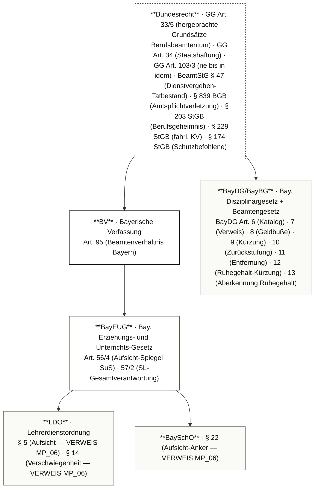
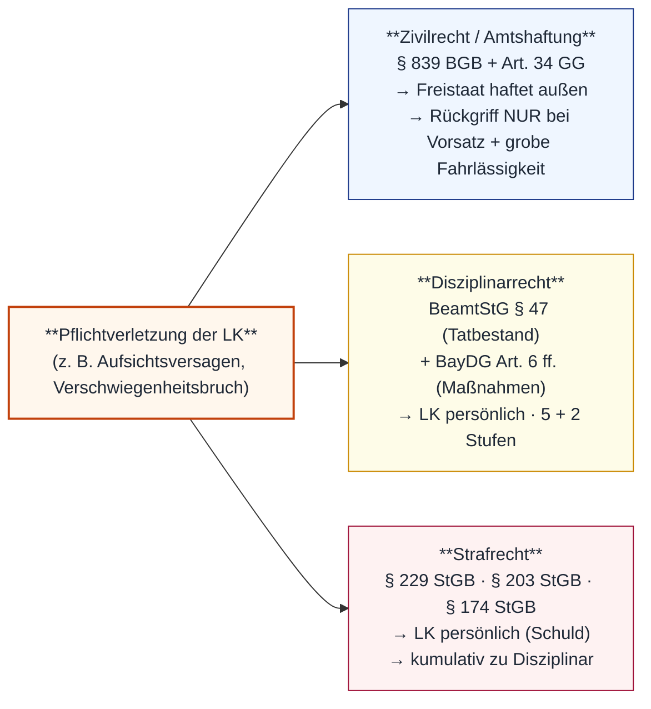

# MP_07 — Disziplinarrecht und Haftung im Schuldienst

ZALGM § 16 Nr. 7 · 2. Staatsexamen MS Bayern · Schwerpunkt 7.1 Haftungsdreieck (Zivil/Disziplinar/Strafrecht) · 7.2 Amtshaftung · 7.3 Disziplinarmaßnahmen-Katalog (BayDG) · 7.4 Strafrechts-Schnittstelle · 7.5 Verschuldensformen (einfach vs. grob fahrlässig vs. vorsätzlich).

## In aller Kürze

Die Verantwortung der Lehrkraft im Schuldienst ist eine **Drei-Pfad-Haftung** (Haftungsdreieck): **Zivil-/Amtshaftung** (§ 839 BGB i.V.m. Art. 34 GG → Außenhaftung trifft den **Freistaat Bayern**; Rückgriff auf die LK NUR bei **Vorsatz + grober Fahrlässigkeit**); **Disziplinarrecht** (§ 47 BeamtStG = Tatbestand „Dienstvergehen" + BayDG Art. 6 = Maßnahmenkatalog mit **5 Stufen Lebenszeit + 2 Stufen Ruhestand**); **Strafrecht** (§ 229 StGB fahrl. KV · § 203 StGB Berufsgeheimnis · § 174 StGB sex. Missbrauch Schutzbefohlener — LK persönlich). **Bund-Land-Trennschärfe** ist Pflicht: BeamtStG = Bund/Tatbestand · BayDG = Land/Maßnahme. **Berufsbeamtentum-Anker** (Streikverbot, hergebrachte Grundsätze) = **GG Art. 33/5** (NICHT BV Art. 130). Die drei Pfade laufen **kumulativ nebeneinander** — Strafe + Disziplinarmaßnahme verstoßen NICHT gegen Art. 103/3 GG (ne bis in idem gilt nur für „allgemeine Strafgesetze").

> **Hinweis** — Stoff-Überlapp mit MP_06 (Aufsichtspflicht-Material § 5 LDO + Art. 56/4 BayEUG + § 22 BaySchO): MP_07 vertieft den Sanktions-/Haftungspfad, MP_06 das Aufsichtspflichten-Substrat. § 5 LDO wird hier NICHT erneut full-quote, sondern via Cross-Ref auf MP_06 A.2 abgerufen.

## Norm-Kartografie (5 Ebenen)

| Ebene | Schwerpunkt-Normen MP_07 |
|---|---|
| **BV** | Art. 95 (Beamtenverhältnis Bayern); Berufsbeamtentum-Grundsätze primär in **GG Art. 33/5** verankert (NICHT BV Art. 130 — stale Sekundärquellen-Pfad) |
| **BayEUG** | Art. 56/4 (SuS-Pflicht Spiegel der LK-Aufsicht — Cross-Ref MP_06 + MP_05) · Art. 57/2 (SL-Gesamtverantwortung) |
| **VO** | LDO § 5 (Aufsicht — VERWEIS MP_06) · LDO § 14 (Verschwiegenheit — VERWEIS MP_06) · BaySchO § 22 (Aufsicht-Anker — VERWEIS MP_06) |
| **Bay. Beamtenrecht** | BayDG Art. 6 (5+2-Stufen-Maßnahmenkatalog) · Art. 7 (Verweis) · Art. 8 (Geldbuße) · Art. 9 (Kürzung Dienstbezüge) · Art. 10 (Zurückstufung) · Art. 11 (Entfernung Beamtenverhältnis) · Art. 12/13 (Ruhestands-Maßnahmen) |
| **Bundesrecht** | **GG Art. 33/5** (Berufsbeamtentum, Streikverbot) · **Art. 34 GG** (Staatshaftung + Rückgriff) · **Art. 103/3 GG** (ne bis in idem) · **§ 47 BeamtStG** (Dienstvergehen-Tatbestand) · **§ 839 BGB** (Amtspflichtverletzung) · **§ 203 StGB** (Berufsgeheimnis) · **§ 229 StGB** (fahrl. KV) · **§ 174 StGB** (sex. Missbrauch Schutzbefohlener) |

---

# Teil A — Stoff

## A.1 Haftungsdreieck — drei Pfade nebeneinander

**Haftungsdreieck-Tabelle** (K S. 178–179):

| Haftungsart | Anspruchsgrundlage | Wer haftet außen? | Rückgriff/Persönlich? |
|---|---|---|---|
| **Zivil/Amtshaftung** | § 839 BGB i.V.m. Art. 34 GG | **Freistaat Bayern** | Rückgriff auf LK NUR bei **Vorsatz + grobe Fahrlässigkeit** (Art. 34 S. 2 GG) |
| **Disziplinarrecht** | § 47 BeamtStG (Tatbestand) + BayDG Art. 6 ff. (Maßnahme) | LK persönlich (Dienstherr → LK) | **5-Stufen-Katalog Lebenszeit + 2 Stufen Ruhestand** (BayDG Art. 6 Abs. 1 + 2) |
| **Strafrecht** | StGB (z. B. § 229 fahrl. KV · § 203 Berufsgeheimnis · § 174 Schutzbefohlene) | LK persönlich (Schuldprinzip) | Kumulativ neben Disziplinarmaßnahme zulässig |

**Verbatim — Cross-Ref auf MP_06 A.2** (Aufsichtspflicht § 5 LDO):

> Aufsichtspflichten-Substrat (§ 5 LDO + Art. 56/4 BayEUG + § 22 BaySchO + Art. 57/2 BayEUG) → siehe **MP_06 Teil A.2** für Verbatim-Block + räumliche/zeitliche Reichweite + Hertha-/Pünktlich-Parkplatz-/Büchertaschen-Falle. MP_07 setzt auf diesem Substrat auf und schichtet die drei Sanktionspfade darüber.

**ne-bis-in-idem-Klärung** (Art. 103/3 GG verbatim):

> Niemand darf wegen derselben Tat auf Grund der allgemeinen Strafgesetze mehrmals bestraft werden.

> **KRITISCH**: Wortlaut sagt „**allgemeinen Strafgesetze**". Disziplinarrecht ist NICHT „allgemeines Strafrecht" — Strafverfahren + Disziplinarverfahren laufen daher **kumulativ** nebeneinander. Auch Schulrecht-Sanktionen (Erziehungs-/Ordnungsmaßnahmen) sind nicht durch Art. 103/3 GG direkt erfasst, sondern allenfalls **analog** über Verhältnismäßigkeitsgrundsatz.

!!! warning "⚠ Fallen Haftungsdreieck"
 - Außenhaftung trifft **Freistaat** (nicht LK direkt) — Eltern verklagen Staat, nicht Lehrkraft.
 - Rückgriff Freistaat → LK NUR bei **Vorsatz oder grober Fahrlässigkeit** (Art. 34 S. 2 GG).
 - Strafrecht UND Disziplinarrecht UND Zivilrecht laufen **parallel** — KEINE Doppelbestrafung iSd Art. 103/3 GG (gilt nur „allgemeine Strafgesetze").
 - **Tatbestand** des Dienstvergehens steht in **§ 47 BeamtStG** (Bund) — **NICHT** in BayDG Art. 6.
 - BayDG Art. 6 = nur **Maßnahmen-Katalog** (Verweis bis Entfernung).

---

## A.2 Amtshaftung — § 839 BGB + Art. 34 GG

**Konstruktion**: Beamtenpflichtverletzung gegenüber Drittem → § 839 BGB (Anspruchsgrundlage gegen Beamten persönlich) → Art. 34 GG **leitet die Haftung an Staat um** (Außenhaftung) → Rückgriff Staat auf LK nur bei **Vorsatz + grober Fahrlässigkeit**.

**Sinngemäß-Wiedergabe**:

> § 839 Abs. 1 BGB *(sinngemäß)*: Verletzt ein Beamter vorsätzlich oder fahrlässig die ihm einem Dritten gegenüber obliegende Amtspflicht, so hat er dem Dritten den daraus entstehenden Schaden zu ersetzen.

> Art. 34 GG *(sinngemäß)*: Verletzt jemand in Ausübung eines ihm anvertrauten öffentlichen Amtes die ihm einem Dritten gegenüber obliegende Amtspflicht, so trifft die Verantwortlichkeit grundsätzlich den Staat oder die Körperschaft, in deren Dienst er steht. Bei Vorsatz oder grober Fahrlässigkeit bleibt der Rückgriff vorbehalten.

**Anspruchsgrundlagen-Schaltung** (K S. 178):

| Schritt | Norm | Wirkung |
|---|---|---|
| 1. Tatbestandsprüfung | § 839 BGB | Schadensersatzanspruch des Dritten gegen Beamten persönlich |
| 2. Haftungsverlagerung | Art. 34 S. 1 GG | Anspruch trifft den **Staat (Freistaat Bayern)**, nicht die LK |
| 3. Rückgriff | Art. 34 S. 2 GG | Staat → LK NUR bei **Vorsatz oder grober Fahrlässigkeit** |
| 4. Beweislast | (Rspr.) | Staat trägt Beweislast für Vorsatz/grobe Fahrlässigkeit |

**Faustregel Verschuldensformen** (siehe A.5 ausführlich):

- **Einfache Fahrlässigkeit** = „Das kann vorkommen!" → **kein Rückgriff**.
- **Grobe Fahrlässigkeit** = „Das darf nicht vorkommen!" → Rückgriff möglich.
- **Vorsatz** = wissentlich + willentlich → Rückgriff sicher.

!!! tip "💡 Antwort-Schema Amtshaftung"
 1. Pflichtverletzung benennen (z. B. Aufsichtspflichtverletzung § 5 LDO).
 2. Schaden + Kausalität feststellen.
 3. Anspruchsgrundlage **§ 839 BGB i.V.m. Art. 34 GG** zitieren.
 4. Außenhaftung → **Freistaat**.
 5. Rückgriff prüfen → Verschulden-Stufe (einfach/grob/Vorsatz) → Folge.

---

## A.3 Disziplinarrecht — BayDG Art. 6 ff. (5+2-Stufen-Katalog)

> **§ 47 BeamtStG (Bundesrecht)** definiert das **Dienstvergehen** — **Art. 6 BayDG enthält NICHT die Tatbestandsdefinition**, sondern den Maßnahmenkatalog. Tatbestand (§ 47/1 BeamtStG): schuldhafte Pflichtverletzung; außerdienstliches Verhalten erfasst, wenn es nach den Umständen des Einzelfalls in besonderem Maße geeignet ist, das Vertrauen in einer für ihr Amt bedeutsamen Weise zu beeinträchtigen.

**Bund-Land-Trennschärfe (PFLICHT)**:

| Ebene | Norm | Funktion |
|---|---|---|
| **Bund — Tatbestand** | **§ 47 BeamtStG** | Definiert „Dienstvergehen" (= schuldhafte Pflichtverletzung) |
| **Land — Maßnahme** | **BayDG Art. 6 ff.** | Katalog der Disziplinarmaßnahmen (Verweis bis Entfernung) |

### A.3.1 Maßnahmenkatalog — Art. 6 BayDG (verbatim)

> Arten der Disziplinarmaßnahmen
> Abs. 1: Disziplinarmaßnahmen gegen Beamte und Beamtinnen sind: 1. Verweis (Art. 7), 2. Geldbuße (Art. 8), 3. Kürzung der Dienstbezüge (Art. 9), 4. Zurückstufung (Art. 10) und 5. Entfernung aus dem Beamtenverhältnis (Art. 11).
> Abs. 2: Disziplinarmaßnahmen gegen Ruhestandsbeamte und Ruhestandsbeamtinnen sind: 1. Kürzung des Ruhegehalts (Art. 12) und 2. Aberkennung des Ruhegehalts (Art. 13).
> Abs. 3: Bei Ehrenbeamten und Ehrenbeamtinnen sind nur Verweis, Geldbuße und Entfernung aus dem Beamtenverhältnis zulässig.
> Abs. 4: Bei Beamten und Beamtinnen auf Zeit sind nur Verweis, Geldbuße, Kürzung der Dienstbezüge und Entfernung aus dem Beamtenverhältnis zulässig.
> Abs. 5: Beamten und Beamtinnen auf Probe oder auf Widerruf können nur Verweise erteilt und Geldbußen auferlegt werden. § 23 Abs. 3 Nr. 1 und § 23 Abs. 4 BeamtStG bleiben unberührt.

**Stufenleiter — Lebenszeitbeamte (5 Stufen) + Ruhestandsbeamte (2 Stufen)**:

| Nr. | Maßnahme | Norm | Härtegrad |
|---|---|---|---|
| 1 | **Verweis** | Art. 7 BayDG | mildeste Stufe — schriftl. Tadel |
| 2 | **Geldbuße** | Art. 8 BayDG | bis 1 Monatsbezug (oder 500 € ohne Bezüge) |
| 3 | **Kürzung der Dienstbezüge** | Art. 9 BayDG | max. 1/5 auf max. 3 Jahre (Eingangsamt 5 J) |
| 4 | **Zurückstufung** | Art. 10 BayDG | in geringeres Amt (max. bis Eingangsamt) + 5-J-Beförderungssperre |
| 5 | **Entfernung aus dem Beamtenverhältnis** | Art. 11 BayDG | Ende Dienstverhältnis + Versorgungs-Verlust |
| Ruhestand 1 | Kürzung des Ruhegehalts | Art. 12 BayDG | (parallel zu Art. 9) |
| Ruhestand 2 | Aberkennung des Ruhegehalts | Art. 13 BayDG | (parallel zu Art. 11) |

**Sonderregeln** (Art. 6 Abs. 3–5):

- **Ehrenbeamt:innen**: nur Verweis · Geldbuße · Entfernung
- **Beamt:innen auf Zeit**: Verweis · Geldbuße · Kürzung · Entfernung
- **Probe-/Widerrufsbeamt:innen**: NUR Verweis + Geldbuße

### A.3.2 Verweis — Art. 7 BayDG (verbatim)

> Verweis
> Abs. 1: Der Verweis ist der Tadel eines bestimmten Verhaltens. Missbilligende Äußerungen (Zurechtweisungen, Ermahnungen oder Rügen), die nicht ausdrücklich als Verweis bezeichnet werden, sind keine Disziplinarmaßnahmen. Der Verweis ist schriftlich, aber nicht in elektronischer Form auszusprechen.
> Abs. 2: Der Verweis gilt als vollstreckt, sobald er unanfechtbar ist. Er steht bei Bewährung einer Beförderung des Beamten oder der Beamtin nicht entgegen.

### A.3.3 Geldbuße — Art. 8 BayDG (verbatim-equivalent)

> Geldbuße
> Abs. 1: Die Geldbuße kann bis zur Höhe der monatlichen Dienst- oder Anwärterbezüge auferlegt werden. Hat der Beamte oder die Beamtin keine Dienst- oder Anwärterbezüge, darf die Geldbuße bis zu 500 € oder bei Ehrenbeamten bis zu einem Monatsbetrag der Aufwandsentschädigung auferlegt werden.
> Abs. 2: Die Geldbuße fließt dem Dienstherrn zu. Art. 7 Abs. 2 Satz 2 gilt entsprechend.

### A.3.4 Kürzung der Dienstbezüge — Art. 9 BayDG (Auszug)

> Kürzung der Dienstbezüge
> Abs. 1: Die Kürzung der Dienstbezüge ist die bruchteilsmäßige Verminderung der monatlichen Dienstbezüge um höchstens ein Fünftel auf längstens drei Jahre. Eine gewährte Leistungsstufe verfällt ganz. Bei Beamten im Eingangsamt kann die Kürzung bis zu fünf Jahren ausgesprochen werden. Sie erstreckt sich auf alle Ämter, die der Beamte oder die Beamtin bei Unanfechtbarkeit der Entscheidung innehat.
> [...]
> Abs. 4: Solange die Dienstbezüge gekürzt werden, darf der Beamte oder die Beamtin nicht befördert werden. Der Zeitraum kann abgekürzt werden.

### A.3.5 Zurückstufung — Art. 10 BayDG (Auszug)

> Zurückstufung
> Abs. 1: Die Zurückstufung ist die Versetzung in ein Amt mit geringerem Endgrundgehalt, höchstens bis in das jeweilige Eingangsamt. Der Beamte oder die Beamtin verliert alle Rechte aus dem bisherigen Amt einschließlich der damit verbundenen Dienstbezüge und der Befugnis, die bisherige Amtsbezeichnung zu führen; eine ihm oder ihr gewährte Leistungsstufe verfällt. [...]
> Abs. 3: Vor Ablauf von fünf Jahren nach Eintritt der Unanfechtbarkeit der Entscheidung darf der Beamte oder die Beamtin nicht befördert werden. Der Zeitraum kann in der Entscheidung verkürzt werden, sofern dies im Hinblick auf die Dauer des Disziplinarverfahrens angezeigt ist.

### A.3.6 Entfernung aus dem Beamtenverhältnis — Art. 11 BayDG (Auszug)

> Entfernung aus dem Beamtenverhältnis
> Abs. 1: Mit der Entfernung aus dem Beamtenverhältnis endet das Dienstverhältnis. Der Beamte oder die Beamtin verliert den Anspruch auf Dienstbezüge und Versorgung einschließlich der Hinterbliebenenversorgung sowie die Befugnis, die Amtsbezeichnung und die im Zusammenhang mit dem Amt verliehenen Titel und akademischen Würden zu führen und die Dienstkleidung zu tragen.
> Abs. 2: Die Zahlung der Dienstbezüge wird mit dem Ende des Kalendermonats eingestellt, in dem die Entscheidung unanfechtbar wird. [...]
> Abs. 3: Für die Dauer von sechs Monaten nach der Entfernung aus dem Beamtenverhältnis wird ein Unterhaltsbeitrag in Höhe von 50 v.H. der Dienstbezüge [...] gezahlt; [...].
> [...]
> Abs. 6: Beamte und Beamtinnen, die aus dem Beamtenverhältnis entfernt worden sind, dürfen bei einem bayerischen Dienstherrn (§ 2 BeamtStG) nicht wieder zum Beamten oder zur Beamtin ernannt werden; es soll auch kein anderes Beschäftigungsverhältnis begründet werden.

!!! warning "⚠ Fallen Disziplinarrecht"
 - **5 Stufen Lebenszeit + 2 Stufen Ruhestand** — NICHT „8 Stufen".
 - **Tatbestand** Dienstvergehen = **§ 47 BeamtStG (Bund)**, NICHT BayDG Art. 6.
 - „Zurechtweisungen, Ermahnungen, Rügen" OHNE ausdrücklichen Verweis-Titel sind **KEINE** Disziplinarmaßnahme (Art. 7/1 S. 2).
 - Verweis muss **schriftlich** UND **nicht-elektronisch** sein (Papierform!).
 - **Probe-/Widerrufsbeamt:innen**: NUR Verweis + Geldbuße zulässig (Art. 6/5).
 - Geldbuße HÖCHSTENS 1 Monatsbezug (Art. 8/1).
 - Kürzung max. 1/5 auf max. 3 Jahre (Eingangsamt 5 J) — Beförderungssperre WÄHREND.
 - Zurückstufung max. bis Eingangsamt + 5-J-Beförderungssperre.
 - Entfernung: Wiederernennungs-VERBOT bei bayerischem Dienstherrn (Art. 11/6).

---

## A.4 Strafrecht-Schnittstelle

Das Strafrecht trifft die Lehrkraft **persönlich** (Schuldprinzip — keine Staatsumleitung). Es läuft **kumulativ** zu Disziplinar + Zivil.

### A.4.1 § 229 StGB — fahrlässige Körperverletzung (Aufsichtsversagen)

> Wer durch Fahrlässigkeit die Körperverletzung einer anderen Person verursacht, wird mit Freiheitsstrafe bis zu drei Jahren oder mit Geldstrafe bestraft.

**Schul-Relevanz**: Klassischer Aufsichtspflicht-Strafrechtsanker bei Schülerunfällen mit Aufsichtsversagen (Cross-Ref **MP_06 A.2 Pünktlich-Parkplatz-Fall** + **MP_05** SuS-Sicherheitsbedürfnis).

### A.4.2 § 203 StGB — Berufsgeheimnis-Verletzung

> Wer unbefugt ein fremdes Geheimnis offenbart, das ihm in seiner Eigenschaft als Angehöriger eines bestimmten Berufs (z. B. Schulpsycholog:innen) anvertraut worden ist, wird mit Freiheitsstrafe bis zu einem Jahr oder mit Geldstrafe bestraft. *(verkürzte Sinngehalt-Wiedergabe — Wortlaut nicht 1:1 erfasst)*

**Schul-Relevanz** (Cross-Ref **MP_08** Beratungsdienste):

- **Schulpsycholog:innen** (§ 203/1 Nr. 2: anerkannte Berufspsycholog:innen) und **Schul-Ärzt:innen** (§ 203/1 Nr. 1) unterliegen § 203 StGB. **Beratungslehrkräfte** fallen i.d.R. **NICHT** darunter — nur bei Doppel-Qualifikation als anerkannte Sozialpädagog:in (Nr. 6) oder Berufspsycholog:in (Nr. 2).
- **Reguläre Lehrkräfte** unterliegen idR **NICHT** § 203 StGB direkt — sondern § 14 LDO (Verschwiegenheitspflicht — siehe MP_06) + Amtsverschwiegenheit.
- Bruch der Verschwiegenheit kann ABER Disziplinarmaßnahme nach BayDG Art. 6 auslösen (Tatbestand § 47 BeamtStG).

### A.4.3 § 174 StGB — sexueller Missbrauch von Schutzbefohlenen

> Strafbar ist sexueller Missbrauch an Personen unter 18 Jahren, die einem Beamten in Ausbildungs-/Erziehungsverhältnis anvertraut sind.

**Schul-Relevanz**: SuS sind regelmäßig **Schutzbefohlene** der LK (Cross-Ref **MP_05** SuS-Schutzpflicht). Tatbestand löst zwingend disziplinarrechtliche Höchstmaßnahme (Art. 11 BayDG — Entfernung) + Strafverfahren aus.

### A.4.4 § 232 StGB — Menschenhandel (marginal)

Marginale Relevanz (Extremfälle), Vollständigkeit halber genannt.

!!! warning "⚠ Fallen Strafrecht-Schnittstelle"
 - Strafe trifft LK **persönlich** (Schuldprinzip) — KEIN Rückgriff über Freistaat.
 - § 203 StGB greift NICHT für jede LK — primär Schulpsycholog:innen (Nr. 2) + Schul-Ärzt:innen (Nr. 1); reine Beratungs-LK NUR mit Doppel-Qualifikation.
 - § 14 LDO Verschwiegenheitsbruch ist primär **Disziplinar**-Tatbestand (Cross-Ref MP_06 A.3).
 - Strafverfahren UND Disziplinarverfahren laufen **kumulativ** — kein Verstoß gegen Art. 103/3 GG.

---

## A.5 Verschuldensformen — Faustregel

Drei Stufen — entscheidend für Rückgriff (Amtshaftung) und Maßnahmen-Schwere (Disziplinar):

| Stufe | Definition | Rspr.-Faustregel | Folge Amtshaftung |
|---|---|---|---|
| **Einfache Fahrlässigkeit** | Verkehrsübliche Sorgfalt verletzt | „**Das kann vorkommen!**" | **KEIN** Rückgriff Freistaat → LK |
| **Grobe Fahrlässigkeit** | Verkehrsübliche Sorgfalt in besonders schwerem Maße verletzt; einfachste Überlegungen nicht angestellt | „**Das darf nicht vorkommen!**" | Rückgriff Freistaat → LK **möglich** |
| **Vorsatz** | Wissentlich + willentlich | „**Mit Wissen und Wollen**" | Rückgriff Freistaat → LK **sicher** |

**Anwendungs-Schaltung**:

- Aufsichtsversagen *Pünktlich-Parkplatz* (LK 13:02 am Parkplatz, 13:00 Stundenende, SuS verletzt sich) → typischerweise **einfache Fahrlässigkeit** → Freistaat haftet, **kein Rückgriff**, ABER Disziplinarmaßnahme (Art. 7 Verweis) möglich.
- Aufsichts-totales-Versagen *Büchertasche-am-Pult* (LK verlässt Klasse für 30 min, Tasche als „Symbol-Aufsicht") → **grobe Fahrlässigkeit** → Rückgriff möglich + Art. 7/8 BayDG.
- Vorsätzliche Geheimnis-Preisgabe → **Vorsatz** + § 14 LDO + Amtsverschwiegenheit + ggf. § 203 StGB (sofern berufsgeheimnisträgerisch) → Rückgriff sicher + Art. 8/9 BayDG.

!!! tip "💡 Antwort-Schema Verschuldensprüfung"
 1. Pflicht benennen (z. B. § 5 LDO Aufsicht).
 2. Pflichtverletzung (Tatbestand) feststellen.
 3. Verschuldensgrad zuordnen (einfach/grob/Vorsatz).
 4. Folge: Amtshaftung (Rückgriff?) + Disziplinarmaßnahme (Stufe?) + ggf. Strafrecht.

---

# Teil B — Top-8-Pflichtwissen (H01–H08)

| Karte | Inhalt |
|---|---|
| **H01** | **Haftungsdreieck**: Zivil (§ 839 BGB + Art. 34 GG → Freistaat haftet) · Disziplinar (§ 47 BeamtStG Tatbestand + BayDG Art. 6 Maßnahme) · Strafrecht (§§ 229/203/174 StGB persönlich). Kumulativ! |
| **H02** | **Bund-Land-Trennung**: BeamtStG = Bund/Tatbestand · BayDG = Land/Maßnahme. NIEMALS „Art. 6 BayDG = Dienstvergehen-Tatbestand". |
| **H03** | **BayDG Art. 6 Maßnahmen-Stufenleiter**: 1 Verweis (Art. 7) · 2 Geldbuße (Art. 8) · 3 Kürzung (Art. 9) · 4 Zurückstufung (Art. 10) · 5 Entfernung (Art. 11). Plus 2 Stufen Ruhestand: Kürzung Ruhegehalt (Art. 12) · Aberkennung (Art. 13). **5 + 2 — NICHT 8**. |
| **H04** | **Sonderregeln Art. 6/3-5 BayDG**: Ehrenbeamte (Verweis, Geldbuße, Entfernung) · Beamte auf Zeit (V+G+K+E) · **Probe/Widerruf** NUR Verweis + Geldbuße. |
| **H05** | **Verschuldensformen-Faustregel**: einfache Fahrlässigkeit „kann vorkommen" → kein Rückgriff · grobe Fahrlässigkeit „darf nicht vorkommen" → Rückgriff möglich · Vorsatz → Rückgriff sicher (Art. 34 S. 2 GG). |
| **H06** | **Berufsbeamtentum-Anker**: **GG Art. 33/5** (hergebrachte Grundsätze) → Streikverbot, Treuepflicht. NICHT BV Art. 130. |
| **H07** | **ne bis in idem (Art. 103/3 GG)**: Strafrecht + Disziplinar laufen **kumulativ** — keine Doppelbestrafung iSd Art. 103/3 GG (gilt nur „allgemeine Strafgesetze"). |
| **H08** | **§ 203 StGB-Reichweite**: Greift NUR für Berufsgeheimnisträger:innen kraft Beruf — primär Schulpsycholog:innen (§ 203/1 Nr. 2) + Schul-Ärzt:innen (Nr. 1). Beratungs-LK NUR bei Doppel-Qualifikation als anerkannte Sozialpädagog:in/Berufspsycholog:in. Reguläre LK + reine Beratungs-LK → § 14 LDO + Amtsverschwiegenheit + ggf. § 353b StGB. |

---

# Teil C — Falle-Atlas (FA01–FA10)

| FA | Falle | Korrektur |
|---|---|---|
| **FA01** | „Art. 6 BayDG = Dienstvergehen-Tatbestand" | **NEIN**. Tatbestand ist § 47 BeamtStG (Bund). BayDG Art. 6 = Maßnahmen-Katalog. |
| **FA02** | „Es gibt 8 Stufen im BayDG" | **NEIN**. **5 Stufen Lebenszeit + 2 Stufen Ruhestand = 7 Maßnahmen**, gegliedert als 5 + 2. Niemals „8". |
| **FA03** | „Berufsbeamtentum-Streikverbot folgt aus BV Art. 130" | **NEIN**. Robuster Anker ist **GG Art. 33/5** (hergebrachte Grundsätze). BV Art. 130 ist stale Sekundärquellen-Pfad. |
| **FA04** | „Eltern verklagen Lehrkraft direkt" | **NEIN**. Außenhaftung trifft **Freistaat Bayern** (Art. 34 GG). Rückgriff nur bei Vorsatz/grobe Fahrlässigkeit. |
| **FA05** | „Strafverfahren + Disziplinarverfahren = Doppelbestrafung iSd Art. 103/3 GG" | **NEIN**. Art. 103/3 GG gilt nur „allgemeine Strafgesetze". Disziplinar ist KEIN allgemeines Strafrecht — Verfahren laufen kumulativ. |
| **FA06** | „Eine Ermahnung ist eine Disziplinarmaßnahme" | **NEIN** (Art. 7/1 S. 2 BayDG). Zurechtweisungen/Ermahnungen/Rügen OHNE ausdrücklichen Verweis-Titel sind KEINE Disziplinarmaßnahme. |
| **FA07** | „Der Verweis kann per E-Mail ausgesprochen werden" | **NEIN**. Art. 7/1 S. 3: schriftlich UND **nicht in elektronischer Form** — Papierform. |
| **FA08** | „Kürzung der Dienstbezüge bis zur Hälfte des Gehalts auf 5 Jahre" | **NEIN**. Art. 9: max. **1/5** auf max. **3 Jahre** (Eingangsamt 5 J). |
| **FA09** | „Jede Lehrkraft fällt unter § 203 StGB" | **NEIN**. § 203 StGB greift berufsbezogen — primär Schulpsycholog:innen (Nr. 2) + Schul-Ärzt:innen (Nr. 1). Beratungs-LK i.d.R. NICHT erfasst (nur bei Doppel-Qualifikation als anerkannte Sozialpädagog:in/Berufspsycholog:in). Reguläre LK → § 14 LDO + Amtsverschwiegenheit + ggf. § 353b StGB. |
| **FA10** | „Probebeamt:in kann zurückgestuft werden" | **NEIN**. Art. 6/5: Probe-/Widerrufsbeamt:innen NUR Verweis + Geldbuße zulässig (geringerer Schutzstandard). |

---

# Teil D — Fallbeispiele

## Fall 1 — Pünktlich-Parkplatz (Cross-Ref MP_06 A.2)

**Sachverhalt**: LK Müller verlässt um 13:00 (Stundenende) den Klassenraum, geht zum Parkplatz. Um 13:02 stürzt SuS Lara im leeren Klassenraum von der Fensterbank, bricht sich den Arm. Eltern verlangen Schadensersatz vom Freistaat + fordern „Strafe für Lehrer".

**Lösung**:

1. **Aufsichtspflichtverletzung** (§ 5 LDO Abs. 1: „erforderlichenfalls bis zum Weggang" — nicht nur Stundenende; Cross-Ref **MP_06 A.2**).
2. **Zivil/Amtshaftung**: § 839 BGB i.V.m. Art. 34 GG → **Freistaat Bayern haftet außen** für Lara/Eltern. Rückgriff auf LK Müller NUR bei Vorsatz oder grober Fahrlässigkeit. Hier idR **einfache Fahrlässigkeit** („das kann vorkommen") → **kein Rückgriff**.
3. **Disziplinar**: Tatbestand § 47 BeamtStG (schuldhafte Pflichtverletzung) → Maßnahme aus BayDG Art. 6-Katalog. Bei Erstvorgang + ohne gravierenden Schaden: niedrigste Stufe **Verweis (Art. 7 BayDG, schriftlich)**.
4. **Strafrecht**: § 229 StGB (fahrlässige KV) prüfen — bei einfacher Fahrlässigkeit + geringem Schaden idR **Einstellung nach § 153 StPO** (Geringfügigkeit), aber rechtlich denkbar.
5. „Strafe für Lehrer": Eltern haben keinen Strafanspruch — Anzeigerecht ja, Anklage entscheidet StA.

**Antwortkette**: Pflichtverletzung § 5 LDO → Außenhaftung Freistaat (§ 839 BGB + Art. 34 GG) → einfache Fahrlässigkeit → kein Rückgriff → Disziplinarmaßnahme Verweis (Art. 7 BayDG) → ggf. § 229 StGB (idR Einstellung).

---

## Fall 2 — Pressekontakt-Falle

**Sachverhalt**: LK Schmidt gibt der Lokalzeitung Auskunft über einen Vorfall in ihrer Klasse („Konflikt zwischen zwei SuS"). Die SL wurde nicht informiert. Nach Erscheinen des Artikels beschwert sich ein Elternpaar bei der Schulaufsicht.

**Lösung**:

1. **§ 14/2 LDO** (Cross-Ref **MP_06 A.3** Verschwiegenheits-Trias): „Auskünfte an Presse, Rundfunk und Fernsehen erteilt **nur die Schulleiterin oder der Schulleiter** oder die von ihr/ihm beauftragte Lehrkraft."
2. **§ 14/1 LDO**: Amtsverschwiegenheit auch nach Beendigung des Dienstverhältnisses.
3. **Disziplinar**: § 47 BeamtStG (Tatbestand) erfüllt → Maßnahmen-Katalog BayDG Art. 6: realistische Stufe **Verweis (Art. 7)**, ggf. **Geldbuße (Art. 8)** je Schwere/Wiederholung.
4. **§ 203 StGB**? Greift NUR, wenn LK Schmidt Berufsgeheimnisträger:in kraft Beruf ist (Schulpsycholog:in nach Nr. 2 oder Schul-Ärzt:in nach Nr. 1; Beratungslehrkraft nur bei Doppel-Qualifikation als anerkannte Sozialpädagog:in). Bei regulärer LK: **NEIN**, sondern § 14 LDO + Amtsverschwiegenheit + ggf. § 353b StGB.
5. **Zivil**: Persönlichkeitsrechtsverletzung der SuS denkbar — Außenhaftung Freistaat (§ 839 BGB + Art. 34 GG); Rückgriff bei grober Fahrlässigkeit.

**Antwortkette**: § 14/2 LDO Verstoß + § 14/1 Vertraulichkeit → § 47 BeamtStG Tatbestand → BayDG Art. 6 Maßnahme (Verweis Art. 7 oder Geldbuße Art. 8) → Außenhaftung Freistaat → § 203 StGB-Anker NUR bei Berufsgeheimnisträgerschaft prüfen.

---

## Fall 3 — Probebeamt:in + Zurückstufung-Frage

**Sachverhalt**: LK Becker (Beamtin auf Probe) verstößt gegen Verschwiegenheitspflicht. Die SL fragt sich, ob als Disziplinarmaßnahme eine **Zurückstufung** ausgesprochen werden kann.

**Lösung**:

1. **BayDG Art. 6/5**: „Beamten und Beamtinnen auf Probe oder auf Widerruf können nur Verweise erteilt und Geldbußen auferlegt werden."
2. → **Zurückstufung (Art. 10)** ist bei Probebeamtinnen **NICHT zulässig**.
3. Möglich sind: **Verweis (Art. 7)** oder **Geldbuße (Art. 8)**.
4. Alternativ kann der Dienstherr nach § 23 BeamtStG die **Entlassung** prüfen (Art. 6/5 Halbsatz 2: „§ 23 Abs. 3 Nr. 1 und § 23 Abs. 4 BeamtStG bleiben unberührt").

**Antwortkette**: Probebeamtin → Art. 6/5 BayDG schließt Zurückstufung aus → Maßnahme-Auswahl Verweis (Art. 7) oder Geldbuße (Art. 8) → ggf. zusätzlich Entlassung nach § 23 BeamtStG (Bund).

---

## Fall 4 — Schwere Aufsichtsverletzung mit Vorsatz-Verdacht

**Sachverhalt**: LK Wagner verlässt während Sportunterricht 30 min die Halle, raucht draußen. SuS Tim verletzt sich beim Bockspringen schwer (Fraktur). Wagner sagt: „Sportunterricht braucht keine ständige Aufsicht."

**Lösung**:

1. **Pflichtverletzung**: § 5/1 LDO + Art. 56/4 BayEUG (Cross-Ref **MP_06 A.2** + **MP_05** SuS-Sicherheit) — **schwere** Aufsichtspflichtverletzung.
2. **Verschuldensgrad**: 30 min komplette Abwesenheit + Sport (gefährliche Tätigkeit) → **grobe Fahrlässigkeit** mindestens, ggf. **bedingter Vorsatz** („darf nicht vorkommen").
3. **Zivil/Amtshaftung**: § 839 BGB + Art. 34 GG → Freistaat haftet außen; **Rückgriff möglich** wegen grober Fahrlässigkeit.
4. **Disziplinar**: § 47 BeamtStG erfüllt → BayDG Art. 6: **Geldbuße (Art. 8)** oder **Kürzung der Dienstbezüge (Art. 9)** realistisch (1/5 bis 3 J); ggf. **Zurückstufung (Art. 10)** bei Wiederholung/Schwere.
5. **Strafrecht**: **§ 229 StGB** (fahrlässige KV) — keine Einstellung wahrscheinlich wegen Schwere; ggf. § 13 StGB (Garantenstellung über § 5 LDO).

**Antwortkette**: § 5/1 LDO schwere Verletzung → grobe Fahrlässigkeit/Vorsatz → Rückgriff Freistaat möglich → BayDG Art. 8/9/10 → § 229 StGB.

---

# Glossar / Abkürzungen

*[BayDG]: Bayerisches Disziplinargesetz — Bayerisches Landesgesetz, regelt Maßnahmen-Katalog (Art. 6-13)
*[BeamtStG]: Beamtenstatusgesetz — Bundesgesetz, regelt Status-Tatbestände (u.a. § 47 Dienstvergehen)
*[BayBG]: Bayerisches Beamtengesetz
*[LDO]: Lehrerdienstordnung
*[BaySchO]: Bayerische Schulordnung
*[BayEUG]: Bayerisches Erziehungs- und Unterrichts-Gesetz
*[GG]: Grundgesetz
*[BV]: Bayerische Verfassung
*[BGB]: Bürgerliches Gesetzbuch
*[StGB]: Strafgesetzbuch
*[StPO]: Strafprozessordnung
*[KV]: Körperverletzung
*[Art. 6 BayDG]: BayDG Art. 6 — Arten der Disziplinarmaßnahmen (5 Stufen Lebenszeit + 2 Stufen Ruhestand)
*[Art. 7 BayDG]: BayDG Art. 7 — Verweis (geringste Disziplinarmaßnahme, schriftlich, nicht-elektronisch)
*[Art. 8 BayDG]: BayDG Art. 8 — Geldbuße (max. 1 Monatsbezug)
*[Art. 9 BayDG]: BayDG Art. 9 — Kürzung der Dienstbezüge (max. 1/5 auf max. 3 Jahre)
*[Art. 10 BayDG]: BayDG Art. 10 — Zurückstufung (max. bis Eingangsamt)
*[Art. 11 BayDG]: BayDG Art. 11 — Entfernung aus dem Beamtenverhältnis
*[Art. 12 BayDG]: BayDG Art. 12 — Kürzung des Ruhegehalts
*[Art. 13 BayDG]: BayDG Art. 13 — Aberkennung des Ruhegehalts
*[§ 47 BeamtStG]: BeamtStG § 47 (Bundesrecht) — Tatbestand des Dienstvergehens (schuldhafte Pflichtverletzung)
*[Dienstvergehen]: § 47 BeamtStG (Bundesrecht) — schuldhafte Pflichtverletzung; NICHT BayDG Art. 6 (= Maßnahmen)
*[§ 839 BGB]: BGB § 839 — Amtshaftung / Amtspflichtverletzung
*[Art. 34 GG]: GG Art. 34 — Staatshaftung + Rückgriff (S. 2 nur bei Vorsatz/grobe Fahrlässigkeit)
*[Art. 33/5 GG]: GG Art. 33 Abs. 5 — hergebrachte Grundsätze des Berufsbeamtentums (Streikverbot)
*[Art. 103/3 GG]: GG Art. 103 Abs. 3 — ne bis in idem (Doppelbestrafungsverbot, „allgemeine Strafgesetze")
*[§ 203 StGB]: StGB § 203 — Verletzung von Privatgeheimnissen (Berufsgeheimnis; Schulpsych. + Schul-Ärzt:in; Beratungs-LK nur mit Doppel-Qualifikation)
*[§ 229 StGB]: StGB § 229 — fahrlässige Körperverletzung
*[§ 174 StGB]: StGB § 174 — sexueller Missbrauch von Schutzbefohlenen
*[§ 232 StGB]: StGB § 232 — Menschenhandel (marginale Schul-Relevanz)
*[§ 5 LDO]: LDO § 5 — Aufsichtspflicht (VERWEIS auf MP_06 A.2)
*[§ 14 LDO]: LDO § 14 — Verschwiegenheitspflicht (VERWEIS auf MP_06 A.3)
*[§ 22 BaySchO]: BaySchO § 22 — Aufsicht-Anker (VERWEIS auf MP_06)
*[Art. 56/4 BayEUG]: BayEUG Art. 56 Abs. 4 — SuS-Pflichten als Spiegel der LK-Aufsicht
*[Art. 57/2 BayEUG]: BayEUG Art. 57 Abs. 2 — SL-Gesamtverantwortung
*[Vorsatz]: Wissentlich + willentlich — „mit Wissen und Wollen"
*[grobe Fahrlässigkeit]: Verkehrsübliche Sorgfalt in besonders schwerem Maße verletzt — „das darf nicht vorkommen"
*[einfache Fahrlässigkeit]: Verkehrsübliche Sorgfalt verletzt — „das kann vorkommen" — kein Rückgriff Freistaat → LK
*[Art. 6/3]: BayDG Art. 6 Abs. 3 — Sonderregel Ehrenbeamte (nur Verweis, Geldbuße, Entfernung)
*[Art. 6/5]: BayDG Art. 6 Abs. 5 — Sonderregel Probe-/Widerrufsbeamte (nur Verweis + Geldbuße)
*[Art. 7/1]: BayDG Art. 7 Abs. 1 — Verweis (Tadel; Schriftform-Pflicht; nicht-elektronisch)
*[Art. 7/8]: BayDG Art. 7 + 8 (Verweis + Geldbuße als geringste Maßnahmen)
*[Art. 8/1]: BayDG Art. 8 Abs. 1 — Geldbuße max. 1 Monatsbezug
*[Art. 8/9]: BayDG Art. 8 + 9 (Geldbuße + Kürzung)
*[Art. 11/6]: BayDG Art. 11 Abs. 6 — Wiederernennungs-Verbot bei bayerischem Dienstherrn
*[Art. 12/13]: BayDG Art. 12 + 13 — Ruhestands-Maßnahmen (Kürzung Ruhegehalt + Aberkennung)
*[Art. 130]: BV Art. 130 — Sekundärquellen-Verweis Berufsbeamtentum (stale; robust ist GG Art. 33/5)
*[§ 174]: StGB § 174 — sexueller Missbrauch von Schutzbefohlenen
*[§ 174 Schutzbefohlene]: StGB § 174 — Tatbestand SuS als Schutzbefohlene der LK
*[§ 174 StGB]: StGB § 174 — sexueller Missbrauch von Schutzbefohlenen
*[§ 232]: StGB § 232 — Menschenhandel (marginale Schul-Relevanz)
*[§ 232 StGB]: StGB § 232 — Menschenhandel (marginale Schul-Relevanz)
*[§ 13]: StGB § 13 — Garantenstellung (Aufsichts-LK als Garant)
*[§ 153]: StPO § 153 — Einstellung wegen Geringfügigkeit
*[§ 2]: BeamtStG § 2 — bayerischer Dienstherr-Begriff
*[§ 23]: BeamtStG § 23 — Entlassung aus dem Beamtenverhältnis
*[§ 23 Abs]: BeamtStG § 23 Abs. 3+4 — Entlassungs-Tatbestände (Probebeamte)
*[§ 839 Abs]: BGB § 839 Abs. 1 — Schadensersatzpflicht bei Amtspflichtverletzung
