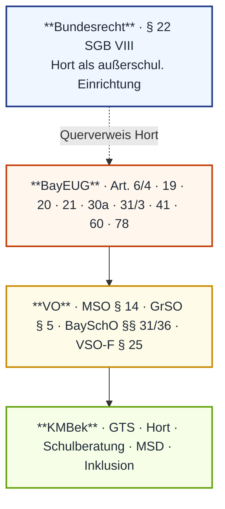
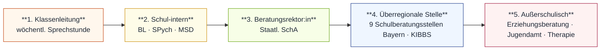

# MP_08 — Kooperation mit Bildungs- und Betreuungseinrichtungen

ZALGM § 16 Nr. 8 · 2. Staatsexamen MS Bayern.

## In aller Kürze

Block 8 regelt das **Zusammenspiel zwischen Schule und externen Bildungs-/Betreuungs-Akteuren**: schulinterne Dienste (MSD, BL, SPych) wirken **subsidiär** zur regulären Lehrkraft; außerschulische Stellen (Hort, Erziehungsberatung, Jugendamt) ergänzen mit **eigener Trägerschaft**. Lernort entscheiden Eltern (Art. 41); Diagnostik in der allgemeinen Schule liegt im professionellen Schulermessen.

## Norm-Kartografie (4 Ebenen)

| Ebene | Quellen für Block 8 |
|---|---|
| **Bundesrecht** | § 22 SGB VIII (Hort, früher KJHG) |
| **BayEUG** | Art. 6/4 · 19 · 20 · 21 · 30a · 31/3 · 41 · 60 · 78 |
| **VO** | MSO § 14 · GrSO § 5 · BaySchO §§ 31/36 · VSO-F § 25 |
| **KMBek** | KWMBl 2011/240 · 08.07.2013 (oGTS) · 10.02.2020 (gGTS) · 12.06.1991 (Hort↔Schule) · 29.10.2001 (Schulberatung) |

---

!!! abstract "Begleit-Material"
    - 🃏 [**Anki-Lerndeck** (45 Karten · 11 Falle · 9 Hochprior)](https://weitergehts.online/lerndecks/schulrecht-mp08-kooperation/)
    - 📑 [**Themen-Übersichtsseite**](https://weitergehts.online/staatsexamen/schulrecht/8-kooperation/)

## Teil A — Stoff

### A.1 MSD — Mobile Sonderpädagogische Dienste

**Norm**: Art. 21/1 BayEUG · KMBek MSD.
**Wesen**: präventiv-integrativer **Dienst an der allgemeinen Schule** (≠ Schulart!). Ziel: negative Entwicklung aufhalten, Verbleib an allgem. Schule, FöS-Überweisung **vermeiden**.
**Träger**: nächstgelegene FöS mit entspr. Schwerpunkt; Personal: Förderschullehrkräfte.
**Aufgaben**: diagnostizieren · fördern · beraten (LK/Eltern/SuS) · koordinieren · fortbilden.
**9 Bereiche**: Autismus · em./soz. · gE · Hören · k./m. · Lernen · Sehen · Sprache · **ELECOK** (Elektronische Hilfen + Computer für Körperbehinderte).
**Anfrage-Indikatoren** (4 Felder):

- Lern/Leistung — Verweigerung, Schwänzen, U.-Störung, Schul-/Prüfungsangst, Konzentration.
- Sozial — Aggression, Außenseiter, Verwahrlosung, Delinquenz, sex. Auffälligkeit.
- Emotional — aggressiv, Beziehungsstörung, psychosomatisch, zwanghaft.
- Psychomotorisch — Wahrnehmung, Aufmerksamkeit, Hyperaktivität, Motorik.

**Maßstab**: Einzelsymptom ≠ Auffälligkeit. Ausschlag = **Ausprägung + Dauer + Intensität + Häufigkeit + Kombination**.
**Erweiterungen**: MSD verantwortet **Förderdiagnostischen Bericht** (Eltern vorab über standardisierte Tests informieren — Pflicht); Unterstützung inklusiver Schulentwicklung; Übergangsbegleitung schul. Lernorte.

!!! warning "⚠ Fallen MSD"
    - **MSD ≠ FöS** — Dienst (Art. 21) vs. Schulart (Art. 19).
    - **MSD ≠ MSH** — schulisch (Art. 21) vs. **vorschulisch** (Art. 19/2).
    - **Eltern-Info-Pflicht** vor standardisierten Tests.

### A.2 Förderzentrum (FöS)

**Norm**: Art. 19 (Aufgaben) · Art. 20 (Schwerpunkte/Aufbau) · Art. 41 (Lernort) · Art. 30a (Inklusion) · § 5 GrSO (Überweisung) · MSO § 14 (Förderplan).

**Aufgaben (Art. 19/1–3)**: diagnostizieren · erziehen · unterrichten · beraten · fördern. Adressaten: K/J mit Bedarf, an allgem. Schule **nicht ausreichend** förderbar. Leistungsspektrum: Klassen-U. + SVE (vorschulisch) + MSH + MSD.

**7 Förderschwerpunkte (Art. 20/1)**: Sehen · Hören · k./m. Entwicklung · gE · Sprache · Lernen · em./soz. Entwicklung.

**Aufbau (Art. 20/2)**: GS-Stufe 1–4 · MS-Stufe 5–9 (ggf. 10 MR) · **Berufsschulstufe** 10–12 bei FS gE (ersetzt BS).

**Lernort (Art. 41)**:

| Abs. | Inhalt |
|---|---|
| 1 | **Eltern entscheiden** — allgem. Schule oder FöS |
| 2 | Längerfristig Kranke → Schule für Kranke |
| 3 | Eltern *sollen* Beratungsstelle aufsuchen |
| 4 | Anmeldung Sprengel/Inklusion-Profil/FöS; FöS = sonderpäd. Gutachten |
| 5 | Bedarf nicht deckbar → geeignete FöS |
| 6 | Kein Einvernehmen → **Schulaufsichtsbehörde** entscheidet |

**Überweisungsverfahren (§ 5 GrSO, 6 Schritte)**: KL erörtert mit Eltern → schriftl. Meldung an SL → SL benachrichtigt Eltern → Hinweis auf BL/SPych → sonderpäd. Gutachten → Eltern-Stellungnahme → Förderort.

**Förderplanpflicht (MSO § 14)**: SuS mit voraussichtlich nicht erreichten Lernzielen erhalten **individuellen Förderplan + Nachteilsausgleich**. Inhalt: Ziele + Maßnahmen + Leistungserhebungen. **Jährlich fortschreiben**. **MSD-Einbeziehung Pflicht**, mit Eltern erörtern. Sonderpäd. Bedarf ≠ Schulart-Zugehörigkeit.

**Inklusion (Art. 30a)**: Abs. 1 Pflicht aller Schularten zur Zusammenarbeit; Abs. 3 SuS mit/ohne Bedarf gemeinsam möglich, FöS unterstützt; **Abs. 4** FS Sehen/Hören/k.-m. an allgem. Schule **nur mit Sachaufwandsträger-Zustimmung**; Abs. 5 sonderpäd. Bedarf begründet keine Schulart-Zugehörigkeit.

**4 Kooperationsformen** (KMBek): Kooperationsklasse (gemeinsam + MSD) · Partnerklasse (FöS↔allg., lernzieldifferent) · Offene Klasse FöS · Tandemklasse.

!!! warning "⚠ Falle FöS"
    **Hertha-Konfiguration** (FS gE → Regelschule): rechtlich möglich (Art. 41/1 + Art. 30a/3). **ABER**: Sachaufwandsträger-Zustimmung NUR bei Sehen/Hören/k.-m. — bei FS gE NICHT erforderlich.

### A.3 Schulberatung

**Norm**: Art. 78/1 BayEUG · KMBek 29.10.2001 (geänd. 24.06.2011). **Freiwilligkeitsgrundsatz**.

**Beratungsweg** (5 Eskalationsstufen):

**Beratungsebenen** (Reihenfolge):

| Ebene | Wer / Qualifikation |
|---|---|
| 1 | **KL** — wöchentl. Sprechstunde |
| 2a | **Beratungslehrkraft (BL)** — LK + **Erweiterungsstudium Univ.** ODER 2-J-Weiterbildung |
| 2b | **Schulpsycholog:in (SPych)** — Psychologie-Studium mit schulpsych. Schwerpunkt; mehrere Schulen |
| 2c | **MSD** — Förderschullehrkraft |
| 3 | **Beratungsrektor:in** (Staatl. SchA, Koordination) |
| 4 | **Staatl. Schulberatungsstelle** (9 in Bayern; KIBBS) |
| 5 | **Außerschulisch** — Erziehungsberatung, Jugendamt, Therapie |

**Themen**: Schullaufbahn/Übertritt · Bildungsmöglichkeiten · Lern-/Leistungsstörung · Verhaltensauffälligkeit.

**SPych-Aufgaben**: Diagnostik · Gruppenuntersuchungen · Krisenintervention · Test-/Diagnoseverfahren (LRS, Rechenschwäche) · Supervision · kollegiale Fallbesprechung. Besondere Felder: Inklusion · Lehrergesundheit · Supervision/Coaching · Mobbing · Demokratie/Toleranz · **KIBBS** (Kriseninterventions-/Bewältigungsteam Bayer. Schulpsychologen).

**Außerschulische Schnittstellen**: vorschulisch (Einschulungsberatung) · Berufsberatung MS 8/9 · Gesundheitsamt/Logopäd:innen · Jugendamt · Erziehungsberatung (**Verschwiegenheit + Eltern-Einverständnis** Voraussetzung).

!!! warning "⚠ Fallen Beratung"
    - **BL ≠ SPych** — Lehrkraft mit Zusatzqual. vs. Psychologe.
    - LK darf **nicht selbst therapieren** — Pflicht zur Weiterleitung.

### A.4 Betreuung (4 Säulen)

**Übersicht** — vier Säulen, drei Rechtsregime:

| Form | Norm | Träger | Zeit |
|---|---|---|---|
| **Mittagsbetreuung** | Art. 31/3 BayEUG | Gemeinde / gemeinnützig | bis ~14 Uhr; verlängert bis 15:30/16:00 |
| **Halbtagsgrundschule** | KMBek (seit 1999/2000) | staatl. | 7:30–13:00 |
| **Ganztagsschule (oGTS/gGTS)** | Art. 6/4 BayEUG + KMBek | staatl. | mind. 4 Tage à 7 Std. |
| **Hort** | **§ 22 SGB VIII** | freier/kirchl./kommunal. JuHi-Träger | außerschul. |

=== "Mittagsbetreuung"

    **Art. 31/3 BayEUG · Träger: Gemeinde / gemeinnützig.**

    - Sozialpäd. Fachpersonal.
    - SL-Benehmen bei Organisation.
    - Standard bis ca. 14 Uhr.
    - Verlängert bis 15:30/16:00 mit HA-Betreuung möglich.

=== "Halbtags-GS"

    **KMBek (seit 1999/2000) · staatl.**

    - 7:30–13:00 Uhr.
    - Vernetzung vor-/nachunterrichtlicher Angebote.
    - Kindgerechte Rhythmisierung des Schulvormittags.

=== "oGTS"

    **KMBek 08.07.2013 · offene Ganztagsschule.**

    - Vormittag im Klassenverband.
    - Nachmittag **freiwillig** (Anmeldung erforderlich).
    - Mittagsverpflegung + HA-Betreuung + Förder-U. + AGs.
    - Kooperation mit Vereinen / Musikschule.

=== "gGTS"

    **KMBek 10.02.2020 · gebundene Ganztagsschule.**

    - **Ganztagszug**, **verpflichtend**.
    - Mind. 4 Tage à 7 Std.; typisch 8–16 Uhr.
    - **Rhythmisierter U.** in Ganztagsklasse.
    - 45-Min-Regel-Abweichung möglich.
    - Zusatzangebote: Sprachförderung, HA-Hilfe, Gewaltprävention.

=== "Hort"

    **§ 22 SGB VIII · KMBek 12.06.1991 (Schule↔Hort).**

    - Eigenständige Bildungs-/Erziehungseinrichtung.
    - Träger: kirchlich / kommunal / freie Jugendhilfe.
    - Ziele: Lebensraum · Selbstständigkeit · HA-Bewältigung · sinnvolle Freizeit (**Bewegung!**) · gesundes Mittagessen.
    - Zusammenarbeit: gemeinsame Besprechungen, Besuche, Fortbildungen, Projekte.

!!! warning "⚠ Fallen Betreuung"
    - **Mittagsbetreuung ≠ Hort ≠ GTS** — drei verschiedene Rechtsregime.
    - **gGTS-Anmeldung freiwillig**, danach **Teilnahme verpflichtend**.
    - **Aufsichtspflicht Mittagspause Halbtags-GS** = Schulverband/Gemeinde, NICHT Schule (↔ Block 6.2).
    - **Kein Rechtsanspruch** auf GTS-Platz — Wahlfreiheit, Schulaufwandsträger entscheidet Ausbau.

### A.5 Detail-Zusätze (GTS-Antragsprinzip · Förderlehrkraft)

**Ganztagsschule – Antragsprinzip**: **Schulaufwandsträger** beantragt GTS-Einrichtung an GS/MS/RS/WS/Gym + entspr. FöS, im Benehmen mit Trägern öff. Jugendhilfe. Wahlfreiheit Halbtag↔Ganztag, **kein Rechtsanspruch**, Teilnahmepflicht ab Anmeldung.

**Förderlehrkraft (FL)**: Rechtsgrund Art. 60 BayEUG + BaySchO §§ 31/36 + VSO-F § 25 + MSO §§ 9/10. Aufgaben: AG-Leitung, LRS-Förder-U., Intensiv-/Förder-U., diff. Sport/Schwimmen, EH/Verkehr, Aufsicht. **Arbeitszeit GS/MS**: 28 UE (45 Min) = 8 eigenverantwortlich (AGs) + 20 Kooperations-U. + 5 Verwaltungsstunden (60 Min). FöS/Schulen für Kranke: 27 UE. SL bestellt Einsatzplan; Kooperations-LK verantwortet Klasseneinsatz.

!!! warning "⚠ Falle FL"
    **FL-Vertretungsunterricht** nur kurzfristig in unabweisbaren Fällen, **max. 5 WStd**, NICHT permanent.

---

## Teil B — Top-9-Pflichtwissen

7-Tage-Endspurt-Cheat-Sheet · Karten-IDs verlinken auf das Anki-Lerndeck.

-   :material-numeric-1-circle: __K03 · MSD-Ziel__

    Verbleib allgem. Schule.
    FöS-Überweisung **vermeiden**.
    *Art. 21 BayEUG*

-   :material-numeric-2-circle: __K08 · Förderdiagn. Bericht__

    MSD verantwortlich.
    **Eltern-Info-Pflicht** vor standardisierten Tests.

-   :material-numeric-3-circle: __K11 · 7 Förderschwerpunkte__

    Sehen · Hören · k./m. · gE · Sprache · Lernen · em./soz.
    *Art. 20/1 BayEUG*

-   :material-numeric-4-circle: __K13 · Lernort-Entscheidung__

    **Eltern** (Art. 41/1).
    FöS-Aufnahme = sonderpäd. Gutachten.

-   :material-numeric-5-circle: __K16 · Förderplanpflicht__

    Pflicht bei nicht erreichten Lernzielen.
    Jährlich fortschreiben.
    MSD-Einbeziehung Pflicht.
    *MSO § 14*

-   :material-numeric-6-circle: __K22 · BL ≠ SPych__

    Unterschiedl. Qualifikation + Aufgabenkatalog.

-   :material-numeric-7-circle: __K27 · LK ≠ Therapie__

    Weiterleitung Pflicht.
    Verschwiegenheit + Eltern-Einverständnis.

-   :material-numeric-8-circle: __K31 · oGTS vs. gGTS__

    Anmeldung **freiwillig**.
    Teilnahme **verpflichtend**.

-   :material-numeric-9-circle: __K32 · Kein Anspruch GTS-Platz__

    Wahlfreiheit Halbtag↔Ganztag.
    Antrag durch Schulaufwandsträger.

🃏 **Direkt zur Karte im Lerndeck**: [K03](https://weitergehts.online/lerndecks/schulrecht-mp08-kooperation/?card=K03) · [K08](https://weitergehts.online/lerndecks/schulrecht-mp08-kooperation/?card=K08) · [K11](https://weitergehts.online/lerndecks/schulrecht-mp08-kooperation/?card=K11) · [K13](https://weitergehts.online/lerndecks/schulrecht-mp08-kooperation/?card=K13) · [K16](https://weitergehts.online/lerndecks/schulrecht-mp08-kooperation/?card=K16) · [K22](https://weitergehts.online/lerndecks/schulrecht-mp08-kooperation/?card=K22) · [K27](https://weitergehts.online/lerndecks/schulrecht-mp08-kooperation/?card=K27) · [K31](https://weitergehts.online/lerndecks/schulrecht-mp08-kooperation/?card=K31) · [K32](https://weitergehts.online/lerndecks/schulrecht-mp08-kooperation/?card=K32)

---

## Teil C — Falle-Atlas

| ID | Falle | Korrekte Auflösung |
|---|---|---|
| FA01 | MSD = FöS? | MSD = Dienst (Art. 21); FöS = Schulart (Art. 19). |
| FA02 | MSD = MSH? | MSD = schulisch; MSH = vorschulisch (Art. 19/2). |
| FA03 | Eltern-Info vor MSD-Tests optional? | Pflicht. |
| FA04 | Hertha (FS gE) braucht Sachaufwandsträger? | Nein — Abs. 4 nur Sehen/Hören/k.-m. |
| FA05 | BL = SPych? | Nein — LK + Zusatzqual. vs. Psychologe. |
| FA06 | LK darf therapieren? | Nein — Weiterleitung; Verschwiegenheit + Eltern-Einverständnis. |
| FA07 | Lina muss in gGTS? | Anmeldung freiwillig, Teilnahme ab Anmeldung verpflichtend. |
| FA08 | Mittagsbetreuung = Hort = GTS? | 3 Rechtsträger (Gemeinde / freier JuHi / staatl. Schule). |
| FA09 | Aufsichtspflicht Mittagspause Halbtags-GS = Schule? | Nein — Schulverband/Gemeinde. |
| FA10 | Rechtsanspruch GTS-Platz? | Kein Anspruch; Wahlfreiheit. |
| FA11 | FL permanent als Vertretung? | Nur kurzfristig, max. 5 WStd, unabweisbare Fälle. |

**Interaktiv-Modus** (Click-to-Reveal — zum Selbst-Abprüfen):

FA01 · MSD = Förderzentrum?

NEIN — MSD = **Dienst** an der allgem. Schule (Art. 21 BayEUG); FöS = **Schulart** (Art. 19 BayEUG).

FA04 · Hertha (FS gE) → Regelschule braucht Sachaufwandsträger?

NEIN — Art. 30a/4 sieht Sachaufwandsträger-Zustimmung **nur** für **Sehen / Hören / körperl.-motor.** vor. FS gE fällt NICHT darunter.

FA05 · BL = SPych?

NEIN — BL = **Lehrkraft + Erweiterungsstudium** (oder 2-J-Weiterbildung); SPych = **Psychologe** mit schulpsych. Schwerpunkt. Unterschiedliche Qualifikation + Aufgabenkatalog.

FA08 · Mittagsbetreuung = Hort = Ganztagsschule?

NEIN — drei verschiedene Rechtsträger: Gemeinde (Mittagsbetreuung, Art. 31/3) · freier/kirchl./kommunal. JuHi-Träger (Hort, § 22 SGB VIII) · staatl. Schule (GTS, Art. 6/4 BayEUG).

---

## Teil D — Fallbeispiele (Anwendung)

??? example "Fall **Tom** — em./soz. + Eltern-Veto + Hort-Frage (Hauptfall)"
    **Sachverhalt**: 7. Kl. MS. Aggressives Verhalten, Schulverweigerung, Konzentrationsprobleme. Sie vermuten Förderbedarf em./soz. Eltern lehnen MSD-Diagnostik ab, fordern SPych-Termin und fragen nach Hortwechsel.

    **Knackpunkte**:

    1. **MSD-Anfrage trotz Eltern-Veto möglich** — MSD = Dienst an allgem. Schule (Art. 21), kein Schulartenwechsel. Eltern haben **Lernort-Primat** (Art. 41), nicht Diagnostik-Veto. Pflicht: Eltern vorab über standardisierte Tests informieren.
    2. **BL ≠ SPych** — beide möglich, aber unterschiedliche Qualifikation/Aufgaben. Bei em./soz.-Verdacht ist MSD primär; SPych ergänzend für psychol. Diagnostik/Krisenintervention.
    3. **Hort = außerschulisch** (§ 22 SGB VIII), Träger ≠ Schule. Anmeldung über Jugendhilfe; Schule kooperiert (KMBek 12.06.1991), bietet aber nicht an.
    4. **Therapie-Verbot** (Falle Hanna) — falls Tom psychotherapeutisch auffällig: Weiterleitung, nicht Selbst-Therapie.

    **Antwortkette**: Anfrage-Indikatoren em./soz. erkennen (Maßstab Ausprägung+Dauer+Intensität+Häufigkeit+Kombination) → Elterngespräch (MSD ≠ Sonderschullehrer-Stigma entkräften) → Beratungsweg KL→BL/SPych/MSD parallel → Förderplanpflicht MSO § 14 ankündigen falls Bedarf bestätigt → Hort-Anregung in Jugendhilfe-Kanal verweisen → bei Eltern-Verhärtung: SL + Beratungsrektor:in einschalten (Schulaufsichtsbehörde nur bei FöS-Überweisungs-Konflikt nach Art. 41/6).

??? example "Fall **Hertha** — FS gE → Regelschule"
    **Sachverhalt**: 7-jährige Hertha (FS gE) soll an die Sprengelschule wechseln.

    **Knackpunkte**:

    1. Rechtlich möglich über **Art. 41/1** (Eltern-Lernort-Entscheidung) + **Art. 30a/3** (gemeinsamer Unterricht).
    2. **Sachaufwandsträger-Zustimmung** ist **NICHT** erforderlich — Art. 30a/4 betrifft NUR Sehen/Hören/k.-m., nicht gE.
    3. **Förderplan MSO § 14** verbindlich; **Schulprofil Inklusion** oder Kooperations-/Partnerklasse prüfen; MSD em./soz. + gE zur Begleitung anfragen.

    **Antwortkette**: Eltern-Anmeldung an Sprengelschule → Schulprofil Inklusion verfügbar? → MSD-Anbindung an FS gE → Förderplan + Nachteilsausgleich → Wertigkeit FöS pädagogisch verdeutlichen, Rückkehr-Option offen halten.

??? example "Fall **Hanna** — therapeutisch auffällig"
    **Sachverhalt**: Schülerin zeigt Symptome, die therapeutische Behandlung nahelegen.

    **Knackpunkte**:

    1. **LK darf NICHT selbst therapieren** — Pflicht zur Weiterleitung (BL/SPych/Erziehungsberatung).
    2. **Verschwiegenheit + Eltern-Einverständnis** Voraussetzung für Erziehungsberatung.
    3. **Freiwilligkeitsgrundsatz** Schulberatung — Eltern können ablehnen.

??? example "Fall **Lina** — gGTS-Anmeldung"
    **Sachverhalt**: 9-jährige Lina will keine gebundene Ganztagsschule mehr besuchen.

    **Knackpunkte**:

    1. **Anmeldung freiwillig** — Eltern-Entscheidung.
    2. **Teilnahme ab Anmeldung verpflichtend** — gGTS = Ganztagszug, kein Tages-Rückzug.
    3. **Wechsel nur zum SJ-Ende** möglich; alternativ oGTS prüfen (freiwillige Nachmittagsanmeldung).

    **Antwortkette**: Eltern-Beratung Art. 78 → Wechsel-Antrag zum SJ-Ende oder Wechsel in oGTS (sofern an Schule angeboten) → bei Halbtags-Bedarf akut: Mittagsbetreuung (Gemeinde) oder Hort (außerschulisch) als Alternative.

??? example "Fall **Niklas** — Aufsichtspflicht-Übergang Schule → Hort"
    **Sachverhalt**: Niklas (7) verletzt sich auf dem Weg von der Halbtags-Grundschule zum Hort um 13:15 Uhr. Mutter macht die Schule haftbar.

    **Knackpunkte**:

    1. **Aufsichtspflicht-Sphären getrennt**: Schule (Unterricht) — Schulverband/Gemeinde (Mittagspause Halbtags-GS) — Hort-Träger (außerschulisch, § 22 SGB VIII).
    2. **Mittagsbetreuung ≠ Hort ≠ GTS** — drei verschiedene Träger, drei verschiedene Haftungsachsen.
    3. **Schule haftet nur** für die Zeit unter SL-Aufsicht und -Verantwortung (bei GTS Nachmittag inkl., bei Halbtags-GS nicht).

    **Antwortkette**: Sphären-Zuordnung klären → Niklas-Unfall um 13:15 außerhalb Schulpräsenz → Schulverband/Gemeinde bzw. Hort-Träger als Verantwortliche → KL informiert SL + Eltern, dokumentiert Vorfall, verweist Mutter an Hort-Träger / Gemeindeverwaltung. Cross-Ref Block 6.2.

??? example "Fall **Becker** — FL als Dauer-Vertretung"
    **Sachverhalt**: SL setzt Frau Becker (Förderlehrkraft) seit 6 Wochen täglich als Vertretung für eine erkrankte Klassenleitung ein. Beckers AG-Stunden fallen aus. Personalrat fragt nach.

    **Knackpunkte**:

    1. **FL-Vertretungsunterricht NUR kurzfristig** in unabweisbaren Fällen, **max. 5 WStd**, NICHT permanent.
    2. **Arbeitszeit-Aufteilung** schützt das FL-Profil: 8 eigenverantwortliche AG-Stunden + 20 Kooperations-U. + 5 Verwaltungsstunden.
    3. **Permanente Vertretung** wäre Verstoß gegen die FL-Aufgabenbindung — alternativ: mobile Reserve, befristete Vertretungsregelung über SchA.

    **Antwortkette**: SL-Praxis prüfen → wenn Dauer-Vertretung: rechtswidrig → Eskalation an Schulaufsichtsbehörde / Beratungsrektor:in → mobile Reserve als Lösung; Personalrat hat Mitbestimmungsrecht.

??? example "Fall **Mira** — Rückkehr von FöS zur MS"
    **Sachverhalt**: Mira (12) besucht seit 3 Jahren eine FöS Lernen, hat sich stabilisiert. Eltern fragen, ob sie zur Mittelschule zurückkehren und zum Quali zugelassen werden kann.

    **Knackpunkte**:

    1. **Rückkehr stets möglich** — pädagogischer Hinweis: Eltern beraten, Wertigkeit FöS verdeutlichen, aber Übergang nicht verstellen.
    2. **QA-Teilnahme stets offen** — Mira kann externe Prüfung absolvieren.
    3. **Förderplan + Nachteilsausgleich** (MSO § 14) übergangsweise an der MS möglich; sonderpäd. Bedarf endet nicht automatisch mit Schulartenwechsel.

    **Antwortkette**: Beratung Art. 78 → Anmeldung an Sprengel-MS → Probezeit/-versetzung nach MS-Regularien → Förderplan in MS-Schuljahr fortschreiben → MSD-Anbindung optional → QA-Anmeldung im 9. SJ.

??? example "Fall **Familie Schwarz** — Antrag auf GTS-Einrichtung"
    **Sachverhalt**: Eltern einer GS-Klasse fordern bei der Schule die Einrichtung einer gebundenen Ganztagsschule. Die SL verweist auf den Schulträger.

    **Knackpunkte**:

    1. **Antragsrecht bei Schulaufwandsträger** — Eltern haben **kein** direktes Antragsrecht; Antrag an GS/MS/RS/WS/Gym läuft über Schulaufwandsträger (Gemeinde/Landkreis).
    2. **Im Benehmen mit Trägern öff. Jugendhilfe** — Planung erfordert Abstimmung.
    3. **Kein Rechtsanspruch** auf GTS-Platz — Wahlfreiheit Halbtag↔Ganztag, aber Ausbau abhängig von Träger-Entscheidung.

    **Antwortkette**: Eltern-Beratung → Verweis auf Schulaufwandsträger als richtigen Adressaten → Eltern-Initiative kann politisch wirken, aber nicht rechtlich erzwungen werden → Alternative: oGTS (Antrag durch SL möglich, aber ebenfalls trägergebunden).

??? example "Fall **Frau Akbar** — Eltern-Forderung Schulpsych. Test ohne LK-Befund"
    **Sachverhalt**: Frau Akbar fordert schriftlich einen LRS-Test ihrer Tochter durch die Schulpsychologin, obwohl die KL keinen Verdacht hat.

    **Knackpunkte**:

    1. **Freiwilligkeitsgrundsatz Schulberatung** — Eltern können Beratung in Anspruch nehmen, KL/Schule keine Veto-Position.
    2. **SPych-Aufgaben umfassen Test-/Diagnoseverfahren LRS** — formal zuständig, terminiert nach Verfügbarkeit.
    3. **Verschwiegenheitspflicht** und **Eltern-Einverständnis** sind bereits gegeben, da Eltern selbst beantragen.

    **Antwortkette**: Eltern-Anliegen aufnehmen → Weiterleitung an Beratungsrektor:in → SPych-Termin koordinieren → KL-Aufzeichnungen auf Lern-/Leistungsverhalten dokumentieren (zur Test-Vorbereitung) → Test-Ergebnis abwarten, ggf. Förderplan einleiten.

---

## Querverweise

- **K16 Förderplan ↔ Block 5.5** — Notenschutz/Nachteilsausgleich (BVerwG 29.07.2015; BaySchO § 33 NA äußere Bedingungen vs. § 34 NS Anforderungs-/Bewertungsverzicht).
- **K35 Aufsichtspflicht Mittagspause ↔ Block 6.2** — Träger außerhalb Schulzeit.
- **K08 Förderdiagn. Bericht ↔ Block 5.5** — BaySchO § 37/1 lit. i/k/l (Schülerunterlagen); § 39 (Weitergabe nur mit Einwilligung).
- **Hertha-Falle ↔ Block 2** — Bildungssystem-Gliederung, Norm-Spezialitätsverhältnis Art. 30a/4 ↔ 41/1.
- **Schulberatung Art. 78 ↔ Block 4.1** — Beratungspflicht im Übertrittskontext.

---

## Quellen

- **Bundesrecht**: § 22 SGB VIII (8. Buch SGB; früher KJHG).
- **BayEUG**: Art. 6/4, 19, 20, 21, 30a, 31/3, 41, 60, 78.
- **Schulordnungen**: MSO § 14 (Förderplan), GrSO § 5 (Überweisungsverfahren), BaySchO §§ 31/36 (FL-Arbeitszeit), VSO-F § 25, MSO §§ 9/10.
- **KMBek**: KWMBl 2011 S. 240 (GTS-Ausbau) · 08.07.2013 (oGTS) · 10.02.2020 (gGTS) · 12.06.1991 (Hort↔Schule) · 29.10.2001 geänd. 24.06.2011 (Schulberatung).

--8<-- "includes/normen-glossar.md"
