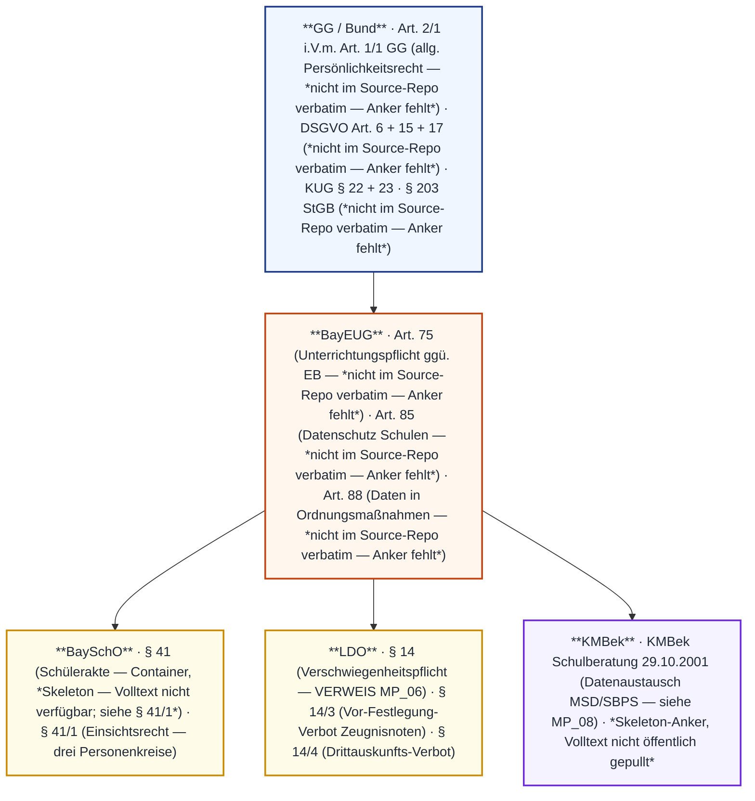
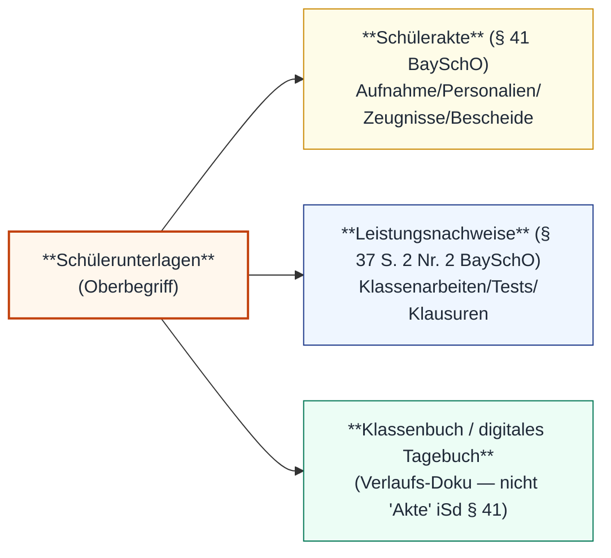
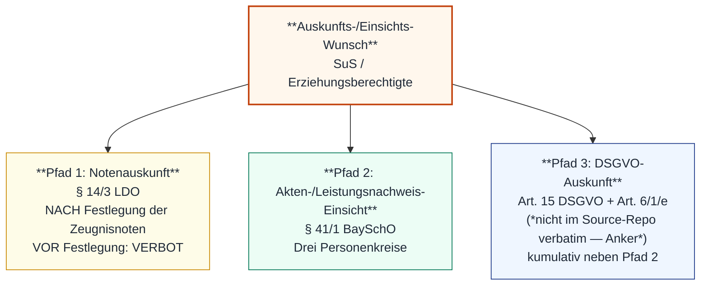
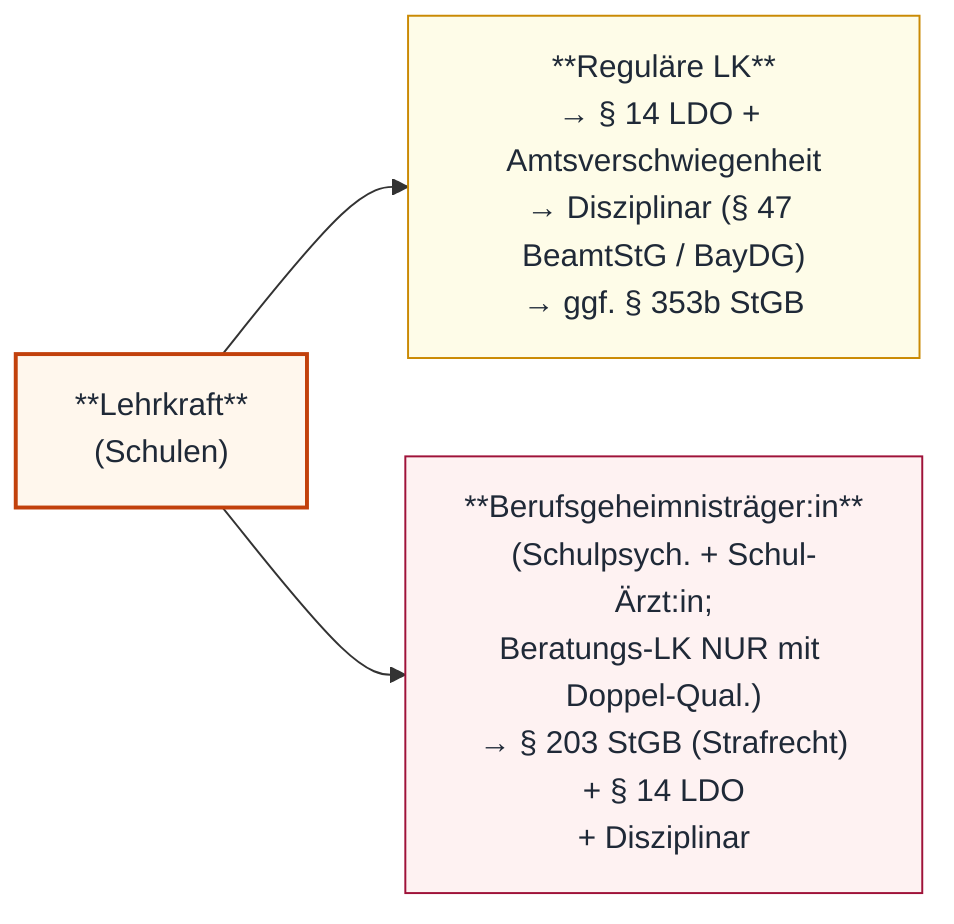
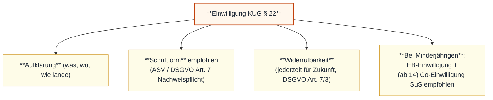

# MP_09 — Datenschutz und Schülerakte im Schuldienst

ZALGM § 16 Nr. 9 · 2. Staatsexamen MS Bayern · Schwerpunkt 9.1 Schülerunterlagen-Terminologie + § 41 BaySchO Schülerakte · 9.2 Auskunfts-Trias (Notenauskunft / Akten-Einsicht / DSGVO Art. 15) · 9.3 Verschwiegenheit § 14 LDO (Verweis MP_06 + Kern Abs. 3+4) · 9.4 Strafrechts-Schnittstelle § 203 StGB · 9.5 Bildrechte KUG / Persönlichkeitsrecht.

## In aller Kürze

Datenschutz im Schuldienst ist eine **Auskunfts-Trias** mit klarer **Verbot-vs.-Recht-Trennschärfe**: **Auskunfts-VERBOT an Dritte** (§ 14/4 LDO — Schule darf KEINE Auskunft an Personen außerhalb der Erziehungsberechtigten geben; nur mit ausdrücklicher Zustimmung oder bei günstiger Auswirkung mit Zustimmungs-Vermutung) — **NICHT** zu verwechseln mit „Notengeheimnis" zwischen SuS. Demgegenüber besteht das **subjektive Auskunfts-RECHT der SuS/EB**: Akten-Einsicht nach **§ 41/1 BaySchO** (drei Personenkreise — SuS ab Vollendung 14. Lj., aktuelle EB, frühere EB bis Vollendung 21. Lj.) plus **DSGVO Art. 15** (kumulativ, Bund/EU-Anker) plus **Notenauskunft** an SuS/EB (§ 14/3 LDO erlaubt ab endgültiger Festlegung der Zeugnisnoten). **§ 203 StGB** (Berufsgeheimnis-Strafrecht) greift NICHT pauschal für jede Lehrkraft. Tatbestandsseitig erfasst sind primär **Schulpsycholog:innen** (§ 203 Abs. 1 Nr. 2: staatlich anerkannte Berufspsycholog:innen) und **Schul-Ärzt:innen** (§ 203 Abs. 1 Nr. 1). **Beratungs-LK** fallen i.d.R. **NICHT** unter § 203 StGB — nur dann, wenn sie zugleich als staatlich anerkannte Sozialpädagog:in/Berufspsycholog:in tätig werden. Reguläre LK + reine Beratungs-LK unterliegen **§ 14 LDO + Amtsverschwiegenheit (Disziplinar-Tatbestand)** + ggf. **§ 353b StGB**. **Bildrechte**: § 22 KUG verlangt **Einwilligung** zur Verbreitung/Schaustellung; § 23 KUG kennt vier Ausnahmen (Zeitgeschichte, Beiwerk, Versammlung, Kunst-Interesse) — **Klassenfotos** fallen NICHT darunter. **Verfassungs-Anker**: allgemeines Persönlichkeitsrecht aus **Art. 2/1 GG i.V.m. Art. 1/1 GG** (informationelle Selbstbestimmung, BVerfG Volkszählungsurteil 1983).

> **Hinweis** — Stoff-Überlapp: § 14 LDO Verschwiegenheit wird primär in **MP_06 A.3** entwickelt; MP_09 vertieft Abs. 3 (Vor-Festlegung-Verbot) + Abs. 4 (Drittauskunfts-Verbot) als datenschutzrechtlichen Kern. KUG / Persönlichkeitsrecht überlappt mit der **MP_05 K15-Falle** (SuS-Persönlichkeitsrecht). § 203 StGB hat eine Schnittstelle zu **MP_08** (Schulpsychologie / Beratungslehrer:innen / MSD-Datenaustausch).

## Norm-Kartografie (5 Ebenen)

| Ebene | Schwerpunkt-Normen MP_09 |
|---|---|
| **GG / Bund** | **Art. 2/1 i.V.m. Art. 1/1 GG** (allgemeines Persönlichkeitsrecht / informationelle Selbstbestimmung — *nicht im Source-Repo verbatim — Anker fehlt*) · **DSGVO Art. 6** (Rechtmäßigkeit) · **Art. 15** (Auskunftsrecht) · **Art. 17** (Löschung) — alle *nicht im Source-Repo verbatim — Anker fehlt* · **§ 22/23 KUG** (Recht am eigenen Bild — verified-1:1) · **§ 203 StGB** (Berufsgeheimnis-Strafrecht — *nicht im Source-Repo verbatim — Anker fehlt*) |
| **BayEUG** | **Art. 75** (Datenverarbeitungs-Anker — *nicht im Source-Repo verbatim — Anker fehlt*) · **Art. 85** (Datenschutz Schulen — *nicht im Source-Repo verbatim — Anker fehlt*) · **Art. 88/4** (Daten in Ordnungsmaßnahmen — *nicht im Source-Repo verbatim — Anker fehlt*; Hinweis aus § 14/4 LDO i.V.m. Art. 75/1 + 88/4 BayEUG) |
| **BaySchO** | **§ 41** (Container Schülerakte — *Skeleton — Volltext nicht verfügbar; siehe § 41/1*) · **§ 41/1** (Einsichtsrecht — drei Personenkreise verbatim verfügbar) |
| **LDO** | **§ 14** (Verschwiegenheit — VERWEIS MP_06; Abs. 3 + 4 hier verbatim) · **§ 14/3** (Vor-Festlegung-Verbot bei Zeugnisnoten) · **§ 14/4** (Auskunfts-Verbot ggü. Dritten — KERN MP_09) |
| **KMBek / Sek.** | KMBek Schulberatung 29.10.2001 (Datenaustausch MSD/SBPS — Cross-Ref **MP_08**) · *Skeleton-Anker, Volltext nicht öffentlich gepullt* |

---

# Teil A — Stoff

## A.1 Schülerunterlagen-Terminologie + § 41 BaySchO Schülerakte

**Begriffs-Trias der Schülerunterlagen**:

**§ 41 BaySchO — Schülerakte (Container-Eintrag)**:

> ⚠️ Wortlaut-Container — Volltext nicht verfügbar; konkrete Norm im Container ist § 41/1 BaySchO mit dem Einsichtsrecht. Container-Eintrag dient der Skopuierung „Schülerakte als Begriff".

*Skeleton — Volltext nicht verfügbar; Container-Verweis · BaySchO § 41 · siehe § 41/1*

**§ 41/1 BaySchO — Einsichtsrecht in die Schülerakte (PFLICHT-Verbatim)**:

> Ein Recht auf Einsicht in die eigene Schülerakte nach § 37 Satz 2 Nr. 1 sowie – nach Abschluss des Aufnahmeverfahrens, der Abschlussprüfung oder anderer schulischer Leistungsfeststellungen – in die Leistungsnachweise nach § 37 Satz 2 Nr. 2 haben
> 1. die jeweiligen Schülerinnen und Schüler ab Vollendung des 14. Lebensjahres, auch wenn sie die Schule verlassen haben,
> 2. die Erziehungsberechtigten der jeweiligen Schülerinnen und Schüler und
> 3. die früheren Erziehungsberechtigten bei Schülerinnen und Schülern bis zur Vollendung des 21. Lebensjahres, soweit Vorschriften des Bayerischen Gesetzes über das Erziehungs- und Unterrichtswesen oder der Schulordnungen ihre Unterrichtung vorschreiben.

*verified-1:1 · gesetze.legal/bayern/bayscho/41 · BaySchO § 41/1*

**Personenkreis-Tabelle (drei Berechtigte — NICHT zwei oder vier!)**:

| Nr. | Berechtigte | Voraussetzung | Zeitliche Grenze |
|---|---|---|---|
| 1 | **SuS selbst** | **ab Vollendung des 14. Lebensjahres** | auch nach Schulaustritt |
| 2 | **(aktuelle) Erziehungsberechtigte** | EB-Status | solange EB-Eigenschaft besteht |
| 3 | **frühere Erziehungsberechtigte** | wenn BayEUG/Schulordnungen Unterrichtung vorschreiben | nur **bis Vollendung des 21. Lj.** des SuS |

!!! warning "⚠ Fallen Personenkreis"
    - **„ab 14 Lj." ≠ „ab Vollendung des 14. Lebensjahres"** — Wortlaut entscheidet (also **nach** dem 14. Geburtstag).
    - **„nach Vollendung" ≠ „ab Vollendung"** — Wortlaut sagt **„AB Vollendung"** (sofortige Anwendbarkeit ab Tag der Vollendung).
    - 21-Lj.-Grenze gilt **nur für FRÜHERE EB** — nicht für aktuelle EB und nicht für SuS.
    - Es sind **drei** Personenkreise, nicht zwei (SuS-EB) oder vier (zzgl. Lehrkräfte). Lehrkräfte sind **keine** Berechtigten iSd § 41/1 BaySchO; sie haben Aktenzugang qua Funktion.

---

## A.2 Auskunfts-Trias — drei Pfade getrennt halten

**Pfad-Vergleich-Tabelle**:

| Pfad | Norm | Berechtigte | Inhalt | Verbot-Phase? |
|---|---|---|---|---|
| **1 Notenauskunft** | § 14/3 LDO | SuS + EB | Vorrücken / Zeugnisnoten | **VOR endgültiger Festlegung VERBOTEN** (Abs. 3 S. 1) |
| **2 Akten-/LN-Einsicht** | § 41/1 BaySchO | SuS ab 14, EB, frühere EB bis 21 | Schülerakte (§ 37 S. 2 Nr. 1) + Leistungsnachweise (§ 37 S. 2 Nr. 2) | nach Abschluss Aufnahmeverfahren / Abschlussprüfung / anderer Leistungsfeststellung |
| **3 DSGVO-Auskunft** | Art. 15 DSGVO (Bund/EU) | Betroffene Person (idR SuS / EB als Vertreter) | Verarbeitungszwecke, Empfänger, Speicherdauer, Rechte | binnen 1 Monat (Art. 12/3 DSGVO — *nicht im Source-Repo verbatim — Anker fehlt*) |

**§ 14/3 LDO — Vor-Festlegung-Verbot (PFLICHT-Verbatim, Auszug)**:

> Bis zur endgültigen Festlegung der Zeugnisnoten nach den für die einzelnen Schularten geltenden Bestimmungen dürfen Schülerinnen und Schülern oder Erziehungsberechtigten keine Auskünfte über das Vorrücken oder über Zeugnisnoten erteilt werden. § 6 Abs. 3 bleibt unberührt.

*verified-1:1 · gesetze-bayern.de · LDO § 14 Abs. 3*

**Art. 15 DSGVO — Sinngehalt** (*nicht im Source-Repo verbatim — Anker fehlt*):

> Art. 15 DSGVO *(sinngemäß)*: Die betroffene Person hat das Recht, von der verantwortlichen Stelle eine Bestätigung darüber zu erhalten, ob sie betreffende personenbezogene Daten verarbeitet werden, sowie Auskunft über diese Daten und alle nach Art. 15 Abs. 1 lit. a–h geforderten Informationen (u. a. Verarbeitungszwecke, Datenkategorien, Empfänger, geplante Speicherdauer, Rechte auf Berichtigung/Löschung, Beschwerderecht).

*sinngemäß · Art. 15 DSGVO · nicht im Source-Repo verbatim — Anker fehlt*

!!! info "Trennschärfe-Merkhilfe"
    - **§ 41/1 BaySchO** = **Akten-Einsicht** (das Papier-/Datei-Original anschauen).
    - **Art. 15 DSGVO** = **Daten-Auskunft** (was wird über mich gespeichert / verarbeitet?).
    - Beide bestehen **kumulativ** — Schule muss beide Anfragen bearbeiten; § 41/1 ersetzt nicht Art. 15 DSGVO und umgekehrt.

!!! warning "⚠ Fallen Auskunfts-Trias"
    - **VOR Festlegung der Zeugnisnoten KEINE Auskunft** — auch nicht an EB oder SuS (§ 14/3 LDO).
    - „Notengeheimnis zwischen SuS" ist KEIN Begriff der LDO — es geht um **Zeitsperre vor Festlegung** + **Auskunfts-Verbot ggü. Dritten** (Abs. 4).
    - DSGVO Art. 15 + § 41/1 BaySchO nicht gegeneinander ausspielen — sie ergänzen sich.
    - Bei **digitalen Aktensystemen** (z. B. ASV) gelten DSGVO-Pflichten **zusätzlich** zur BaySchO-Akteneinsicht.

---

## A.3 Verschwiegenheit § 14 LDO — KERN MP_09 (Verweis MP_06 + Vertiefung Abs. 3+4)

> **Cross-Ref MP_06 A.3** — § 14 LDO Abs. 1 + 2 (Amtsverschwiegenheit + Presse-Auskunft nur durch SL) wird in **MP_06 Teil A.3** verbatim entwickelt. MP_09 fokussiert **Abs. 3** (Vor-Festlegung-Verbot — siehe A.2) und **Abs. 4** (Drittauskunfts-Verbot — Datenschutz-Kern).

**§ 14/4 LDO — Auskunfts-Verbot ggü. Dritten (PFLICHT-Verbatim, KERN-Norm MP_09)**:

> Die Schule ist nicht berechtigt, anderen Personen als den Erziehungsberechtigten Auskunft über Schülerinnen und Schüler und ihre Leistungen zu geben. Von dieser Regel kann jedoch abgewichen werden, wenn die Erziehungsberechtigten ausdrücklich zustimmen oder wenn anzunehmen ist, dass sich die Auskunft für die Schülerinnen und Schüler und die Erziehungsberechtigten nur günstig auswirkt und die Zustimmung der Erziehungsberechtigten erwartet werden kann. Die Auskunftspflicht gegenüber den Ausbildenden oder Arbeitgebern nach den schulrechtlichen Bestimmungen für die Berufsschulen bleibt hiervon unberührt. Für Auskünfte an frühere Erziehungsberechtigte volljähriger Schüler gelten Art. 75 Abs. 1 und 88 Abs. 4 Satz 1 Ziff. 3 BayEUG. Die Erteilung von Auskünften über Schülerinnen und Schüler an Behörden außerhalb der Schulaufsicht richtet sich nach den dafür ergangenen besonderen Bestimmungen.

*verified-1:1 · gesetze-bayern.de/Content/Document/BayVwV288393-14 · LDO § 14/4*

**Auflösung-Tabelle (Drittauskunfts-Anfragen)**:

| Anfragender | Auskunft? | Rechtsgrundlage |
|---|---|---|
| Aktuelle Erziehungsberechtigte | **JA** (regulär) | § 14/4 S. 1 — sind keine „Dritten" |
| Lehrkräfte derselben Schule | **JA** (dienstlich erforderlich) | § 14/1 LDO „dienstlicher Verkehr" |
| **Dritte** (Verwandte, Nachbarn, Vereine) | **NEIN — grundsätzlich verboten** | § 14/4 S. 1 — Auskunfts-Verbot |
| Dritte mit **ausdrücklicher EB-Zustimmung** | JA (Ausnahme 1) | § 14/4 S. 2 |
| Dritte bei **„günstiger Auswirkung" + Zustimmungs-Vermutung** | JA (Ausnahme 2) | § 14/4 S. 2 |
| Ausbildende / Arbeitgeber (Berufsschule) | **JA** (gesonderte Auskunftspflicht) | § 14/4 S. 3 |
| Frühere EB volljähriger SuS | nach Maßgabe | § 14/4 S. 4 i.V.m. Art. 75/1 + 88/4/Nr. 3 BayEUG |
| Behörden außerhalb Schulaufsicht (Polizei, JA) | nach Maßgabe besonderer Bestimmungen | § 14/4 S. 5 |
| Presse / Rundfunk / TV | NUR durch SL oder Beauftragte | § 14/2 LDO (siehe MP_06) |

!!! warning "⚠ Fallen § 14/4 LDO"
    - Abs. 4 ist **Auskunfts-VERBOT-an-DRITTE** (Schule → Dritte) — populäre Charakterisierung als „Notengeheimnis / Vergleichsverbot zwischen SuS" ist **verkürzt** und **falsch**.
    - Auskunft an Dritte NUR mit **ausdrücklicher** Zustimmung EB ODER bei „günstiger Auswirkung" mit **Zustimmungs-Vermutung** — beide Voraussetzungen sind kumulativ-konjunktiv im jeweiligen Fall zu prüfen.
    - Bei volljährigen SuS: Art. 75/1 + 88/4 Nr. 3 BayEUG zu beachten (frühere EB).
    - Berufsschule: Auskunftspflicht **ggü. Ausbildenden/Arbeitgebern** ist UNBERÜHRT (Sonder-Datenfluss).
    - Bei Verstoß: **§ 47 BeamtStG (Bund)** Tatbestand → **BayDG Art. 6 ff.** Maßnahmen (Cross-Ref **MP_07 A.3**).

---

## A.4 Strafrechts-Schnittstelle — § 203 StGB (NICHT pauschal)

**§ 203 StGB — Verletzung von Privatgeheimnissen (Bund/Strafrecht)**:

> § 203 StGB *(sinngemäß)*: Strafbar macht sich, wer unbefugt ein fremdes Geheimnis, insbesondere ein zum persönlichen Lebensbereich gehörendes, offenbart, das ihm in seiner Eigenschaft als Angehöriger eines bestimmten Berufs (z. B. Ärzt:in, Psycholog:in, Berufspsycholog:in mit anerkannter Ausbildung) anvertraut oder bekannt geworden ist. Strafdrohung idR Freiheitsstrafe bis zu einem Jahr oder Geldstrafe.

*sinngemäß · § 203 StGB · nicht im Source-Repo verbatim — Anker fehlt*

**Reichweiten-Tabelle (KRITISCH — NICHT pauschalisieren)**:

| Personenkreis | § 203 StGB? | Statt dessen |
|---|---|---|
| **Schulpsycholog:in** | **JA** (Berufspsycholog:in mit anerkannter Ausbildung) | + § 14 LDO + Disziplinar |
| **Beratungslehrer:in** | **JA**, soweit Zusatzfunktion und entsprechende Anerkennung | + § 14 LDO + Disziplinar |
| **Schul-Ärzt:in / Schulgesundheits-FK** | **JA** (Heilberuf) | + § 14 LDO |
| **Reguläre Klassenlehrkraft** (ohne Zusatzfunktion) | idR **NEIN** | **§ 14 LDO + Amtsverschwiegenheit** + ggf. **§ 353b StGB** (Verletzung des Dienstgeheimnisses, *nicht im Source-Repo verbatim — Anker fehlt*) + Disziplinar (§ 47 BeamtStG / BayDG) |

> **Cross-Ref MP_08** — Datenaustausch mit MSD / Schulberatung / SBPS unterliegt dem KMBek-Datenflussregime (KMBek Schulberatung 29.10.2001). Berufsgeheimnis-Träger:innen brauchen für jede Übermittlung **Schweigepflichts-Entbindung der Erziehungsberechtigten** — siehe **MP_08 A.4**.

!!! warning "⚠ Fallen § 203 StGB"
    - **Nicht jede LK** unterliegt § 203 StGB — § 203 ist **berufsbezogen** (vgl. Aufzählung in § 203 Abs. 1 StGB).
    - Reguläre LK → bei Geheimnisbruch **§ 14 LDO + Amtsverschwiegenheit** → Disziplinar; ggf. § 353b StGB.
    - Schweigepflicht-Entbindung MUSS schriftlich + ausdrücklich erfolgen (Berufsgeheimnis-Träger:innen).
    - Auch ohne § 203 StGB-Tatbestand kann die **gleiche Tat** disziplinar- und ggf. zivilrechtlich (§ 839 BGB + Amtshaftung-Anker, Cross-Ref **MP_07 A.2**) sanktioniert werden.

---

## A.5 Bildrechte (KUG § 22-23) und Persönlichkeitsrecht

**Verfassungsrechtlicher Anker** (*nicht im Source-Repo verbatim — Anker fehlt*):

> Allgemeines Persönlichkeitsrecht *(sinngemäß)*: Aus **Art. 2 Abs. 1 GG i.V.m. Art. 1 Abs. 1 GG** schützt das BVerfG (Volkszählungsurteil 1983) das Recht auf informationelle Selbstbestimmung — Schutz vor unbegrenzter Erhebung, Speicherung, Verwendung und Weitergabe persönlicher Daten.

*sinngemäß · Art. 2/1 GG i.V.m. Art. 1/1 GG · nicht im Source-Repo verbatim — Anker fehlt*

**§ 22 KUG — Recht am eigenen Bild (PFLICHT-Verbatim, Auszug)**:

> Bildnisse dürfen nur mit Einwilligung des Abgebildeten verbreitet oder öffentlich zur Schau gestellt werden. Die Einwilligung gilt im Zweifel als erteilt, wenn der Abgebildete dafür, daß er sich abbilden ließ, eine Entlohnung erhielt. Nach dem Tode des Abgebildeten bedarf es bis zum Ablaufe von 10 Jahren der Einwilligung der Angehörigen des Abgebildeten. […]

*verified-1:1 · gesetze-im-internet.de/kunsturhg/__22.html · KUG § 22 · Auszug, Wortlaut gekürzt*

**§ 23 KUG — Ausnahmen (PFLICHT-Verbatim)**:

> Abs. 1: Ohne die nach § 22 erforderliche Einwilligung dürfen verbreitet und zur Schau gestellt werden:
> 1. Bildnisse aus dem Bereiche der Zeitgeschichte;
> 2. Bilder, auf denen die Personen nur als Beiwerk neben einer Landschaft oder sonstigen Örtlichkeit erscheinen;
> 3. Bilder von Versammlungen, Aufzügen und ähnlichen Vorgängen, an denen die dargestellten Personen teilgenommen haben;
> 4. Bildnisse, die nicht auf Bestellung angefertigt sind, sofern die Verbreitung oder Schaustellung einem höheren Interesse der Kunst dient.
> Abs. 2: Die Befugnis erstreckt sich jedoch nicht auf eine Verbreitung und Schaustellung, durch die ein berechtigtes Interesse des Abgebildeten oder, falls dieser verstorben ist, seiner Angehörigen verletzt wird.

*verified-1:1 · gesetze-im-internet.de/kunsturhg/__23.html · KUG § 23*

**Schul-Anwendungs-Tabelle**:

| Schul-Szenario | KUG § 22? | KUG § 23 Ausnahme? | Praxis |
|---|---|---|---|
| Klassenfoto Schul-Homepage | **JA — Einwilligung nötig** | **NEIN** (kein Beiwerk, keine Zeitgeschichte) | schriftliche Einwilligung **aller** abgebildeten SuS / EB |
| Schulfest-Foto Lokalpresse | JA — Einwilligung | ggf. **§ 23 Abs. 1 Nr. 3** (Versammlung) — aber Abs. 2 prüfen | im Zweifel: Einwilligung einholen |
| Wandzeitung Klassenraum (intern) | str. — keine „Verbreitung" iSd § 22? | n/a | Sicherheits-Pfad: Einwilligung |
| Yearbook / Jahrbuch | JA — Einwilligung | NEIN | schriftliche Einwilligung |
| Foto im Hintergrund von Klassengebäude | ggf. **§ 23 Abs. 1 Nr. 2** (Beiwerk) | **JA**, wenn klar als Beiwerk | meist zulässig |

> **Cross-Ref MP_05 K15-Falle** — SuS-Persönlichkeitsrecht (Datenschutz-Komponente) wird in MP_05 als „K15-Falle" diskutiert; MP_09 vertieft den **Bildrechte-Aspekt** (KUG) und das **informationelle Selbstbestimmungs**-Recht.

**Einwilligungs-Anatomie** (Schul-Praxis):

!!! warning "⚠ Fallen Bildrechte"
    - **Klassenfoto** ist **NICHT** „Beiwerk" oder „Zeitgeschichte" — § 22 KUG-Einwilligung **erforderlich**.
    - Original-Schreibweise „**daß**" im § 22 KUG (alte Rechtschreibung) **beibehalten** im Zitat.
    - 10-Jahres-Frist post mortem (NICHT 30 oder 70 Jahre wie bei UrhG).
    - **Vier** Ausnahmen § 23 Abs. 1 — nicht drei oder fünf.
    - **Abs. 2 ist Gegen-Ausnahme** (berechtigtes Interesse des Abgebildeten überwiegt) — auch in Ausnahme-Fällen anwendbar.
    - Einwilligung bei Minderjährigen: EB (alleinvertretungsberechtigt bei Sorgerechtsverhältnis); ab 14 Co-Einwilligung der SuS empfohlen (Persönlichkeitsrecht-Reife — i.V.m. § 41/1 BaySchO ab Vollendung 14. Lj.).

---

# Teil B — Top-8-Pflichtwissen (D01–D08)

| Karte | Inhalt |
|---|---|
| **D01** | **§ 41/1 BaySchO — drei Personenkreise**: SuS **ab Vollendung 14. Lj.** · aktuelle EB · frühere EB nur **bis Vollendung 21. Lj.** des SuS. Drei — nicht zwei oder vier. |
| **D02** | **Auskunfts-Trias**: (1) Notenauskunft § 14/3 LDO (NACH Festlegung) · (2) Akten-Einsicht § 41/1 BaySchO · (3) DSGVO Art. 15 (kumulativ). Drei Pfade getrennt halten. |
| **D03** | **§ 14/4 LDO ist DRITTAUSKUNFTS-VERBOT** — NICHT „Notengeheimnis". Auskunft an Dritte NUR mit ausdrücklicher EB-Zustimmung ODER bei „günstiger Auswirkung" + Zustimmungs-Vermutung. |
| **D04** | **§ 14/3 LDO Vor-Festlegungs-Verbot**: VOR endgültiger Festlegung der Zeugnisnoten KEINE Auskunft an SuS/EB über Vorrücken oder Zeugnisnoten. |
| **D05** | **§ 203 StGB greift NUR für Berufsgeheimnisträger:innen** kraft Beruf — primär Schulpsycholog:innen (Abs. 1 Nr. 2) + Schul-Ärzt:innen (Abs. 1 Nr. 1). Beratungs-LK NUR bei Doppel-Qualifikation (anerkannte Sozialpädagog:in/Berufspsycholog:in). Reguläre LK + reine Beratungs-LK → § 14 LDO + Amtsverschwiegenheit + Disziplinar (§ 47 BeamtStG / BayDG) + ggf. § 353b StGB. |
| **D06** | **Berufsschule-Sonderpfad**: § 14/4 S. 3 LDO — Auskunftspflicht ggü. Ausbildenden / Arbeitgebern UNBERÜHRT. Datenfluss zur dualen Ausbildung gesetzlich gewollt. |
| **D07** | **KUG § 22**: Verbreitung/Schaustellung von Bildnissen NUR mit Einwilligung. § 23 kennt **vier** Ausnahmen (Zeitgeschichte / Beiwerk / Versammlung / Kunst-Interesse). Klassenfoto fällt NICHT darunter. |
| **D08** | **Persönlichkeitsrecht-Anker**: allgemeines Persönlichkeitsrecht / informationelle Selbstbestimmung aus **Art. 2/1 GG i.V.m. Art. 1/1 GG** (BVerfG Volkszählungsurteil 1983). NICHT BV Art. 100/101 — robuster Anker ist Bundesrecht. |

---

# Teil C — Falle-Atlas (FA01–FA10)

| FA | Falle | Korrektur |
|---|---|---|
| **FA01** | „§ 14/4 LDO ist das **Notengeheimnis** zwischen SuS — SuS dürfen Noten nicht vergleichen" | **NEIN**. Abs. 4 regelt Auskunft-an-DRITTE (Schule → Dritte). Note-Vergleiche zwischen SuS sind durch § 14/4 LDO NICHT verboten. Vor-Festlegungs-Verbot ist Abs. 3 (NICHT Abs. 4). |
| **FA02** | „Jede Lehrkraft fällt unter § 203 StGB" | **NEIN**. § 203 StGB greift **berufsbezogen** — primär Schulpsycholog:innen (Abs. 1 Nr. 2) + Schul-Ärzt:innen (Abs. 1 Nr. 1). Beratungs-LK i.d.R. NICHT erfasst (nur bei Doppel-Qualifikation als staatl. anerkannte Sozialpädagog:in/Berufspsycholog:in). Reguläre LK → § 14 LDO + § 353b StGB + Disziplinar. |
| **FA03** | „§ 41/1 BaySchO sagt 'ab 14 Lj.'" | **NEIN**. Wortlaut ist **„ab Vollendung des 14. Lebensjahres"** (Wirkung: ab dem Tag des 14. Geburtstages). |
| **FA04** | „Die DSGVO ersetzt § 41/1 BaySchO als Akten-Einsichtsrecht" | **NEIN**. Beide bestehen **kumulativ** — § 41/1 = Akten-Einsicht, Art. 15 DSGVO = Datenauskunft; getrennte Anspruchsgrundlagen. |
| **FA05** | „Klassenfoto auf Schul-Homepage = Beiwerk iSd § 23 Nr. 2 KUG — keine Einwilligung nötig" | **NEIN**. Klassenfoto IST KEIN Beiwerk (SuS sind Hauptmotiv). § 22 KUG-Einwilligung erforderlich. |
| **FA06** | „§ 14/4 LDO erlaubt jede Auskunft, sobald ein EB irgendwann mal zugestimmt hat" | **NEIN**. **Ausdrückliche** Zustimmung pro Auskunft ODER „günstige Auswirkung" + Zustimmungs-Vermutung. Pauschal-Zustimmungen sind heikel. |
| **FA07** | „Ausbildende dürfen wegen § 14/4 S. 1 LDO keine Auskünfte erhalten" | **NEIN**. § 14/4 **S. 3** sagt explizit: Auskunftspflicht ggü. Ausbildenden / Arbeitgebern (Berufsschule) UNBERÜHRT. |
| **FA08** | „Kollegin/Kollege darf alles über die SuS erfahren — wir sitzen ja im selben Lehrerzimmer" | **NEIN**. § 14/1 LDO erlaubt Mitteilungen im **dienstlichen Verkehr** (also: erforderlich zur Aufgabenerfüllung). Off-topic-Plausch ist KEIN dienstlicher Verkehr — Verschwiegenheit gilt. |
| **FA09** | „§ 41/1 BaySchO gewährt EB lebenslanges Akten-Einsichtsrecht" | **NEIN**. Aktuelle EB ja, **frühere** EB nur **bis Vollendung des 21. Lj.** des SuS. Volljährige SuS entscheiden selbst (§ 14/4 S. 4 LDO i.V.m. Art. 75/1 + 88/4/Nr. 3 BayEUG). |
| **FA10** | „Persönlichkeitsrecht-Anker für Datenschutz ist BV Art. 100" | **NEIN**. Robuster Anker ist **Art. 2/1 GG i.V.m. Art. 1/1 GG** (allgemeines Persönlichkeitsrecht, BVerfG Volkszählungsurteil) — Bundesrecht, BV-Sekundärquellen sind stale. |

---

# Teil D — Fallbeispiele

## Fall 1 — „Oma will Noten der Enkelin wissen"

**Sachverhalt**: Oma Frau Schmidt ruft die Klassenlehrerin von Lara (12 J) an: „Lara hat nur eine 4 in Mathe geschrieben — ich will wissen, ob das ein Einzelfall ist oder ob mehr da ist." Die Klassenlehrerin überlegt, ob sie kurz „im familiären Sinne" Auskunft gibt.

**Lösung**:

1. **Pfad-Klärung Auskunfts-Trias**: keine Notenauskunft an Drittpersonen (§ 14/3 LDO regelt SuS/EB; Oma ist KEIN EB).
2. **§ 14/4 LDO Drittauskunfts-Verbot**: Oma ist „andere Person als Erziehungsberechtigte" → **grundsätzlich verboten**.
3. **Ausnahme-Prüfung**: ausdrückliche EB-Zustimmung? Nein. „Günstige Auswirkung + Zustimmungs-Vermutung"? Spekulativ — bei Notenauskünften kein Standardfall.
4. **Empfehlung**: Auskunft **ablehnen**, an Erziehungsberechtigte (Eltern) verweisen. Schriftliche Schweigepflicht-Entbindung der EB einholen, bevor weitere Gespräche möglich sind.
5. **Bei Verstoß**: § 47 BeamtStG (Tatbestand) → BayDG Art. 6 ff. (Maßnahme — Cross-Ref **MP_07 A.3**); ggf. § 353b StGB Bund-Anker.

**Antwortkette**: Anfrage Drittperson → § 14/4 S. 1 LDO Verbot → keine Ausnahme greift → Auskunft ablehnen → Verweis auf EB → bei Verstoß Disziplinar-Tatbestand erfüllt.

---

## Fall 2 — „SuS Tim, 15 J, will eigene Akte einsehen — EB sind dagegen"

**Sachverhalt**: Tim (15 J) bittet die Schule um Einsicht in seine Schülerakte. Sein Vater telefoniert vorher und sagt: „Wir wollen nicht, dass Tim die Akte sieht — er soll sich auf die Schule konzentrieren."

**Lösung**:

1. **§ 41/1 BaySchO Nr. 1**: SuS **ab Vollendung des 14. Lj.** haben **eigenes** Recht auf Akten-Einsicht. Tim ist 15 → Vollendung 14. Lj. liegt vor.
2. Das Recht der SuS und das Recht der EB (§ 41/1 Nr. 2) bestehen **nebeneinander** (kumulativ — beide Personenkreise).
3. EB können das SuS-eigene Recht **NICHT blockieren** — es ist subjektives Recht des SuS.
4. **Cross-Ref MP_05** (SuS-Rechte): Anhörungsrecht / Beteiligungsrechte.
5. **Verfahren**: Schule bietet Tim Einsichtstermin an; bei Streit zwischen Tim und EB ist Schule nicht Schiedsrichter, aber Bewahrer des SuS-Rechts.

**Antwortkette**: SuS 15 J → § 41/1 Nr. 1 BaySchO eigenes Einsichtsrecht → EB-Veto unzulässig → Termin gewähren → ggf. Hinweis an EB auf eigenes Recht aus Nr. 2.

---

## Fall 3 — „Schulpsychologin und Klassenlehrer im Lehrerzimmer"

**Sachverhalt**: Schulpsychologin Frau Dr. Berg hat in einer Beratung mit SuS Hannah erfahren, dass Hannah häuslicher Gewalt ausgesetzt ist. Im Lehrerzimmer fragt der Klassenlehrer: „Was ist denn mit Hannah los? Sie war heute so still." Frau Dr. Berg möchte den Kollegen informieren, „damit er sensibler reagiert".

**Lösung**:

1. **§ 203 StGB greift für Schulpsychologin** (Berufsgeheimnis-Träger:in mit anerkannter Ausbildung). Strafrechtlicher Rahmen.
2. **§ 14 LDO** zusätzlich (Verschwiegenheit Lehrkraft).
3. **Schweigepflichts-Entbindung**: liegt KEINE Einwilligung Hannahs (bzw. EB) vor → Auskunft an Klassenlehrer **strafbar nach § 203 StGB** + Disziplinar.
4. **Ausnahmen** (Garantenstellung Kindeswohl): § 4 KKG (Datenübermittlung an Jugendamt, *nicht im Source-Repo verbatim — Anker fehlt*) erlaubt Übermittlung an JA bei gewichtigen Anhaltspunkten — aber NICHT pauschalen Lehrerzimmer-Plausch.
5. **Empfehlung**: Schweigepflichts-Entbindung der EB einholen (bzw. Hannah ab 14); falls Kindeswohl-Gefährdung → strukturierter Ablauf nach § 8a SGB VIII (Cross-Ref **MP_08**).
6. **Cross-Ref MP_08**: Datenaustausch MSD / Schulberatung über KMBek 29.10.2001.

**Antwortkette**: Berufsgeheimnis Schulpsych. § 203 StGB → keine Schweigepflicht-Entbindung → Auskunft im Lehrerzimmer strafbar → strukturiertes Verfahren nach § 8a SGB VIII / KKG erforderlich.

---

## Fall 4 — „Klassenfoto auf Schul-Homepage"

**Sachverhalt**: Die SL möchte Klassenfotos der 7a auf die Schul-Homepage stellen, um „Schulleben zu zeigen". Bei der Foto-AG gab es Einwilligungs-Zettel — zwei EB haben nicht zurückgesendet.

**Lösung**:

1. **§ 22 KUG**: Verbreitung von Bildnissen → Einwilligung erforderlich.
2. **§ 23 KUG-Ausnahme**: Klassenfoto ist KEIN „Beiwerk" (SuS Hauptmotiv) und KEINE „Zeitgeschichte" → keine Ausnahme.
3. **Folge**: Kinder ohne EB-Einwilligung dürfen **NICHT** auf das veröffentlichte Foto.
4. **Praxis**: entweder ohne diese Kinder fotografieren / abschneiden / unkenntlich machen ODER Einwilligung nachfordern und bis dahin nicht veröffentlichen.
5. **Pflichten zusätzlich aus DSGVO Art. 6/1/a + Art. 7 (Einwilligungs-Anforderungen — *nicht im Source-Repo verbatim — Anker fehlt*)**: schriftlich, freiwillig, jederzeit widerrufbar.
6. **Bei Minderjährigen**: EB-Einwilligung; ab Vollendung 14. Lj. zusätzlich Ko-Einwilligung der SuS empfohlen (Persönlichkeitsrechts-Reife — i.V.m. § 41/1 Nr. 1 BaySchO).
7. **Cross-Ref MP_05** (SuS-Persönlichkeitsrecht — K15-Falle).

**Antwortkette**: Klassenfoto Homepage → § 22 KUG Einwilligung → § 23 keine Ausnahme → fehlende Einwilligungen blockieren Veröffentlichung → DSGVO-Schriftform + Widerrufbarkeit → ab 14 Ko-Einwilligung SuS.

---

## Fall 5 — „Polizei fordert Auskunft über SuS bei Schulhof-Vorfall"

**Sachverhalt**: Nach einer körperlichen Auseinandersetzung auf dem Schulhof zwischen zwei SuS erscheint die Polizei am nächsten Tag an der Schule und fordert die Adresse des involvierten SuS Mark sowie die Kontaktdaten der Eltern.

**Lösung**:

1. **§ 14/4 S. 5 LDO**: Auskünfte an Behörden außerhalb Schulaufsicht richten sich nach **besonderen Bestimmungen** (StPO, BayPAG).
2. **Differenzierung**: Polizei als Strafverfolgungsbehörde + konkreter Tatverdacht → Anfrage zulässig nach § 161 StPO + § 163 StPO (*nicht im Source-Repo verbatim — Anker fehlt*); Schule darf hier idR auskunftspflichtig sein.
3. **Aber Verfahrensweg**: Schulleitung entscheidet (§ 14/2 LDO analog für Außenkommunikation; SL trägt Verantwortung).
4. **Empfehlung**: Bitte um schriftliches Auskunftsersuchen mit Rechtsgrundlage; bei Eilfall Notruf-Konstellation prüfen.
5. **Bei Datenschutzbedenken**: Schul-Datenschutzbeauftragte:r einbinden.
6. **DSGVO**: Art. 6/1/c (rechtliche Verpflichtung) + Art. 6/1/e (öffentliche Aufgabe) als Rechtsgrundlage — *nicht im Source-Repo verbatim — Anker fehlt*.

**Antwortkette**: Polizei-Anfrage → § 14/4 S. 5 LDO Verweis auf besondere Bestimmungen (StPO) → SL-Entscheidung → schriftliches Ersuchen mit Rechtsgrundlage → Auskunft auf das Notwendige beschränkt.

---

# Glossar / Abkürzungen

*[BaySchO]: Bayerische Schulordnung
*[BayEUG]: Bayerisches Erziehungs- und Unterrichts-Gesetz
*[LDO]: Lehrerdienstordnung
*[GG]: Grundgesetz
*[BV]: Bayerische Verfassung
*[StGB]: Strafgesetzbuch
*[KUG]: Kunsturhebergesetz (Gesetz betreffend das Urheberrecht an Werken der bildenden Künste und der Photographie)
*[KunstUrhG]: Kunsturhebergesetz (= KUG)
*[DSGVO]: Datenschutz-Grundverordnung (EU) 2016/679
*[BeamtStG]: Beamtenstatusgesetz (Bund)
*[BayDG]: Bayerisches Disziplinargesetz
*[SGB VIII]: Sozialgesetzbuch Achtes Buch — Kinder- und Jugendhilfe
*[KKG]: Kinderschutzgesetz / Bundeskinderschutzgesetz
*[StPO]: Strafprozessordnung
*[BayPAG]: Bayerisches Polizeiaufgabengesetz
*[SL]: Schulleitung / Schulleiter:in
*[SuS]: Schülerinnen und Schüler
*[EB]: Erziehungsberechtigte
*[LK]: Lehrkraft / Lehrkräfte
*[MSD]: Mobile Sonderpädagogische Dienste
*[SBPS]: Staatliche Schulberatung / Schulpsychologischer Dienst
*[ASV]: Amtliche Schulverwaltung (digitales Aktensystem Bayern)
*[§ 41 BaySchO]: BaySchO § 41 — Schülerakte (Container; Volltext via § 41/1)
*[§ 41/1 BaySchO]: BaySchO § 41 Abs. 1 — Einsichtsrecht (drei Personenkreise: SuS ab Vollendung 14. Lj. · aktuelle EB · frühere EB bis Vollendung 21. Lj.)
*[§ 41/1]: BaySchO § 41 Abs. 1 — Einsichtsrecht (drei Personenkreise)
*[§ 14 LDO]: LDO § 14 — Verschwiegenheitspflicht (Cross-Ref MP_06; Abs. 3 Vor-Festlegungs-Verbot, Abs. 4 Drittauskunfts-Verbot)
*[§ 14]: LDO § 14 — Verschwiegenheitspflicht
*[§ 14/3]: LDO § 14 Abs. 3 — Vor-Festlegungs-Verbot bei Zeugnisnoten / Vorrücken
*[§ 14/4]: LDO § 14 Abs. 4 — Auskunfts-Verbot ggü. Dritten (KERN MP_09)
*[§ 14/4 LDO]: LDO § 14 Abs. 4 — Auskunfts-Verbot ggü. Dritten (KERN MP_09)
*[§ 22 KUG]: KUG § 22 — Recht am eigenen Bild (Verbreitung/Schaustellung nur mit Einwilligung)
*[§ 23 KUG]: KUG § 23 — Ausnahmen (Zeitgeschichte / Beiwerk / Versammlung / Kunst-Interesse + Gegen-Ausnahme berechtigtes Interesse)
*[§ 22]: KUG § 22 — Recht am eigenen Bild
*[§ 23]: KUG § 23 — Ausnahmen vom Einwilligungs-Erfordernis
*[§ 203 StGB]: StGB § 203 — Verletzung von Privatgeheimnissen (Berufsgeheimnis; Schulpsych. + Schul-Ärzt:in; Beratungs-LK nur mit Doppel-Qualifikation)
*[§ 203]: StGB § 203 — Verletzung von Privatgeheimnissen
*[§ 353b StGB]: StGB § 353b — Verletzung des Dienstgeheimnisses (für reguläre LK ohne § 203-Berufseigenschaft)
*[§ 353b]: StGB § 353b — Verletzung des Dienstgeheimnisses
*[Art. 15 DSGVO]: DSGVO Art. 15 — Auskunftsrecht der betroffenen Person (kumulativ neben § 41/1 BaySchO)
*[Art. 6 DSGVO]: DSGVO Art. 6 — Rechtmäßigkeit der Verarbeitung (lit. a Einwilligung, lit. c gesetzliche Pflicht, lit. e öffentliche Aufgabe)
*[Art. 17 DSGVO]: DSGVO Art. 17 — Recht auf Löschung („Recht auf Vergessenwerden")
*[Art. 75 BayEUG]: BayEUG Art. 75 — Unterrichtungspflicht ggü. Erziehungsberechtigten (NICHT Datenverarbeitungs-Befugnis)
*[Art. 85 BayEUG]: BayEUG Art. 85 — Datenschutz Schulen (DSGVO-Konkretisierung Bayern)
*[Art. 88 BayEUG]: BayEUG Art. 88 — Daten in Ordnungsmaßnahmen
*[Art. 88/4]: BayEUG Art. 88 Abs. 4 — Auskünfte an frühere EB volljähriger SuS
*[Art. 75/1]: BayEUG Art. 75 Abs. 1 — Unterrichtungspflicht ggü. Erziehungsberechtigten
*[Art. 2/1 GG]: GG Art. 2 Abs. 1 — Allgemeines Persönlichkeitsrecht (i.V.m. Art. 1/1 GG)
*[Art. 1/1 GG]: GG Art. 1 Abs. 1 — Würde des Menschen (Anker für allg. Persönlichkeitsrecht)
*[informationelle Selbstbestimmung]: BVerfG Volkszählungsurteil 1983 — Schutz vor unbegrenzter Datenerhebung; verfassungsrechtlicher Anker für DSGVO
*[Schülerakte]: BaySchO § 41 — Aufnahme/Personalien/Zeugnisse/Bescheide; Container, Volltext via § 41/1
*[Leistungsnachweise]: BaySchO § 37 S. 2 Nr. 2 — Klassenarbeiten/Tests/Klausuren (eigener Einsichtspfad nach Abschluss-Feststellung)
*[Berufsgeheimnis]: § 203 StGB — Geheimnisträger:innen kraft Beruf (Schulpsych. + Schul-Ärzt:in; Beratungs-LK nur bei Doppel-Qualifikation als anerkannte Sozialpädagog:in/Berufspsycholog:in)
*[Amtsverschwiegenheit]: § 14 LDO + BeamtStG § 37 — beamtenrechtliche Verschwiegenheit (reguläre LK)
*[Schweigepflichts-Entbindung]: schriftliche, ausdrückliche Erklärung der/des Berechtigten, die Schweigepflicht für definierten Zweck aufzuheben
*[Vor-Festlegungs-Verbot]: § 14/3 LDO — keine Auskunft über Vorrücken/Zeugnisnoten VOR endgültiger Festlegung
*[Drittauskunfts-Verbot]: § 14/4 S. 1 LDO — Schule erteilt anderen Personen als EB keine Auskunft über SuS / Leistungen
*[Klassenfoto]: Schulfoto-Szenario — § 22 KUG-Einwilligung erforderlich, § 23 KUG-Ausnahmen idR NICHT einschlägig
*[Volkszählungsurteil]: BVerfG 1983 — Begründung des Rechts auf informationelle Selbstbestimmung
*[K15]: K-Buch Kap. 15 — SuS-Persönlichkeitsrecht (Cross-Ref MP_05)
