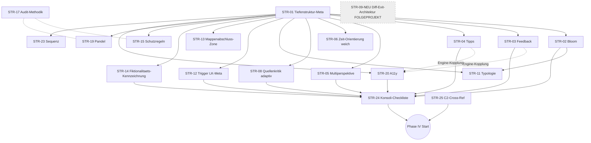

# D15b Optimierungs-Strategien

**Zweck:** Konsolidierte Strategie-Entwuerfe, abgeleitet aus `D15B_IMPLIKATIONS_MATRIX.md` (23 Netto-Cluster, 6 Bundle-Zonen). Jede Strategie = eine kohaerente, committierbare Aenderungs-Einheit.
**Kontext:** `AUSFUEHRUNGSPLAN_D15B_OPTIMIERUNG.md` Phase III.
**Status:** GEFUELLT + EVALUIERT (Phase III, 2026-04-05). 21 aktive Strategien (4 nach User-Evaluation gestrichen: STR-07, STR-10, STR-16, STR-18). STR-09 + STR-14 durch strukturell andere Loesungen ersetzt. STR-09-NEU Differenzierungs-Exit-Architektur als Folgeprojekt ausserhalb Phase IV.

---

## Ausfuell-Regeln

1. **Eine Strategie = eine kohaerente Aenderungs-Einheit.** Wenn zwei Aenderungen unabhaengig umsetzbar/testbar/zurueckrollbar sind, sind es zwei Strategien.
2. **Atom-Unit-Regel (aus Phase II):** Cluster mit E1↔E3-Kopplung werden als **ein** STR gefuehrt. Der Commit enthaelt Vertrag + Subagent + Gueteregel-Katalog **synchron**.
3. **Strategien sind versionier- und committierbar.** Commit-Template: `feat(d15b): STR-XX — <Kurztitel> (adressiert Kxx)`.
4. **Abhaengigkeiten als DAG.** Keine Zyklen. STR-01 ist Meta-Fundament.
5. **Prioritaet P0–P2** entspricht Cluster-Verdikt aus Phase I.
6. **Aufwand** S (< 1h) / M (1–4h) / L (> 4h).

---

## Strategie-Register

| ID | Titel | Prio | Cluster | Ebenen | Aufwand | Wave |
|---|---|---|---|---|---|---|
| STR-01 | Tiefenstruktur-Refactor der 6 Gueteregel-Kataloge | **P0-META** | K13 | E5, E6, E9 | L | 0 |
| STR-02 | Bloom-Tiefe als Pflicht in Aufgaben-Generierung | P0 | K01 | E1, E3, E5 | M | 1 |
| STR-03 | Elaboratives Feedback als Pflicht-Slot | P0 | K02 | E1, E3, E5 | M | 1 |
| STR-04 | 3-stufige Tipp-Struktur mit Haertegraden | P0 | K03 | E1, E3, E5 | M | 1 |
| STR-05 | Multiperspektivitaet-Pflicht bei Konfliktthemen | P0 | K04 | E1, E2, E5 | M | 1 |
| STR-06 | Zeit-Orientierungsgroesse (weich) | P0 | K09 | E1, E5 | S | 2 |
| ~~STR-07~~ | ~~Spatial-Contiguity Layout-Regel~~ | GESTRICHEN | — | — | — | — |
| STR-08 | Quellenkritik als adaptiver Aufgabentyp | P1 | K05 | E1, E3, E5 | L | 1 |
| STR-09 | Differenzierungs-Exit-Architektur (NEU) | FOLGEPROJEKT | K07 | E1, E2, E7 | L | — |
| ~~STR-10~~ | ~~DaZ/Sprachliche Sensibilitaet~~ | AUFGEGANGEN in STR-09 | — | — | — | — |
| STR-11 | Aufgabentypologie-Erweiterung (Vergleich, Begruendung) | P1 | K16 | E1, E3, E5 | M | 1 |
| STR-12 | Trigger-Sensibilitaet-System (Lehrkraft-Metadaten) | P1 | K08 | E2, E6, E8 | S | 2 |
| STR-13 | Mappenabschluss-Zone Reflexion (standardisiert) | P1 | K14 | E2, E4, E5 | S | 2 |
| STR-14 | Fiktionalitaets-Kennzeichnung in Quellenangabe (NEU) | P1 | K34 | E2, E5 | S | 2 |
| STR-15 | R3-Schutzregeln als Regressions-Guard | P1 | K32 | E5, E9 | S | 2 |
| ~~STR-16~~ | ~~Lehrprobe-Tauglichkeits-Check~~ | GESTRICHEN (out of scope) | — | — | — | — |
| STR-17 | Audit-Methodik-Iteration (D15b-Lessons) | P1 | K36 | E9 | M | 6 |
| ~~STR-18~~ | ~~Metakognitions-Prompt-Variante~~ | GESTRICHEN (out of scope) | — | — | — | — |
| STR-19 | Pandel Geschichtsbewusstsein als Audit-Dimension | P2 | K15 | E5, E9 | S | 6 |
| STR-20 | WCAG / A11y-Pass | P2 | K17 | E5, E6, E7, E9 | L | 3 |
| STR-21 | Worked-Example-Variante | P2 | K23 | E3, E5 | S | 7 |
| STR-22 | Synchronisationspunkte Orchestrator | P2 | K22 | E0, E4 | S | 7 |
| STR-23 | Sequenz-Uebergangs-Doku | P2 | K31 | E5, E8 | S | 4 |
| STR-24 | Konsolidierte D15b-Post-Publish-Checkliste | Konsoli | K01-K17 (E6-Anteile) | E6 | M | 5 |
| STR-25 | C2-Cross-Reference + Restposten-Abgleich | Meta | — (prozess) | — | S | vor IV |

**Summe (aktiv Phase IV):** 20 Strategien. P0: 5 (STR-02 bis STR-06). P1: 7 (STR-08, 11, 12, 13, 14, 15, 17). P2: 5 (STR-19, 20, 21, 22, 23). Konsolidierung/Meta: 2 (STR-24, 25). P0-META Fundament: 1 (STR-01).
**Gestrichen nach Evaluation (2026-04-05):** STR-07 (Audit-Fehlannahme), STR-10 (aufgegangen in STR-09-NEU), STR-16 (Lehrprobe out of scope), STR-18 (Metakognition out of scope).
**Folgeprojekt (ausserhalb Phase IV):** STR-09-NEU Differenzierungs-Exit-Architektur.

---

## Strategie-Details

### STR-01 — Tiefenstruktur-Refactor der 6 Gueteregel-Kataloge

**Prioritaet:** P0-META (Fundament, vor allem anderen)
**Adressiert:** K13 (Gueteregeln-Tiefenstruktur)
**Ebenen:** E5, E6, E9
**Dateien:** `docs/checklisten/GUETEKRITERIEN_HEFTEINTRAG_ENTWURF.md`, `…_HEFTEINTRAG_PRODUKT.md`, `GUETEKRITERIEN_AUFGABEN.md`, `GUETEKRITERIEN_SKRIPT.md`, `GUETEKRITERIEN_SEQUENZIERUNG.md`, `QUALITAETSKRITERIEN_MATERIALPRODUKTION.md`

**Ziel:** Alle 6 Kataloge erhalten eine zweischichtige Struktur: (1) **Oberflaechen-Kriterien** (Existenz, Format, Encoding — bisheriges Modell) + (2) **Tiefenstruktur-Kriterien** (didaktische Qualitaet, kognitive Tiefe, Lernwirksamkeit — neu). Tiefenstruktur wird zur **Primaer-Achse**. Ein Artefakt darf Oberflaechen-Checks bestehen und trotzdem am Tiefenstruktur-Check scheitern.

**Aenderung:**
- Jeder Katalog bekommt neuen Kopfabschnitt "Tiefenstruktur vs. Oberflaeche" mit Begriffsdefinition und Durchsetzungs-Regel.
- Bestehende Kriterien werden als "Oberflaeche" markiert; neue Kriterien werden als "Tiefenstruktur" ergaenzt (Platzhalter, werden in STR-02 bis STR-17 befuellt).
- Q-Gate-Reihenfolge: Tiefenstruktur zuerst, Oberflaeche danach (Rueckwaerts-Priorisierung).
- `AUDITBEGRUENDUNG`-Feld in allen Katalogen: bei FAIL muss Pruefer angeben, ob Oberflaeche oder Tiefe betroffen.

**Abhaengigkeiten:** Vor: — . Nach: STR-02, STR-03, STR-04, STR-05, STR-07, STR-08, STR-09, STR-11, STR-15, STR-16, STR-19, STR-20.
**Risiken:** Begriffs-Inflation; Pruefer-Kalibrierung. Gegensteuer: 2-3 Beispiel-Paare (Oberflaeche-PASS / Tiefe-FAIL) pro Katalog.
**Validierung:** Manuell — jede der bisherigen 6 Kataloge-Dateien hat nach dem Patch einen Tiefenstruktur-Abschnitt mit mind. 2 Beispielen.
**Aufwand:** L

---

### STR-02 — Bloom-Tiefe als Pflicht in Aufgaben-Generierung [ATOM-UNIT]

**Prioritaet:** P0
**Adressiert:** K01 (Cognitive Depth / Bloom-Verteilung)
**Ebenen:** E1, E3, E5
**Dateien:** `docs/architektur/vertraege/VERTRAG_PHASE_2-2b_AUFGABE.md`, `docs/agents/SUB_AUFGABE_MC.md`, `…_FREITEXT.md`, `…_LUECKENTEXT.md`, `…_REIHENFOLGE.md`, `…_ZUORDNUNG.md`, `docs/checklisten/GUETEKRITERIEN_AUFGABEN.md`

**Ziel:** Pro Mappe muss eine vorgeschriebene Bloom-Verteilung erreicht werden (Richtwert: max. 40% Level 1-2, mind. 30% Level 3-4, mind. 20% Level 5-6). Jeder SUB_AUFGABE-Output deklariert `_meta.bloom_level` explizit. Der Progressionsplan validiert die Verteilung.

**Aenderung:**
- `VERTRAG_PHASE_2-2b`: `bloom_level` Pflichtfeld, `bloom_verteilung_policy` als Rahmen-Constraint.
- SUB_AUFGABE_*: Prompt-Instruktion zur Bloom-Einstufung + Selbst-Validierung.
- `GUETEKRITERIEN_AUFGABEN.md`: neue A19 "Bloom-Verteilung erfuellt Policy" als Tiefenstruktur-Kriterium.
- Automatisierter Check: Python-Validator `validate_bloom_distribution(progressionsplan.json)`.

**Abhaengigkeiten:** Vor: STR-01. Nach: STR-24.
**Risiken:** Bloom-Level-Einstufung subjektiv — Beispiel-Matrix beilegen. ATOM-UNIT: Vertrag + Subagent + Katalog MUESSEN im selben Commit.
**Validierung:** Mappe-4-Re-Audit-Spot: Progressionsplan erfuellt Bloom-Policy. Automatisierter Validator-Lauf.
**Aufwand:** M

---

### STR-03 — Elaboratives Feedback als Pflicht-Slot [ATOM-UNIT]

**Prioritaet:** P0
**Adressiert:** K02 (Feedback-Hattie)
**Ebenen:** E1, E3, E5 (Engine-Teil in STR-07-Rahmen oder separater Patch)
**Dateien:** `VERTRAG_PHASE_2-2b_AUFGABE.md`, 5 SUB_AUFGABE_*, `GUETEKRITERIEN_AUFGABEN.md`, `assets/js/escape-engine.js` (Rendering)

**Ziel:** Feedback-Field ist nicht mehr `string`, sondern Objekt: `{ korrekt: <Bestaetigung + kurze Vertiefung>, falsch_generic: <Konstruktive Hinweise>, falsch_spezifisch: { <antwort_id>: <distraktor-spezifisch> }, task_feedback: <nach Abschluss: Transfer-Impuls> }`. Mindest-Quote: 80% elaboratives Feedback (Hattie d>0.70 Zielbereich), nicht mehr nur "richtig/falsch".

**Aenderung:**
- `VERTRAG_2-2b`: Feedback-Schema-Umbau (Breaking Change, Mappen 1-4 bleiben legacy-kompatibel durch optionales altes string-Format, neue Mappen MUSS Objekt).
- SUB_AUFGABE_*: Prompt-Erweiterung "generiere alle 4 Feedback-Slots".
- A-Katalog: A20 "Feedback ist elaborativ" als Tiefenstruktur-Kriterium.
- Engine-Patch: Feedback-Slot-Rendering erkennt Objekt-Form. **Kopplung zu Wave 3 (Engine-Session)**.

**Abhaengigkeiten:** Vor: STR-01. Eng gekoppelt: Engine-Patch Wave 3 (kann parallel laufen, aber Mappe-5 braucht beide).
**Risiken:** Legacy-Mappen 1-4 duerfen nicht brechen — Engine muss beide Schemas rendern koennen.
**Validierung:** Mappe-4-Re-Audit: alle neuen Aufgaben haben Feedback-Objekte; Browser-Check Engine rendert korrekt.
**Aufwand:** M

---

### STR-04 — 3-stufige Tipp-Struktur mit Haertegraden [ATOM-UNIT]

**Prioritaet:** P0
**Adressiert:** K03 (Tipp-Haertegrade)
**Ebenen:** E1, E3, E5 (Engine-Teil in Wave 3)
**Dateien:** `VERTRAG_2-2b`, 5 SUB_AUFGABE_*, `GUETEKRITERIEN_AUFGABEN.md`, Engine (Wave 3)

**Ziel:** Jede Aufgabe hat 3 Tipps mit strikt abgestuften Haertegraden: **T1 kognitiv-aktivierend** ("Was weisst du ueber X?"), **T2 strukturierend** ("Schau dir Material Y an, besonders Z."), **T3 heuristisch** ("Vergleiche A und B."). **T3 darf die Loesung NICHT vorwegnehmen.** Ein Regelpruefer erkennt Tipp-Leaks.

**Aenderung:**
- VERTRAG: `tipps: [{stufe: 1|2|3, haertegrad: "kognitiv"|"strukturierend"|"heuristisch", text: string}]`.
- SUB_AUFGABE_*: Prompt-Erweiterung mit 3 Haertegrad-Beispielen + Anti-Beispiel (Leak).
- A-Katalog: A21 "Tipp-Haertegrade strikt, kein Leak" als Tiefenstruktur-Kriterium.
- Engine (Wave 3): gestaffeltes UI (Stufen klickbar, nicht alle auf einmal).

**Abhaengigkeiten:** Vor: STR-01. Gekoppelt mit Wave 3 Engine-Patch STR-04-ENG.
**Risiken:** Haertegrad-Einstufung subjektiv — Beispielmatrix im SUB_AUFGABE-Prompt.
**Validierung:** Re-Audit: Mappe-4-Tipps werden neu erzeugt, kein T3 enthaelt die Loesung verbatim.
**Aufwand:** M

---

### STR-05 — Multiperspektivitaet-Pflicht bei Konfliktthemen

**Prioritaet:** P0
**Adressiert:** K04 (Multiperspektivitaet)
**Ebenen:** E1, E2, E5, E6
**Dateien:** `VERTRAG_PHASE_2-1_MATERIAL.md`, SUB_MATERIAL_QUELLENTEXT/TAGEBUCH/BILDQUELLE, `QUALITAETSKRITERIEN_MATERIALPRODUKTION.md`, `GUETEKRITERIEN_SKRIPT.md`, Checkliste

**Ziel:** Konflikt-Themen (Krieg, Revolution, gesellschaftl. Auseinandersetzung) werden im Material-Vertrag als `konflikttyp: true` flagbar. Bei true: mind. 3 Perspektiven (z.B. Deutschland/Frankreich/neutral; oben/unten; taeter/opfer/beobachter). Keine einseitige Nationalperspektive.

**Aenderung:**
- VERTRAG_2-1: neues Flag `konflikttyp` + `perspektiven_policy`.
- SUB_MATERIAL_*: Prompt "bei konflikttyp=true, Quellen aus mind. 3 Perspektiven".
- M-Katalog: M13 "Multiperspektivitaet bei Konflikt-Themen" (Tiefenstruktur).
- SK-Katalog: Skript-Check auf Perspektiven-Diversitaet.
- Checkliste: Perspektiven-Audit als Pre-Publish-Punkt (in STR-24 gebuendelt).

**Abhaengigkeiten:** Vor: STR-01. Nach: STR-24.
**Risiken:** Quellenknappheit bei manchen Themen — Fallback: Sekundaer-Perspektive als Lehrer-Input.
**Validierung:** Mappe-4-Re-Audit (R1 Geschichtsdidaktik): Multiperspektivitaet messbar verbessert.
**Aufwand:** M

---

### STR-06 — Zeit-Orientierungsgroesse (weich)

**Prioritaet:** P0
**Adressiert:** K09 (Zeit-Realismus)
**Ebenen:** E1, E5 (weich)
**Dateien:** `VERTRAG_PHASE_2-0_RAHMEN.md`, `GUETEKRITERIEN_SKRIPT.md`

**Ziel (abgeschwaecht nach Evaluation 2026-04-05):** Im Rahmen-Vertrag wird eine **weiche Orientierungsgroesse** verankert: "1 Mappe ≈ 1 Unterrichts-Einheit (45 Min) bearbeitbar". Keine harten Zeitbudgets pro Station, keine OTL-Schaetzung, keine Doppelstunden-Ablaufplaene, kein Pre-Publish-Zeit-Audit. Der Wert ist Leitplanke fuer die Generierung, nicht Gate.

**Aenderung:**
- VERTRAG_2-0: neues weiches Feld `zeit-orientierung: "1 UE"` als Hinweis an alle nachfolgenden Phasen zum Dimensionieren des Material-/Aufgaben-Umfangs.
- SK-Katalog: Kurz-Notiz unter Tiefenstruktur "Umfang plausibel auf 1 UE dimensioniert" (nicht als BLOCKER-Kriterium).

**Abweichung zur Urfassung:** Die urspruenglich geplanten Elemente (Zeitbudget-Deklaration pro Station, OTL-Schaetzung, Pre-Publish-Zeit-Audit, E8-Doppelstunden-Ablaufplan) werden **gestrichen**. Begruendung User: zu starres Gate fuer iterativ korrigierbare Groesse. Der Mappe-4-R5-Befund (82 Min real) bleibt als Lessons-Learned im Audit-Register, erzeugt aber kein hartes Kontroll-Artefakt.

**Abhaengigkeiten:** Vor: STR-01.
**Risiken:** gering (weiche Leitplanke).
**Validierung:** Mappe-5-Generierung orientiert sich sichtbar an 1 UE.
**Aufwand:** S

---

### STR-07 — ~~Spatial-Contiguity Layout-Regel~~ GESTRICHEN

**Status:** GESTRICHEN nach User-Evaluation 2026-04-05.
**Begruendung:** Das aktuelle Spalten-Layout erfuellt Spatial-Contiguity bereits. Es existieren keine Mobile-Probleme. Der urspruengliche R4-Split-Attention-Befund (BLOCKER) entstand aus einer Fehlannahme im D15b-Audit-Prozess (R4 Instructional Design stuetzte sich auf eine inkorrekte Layout-Rekonstruktion). Keine Infrastruktur-Aenderung notwendig.
**Folge fuer Audit-Methodik:** Hinweis in STR-17 (Audit-Methodik-Iteration): R4-Rollen-Subagent benoetigt in v2 einen expliziten Schritt zur Verifikation der Layout-Rekonstruktion (Screenshot-Check + Text-Beschreibung) bevor Split-Attention als BLOCKER klassifiziert wird.

---

### STR-08 — Quellenkritik als adaptiver Aufgabentyp [ATOM-UNIT]

**Prioritaet:** P1
**Adressiert:** K05 (Quellenkritik)
**Ebenen:** E1, E3, E5
**Dateien:** `VERTRAG_2-2b`, neu: `SUB_AUFGABE_QUELLENKRITIK.md`, `GUETEKRITERIEN_AUFGABEN.md`, Progressionsplan-Agent (Phase 2-2a)

**Ziel (umformuliert nach Evaluation 2026-04-05):** Quellenkritik ist ein **adaptiver, verfuegbarer** Aufgaben-Subtyp mit W-Fragen-Struktur (wer, wann, wo, warum, woher, wozu). Der **Progressionsplan-Agent (Phase 2-2a) entscheidet sinngerichtet**, wann Quellenkritik sinnvoll ist — keine starre Pflicht bei jeder Primaerquelle. Anti-Automatismus-Klausel: Quellenkritik wird getriggert durch didaktische Passung, nicht durch mechanische Quelltyp-Detektion.

**Aenderung:**
- Neuer Subagent `SUB_AUFGABE_QUELLENKRITIK` mit schlankem W-Fragen-Template.
- VERTRAG: `aufgaben_typ: "quellenkritik"` wird verfuegbar, ist aber nicht automatisch bei Primaerquellen Pflicht.
- Progressionsplan-Agent (Phase 2-2a): Entscheidungs-Regel "wenn Material Primaerquelle + didaktisches Ziel Quellen-Reflexion beinhaltet → Quellenkritik-Aufgabe vorsehen".
- A-Katalog: A22 "Quellenkritik sinngerichtet eingesetzt" (Tiefenstruktur, kein starres Quotenkriterium).

**ATOM-UNIT:** Vertrag + neuer Subagent + A-Katalog-Eintrag im selben Commit.

**Abhaengigkeiten:** Vor: STR-01. Parallel zu STR-02/03/04.
**Risiken:** Progressionsplan-Agent muss Entscheidungsregel sauber anwenden — Beispiel-Matrix in Agent-Prompt.
**Validierung:** Mappe-5-Spot: Primaerquellen mit Quellen-Reflexionsziel erhalten Quellenkritik, andere nicht.
**Aufwand:** L

---

### STR-09 (NEU) — Differenzierungs-Exit-Architektur [FOLGEPROJEKT]

**Prioritaet:** FOLGEPROJEKT ausserhalb Phase IV. Umsetzung nach hinreichender Stabilitaet der Kerninfrastruktur.
**Adressiert:** K07 (Differenzierung), K06 (DaZ/Sprach-Niveau — aufgegangen in dieser Strategie)
**Ebenen:** E1 (Vertrag um Exit-Hooks), E2 (Material-Metadaten fuer Glossar-Terme), E7 (Engine-Komponenten)
**Dateien:** spaetere Konkretisierung — nicht in Phase IV. Quelle: `docs/analyse/Ideen zu Differenzierung.md`.

**Kern-Idee (User-Konzept):**
- **Sprachliche Differenzierung via Hover-Glossar:** Fachbegriffe und schwierige Worte im Material werden beim Hovern mit schuelernahen Kurz-Erklaerungen eingeblendet.
- **Globale Sprachumstellung des Games:** zentraler Header-Button zur Umschaltung der Game-Sprache (Forschungsfrage offen: nur Materialspalte oder auch Fragebogen? Best-Practice der sprachuebergreifenden Bildung pruefen).
- **Differenzierung nach unten / nach oben via Clipboard-KI-Prompts:** Buttons an kontextspezifischen Stellen in der Materialspalte kopieren vorgefertigte, rollengepimte KI-Prompts ins Clipboard. SuS fuehren den Prompt beim beliebigen KI-Anbieter aus. Prompts mit Rollenpriming als Lernbegleiter, Folgefragen-Anregung, niedrigschwellige Interaktion.
  - **Nach unten:** kleinschrittigere, schuelernahe Erklaerung des Materials/Sachverhalts.
  - **Nach oben:** Hintergrund, Nachfragen, Anknuepfen an Interesse, konstruktivistische Lernprozesse.

**Status:** Konzept. **KEINE Umsetzung in Phase IV Waves.** Einplanung als eigenes Folgeprojekt nach hinreichender Stabilitaet der Kerninfrastruktur (Waves 0-6).

**Konsequenz fuer die urspruengliche STR-09 (Tracks A/B/C) und STR-10 (DaZ-Glossar-System):**
- Beide Urfassungen **entfallen**. Tracks A/B/C werden nicht umgesetzt (hoher Content-Aufwand, strukturell fragwuerdige Loesung). Das DaZ-Glossar geht in der Hover-Idee der Exit-Architektur auf und wird nicht als eigener E8-Lehrkraft-Workflow realisiert.
- Das DaZ-Glossar-Template (E8) entfaellt.

**Offene Punkte fuer Folgeprojekt-Start:**
1. Engine-Design Hover-Komponente (Accessibility, Touch-Verhalten).
2. Prompt-Katalog: 3-5 generische Prompt-Templates + Platzhalter fuer kontextspezifische Ergaenzung.
3. Trigger-Entscheidung: wo in Materialspalte werden Exit-Buttons platziert (heuristisch vs. annotiert).
4. Sprachumstellung-Scope-Entscheidung.

**Abhaengigkeiten:** Keine fuer Phase IV. Eingabeleistung: Kerninfrastruktur stabil (mindestens Waves 0-3 abgeschlossen + Mappe 5 mit neuer Infrastruktur produziert).

---

### STR-10 — ~~DaZ / Sprachliche Sensibilitaet~~ AUFGEGANGEN

**Status:** AUFGEGANGEN in STR-09-NEU (Hover-Glossar). Urspruenglicher Scope (Inline-Tagging, Engine-Tooltip, DaZ-Lehrkraft-Template) deckt sich weitgehend mit der Hover-Komponente der Exit-Architektur. Keine separate Strategie mehr.
**Konsequenz:** Phase IV enthaelt kein DaZ-System. Die M-Katalog-Ebene kann spaeter im Rahmen von STR-09-NEU ergaenzt werden.

---

### STR-11 — Aufgabentypologie-Erweiterung [ATOM-UNIT]

**Prioritaet:** P1
**Adressiert:** K16 (Aufgabentypologie)
**Ebenen:** E1, E3, E5
**Dateien:** `VERTRAG_2-2b`, neue SUB_AUFGABE_VERGLEICH.md, SUB_AUFGABE_BEGRUENDUNG.md (oder als FREITEXT-Varianten), A-Katalog

**Ziel:** Zwei neue Aufgaben-Subtypen werden **verfuegbar gemacht**: **Vergleich** (systematisch 2-3 Objekte gegenueberstellen, Strukturraster) und **Begruendung** (Claim-Evidence-Reasoning). Adressiert die Bloom-Luecke (K01) durch Typen, die von sich aus Level 4-5 erfordern. **Anti-Quota-Klausel:** kein starres "mind. X Typen pro Mappe"-Kriterium. Der Progressionsplan-Agent (Phase 2-2a) waehlt Subtypen **sinngerichtet** entlang didaktischer Zielsetzung.

**Aenderung:**
- VERTRAG: 2 neue `aufgaben_typ`-Werte.
- 2 neue SUB_AUFGABE-Prompts oder FREITEXT-Variante mit strukturierter Output-Regel.
- A-Katalog: Typologie-Erweiterung dokumentiert mit expliziter **Anti-Template-Rule**: "kein Quotenkriterium mind. X Typen pro Mappe; Progressionsplan waehlt sinngerichtet".
- Progressionsplan-Agent: Auswahl-Heuristik erweitert um Vergleich/Begruendung.

**ATOM-UNIT:** Vertrag + Subagent/FREITEXT-Variante + A-Katalog im selben Commit.

**Abhaengigkeiten:** Vor: STR-01. Synergetisch mit STR-02 (Bloom) — nicht quotiert, sondern als zusaetzliche Hebel fuer Bloom-Tiefe.
**Risiken:** Subagent-Proliferation — zuerst als FREITEXT-Varianten, eigene Subagenten bei Bedarf nach Mappe-5.
**Validierung:** Mappe-5 — Progressionsplan zeigt, dass mind. einer der beiden Typen didaktisch sinnvoll eingesetzt wurde (nicht quotenbasiert).
**Aufwand:** M

---

### STR-12 — Trigger-Sensibilitaet-System

**Prioritaet:** P1
**Adressiert:** K08 (Trigger)
**Ebenen:** E2, E6, E8
**Dateien:** SUB_MATERIAL_*, Checkliste, neu: `lehrkraft/trigger-leitfaden.md`

**Ziel:** Materialien mit Triggerpotenzial (Gewalt, Krieg, Tod, Diskriminierung) werden mit `trigger_flags: [gewalt, tod, ...]` als **Lehrkraft-Metadaten** markiert. Checkliste verlangt Trigger-Check vor Publikation. Lehrkraft erhaelt Leitfaden zur Vorbereitung + Handhabung (Opt-Out, Gespraechs-Prompts).

**Sichtbarkeits-Constraint (Evaluation 2026-04-05):** `trigger_flags` sind **ausschliesslich Lehrkraft-Metadaten**. Sie sind **NIE SuS-sichtbar**. Im Schauseiten-Rendering (Engine) werden die Flags unterdrueckt. Der Orchestrator/Assembly-Schritt muss sicherstellen, dass Trigger-Metadaten nur in Lehrkraft-Pfaden (Leitfaden, Pre-Publish-Checkliste) auftauchen.

**Aenderung:**
- SUB_MATERIAL: Metadaten-Feld `trigger_flags` (Lehrkraft-Scope, nicht im oeffentlichen JSON-Export).
- Engine: expliziter Unterdrueckungs-Check beim Rendern von Material-Metadaten.
- Checkliste: Trigger-Spot (in STR-24).
- E8: Leitfaden-Template.

**Abhaengigkeiten:** Vor: STR-01.
**Risiken:** Over-Flagging macht Flag bedeutungslos — Kriterien strikt: was ist Trigger, was nicht.
**Validierung:** Re-Audit R2 (Kilic, Trigger-Sensibilitaet): Luecke geschlossen.
**Aufwand:** S

---

### STR-13 — Mappenabschluss-Zone Reflexion (standardisiert, Variante a)

**Prioritaet:** P1
**Adressiert:** K14 (Reflexion) + Aufraeum-Auftrag Mappenabschlussbereich
**Ebenen:** E2 (Material/Zone-Metadaten), E4 (Assembly/Orchestrator), E5 (HE-Katalog Abgrenzung)
**Dateien:** Assembly-Skript/Orchestrator, `data.json`-Schema, neues Sub-Template `mappenabschluss-zone.md`, `GUETEKRITERIEN_HEFTEINTRAG_*.md` (Abgrenzungs-Notiz)

**Ziel (umgebaut nach Evaluation 2026-04-05):** Die Reflexion wird **aus dem Hefteintrag herausgezogen**. Der Hefteintrag bleibt **reine Wissenssicherung**. Unterhalb des Hefteintrags entsteht eine neue **statische Mappenabschluss-Zone** als fixes, standardisiertes Template mit zwei Elementen: (1) 1-2 Reflexions-Frage(n), (2) Ueberleitungssatz zur naechsten Mappe.

**Aenderung:**
- Neuer Abschnitt in `data.json` / Assembly-Output: `mappenabschluss_zone { reflexion_fragen: [...], ueberleitungssatz: "..." }`.
- Kleiner **Sub-Task im Assembly-Schritt**, der diese Zone aus fixem Template befuellt (ggf. mit minimaler KI-Unterstuetzung fuer die Ueberleitung).
- HE-Katalog: Abgrenzungs-Notiz "Hefteintrag = Wissenssicherung; Reflexion gehoert NICHT in den Hefteintrag, sondern in die Mappenabschluss-Zone".
- **Aufraeum-Auftrag Mappe 4:** Der aktuelle Mappenabschlussbereich in Mappe 4 ist durch Relikte frueherer Architekturentscheidungen chaotisch. Er wird im Zuge dieser Strategie **praezise aufgeraeumt und standardisiert** — alte Elemente entfernen, neues Template einsetzen.

**Abhaengigkeiten:** Vor: STR-01. Auswirkung auf Assembly-Schritt.
**Risiken:** Floskelhafte Reflexionsfragen — Template-Bank mit 5-8 generischen Fragen, aus der situativ gewaehlt wird.
**Validierung:** Mappe 4 aufgeraeumt und auf neues Template umgestellt; Mappe 5 laeuft direkt mit neuem Schema.
**Aufwand:** S (+ einmaliger Mappe-4-Cleanup)

---

### STR-14 (NEU) — Fiktionalitaets-Kennzeichnung in Quellenangabe

**Prioritaet:** P1
**Adressiert:** K34 (Personalisierung: R1 kritisch vs. R3 positiv, Dissens-Aufloesung)
**Ebenen:** E2 (Material), E5 (M-Katalog)
**Dateien:** `SUB_MATERIAL_TAGEBUCH.md`, `SUB_MATERIAL_QUELLENTEXT.md`, `QUALITAETSKRITERIEN_MATERIALPRODUKTION.md`

**Ziel (umgebaut nach Evaluation 2026-04-05):** Personalisierung (Ich-Erzaehler, Identifikationsfiguren wie Friedrich-Tagebuch) bleibt als didaktisches Werkzeug erhalten. Die R1-Kritik (epistemologische Probleme) wird **nicht** durch eine zusaetzliche Meta-Reflexions-Aufgabe aufgeloest (User-Bewertung: "Overhead + Verwirrung"), sondern durch eine **explizite Fiktionalitaets-Kennzeichnung in der Quellenangabe selbst**.

**Aenderung:**
- SUB_MATERIAL_TAGEBUCH und SUB_MATERIAL_QUELLENTEXT: Quellenangabe-Template wird erweitert um ein **Fiktionalitaets-Feld**: wenn das Material fiktional/rekonstruiert/gekuerzt/zusammengesetzt ist, wird das in der Quellenangabe **direkt am Material** klar benannt — inklusive **Abweichungs-Muster** (z.B. "fiktives Tagebuch, basierend auf typischen Erfahrungsberichten junger Soldaten 1914", "gekuerzt und sprachlich vereinfacht", "aus mehreren Originalquellen zusammengesetzt").
- M-Katalog: M15 "Fiktionalitaets-Status in Quellenangabe explizit gekennzeichnet" (Tiefenstruktur).
- **Keine Meta-Reflexions-Aufgabe wird generiert.** Keine Aenderung an SUB_AUFGABE_*.

**Abhaengigkeiten:** Vor: STR-01.
**Risiken:** Kennzeichnung muss wahrnehmbar ohne belehrend zu wirken — Formulierungsbeispiele in M-Katalog.
**Validierung:** Mappe-4-Friedrich-Tagebuch: Quellenangabe enthaelt explizite Fiktionalitaets-Kennzeichnung; R1-Kritik adressiert ohne zusaetzliche Aufgaben-Last.
**Aufwand:** S

---

### STR-15 — R3-Schutzregeln als Regressions-Guard

**Prioritaet:** P1
**Adressiert:** K32 (R3 Staerken, Do-not-break)
**Ebenen:** E5, E9
**Dateien:** Alle 6 Gueteregel-Kataloge, Audit-Workflow-Doku

**Ziel:** Die 4 positiven R3-Staerken (niedrigschwelliger Einstieg, starke Identifikationsfiguren, visuelle Klarheit, emotionale Ansprache) werden in allen Katalogen als **"Do-not-break"-Schutzregeln** markiert. Ein spaeterer Patch darf diese Qualitaeten nicht kippen.

**Aenderung:**
- Jeder Katalog: neuer Abschnitt "Schutzregeln" mit 4 Eintraegen + Pruefregel.
- Audit-Workflow: Regressions-Check-Schritt "Pruefe Schutzregeln" vor jedem Re-Audit-Abschluss.

**Abhaengigkeiten:** Vor: STR-01. Wird in jedem Re-Audit (Phase V) aktiv.
**Risiken:** Schutzregel-Inflation — strikt auf 4 begrenzt.
**Validierung:** Re-Audit-Checkliste hat Schutzregeln-Spot.
**Aufwand:** S

---

### STR-16 — ~~Lehrprobe-Tauglichkeits-Check~~ GESTRICHEN

**Status:** GESTRICHEN nach User-Evaluation 2026-04-05.
**Begruendung:** Lehrprobe-Tauglichkeit ist ein **Effekt guter Planung**, kein **Kriterium** der Infrastruktur. Das Game ist Material; die Einbettung in eine Lehrprobe ist Lehrer-Aufgabe und liegt ausserhalb des Infrastruktur-Scopes. Der R5-Befund wird im Arbeitsprotokoll als "out of infrastructure scope" vermerkt, nicht als Gueteregel kodifiziert.

---

### STR-17 — Audit-Methodik-Iteration (D15b-Lessons)

**Prioritaet:** P1
**Adressiert:** K36 (Audit-Methodik)
**Ebenen:** E9
**Dateien:** `docs/analyse/D15b-Methodik-Doku.md` (neu), Audit-Workflow-Template

**Ziel:** D15b-Methodik (Evidenz-Bundle / 6 isolierte Rollen-Subagenten / Synthese-Agent / Konvergenz-Klassen A-F) wird als wiederverwendbarer Workflow dokumentiert. Lessons aus D15b: Text-Primat ueber Screenshots, Rollen-Isolation, Inter-Rater-Reliability gewichtet.

**Aenderung:**
- Neue Methodik-Doku: Template, Rollen-Charta-Muster, Subagent-Prompts, Konvergenz-Klassifikation.

**Abhaengigkeiten:** —  . Kann parallel laufen.
**Risiken:** Nur 1 Anwendungsfall (D15b) — als "v1" kennzeichnen, Iteration nach Mappe-5-Audit.
**Validierung:** Methodik-Doku existiert und wird in Phase V (Re-Audit) angewendet.
**Aufwand:** M

---

### STR-18 — ~~Metakognitions-Prompt-Variante~~ GESTRICHEN

**Status:** GESTRICHEN nach User-Evaluation 2026-04-05.
**Begruendung:** Metakognitions-Moderation ist Lehrer-Aufgabe und liegt ausserhalb des Infrastruktur-Scopes. Keine Kodifikation als Aufgaben-Subtyp.

---

### STR-19 — Pandel Geschichtsbewusstsein als Audit-Dimension

**Prioritaet:** P2
**Adressiert:** K15 (Pandel)
**Ebenen:** E5, E9
**Dateien:** `GUETEKRITERIEN_SKRIPT.md`, Methodik-Doku

**Ziel:** Pandels 7 Dimensionen (Zeit, Wirklichkeit, Historizitaet, Identitaet, politisch, oekonomisch, moralisch) werden als SK-Audit-Achse eingefuehrt. Ziel: mind. 4/7 Dimensionen pro Mappe adressiert.

**Aufwand:** S. Abhaengigkeiten: Vor STR-01. Wave 6.

---

### STR-20 — WCAG / A11y-Pass

**Prioritaet:** P2
**Adressiert:** K17 (A11y)
**Ebenen:** E5, E6, E7, E9
**Dateien:** HE/M-Kataloge, Checkliste, `escape-engine.js`, `theme-gpg.css`, accessibility-compliance Plugin

**Ziel:** WCAG 2.1 AA-Konformitaet: Kontrast-Ratios, Touch-Target-Groesse (>44px), ARIA-Labels fuer interaktive Elemente, Tastatur-Navigation. Integration des `accessibility-compliance` Plugins in Audit-Workflow.

**Aenderung:**
- Kataloge: A11y-Referenzen.
- Engine: CSS-Kontrast-Fixes, Touch-Target-Minimum, ARIA.
- Checkliste: A11y-Audit.
- Plugin-Integration: automatisierter Lauf nach jedem Engine-Patch.

**Aufwand:** L. Abhaengigkeiten: Vor STR-01. Wave 3.

---

### STR-21 — Worked-Example-Variante

**Prioritaet:** P2
**Adressiert:** K23 (Worked Examples)
**Ebenen:** E3, E5
**Dateien:** SUB_AUFGABE-Erweiterung, A-Katalog

**Ziel:** Bei komplexen Aufgaben-Typen (Quellenkritik, Begruendung) wird eine Worked-Example-Variante als Scaffolding angeboten — komplette Loesungs-Demonstration fuer ein verwandtes Beispiel.

**Aufwand:** S. Abhaengigkeiten: Vor STR-01, optional nach STR-08 + STR-11. Wave 7.

---

### STR-22 — Synchronisationspunkte Orchestrator

**Prioritaet:** P2
**Adressiert:** K22 (Sync-Punkte)
**Ebenen:** E0, E4
**Dateien:** `WORKFLOW_v4.md`, `ORCHESTRATOR.md`

**Ziel:** Zwischen Phase 2-1 / 2-2a / 2-2b / 3 gibt es explizite Sync-Gates (Progressionsplan-Konsistenz, Material-Aufgaben-Mapping). Aktuell implizit.

**Aufwand:** S. Abhaengigkeiten: —. Wave 7.

---

### STR-23 — Sequenz-Uebergangs-Doku

**Prioritaet:** P2
**Adressiert:** K31 (Sequenz-Uebergeleitung)
**Ebenen:** E5, E8
**Dateien:** `GUETEKRITERIEN_SEQUENZIERUNG.md`, neu: `lehrkraft/sequenz-uebergang.md`

**Ziel:** Zwischen Mappen der gleichen Sequenz (z.B. Mappe 3 → Mappe 4 Erster Weltkrieg) gibt es dokumentierte Brueckenelemente: Was wissen die SuS? Was ist neu? Wie schliesst man an?

**Aufwand:** S. Abhaengigkeiten: Vor STR-01. Wave 4.

---

### STR-24 — Konsolidierte D15b-Post-Publish-Checkliste

**Prioritaet:** Konsolidierung
**Adressiert:** E6-Anteile aus STR-01..STR-16, STR-20
**Ebenen:** E6
**Dateien:** `docs/checklisten/CHECKLISTE_D15B_POST_PUBLISH.md` (neu)

**Ziel:** Anstelle von 9 separaten Checklisten eine konsolidierte Pre-Publikations-Checkliste mit allen Spots: Bloom / Feedback / Tipps / Multiperspektivitaet / Quellenkritik / Trigger / A11y / Fiktionalitaets-Kennzeichnung / Mappenabschluss-Zone. (Gestrichen gegenueber Urfassung: Zeit-Audit, Layout, Differenzierung, DaZ, Lehrprobe.) Strukturiert nach Tiefenstruktur-Primaer und Oberflaeche-Sekundaer.

**Aenderung:**
- Neue Datei mit allen Spots als Liste + Kurz-Referenz auf Katalog-Eintrag.

**Verhaeltnis zu E5 Gueteregel-Katalogen:** STR-24 **ersetzt die Kataloge nicht**. Die 6 Gueteregel-Kataloge bleiben die **prozess-immanente Qualifikation der Teilschritte** (Phase 2-0, 2-1, 2-2a, 2-2b, 3 — jeder Subagent/Assembly-Schritt prueft gegen "seinen" Katalog). STR-24 ist ein **komplementaeres Pre-Publish-Q-Gate auf Mappen-Ebene**, das quer ueber alle Ebenen-Outputs laeuft, nachdem die Kataloge schon gegriffen haben. Zweck: Fang-Netz fuer cross-Ebenen-Konsistenzen (z.B. Feedback-Schema konsistent mit Engine-Rendering) und fuer Kriterien, die erst auf Mappen-Ebene sichtbar werden (z.B. Bloom-Verteilung ueber alle Aufgaben hinweg).

**Abhaengigkeiten:** Nach: alle STR aus Wave 0-3. Sammelt deren E6-Anteile.
**Risiken:** Checklisten-Laenge — max. 30 Spots, gruppiert.
**Validierung:** Mappe-5-Pre-Publish-Lauf mit dieser Checkliste.
**Aufwand:** M

---

### STR-25 — C2-Cross-Reference + Restposten-Abgleich

**Prioritaet:** Meta (vor Phase IV Start)
**Adressiert:** Prozess-Schnittstelle C2 ↔ D15b
**Ebenen:** —
**Dateien:** `docs/analyse/C2_EVALUATION_MAPPE4.md` (lesen), neu: `docs/projekt/C2_D15B_CROSS_REFERENCE.md`

**Ziel:** Vor Beginn Phase IV Umsetzung: jeden offenen C2-Finding (3 MEDIUM + 9 LOW + IL-2/IL-3/IL-5) pruefen, ob durch ein D15b-Cluster/STR bereits mit-abgedeckt. Treffer werden im Cross-Reference-Dokument markiert. Nicht abgedeckte C2-Rest-Findings werden als separater C2-Restposten-Track vor oder parallel zu D15b Phase IV abgearbeitet — keine Register-Merge, keine Cluster-Neu-Berechnung.

**Aenderung:**
- Cross-Reference-Dokument mit Tabelle: C2-Finding-ID | Status | D15b-Abdeckung (STR-XX oder "uncovered") | Folge-Aktion.
- STATUS-Update: C2-Restposten-Track sichtbar machen.

**Abhaengigkeiten:** Vor: Phase IV Start. Nach: Phase III (dieses Dokument).
**Risiken:** Drift zwischen beiden Registern — Cross-Reference ist Einweg-Lookup, nicht Merge.
**Validierung:** Tabelle vollstaendig, jeder C2-Finding hat eindeutige Zuordnung.
**Aufwand:** S

---

## Abhaengigkeits-Graph (DAG)

---

## Execution-Waves (Session-Schnitt)

Umsetzungs-Reihenfolge in Phase IV. Jede Wave = 1-2 Cowork-Sessions. **Nach Evaluation 2026-04-05 geschrumpft: 20 aktive STR statt 25.**

| Wave | Inhalt | STRs | Est. Sessions | Abhaengigkeit |
|---|---|---|---|---|
| **0 Fundament** | Tiefenstruktur-Meta | STR-01 | 1 | — |
| **1 E1+E3 Atom-Units** | Bloom, Feedback, Tipps, Multiperspektive, Quellenkritik adaptiv, Typologie | STR-02, 03, 04, 05, 08, 11 | 2 | Wave 0 |
| **2 E2/E5 Material-Querschnitt** | Zeit-Orientierung weich, Trigger LK-Meta, Mappenabschluss-Zone, Fiktionalitaets-Kennzeichnung, Schutzregeln | STR-06, 12, 13, 14, 15 | 1 | Wave 0 |
| **3 Engine-Session** | Feedback-Rendering, Tipp-UI, A11y | STR-03 (Eng), 04 (Eng), 20 | 1 | Wave 1 (kann parallel starten nach Vertrags-Commits) |
| **4 Lehrkraft-Dokumente** | Trigger-Leitfaden, Sequenz-Uebergang, Mappe-4-Cleanup (STR-13) | STR-12 (E8), 23, 13-Cleanup | 0.5-1 | Wave 1+2 |
| **5 E6-Konsolidierung** | Post-Publish-Checkliste | STR-24 | 1 | Wave 0-4 |
| **6 Audit-Methodik** | D15b-Methodik-Doku, Pandel | STR-17, 19 | 1 | — (parallel) |
| **7 P2-Nachschub** | Worked Examples, Sync-Punkte | STR-21, 22 | 0.5 | Wave 0-1 |
| **Cross-Ref vor IV** | C2-Abgleich | STR-25 | 0.5 | — (vor Wave 0) |

**Summe Est.:** 7-9 Cowork-Sessions fuer vollstaendige Phase IV Umsetzung (gegenueber 10-12 vor Evaluation). P0+P1-Kern-Scope (Waves 0-3 + 5): ~5-6 Sessions.

**Nicht in Phase IV:** STR-09-NEU Differenzierungs-Exit-Architektur (Folgeprojekt nach Stabilitaet Kerninfrastruktur).

---

## Entscheidungspunkte (User-Freigabe fuer Phase IV)

Nach der Evaluation 2026-04-05 ist der Scope geklaert. Offen bleiben diese Klaerungspunkte vor Phase IV Start:

1. **Scope-Cut:** Voll-Umsetzung (alle 20 aktiven STR) oder nur P0+P1-Kern (STR-01 bis STR-08, 11-15)? Voll-Umsetzung = ~7-9 Sessions, Kern-Scope = ~5-6 Sessions.

2. **Engine-Session-Schnitt:** 3 Engine-Teile (STR-03/04/20) in einer Session oder gesplittet? Empfehlung: in einer Session buendelbar (geringerer Footprint nach Streichung von STR-07/09/10-Engine-Anteilen).

3. **Re-Audit-Scope Phase V:** Voller 6-Rollen-Re-Audit oder reduziert (R1 Geschichtsdidaktik + R2 Stadt + R6 Empirie)? R4 Instructional Design hat mit STR-07-Fehlannahme an Gewicht verloren. Empfehlung: reduziert auf R1+R2+R6.

4. **Mappe-4-Daten-Patch vs. Mappe-5-Neu-Produktion:** Mappe 4 retroaktiv patchen als Re-Audit-Baseline, oder Mappe 5 als erstes Produkt der neuen Infrastruktur produzieren? Empfehlung: Mappe 5 neu, Mappe 4 nur wo trivial — **mit Ausnahme des STR-13-Mappenabschluss-Cleanups**, der in Mappe 4 explizit nachgezogen wird.

---

## Arbeitsprotokoll Phase III

**2026-04-04 — Session 10 (Forts. 10): Strategien ausgearbeitet**

- **25 Strategien** definiert (STR-01 bis STR-25). Jede Strategie ist eine committierbare Einheit mit eigenem Commit-Message-Template.
- **STR-01 Tiefenstruktur-Meta** als Wave-0-Fundament etabliert. Alle E5-beruehrenden STRs haengen davon ab (Phase-II-Erkenntnis "K13 als Meta-Patch" umgesetzt).
- **ATOM-UNIT-Kennzeichnung** bei 6 STRs (STR-02, 03, 04, 08, 09, 11). Diese muessen Vertrag + Subagent + Katalog im selben Commit enthalten (Phase-II-Erkenntnis "E1↔E3 Kopplung").
- **Engine-Kopplung** bei STR-03/04/07/09/10 in Wave 3 gebuendelt. STR-20 WCAG ist die Sammel-Strategie fuer alle A11y-Anteile.
- **STR-24 E6-Konsolidierung** sammelt alle Checklisten-Anteile in **einer** konsolidierten Post-Publish-Checkliste statt 9 Einzel-Dokumenten (Phase-II-Erkenntnis "E6 als Multiplikator").
- **STR-25 C2-Cross-Reference** als expliziter Schritt **vor Phase IV** verankert, damit C2-Restposten nicht verloren gehen und keine Register-Merge noetig wird. Setzt die Empfehlung aus der Session-10-Forts.-9-Diskussion um.
- **8 Waves + Cross-Ref-Vorlauf** als Session-Schnitt. Wave 3 Engine kann parallel zu Wave 1+2 starten, sobald die Vertrags-Commits stehen. Wave 6 Audit-Methodik kann ebenfalls parallel laufen. Das verkuerzt die Gesamt-Dauer gegenueber rein sequenzieller Abarbeitung.
- **Aufwands-Schaetzung 10-12 Sessions** bei Voll-Umsetzung; 6-7 Sessions bei P0+P1-Kern-Scope.
- **4 Entscheidungspunkte** fuer User-Freigabe vor Phase IV formuliert.

**Naechste Aktion:** User-Evaluation einholen.

**2026-04-05 — Session 10 (Forts. 11): Evaluations-Runde + Scope-Schaerfung**

- User hat die 25 Strategien durchevaluiert und 12 gezielte Rueckmeldungen gegeben.
- **4 STR gestrichen:**
  - **STR-07 Spatial-Contiguity Layout-Regel** — R4-Split-Attention-Befund war Fehlannahme im Audit-Prozess. Aktuelles Spalten-Layout erfuellt Spatial Contiguity; keine Mobile-Probleme. Folge fuer STR-17: R4-Subagent-Prompt benoetigt Layout-Rekonstruktions-Verifikation.
  - **STR-10 DaZ-System** — geht vollstaendig in STR-09-NEU (Hover-Glossar-Anteil der Exit-Architektur) auf.
  - **STR-16 Lehrprobe-Tauglichkeits-Check** — out of infrastructure scope (Effekt guter Planung, kein Kriterium).
  - **STR-18 Metakognitions-Prompt-Variante** — out of infrastructure scope (Lehrer-Aufgabe).
- **2 STR strukturell ersetzt:**
  - **STR-09 Tracks A/B/C → STR-09-NEU Differenzierungs-Exit-Architektur** (Hover-Glossar + Clipboard-KI-Prompts + optionale Sprachumstellung). Status: Folgeprojekt **ausserhalb Phase IV**, Umsetzung nach Stabilitaet Kerninfrastruktur. Quelle: `docs/analyse/Ideen zu Differenzierung.md`.
  - **STR-14 Personalisierung-Meta-Reflexion → STR-14-NEU Fiktionalitaets-Kennzeichnung in Quellenangabe.** Keine zusaetzliche Meta-Aufgabe (Overhead), stattdessen explizite Fiktionalitaets- und Abweichungs-Kennzeichnung direkt in der Quellenangabe.
- **4 STR abgeschwaecht/praezisiert:**
  - **STR-06 Zeit** — von hartem Gate auf weiche Orientierungsgroesse "1 Mappe ≈ 1 UE" im Rahmen-Vertrag reduziert. Budgets, OTL, Ablaufplaene entfernt. Aufwand L→S.
  - **STR-08 Quellenkritik** — von starrer Pflicht bei Primaerquellen auf adaptiven Typ via Progressionsplan-Agent-Entscheidung.
  - **STR-11 Typologie-Erweiterung** — explizite Anti-Quota-Klausel: neue Subtypen werden **verfuegbar**, nicht quotiert. Progressionsplan waehlt sinngerichtet.
  - **STR-12 Trigger-System** — Sichtbarkeits-Constraint ergaenzt: trigger_flags sind ausschliesslich Lehrkraft-Metadaten, NIE SuS-sichtbar, Engine-Unterdrueckung im Rendering.
- **1 STR umgebaut:**
  - **STR-13 Reflexion** — Variante a: Reflexion wird aus dem Hefteintrag herausgezogen (HE bleibt reine Wissenssicherung). Neue **statische Mappenabschluss-Zone** unterhalb des Hefteintrags mit fixem Template (1-2 Reflexionsfragen + Ueberleitungssatz), generiert durch kleinen Sub-Task im Assembly. **Zusatzauftrag:** Mappe-4-Mappenabschlussbereich ist durch Relikte frueherer Architekturentscheidungen chaotisch; wird im Zuge der Umsetzung praezise aufgeraeumt und standardisiert.
- **1 STR ergaenzt:**
  - **STR-24** erhaelt Abschnitt "Verhaeltnis zu E5 Gueteregel-Katalogen": Kataloge bleiben prozess-immanente Qualifikation der Teilschritte; STR-24 ist **komplementaeres** Pre-Publish-Q-Gate auf Mappen-Ebene, **nicht Ersatz**.
- **Wave-Neuberechnung:** Wave 1 verliert STR-07/09; Wave 2 verliert STR-10; Wave 3 Engine verliert STR-07/09/10-Anteile (nur noch STR-03/04/20); Wave 4 verliert STR-09/10 E8-Anteile + STR-16; Wave 7 verliert STR-18. **Neue Aufwandsschaetzung: 7-9 Sessions Voll / 5-6 Sessions Kern** (statt vorher 10-12 / 6-7).
- **DAG neu gezeichnet:** STR-07/10/16/18 entfernt, STR-09-NEU als Folgeprojekt-Knoten ausserhalb des Haupt-DAG visualisiert.
- **STR-Register aktualisiert:** 20 aktive Strategien (1 P0-META + 5 P0 + 7 P1 + 5 P2 + 2 Konsoli/Meta), 4 gestrichen, 1 Folgeprojekt.

**Naechste Aktion:** Commit des Evaluations-Updates. Danach User-Freigabe zu den noch offenen Entscheidungspunkten (Scope-Cut, Engine-Session-Schnitt, Re-Audit-Scope, Mappe-4/5-Strategie), dann STR-25 (C2-Cross-Reference) als Vorlauf, dann Wave 0 STR-01 starten.

---

**Phase III Status:** EVALUIERT. Scope geschaerft. Braucht User-Freigabe zu den 4 verbleibenden Entscheidungspunkten vor Phase IV (Umsetzung).
