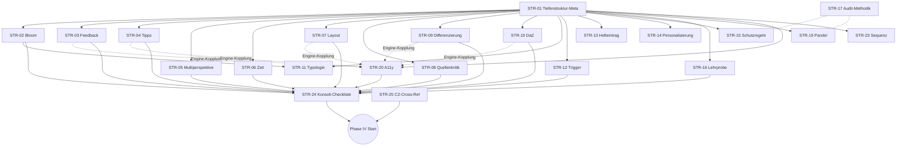

# D15b Optimierungs-Strategien

**Zweck:** Konsolidierte Strategie-Entwuerfe, abgeleitet aus `D15B_IMPLIKATIONS_MATRIX.md` (23 Netto-Cluster, 6 Bundle-Zonen). Jede Strategie = eine kohaerente, committierbare Aenderungs-Einheit.
**Kontext:** `AUSFUEHRUNGSPLAN_D15B_OPTIMIERUNG.md` Phase III.
**Status:** GEFUELLT (Phase III, 2026-04-04). 25 Strategien STR-01 bis STR-25, DAG + 8 Execution-Waves, C2-Cross-Reference verankert.

---

## Ausfuell-Regeln

1. **Eine Strategie = eine kohaerente Aenderungs-Einheit.** Wenn zwei Aenderungen unabhaengig umsetzbar/testbar/zurueckrollbar sind, sind es zwei Strategien.
2. **Atom-Unit-Regel (aus Phase II):** Cluster mit E1↔E3-Kopplung werden als **ein** STR gefuehrt. Der Commit enthaelt Vertrag + Subagent + Gueteregel-Katalog **synchron**.
3. **Strategien sind versionier- und committierbar.** Commit-Template: `feat(d15b): STR-XX — <Kurztitel> (adressiert Kxx)`.
4. **Abhaengigkeiten als DAG.** Keine Zyklen. STR-01 ist Meta-Fundament.
5. **Prioritaet P0–P2** entspricht Cluster-Verdikt aus Phase I.
6. **Aufwand** S (< 1h) / M (1–4h) / L (> 4h).

---

## Strategie-Register

| ID | Titel | Prio | Cluster | Ebenen | Aufwand | Wave |
|---|---|---|---|---|---|---|
| STR-01 | Tiefenstruktur-Refactor der 6 Gueteregel-Kataloge | **P0-META** | K13 | E5, E6, E9 | L | 0 |
| STR-02 | Bloom-Tiefe als Pflicht in Aufgaben-Generierung | P0 | K01 | E1, E3, E5 | M | 1 |
| STR-03 | Elaboratives Feedback als Pflicht-Slot | P0 | K02 | E1, E3, E5 | M | 1 |
| STR-04 | 3-stufige Tipp-Struktur mit Haertegraden | P0 | K03 | E1, E3, E5 | M | 1 |
| STR-05 | Multiperspektivitaet-Pflicht bei Konfliktthemen | P0 | K04 | E1, E2, E5 | M | 1 |
| STR-06 | Zeit-Realismus Doppelstunde | P0 | K09 | E0, E1, E5, E8 | M | 2 |
| STR-07 | Spatial-Contiguity Layout-Regel | P0 | K12 | E5, E7 | M | 1 |
| STR-08 | Quellenkritik als eigener Aufgabentyp | P1 | K05 | E1, E3, E5 | L | 1 |
| STR-09 | Differenzierungs-Tracks A/B/C | P1 | K07 | E1, E3, E5, E7, E8 | L | 1 |
| STR-10 | DaZ/Sprachliche Sensibilitaet (System) | P1 | K06 | E2, E5, E7, E8 | M | 2 |
| STR-11 | Aufgabentypologie-Erweiterung (Vergleich, Begruendung) | P1 | K16 | E1, E3, E5 | M | 1 |
| STR-12 | Trigger-Sensibilitaet-System | P1 | K08 | E2, E6, E8 | S | 2 |
| STR-13 | Hefteintrag Reflexions-Slot | P1 | K14 | E2, E5 | S | 2 |
| STR-14 | Personalisierung parametrisiert (Dissens-Aufloesung) | P1 | K34 | E2, E3, E5 | S | 2 |
| STR-15 | R3-Schutzregeln als Regressions-Guard | P1 | K32 | E5, E9 | S | 2 |
| STR-16 | Lehrprobe-Tauglichkeits-Check | P1 | K33 | E5, E6, E8 | S | 4 |
| STR-17 | Audit-Methodik-Iteration (D15b-Lessons) | P1 | K36 | E9 | M | 6 |
| STR-18 | Metakognitions-Prompt-Variante | P2 | K11 | E3, E5 | S | 7 |
| STR-19 | Pandel Geschichtsbewusstsein als Audit-Dimension | P2 | K15 | E5, E9 | S | 6 |
| STR-20 | WCAG / A11y-Pass | P2 | K17 | E5, E6, E7, E9 | L | 3 |
| STR-21 | Worked-Example-Variante | P2 | K23 | E3, E5 | S | 7 |
| STR-22 | Synchronisationspunkte Orchestrator | P2 | K22 | E0, E4 | S | 7 |
| STR-23 | Sequenz-Uebergangs-Doku | P2 | K31 | E5, E8 | S | 4 |
| STR-24 | Konsolidierte D15b-Post-Publish-Checkliste | Konsoli | K01-K17 (E6-Anteile) | E6 | M | 5 |
| STR-25 | C2-Cross-Reference + Restposten-Abgleich | Meta | — (prozess) | — | S | vor IV |

**Summe:** 25 Strategien. P0: 7. P1: 10. P2: 6. Konsolidierung/Meta: 2.

---

## Strategie-Details

### STR-01 — Tiefenstruktur-Refactor der 6 Gueteregel-Kataloge

**Prioritaet:** P0-META (Fundament, vor allem anderen)
**Adressiert:** K13 (Gueteregeln-Tiefenstruktur)
**Ebenen:** E5, E6, E9
**Dateien:** `docs/checklisten/GUETEKRITERIEN_HEFTEINTRAG_ENTWURF.md`, `…_HEFTEINTRAG_PRODUKT.md`, `GUETEKRITERIEN_AUFGABEN.md`, `GUETEKRITERIEN_SKRIPT.md`, `GUETEKRITERIEN_SEQUENZIERUNG.md`, `QUALITAETSKRITERIEN_MATERIALPRODUKTION.md`

**Ziel:** Alle 6 Kataloge erhalten eine zweischichtige Struktur: (1) **Oberflaechen-Kriterien** (Existenz, Format, Encoding — bisheriges Modell) + (2) **Tiefenstruktur-Kriterien** (didaktische Qualitaet, kognitive Tiefe, Lernwirksamkeit — neu). Tiefenstruktur wird zur **Primaer-Achse**. Ein Artefakt darf Oberflaechen-Checks bestehen und trotzdem am Tiefenstruktur-Check scheitern.

**Aenderung:**
- Jeder Katalog bekommt neuen Kopfabschnitt "Tiefenstruktur vs. Oberflaeche" mit Begriffsdefinition und Durchsetzungs-Regel.
- Bestehende Kriterien werden als "Oberflaeche" markiert; neue Kriterien werden als "Tiefenstruktur" ergaenzt (Platzhalter, werden in STR-02 bis STR-17 befuellt).
- Q-Gate-Reihenfolge: Tiefenstruktur zuerst, Oberflaeche danach (Rueckwaerts-Priorisierung).
- `AUDITBEGRUENDUNG`-Feld in allen Katalogen: bei FAIL muss Pruefer angeben, ob Oberflaeche oder Tiefe betroffen.

**Abhaengigkeiten:** Vor: — . Nach: STR-02, STR-03, STR-04, STR-05, STR-07, STR-08, STR-09, STR-11, STR-15, STR-16, STR-19, STR-20.
**Risiken:** Begriffs-Inflation; Pruefer-Kalibrierung. Gegensteuer: 2-3 Beispiel-Paare (Oberflaeche-PASS / Tiefe-FAIL) pro Katalog.
**Validierung:** Manuell — jede der bisherigen 6 Kataloge-Dateien hat nach dem Patch einen Tiefenstruktur-Abschnitt mit mind. 2 Beispielen.
**Aufwand:** L

---

### STR-02 — Bloom-Tiefe als Pflicht in Aufgaben-Generierung [ATOM-UNIT]

**Prioritaet:** P0
**Adressiert:** K01 (Cognitive Depth / Bloom-Verteilung)
**Ebenen:** E1, E3, E5
**Dateien:** `docs/architektur/vertraege/VERTRAG_PHASE_2-2b_AUFGABE.md`, `docs/agents/SUB_AUFGABE_MC.md`, `…_FREITEXT.md`, `…_LUECKENTEXT.md`, `…_REIHENFOLGE.md`, `…_ZUORDNUNG.md`, `docs/checklisten/GUETEKRITERIEN_AUFGABEN.md`

**Ziel:** Pro Mappe muss eine vorgeschriebene Bloom-Verteilung erreicht werden (Richtwert: max. 40% Level 1-2, mind. 30% Level 3-4, mind. 20% Level 5-6). Jeder SUB_AUFGABE-Output deklariert `_meta.bloom_level` explizit. Der Progressionsplan validiert die Verteilung.

**Aenderung:**
- `VERTRAG_PHASE_2-2b`: `bloom_level` Pflichtfeld, `bloom_verteilung_policy` als Rahmen-Constraint.
- SUB_AUFGABE_*: Prompt-Instruktion zur Bloom-Einstufung + Selbst-Validierung.
- `GUETEKRITERIEN_AUFGABEN.md`: neue A19 "Bloom-Verteilung erfuellt Policy" als Tiefenstruktur-Kriterium.
- Automatisierter Check: Python-Validator `validate_bloom_distribution(progressionsplan.json)`.

**Abhaengigkeiten:** Vor: STR-01. Nach: STR-24.
**Risiken:** Bloom-Level-Einstufung subjektiv — Beispiel-Matrix beilegen. ATOM-UNIT: Vertrag + Subagent + Katalog MUESSEN im selben Commit.
**Validierung:** Mappe-4-Re-Audit-Spot: Progressionsplan erfuellt Bloom-Policy. Automatisierter Validator-Lauf.
**Aufwand:** M

---

### STR-03 — Elaboratives Feedback als Pflicht-Slot [ATOM-UNIT]

**Prioritaet:** P0
**Adressiert:** K02 (Feedback-Hattie)
**Ebenen:** E1, E3, E5 (Engine-Teil in STR-07-Rahmen oder separater Patch)
**Dateien:** `VERTRAG_PHASE_2-2b_AUFGABE.md`, 5 SUB_AUFGABE_*, `GUETEKRITERIEN_AUFGABEN.md`, `assets/js/escape-engine.js` (Rendering)

**Ziel:** Feedback-Field ist nicht mehr `string`, sondern Objekt: `{ korrekt: <Bestaetigung + kurze Vertiefung>, falsch_generic: <Konstruktive Hinweise>, falsch_spezifisch: { <antwort_id>: <distraktor-spezifisch> }, task_feedback: <nach Abschluss: Transfer-Impuls> }`. Mindest-Quote: 80% elaboratives Feedback (Hattie d>0.70 Zielbereich), nicht mehr nur "richtig/falsch".

**Aenderung:**
- `VERTRAG_2-2b`: Feedback-Schema-Umbau (Breaking Change, Mappen 1-4 bleiben legacy-kompatibel durch optionales altes string-Format, neue Mappen MUSS Objekt).
- SUB_AUFGABE_*: Prompt-Erweiterung "generiere alle 4 Feedback-Slots".
- A-Katalog: A20 "Feedback ist elaborativ" als Tiefenstruktur-Kriterium.
- Engine-Patch: Feedback-Slot-Rendering erkennt Objekt-Form. **Kopplung zu Wave 3 (Engine-Session)**.

**Abhaengigkeiten:** Vor: STR-01. Eng gekoppelt: Engine-Patch Wave 3 (kann parallel laufen, aber Mappe-5 braucht beide).
**Risiken:** Legacy-Mappen 1-4 duerfen nicht brechen — Engine muss beide Schemas rendern koennen.
**Validierung:** Mappe-4-Re-Audit: alle neuen Aufgaben haben Feedback-Objekte; Browser-Check Engine rendert korrekt.
**Aufwand:** M

---

### STR-04 — 3-stufige Tipp-Struktur mit Haertegraden [ATOM-UNIT]

**Prioritaet:** P0
**Adressiert:** K03 (Tipp-Haertegrade)
**Ebenen:** E1, E3, E5 (Engine-Teil in Wave 3)
**Dateien:** `VERTRAG_2-2b`, 5 SUB_AUFGABE_*, `GUETEKRITERIEN_AUFGABEN.md`, Engine (Wave 3)

**Ziel:** Jede Aufgabe hat 3 Tipps mit strikt abgestuften Haertegraden: **T1 kognitiv-aktivierend** ("Was weisst du ueber X?"), **T2 strukturierend** ("Schau dir Material Y an, besonders Z."), **T3 heuristisch** ("Vergleiche A und B."). **T3 darf die Loesung NICHT vorwegnehmen.** Ein Regelpruefer erkennt Tipp-Leaks.

**Aenderung:**
- VERTRAG: `tipps: [{stufe: 1|2|3, haertegrad: "kognitiv"|"strukturierend"|"heuristisch", text: string}]`.
- SUB_AUFGABE_*: Prompt-Erweiterung mit 3 Haertegrad-Beispielen + Anti-Beispiel (Leak).
- A-Katalog: A21 "Tipp-Haertegrade strikt, kein Leak" als Tiefenstruktur-Kriterium.
- Engine (Wave 3): gestaffeltes UI (Stufen klickbar, nicht alle auf einmal).

**Abhaengigkeiten:** Vor: STR-01. Gekoppelt mit Wave 3 Engine-Patch STR-04-ENG.
**Risiken:** Haertegrad-Einstufung subjektiv — Beispielmatrix im SUB_AUFGABE-Prompt.
**Validierung:** Re-Audit: Mappe-4-Tipps werden neu erzeugt, kein T3 enthaelt die Loesung verbatim.
**Aufwand:** M

---

### STR-05 — Multiperspektivitaet-Pflicht bei Konfliktthemen

**Prioritaet:** P0
**Adressiert:** K04 (Multiperspektivitaet)
**Ebenen:** E1, E2, E5, E6
**Dateien:** `VERTRAG_PHASE_2-1_MATERIAL.md`, SUB_MATERIAL_QUELLENTEXT/TAGEBUCH/BILDQUELLE, `QUALITAETSKRITERIEN_MATERIALPRODUKTION.md`, `GUETEKRITERIEN_SKRIPT.md`, Checkliste

**Ziel:** Konflikt-Themen (Krieg, Revolution, gesellschaftl. Auseinandersetzung) werden im Material-Vertrag als `konflikttyp: true` flagbar. Bei true: mind. 3 Perspektiven (z.B. Deutschland/Frankreich/neutral; oben/unten; taeter/opfer/beobachter). Keine einseitige Nationalperspektive.

**Aenderung:**
- VERTRAG_2-1: neues Flag `konflikttyp` + `perspektiven_policy`.
- SUB_MATERIAL_*: Prompt "bei konflikttyp=true, Quellen aus mind. 3 Perspektiven".
- M-Katalog: M13 "Multiperspektivitaet bei Konflikt-Themen" (Tiefenstruktur).
- SK-Katalog: Skript-Check auf Perspektiven-Diversitaet.
- Checkliste: Perspektiven-Audit als Pre-Publish-Punkt (in STR-24 gebuendelt).

**Abhaengigkeiten:** Vor: STR-01. Nach: STR-24.
**Risiken:** Quellenknappheit bei manchen Themen — Fallback: Sekundaer-Perspektive als Lehrer-Input.
**Validierung:** Mappe-4-Re-Audit (R1 Geschichtsdidaktik): Multiperspektivitaet messbar verbessert.
**Aufwand:** M

---

### STR-06 — Zeit-Realismus Doppelstunde

**Prioritaet:** P0
**Adressiert:** K09 (Zeit-Realismus)
**Ebenen:** E0, E1, E5, E6, E8
**Dateien:** `docs/architektur/WORKFLOW_v4.md`, `VERTRAG_PHASE_2-0_RAHMEN.md`, `GUETEKRITERIEN_SKRIPT.md`, `GUETEKRITERIEN_SEQUENZIERUNG.md`, neu: `escape-games/<game>/lehrkraft/doppelstunden-ablauf.md`

**Ziel:** Jede Mappe deklariert `zeitbudget_minuten` pro Station. Summe-Check gegen Gesamt-Unterrichts-Zeit (Standard 45 oder 90 Min). OTL-Anteil (Opportunity-to-Learn) wird geschaetzt. Ein Lehrkraft-Ablaufplan ergaenzt jede Mappe.

**Aenderung:**
- WORKFLOW v4: Zeitbudget als Pflicht-Output von Phase 2-0.
- VERTRAG_2-0: `zeitbudget_pro_station`, `zeitbudget_gesamt`, `otl_schaetzung`.
- SK-Katalog: SK16 "Zeit-Plausibilitaet" (Tiefenstruktur).
- S-Katalog: S16 "Station-Zeiten summieren zur Gesamtzeit".
- E8: Ablaufplan-Template als Markdown in `lehrkraft/`.

**Abhaengigkeiten:** Vor: STR-01. Informiert STR-24.
**Risiken:** Zeitschaetzung ist iterativ korrigierbar — nicht als BLOCKER behandeln.
**Validierung:** Mappe-4-Retrospektive-Befund (R5 Seminarleiter: 82 Min real vs. 45 deklariert) wird als BLOCKER-Regression verhindert.
**Aufwand:** M

---

### STR-07 — Spatial-Contiguity Layout-Regel

**Prioritaet:** P0
**Adressiert:** K12 (Layout / Split-Attention — Sweller)
**Ebenen:** E5, E6, E7
**Dateien:** `GUETEKRITERIEN_HEFTEINTRAG_PRODUKT.md`, `GUETEKRITERIEN_SKRIPT.md`, `assets/css/themes/theme-gpg.css`, `escape-engine.js`

**Ziel:** Material und zugehoerige Aufgabe werden **raeumlich benachbart** dargestellt (Spatial-Contiguity nach Mayer). Ende der Split-Attention-BLOCKER-Situation.

**Aenderung:**
- E5 (HE/SK-Kataloge): Regel "Material-Aufgabe-Bezug visuell side-by-side oder in sequenzieller Naehe".
- E7 (Engine): Neues Layout-Modul `_renderStationPair(material, aufgabe)` mit responsive side-by-side Desktop / gestapelt Mobile. CSS-Refactor der Station-Cards.
- E6: Layout-Audit als Pre-Publish-Check (STR-24).

**Abhaengigkeiten:** Vor: STR-01. Tangential zu STR-03/04 Engine-Patches (gleiche Wave 3-Session).
**Risiken:** Responsive-Regression auf iPad-Breite — Browser-Test auf 768px + 1024px.
**Validierung:** Re-Audit R4 (Instructional Design): BLOCKER R4-2 (Split-Attention) gesenkt. Browser-Check 3 Breakpoints.
**Aufwand:** M

---

### STR-08 — Quellenkritik als eigener Aufgabentyp [ATOM-UNIT]

**Prioritaet:** P1
**Adressiert:** K05 (Quellenkritik)
**Ebenen:** E1, E3, E5, E6
**Dateien:** `VERTRAG_2-2b`, neu: `SUB_AUFGABE_QUELLENKRITIK.md` ODER Erweiterung `SUB_AUFGABE_FREITEXT.md`, `GUETEKRITERIEN_AUFGABEN.md`

**Ziel:** Quellenkritik ist ein eigenstaendiger Aufgaben-Subtyp mit Struktur W-Fragen (wer, wann, wo, warum, woher, wozu) + Bewertungs-Rubric. Jede Mappe mit Primaerquellen MUSS mind. eine Quellenkritik-Aufgabe enthalten.

**Aenderung:**
- Entscheidung: Eigener Subagent ODER Erweiterung von FREITEXT. **Empfehlung: eigener Subagent** — das macht die Pflicht kodifizierbar und senkt Prompt-Komplexitaet in FREITEXT.
- VERTRAG: `aufgaben_typ: "quellenkritik"` + Pflicht bei Primaerquellen-Einsatz.
- A-Katalog: A22 "Quellenkritik bei Primaerquellen vorhanden" (Tiefenstruktur).
- Checkliste: Quellenkritik-Spot als Pre-Publish-Check.

**Abhaengigkeiten:** Vor: STR-01. Parallel zu STR-02/03/04.
**Risiken:** Neuer Subagent erhoeht Infrastruktur-Footprint — Prompt klein halten, Template-basiert.
**Validierung:** Re-Audit R1 (Forstner): Quellenkritik-Kriterium erfuellt.
**Aufwand:** L

---

### STR-09 — Differenzierungs-Tracks A/B/C [ATOM-UNIT]

**Prioritaet:** P1
**Adressiert:** K07 (Differenzierung)
**Ebenen:** E1, E3, E5, E7, E8
**Dateien:** `VERTRAG_2-2b`, 5 SUB_AUFGABE_*, A-Katalog, Engine, neu: `lehrkraft/differenzierungs-leitfaden.md`

**Ziel:** Drei Tracks pro Aufgabe: **A** (sprachlich/kognitiv reduziert: kuerzere Texte, mehr Scaffolding, geschlossenere Aufgaben), **B** (Basis), **C** (Herausforderung: mehr Abstraktion, offenere Formate). Track-Switcher in Engine + Leitfaden fuer Lehrkraft zur Zuweisung.

**Aenderung:**
- VERTRAG: `track_flag: "A"|"B"|"C"`, Aufgaben koennen in 2-3 Varianten existieren.
- SUB_AUFGABE_*: Generieren pro Aufgabe die Tracks (oder aufgaben-spezifisch).
- A-Katalog: A23 "Differenzierung Track A/B/C vorhanden".
- Engine: Track-Switcher UI (Lehrkraft kann Klasse auf Track stellen oder Schueler waehlen lassen).
- E8: Leitfaden zur Track-Zuweisung (Diagnose-Hinweise).

**Abhaengigkeiten:** Vor: STR-01. Kopplung mit Wave 3 Engine.
**Risiken:** Hoher Content-Produktionsaufwand — Track B und C erstmal Pflicht, A optional.
**Validierung:** Re-Audit R3 (Landrealschule-Hellermann): Differenzierung strukturell verankert.
**Aufwand:** L

---

### STR-10 — DaZ / Sprachliche Sensibilitaet (System)

**Prioritaet:** P1
**Adressiert:** K06 (DaZ, Sprach-Niveau)
**Ebenen:** E2, E5, E7, E8
**Dateien:** 7 SUB_MATERIAL_*, `QUALITAETSKRITERIEN_MATERIALPRODUKTION.md`, `escape-engine.js` (Glossar-Tooltip), neu: `lehrkraft/daz-glossar-template.md`

**Ziel:** Fachbegriffe und schwierige Worte werden in Materialien markiert (Inline-Tag oder Metadaten). Engine rendert Tooltip/Aufklapp-Glossar. DaZ-Lehrkraefte haben Template fuer Vor-Entlastung.

**Aenderung:**
- SUB_MATERIAL_*: Prompt-Erweiterung "markiere Fachbegriffe > R7-Wortschatz + erkl. Kurzform".
- M-Katalog: M14 "Sprach-Niveau-Check" (Tiefenstruktur).
- Engine: Glossar-Komponente (HTML-Span mit data-glossar-term + Tooltip).
- E8: Template-Dokument, das Lehrkraft pro Mappe ausfuellt.

**Abhaengigkeiten:** Vor: STR-01. Engine-Teil in Wave 3.
**Risiken:** Overtagging — Wortschatz-Quelle konkret: Zertifikat Deutsch A2/B1-Liste.
**Validierung:** Re-Audit R2 (Kilic): DaZ-Glossar-Luecke geschlossen.
**Aufwand:** M

---

### STR-11 — Aufgabentypologie-Erweiterung [ATOM-UNIT]

**Prioritaet:** P1
**Adressiert:** K16 (Aufgabentypologie)
**Ebenen:** E1, E3, E5
**Dateien:** `VERTRAG_2-2b`, neue SUB_AUFGABE_VERGLEICH.md, SUB_AUFGABE_BEGRUENDUNG.md (oder als FREITEXT-Varianten), A-Katalog

**Ziel:** Zwei neue Aufgaben-Subtypen: **Vergleich** (systematisch 2-3 Objekte gegenueberstellen, Strukturraster) und **Begruendung** (Claim-Evidence-Reasoning). Adressiert die Bloom-Luecke (K01) durch Typen, die von sich aus Level 4-5 erfordern.

**Aenderung:**
- VERTRAG: 2 neue `aufgaben_typ`-Werte.
- 2 neue SUB_AUFGABE-Prompts oder FREITEXT-Variante mit strukturierter Output-Regel.
- A-Katalog: Typologie-Erweiterung dokumentiert.

**Abhaengigkeiten:** Vor: STR-01. Synergetisch mit STR-02 (Bloom).
**Risiken:** Subagent-Proliferation — zuerst als FREITEXT-Varianten, eigene Subagenten bei Bedarf nach Mappe-5.
**Validierung:** Mappe-5 enthaelt mind. je 1 Vergleich + 1 Begruendung. Bloom-Verteilung erreicht Policy leichter.
**Aufwand:** M

---

### STR-12 — Trigger-Sensibilitaet-System

**Prioritaet:** P1
**Adressiert:** K08 (Trigger)
**Ebenen:** E2, E6, E8
**Dateien:** SUB_MATERIAL_*, Checkliste, neu: `lehrkraft/trigger-leitfaden.md`

**Ziel:** Materialien mit Triggerpotenzial (Gewalt, Krieg, Tod, Diskriminierung) werden mit `trigger_flags: [gewalt, tod, ...]` markiert. Checkliste verlangt Trigger-Check vor Publikation. Lehrkraft erhaelt Leitfaden zur Vorbereitung + Handhabung (Opt-Out, Gespraechs-Prompts).

**Aenderung:**
- SUB_MATERIAL: Metadaten-Feld `trigger_flags`.
- Checkliste: Trigger-Spot (in STR-24).
- E8: Leitfaden-Template.

**Abhaengigkeiten:** Vor: STR-01.
**Risiken:** Over-Flagging macht Flag bedeutungslos — Kriterien strikt: was ist Trigger, was nicht.
**Validierung:** Re-Audit R2 (Kilic, Trigger-Sensibilitaet): Luecke geschlossen.
**Aufwand:** S

---

### STR-13 — Hefteintrag Reflexions-Slot

**Prioritaet:** P1
**Adressiert:** K14 (Hefteintrag reflexiv)
**Ebenen:** E2, E5
**Dateien:** `AGENT_HEFTEINTRAG.md`, `GUETEKRITERIEN_HEFTEINTRAG_*.md`

**Ziel:** Jeder Hefteintrag enthaelt einen Reflexions-Slot (3. Zone): "Was bedeutet das fuer mich/heute?" — Transfer auf Gegenwart, Urteilsbildung, Metakognition.

**Aenderung:**
- AGENT_HEFTEINTRAG: Reflexions-Zone als Pflicht-Output.
- HE-Katalog: HE14 "Reflexions-Zone vorhanden und relevant" (Tiefenstruktur).

**Abhaengigkeiten:** Vor: STR-01.
**Risiken:** Floskelhafte Reflexionen — Beispiel-Korpus im AGENT_HEFTEINTRAG.
**Validierung:** Mappe-5-Hefteintrag hat Reflexions-Zone.
**Aufwand:** S

---

### STR-14 — Personalisierung parametrisiert (K34 Dissens-Aufloesung)

**Prioritaet:** P1
**Adressiert:** K34 (Personalisierung Friedrich-Tagebuch: R1 kritisch vs. R3 positiv)
**Ebenen:** E2, E3, E5
**Dateien:** `SUB_MATERIAL_TAGEBUCH.md`, SUB_AUFGABE_FREITEXT, M/A-Katalog

**Ziel:** Personalisierung (Tagebuch-Ich-Erzaehler, Identifikationsfiguren) **bleibt** als didaktisches Werkzeug (R3-Kontext: Motivation bildungsferne SuS), aber **Pflicht-Meta-Reflexionsaufgabe** zu Fiktionalitaet und Geschichtsbewusstsein (R1-Kritik: epistemologische Probleme).

**Aenderung:**
- SUB_MATERIAL_TAGEBUCH: `personalisierung_flag: true` plus Pflicht-Meta-Reflexions-Aufgaben-Hook.
- SUB_AUFGABE: bei personalisierung=true automatisch Meta-Aufgabe "Wie unterscheidet sich dieses Tagebuch von einer realen Quelle?" generieren.
- M-Katalog: M15 "Personalisierung mit Meta-Reflexion".

**Abhaengigkeiten:** Vor: STR-01.
**Risiken:** Meta-Aufgabe wirkt aufgesetzt — Formulierungs-Beispiele mitgeben.
**Validierung:** Re-Audit R1 (Forstner): Personalisierungs-Kritik gesenkt (kein BLOCKER, eingerahmt).
**Aufwand:** S

---

### STR-15 — R3-Schutzregeln als Regressions-Guard

**Prioritaet:** P1
**Adressiert:** K32 (R3 Staerken, Do-not-break)
**Ebenen:** E5, E9
**Dateien:** Alle 6 Gueteregel-Kataloge, Audit-Workflow-Doku

**Ziel:** Die 4 positiven R3-Staerken (niedrigschwelliger Einstieg, starke Identifikationsfiguren, visuelle Klarheit, emotionale Ansprache) werden in allen Katalogen als **"Do-not-break"-Schutzregeln** markiert. Ein spaeterer Patch darf diese Qualitaeten nicht kippen.

**Aenderung:**
- Jeder Katalog: neuer Abschnitt "Schutzregeln" mit 4 Eintraegen + Pruefregel.
- Audit-Workflow: Regressions-Check-Schritt "Pruefe Schutzregeln" vor jedem Re-Audit-Abschluss.

**Abhaengigkeiten:** Vor: STR-01. Wird in jedem Re-Audit (Phase V) aktiv.
**Risiken:** Schutzregel-Inflation — strikt auf 4 begrenzt.
**Validierung:** Re-Audit-Checkliste hat Schutzregeln-Spot.
**Aufwand:** S

---

### STR-16 — Lehrprobe-Tauglichkeits-Check

**Prioritaet:** P1
**Adressiert:** K33 (Lehrprobe)
**Ebenen:** E5, E6, E8
**Dateien:** `GUETEKRITERIEN_SKRIPT.md`, `GUETEKRITERIEN_SEQUENZIERUNG.md`, Checkliste, neu: `lehrkraft/lehrprobe-briefing.md`

**Ziel:** Jede Mappe kann als Lehrprobe eingesetzt werden. Lehrprobe-Check prueft: (a) Artikulation klar, (b) Sichtstrukturen sichtbar, (c) Classroom-Management unterstuetzt, (d) Dokumentation vollstaendig, (e) Rubric vorhanden.

**Aenderung:**
- SK/S-Kataloge: Lehrprobe-Tauglichkeits-Kriterium (Tiefenstruktur).
- Checkliste (STR-24): Lehrprobe-Pre-Check.
- E8: Briefing-Dokument fuer Seminarlehrer.

**Abhaengigkeiten:** Vor: STR-01. Wave 4.
**Risiken:** Bayerisch-spezifisch vs. bundeslaenderuebergreifend — klar als "Bayern LehrplanPlus" markieren.
**Validierung:** Re-Audit R5 (Kaltenbrunner): Lehrprobe-Einsatzbereitschaft bestaetigt.
**Aufwand:** S

---

### STR-17 — Audit-Methodik-Iteration (D15b-Lessons)

**Prioritaet:** P1
**Adressiert:** K36 (Audit-Methodik)
**Ebenen:** E9
**Dateien:** `docs/analyse/D15b-Methodik-Doku.md` (neu), Audit-Workflow-Template

**Ziel:** D15b-Methodik (Evidenz-Bundle / 6 isolierte Rollen-Subagenten / Synthese-Agent / Konvergenz-Klassen A-F) wird als wiederverwendbarer Workflow dokumentiert. Lessons aus D15b: Text-Primat ueber Screenshots, Rollen-Isolation, Inter-Rater-Reliability gewichtet.

**Aenderung:**
- Neue Methodik-Doku: Template, Rollen-Charta-Muster, Subagent-Prompts, Konvergenz-Klassifikation.

**Abhaengigkeiten:** —  . Kann parallel laufen.
**Risiken:** Nur 1 Anwendungsfall (D15b) — als "v1" kennzeichnen, Iteration nach Mappe-5-Audit.
**Validierung:** Methodik-Doku existiert und wird in Phase V (Re-Audit) angewendet.
**Aufwand:** M

---

### STR-18 — Metakognitions-Prompt-Variante

**Prioritaet:** P2
**Adressiert:** K11 (Metakognition)
**Ebenen:** E3, E5
**Dateien:** SUB_AUFGABE-Erweiterung, A-Katalog

**Ziel:** Pro Mappe mind. 1 Metakognitions-Aufgabe ("Welche Strategie hast du angewandt? Was hat geholfen?"). Nicht Pflicht, aber Richtwert.

**Aufwand:** S. Abhaengigkeiten: Vor STR-01. Wave 7.

---

### STR-19 — Pandel Geschichtsbewusstsein als Audit-Dimension

**Prioritaet:** P2
**Adressiert:** K15 (Pandel)
**Ebenen:** E5, E9
**Dateien:** `GUETEKRITERIEN_SKRIPT.md`, Methodik-Doku

**Ziel:** Pandels 7 Dimensionen (Zeit, Wirklichkeit, Historizitaet, Identitaet, politisch, oekonomisch, moralisch) werden als SK-Audit-Achse eingefuehrt. Ziel: mind. 4/7 Dimensionen pro Mappe adressiert.

**Aufwand:** S. Abhaengigkeiten: Vor STR-01. Wave 6.

---

### STR-20 — WCAG / A11y-Pass

**Prioritaet:** P2
**Adressiert:** K17 (A11y)
**Ebenen:** E5, E6, E7, E9
**Dateien:** HE/M-Kataloge, Checkliste, `escape-engine.js`, `theme-gpg.css`, accessibility-compliance Plugin

**Ziel:** WCAG 2.1 AA-Konformitaet: Kontrast-Ratios, Touch-Target-Groesse (>44px), ARIA-Labels fuer interaktive Elemente, Tastatur-Navigation. Integration des `accessibility-compliance` Plugins in Audit-Workflow.

**Aenderung:**
- Kataloge: A11y-Referenzen.
- Engine: CSS-Kontrast-Fixes, Touch-Target-Minimum, ARIA.
- Checkliste: A11y-Audit.
- Plugin-Integration: automatisierter Lauf nach jedem Engine-Patch.

**Aufwand:** L. Abhaengigkeiten: Vor STR-01. Wave 3.

---

### STR-21 — Worked-Example-Variante

**Prioritaet:** P2
**Adressiert:** K23 (Worked Examples)
**Ebenen:** E3, E5
**Dateien:** SUB_AUFGABE-Erweiterung, A-Katalog

**Ziel:** Bei komplexen Aufgaben-Typen (Quellenkritik, Begruendung) wird eine Worked-Example-Variante als Scaffolding angeboten — komplette Loesungs-Demonstration fuer ein verwandtes Beispiel.

**Aufwand:** S. Abhaengigkeiten: Vor STR-01, optional nach STR-08 + STR-11. Wave 7.

---

### STR-22 — Synchronisationspunkte Orchestrator

**Prioritaet:** P2
**Adressiert:** K22 (Sync-Punkte)
**Ebenen:** E0, E4
**Dateien:** `WORKFLOW_v4.md`, `ORCHESTRATOR.md`

**Ziel:** Zwischen Phase 2-1 / 2-2a / 2-2b / 3 gibt es explizite Sync-Gates (Progressionsplan-Konsistenz, Material-Aufgaben-Mapping). Aktuell implizit.

**Aufwand:** S. Abhaengigkeiten: —. Wave 7.

---

### STR-23 — Sequenz-Uebergangs-Doku

**Prioritaet:** P2
**Adressiert:** K31 (Sequenz-Uebergeleitung)
**Ebenen:** E5, E8
**Dateien:** `GUETEKRITERIEN_SEQUENZIERUNG.md`, neu: `lehrkraft/sequenz-uebergang.md`

**Ziel:** Zwischen Mappen der gleichen Sequenz (z.B. Mappe 3 → Mappe 4 Erster Weltkrieg) gibt es dokumentierte Brueckenelemente: Was wissen die SuS? Was ist neu? Wie schliesst man an?

**Aufwand:** S. Abhaengigkeiten: Vor STR-01. Wave 4.

---

### STR-24 — Konsolidierte D15b-Post-Publish-Checkliste

**Prioritaet:** Konsolidierung
**Adressiert:** E6-Anteile aus STR-01..STR-16, STR-20
**Ebenen:** E6
**Dateien:** `docs/checklisten/CHECKLISTE_D15B_POST_PUBLISH.md` (neu)

**Ziel:** Anstelle von 9 separaten Checklisten eine konsolidierte Pre-Publikations-Checkliste mit allen Spots: Bloom / Feedback / Tipps / Multiperspektivitaet / Zeit / Layout / Quellenkritik / Differenzierung / DaZ / Trigger / Lehrprobe / A11y. Strukturiert nach Tiefenstruktur-Primaer und Oberflaeche-Sekundaer.

**Aenderung:**
- Neue Datei mit allen Spots als Liste + Kurz-Referenz auf Katalog-Eintrag.

**Abhaengigkeiten:** Nach: alle STR aus Wave 0-3. Sammelt deren E6-Anteile.
**Risiken:** Checklisten-Laenge — max. 30 Spots, gruppiert.
**Validierung:** Mappe-5-Pre-Publish-Lauf mit dieser Checkliste.
**Aufwand:** M

---

### STR-25 — C2-Cross-Reference + Restposten-Abgleich

**Prioritaet:** Meta (vor Phase IV Start)
**Adressiert:** Prozess-Schnittstelle C2 ↔ D15b
**Ebenen:** —
**Dateien:** `docs/analyse/C2_EVALUATION_MAPPE4.md` (lesen), neu: `docs/projekt/C2_D15B_CROSS_REFERENCE.md`

**Ziel:** Vor Beginn Phase IV Umsetzung: jeden offenen C2-Finding (3 MEDIUM + 9 LOW + IL-2/IL-3/IL-5) pruefen, ob durch ein D15b-Cluster/STR bereits mit-abgedeckt. Treffer werden im Cross-Reference-Dokument markiert. Nicht abgedeckte C2-Rest-Findings werden als separater C2-Restposten-Track vor oder parallel zu D15b Phase IV abgearbeitet — keine Register-Merge, keine Cluster-Neu-Berechnung.

**Aenderung:**
- Cross-Reference-Dokument mit Tabelle: C2-Finding-ID | Status | D15b-Abdeckung (STR-XX oder "uncovered") | Folge-Aktion.
- STATUS-Update: C2-Restposten-Track sichtbar machen.

**Abhaengigkeiten:** Vor: Phase IV Start. Nach: Phase III (dieses Dokument).
**Risiken:** Drift zwischen beiden Registern — Cross-Reference ist Einweg-Lookup, nicht Merge.
**Validierung:** Tabelle vollstaendig, jeder C2-Finding hat eindeutige Zuordnung.
**Aufwand:** S

---

## Abhaengigkeits-Graph (DAG)

---

## Execution-Waves (Session-Schnitt)

Umsetzungs-Reihenfolge in Phase IV. Jede Wave = 1-2 Cowork-Sessions.

| Wave | Inhalt | STRs | Est. Sessions | Abhaengigkeit |
|---|---|---|---|---|
| **0 Fundament** | Tiefenstruktur-Meta | STR-01 | 1 | — |
| **1 E1+E3 Atom-Units** | Bloom, Feedback, Tipps, Multiperspektive, Layout, Quellenkritik, Differenzierung, Typologie | STR-02, 03, 04, 05, 07, 08, 09, 11 | 2-3 | Wave 0 |
| **2 E2/E5 Material-Querschnitt** | Zeit, DaZ, Trigger, Hefteintrag, Personalisierung, Schutzregeln | STR-06, 10, 12, 13, 14, 15 | 1-2 | Wave 0 |
| **3 Engine-Session** | Feedback-Rendering, Tipp-UI, Layout, Track-Switcher, Glossar, A11y | STR-03 (Eng), 04 (Eng), 07 (Eng), 09 (Eng), 10 (Eng), 20 | 2 | Wave 1+2 (kann parallel starten nach Vertrags-Commits) |
| **4 Lehrkraft-Dokumente** | Ablaufplan, Diff-Leitfaden, DaZ-Template, Trigger-Leitfaden, Lehrprobe-Briefing, Sequenz-Uebergang | STR-06 (E8), 09 (E8), 10 (E8), 12 (E8), 16, 23 | 1 | Wave 1+2 |
| **5 E6-Konsolidierung** | Post-Publish-Checkliste | STR-24 | 1 | Wave 0-4 |
| **6 Audit-Methodik** | D15b-Methodik-Doku, Pandel | STR-17, 19 | 1 | — (parallel) |
| **7 P2-Nachschub** | Metakognition, Worked Examples, Sync-Punkte | STR-18, 21, 22 | 1 | Wave 0-1 |
| **Cross-Ref vor IV** | C2-Abgleich | STR-25 | 0.5 | — (vor Wave 0) |

**Summe Est.:** 10-12 Cowork-Sessions fuer vollstaendige Phase IV Umsetzung.

---

## Entscheidungspunkte (User-Freigabe fuer Phase IV)

Vor Phase IV Start braucht es Klaerung in 4 Punkten:

1. **Scope-Cut:** Voll-Umsetzung (alle 25 STR) oder nur P0 + ausgewaehlte P1 (STR-01..09, 11, 16)? Voll-Umsetzung = ~10-12 Sessions, P0+P1-kern = ~6-7 Sessions.

2. **Engine-Session-Schnitt:** Alle 6 Engine-Teile (STR-03/04/07/09/10/20) in einer Session (2-3h Cowork, hohes Token-Budget) oder auf 2 Sessions aufteilen (Feedback+Tipp+Layout / Diff+DaZ+A11y)?

3. **Re-Audit-Scope Phase V:** Voller 6-Rollen-Re-Audit oder reduziert (R4 ID + R6 Empirie + R2 Stadt)? Empfehlung hier: reduziert, da die 3 ausgewaehlten Rollen die meisten BLOCKER trugen.

4. **Mappe-4-Daten-Patch vs. Mappe-5-Neu-Produktion:** Mappe 4 retroaktiv patchen als Re-Audit-Baseline, oder Mappe 5 als erstes Produkt der neuen Infrastruktur produzieren (Mappe 4 bleibt Legacy-Dokument)? Empfehlung: Mappe 5 neu, Mappe 4 nur wo trivial.

---

## Arbeitsprotokoll Phase III

**2026-04-04 — Session 10 (Forts. 10): Strategien ausgearbeitet**

- **25 Strategien** definiert (STR-01 bis STR-25). Jede Strategie ist eine committierbare Einheit mit eigenem Commit-Message-Template.
- **STR-01 Tiefenstruktur-Meta** als Wave-0-Fundament etabliert. Alle E5-beruehrenden STRs haengen davon ab (Phase-II-Erkenntnis "K13 als Meta-Patch" umgesetzt).
- **ATOM-UNIT-Kennzeichnung** bei 6 STRs (STR-02, 03, 04, 08, 09, 11). Diese muessen Vertrag + Subagent + Katalog im selben Commit enthalten (Phase-II-Erkenntnis "E1↔E3 Kopplung").
- **Engine-Kopplung** bei STR-03/04/07/09/10 in Wave 3 gebuendelt. STR-20 WCAG ist die Sammel-Strategie fuer alle A11y-Anteile.
- **STR-24 E6-Konsolidierung** sammelt alle Checklisten-Anteile in **einer** konsolidierten Post-Publish-Checkliste statt 9 Einzel-Dokumenten (Phase-II-Erkenntnis "E6 als Multiplikator").
- **STR-25 C2-Cross-Reference** als expliziter Schritt **vor Phase IV** verankert, damit C2-Restposten nicht verloren gehen und keine Register-Merge noetig wird. Setzt die Empfehlung aus der Session-10-Forts.-9-Diskussion um.
- **8 Waves + Cross-Ref-Vorlauf** als Session-Schnitt. Wave 3 Engine kann parallel zu Wave 1+2 starten, sobald die Vertrags-Commits stehen. Wave 6 Audit-Methodik kann ebenfalls parallel laufen. Das verkuerzt die Gesamt-Dauer gegenueber rein sequenzieller Abarbeitung.
- **Aufwands-Schaetzung 10-12 Sessions** bei Voll-Umsetzung; 6-7 Sessions bei P0+P1-Kern-Scope.
- **4 Entscheidungspunkte** fuer User-Freigabe vor Phase IV formuliert.

**Naechste Aktion:** User-Freigabe zu den 4 Entscheidungspunkten einholen. Danach STR-25 (C2-Cross-Reference) als Vorlauf ausfuehren, dann Wave 0 STR-01 starten.

---

**Phase III Status:** GEFUELLT. Braucht User-Freigabe vor Phase IV (Umsetzung).
