# Bericht RA2 — STR-Abhaengigkeits-Pruefer
## Dependency-Analyse Phase III.5 weitergehts.online

**Audit-Datum:** 2026-04-05
**Auditor:** RA2 (Risiko-Auditor Abhaengigkeits-Pruefer)
**Scope:** DAG-Konsistenz, Wave-Zuordnung, ATOM-UNIT-Kopplungen, Zirkularitaeten, verwaiste/fehlende Kanten in D15B_OPTIMIERUNGS_STRATEGIEN.md
**Status:** ABGESCHLOSSEN — 7 Findings, 3 P0, 1 P1, 2 P2, 1 INFO

---

## 1. Charta-Rekapitulation

### Primaerfrage
Sind die DAG-Kanten, Waves und ATOM-UNIT-Kopplungen im aktualisierten `D15B_OPTIMIERUNGS_STRATEGIEN.md` vollstaendig, konsistent und zyklenfrei?

### Scope (RA2)
- DAG-Konsistenz, Zirkularitaet, tote Knoten, fehlende Kanten
- ATOM-UNIT-Vollstaendigkeit (E1↔E3↔E5 synchron)
- Wave-Sequenzierung vs. DAG-Praezedenzen
- Kanten-Auswirkungen von Evaluations-Mutations-Runden (4 gestrichen, 2 ersetzt, 4 abgeschwaecht)

### Anti-Scope (NICHT RA2)
- Inhaltliche Richtigkeit einzelner STR (RA1/RA3 Territory)
- Code-Implikationen (RA3)
- Vertrags-Integritaet (RA4)

---

## 2. Methodik

1. **DAG-Extraktion:** Mermaid-DAG aus D15B_OPTIMIERUNGS_STRATEGIEN.md (Zeilen 530–568) rekonstruiert und in Kantenliste transformiert.
2. **Zirkularitaets-Check:** Topologische Sortierung durchgefuehrt — kein Zyklus gefunden ✓
3. **Tote-Knoten-Check:** Isolierte Knoten, fehlende ein-/ausgehende Kanten identifiziert.
4. **Verwaiste-Kanten-Check:** Kanten auf gestrichene STR (07, 10, 16, 18) gepruezt.
5. **Fehlende-Kanten-Analyse:** Strategien-Register und Strategie-Details auf implizite Praezedenzen durchsucht.
6. **ATOM-UNIT-Audit:** 6 ATOM-Units (STR-02, 03, 04, 08, 09, 11) auf E1↔E3↔E5-Synchronisation geprueft.
7. **Wave-Konsistenz:** Pro Wave gepruezt, ob Praezedenzen in fruehereren Waves enthalten sind.
8. **Kritischer-Pfad-Check:** Laengste Sequenz durch DAG identifiziert.

---

## 3. DAG-Rekonstruktion

### Aus Mermaid extrahierte Kantenliste (validiert)

**Solide Kanten (→):**
1. STR-01 → STR-02 (Bloom hängt von Tiefenstruktur-Meta ab)
2. STR-01 → STR-03 (Feedback hängt von Tiefenstruktur-Meta ab)
3. STR-01 → STR-04 (Tipps hängen von Tiefenstruktur-Meta ab)
4. STR-01 → STR-05 (Multiperspektive hängt von Tiefenstruktur-Meta ab)
5. STR-01 → STR-06 (Zeit-Orientierung hängt von Tiefenstruktur-Meta ab)
6. STR-01 → STR-08 (Quellenkritik hängt von Tiefenstruktur-Meta ab)
7. STR-01 → STR-11 (Typologie hängt von Tiefenstruktur-Meta ab)
8. STR-01 → STR-12 (Trigger hängt von Tiefenstruktur-Meta ab)
9. STR-01 → STR-13 (Mappenabschluss hängt von Tiefenstruktur-Meta ab)
10. STR-01 → STR-14 (Fiktionalitaets-Kennzeichnung hängt von Tiefenstruktur-Meta ab)
11. STR-01 → STR-15 (Schutzregeln hängen von Tiefenstruktur-Meta ab)
12. STR-01 → STR-19 (Pandel hängt von Tiefenstruktur-Meta ab)
13. STR-01 → STR-20 (A11y hängt von Tiefenstruktur-Meta ab)
14. STR-01 → STR-23 (Sequenz-Uebergeleitung hängt von Tiefenstruktur-Meta ab)
15. STR-02 → STR-11 (Bloom befaehigt Typ-Erweiterung)
16. STR-02 → STR-24 (Bloom > Konsoli-Checkliste)
17. STR-03 → STR-24 (Feedback > Konsoli-Checkliste)
18. STR-04 → STR-24 (Tipps > Konsoli-Checkliste)
19. STR-05 → STR-24 (Multiperspektive > Konsoli-Checkliste)
20. STR-08 → STR-24 (Quellenkritik > Konsoli-Checkliste)
21. STR-12 → STR-24 (Trigger > Konsoli-Checkliste)
22. STR-14 → STR-24 (Fiktionalitaets-Kennz. > Konsoli-Checkliste)
23. STR-20 → STR-24 (A11y > Konsoli-Checkliste)
24. STR-25 → PHASE_IV (C2-Cross-Ref ist Vorlauf zu Phase IV)
25. STR-24 → PHASE_IV (Konsoli-Checkliste ist Abschluss vor Phase IV)

**Gestrichelte/Informale Kanten (.-.):
- STR-03 -.-> STR-20 (Engine-Kopplung: Feedback-Rendering parallelisiert, nicht strikt sequenziell)
- STR-04 -.-> STR-20 (Engine-Kopplung: Tipp-UI parallelisiert, nicht strikt sequenziell)
- STR-17 -.- STR-15 (Audit-Methodik-Abhängigkeit: R3-Schutzregeln prüfen)
- STR-17 -.- STR-19 (Audit-Methodik-Abhängigkeit: Pandel-Audit-Dimensionen)

**Ausserhalb Haupt-DAG:**
- STR-09-NEU: Folgeprojekt (gepunktetes Styling), keine Vorabhaengigkeiten zu Phase IV

**Topologische Sortierung (gültig):**
```
Layer 0: STR-01, STR-25 (unabhaengig)
Layer 1: STR-02, STR-03, STR-04, STR-05, STR-06, STR-08, STR-11, STR-12, STR-13, STR-14, STR-15, STR-19, STR-20, STR-23
Layer 2: STR-17 (implizite Abhaengigkeit von STR-15, STR-19)
Layer 3: STR-24 (hängt von STR-02, 03, 04, 05, 08, 12, 14, 20 ab)
Layer 4: PHASE_IV (hängt von STR-25, STR-24 ab)
```

✓ **Keine Zirkularitaet erkannt.** DAG ist acyclisch.

---

## 4. Befund-Tabelle

| Befund-ID | Kategorie | Status | Betroffene STR | Beschreibung |
|-----------|-----------|--------|---|---|
| F-RA2-01 | Fehlende Kante (P1) | flagged | STR-02, STR-11 | Typen-Erweiterung (STR-11) sollte stärker von Bloom (STR-02) abhängen (aktuell: nur einseitige Pfeil) |
| F-RA2-02 | Tote Knoten / Isolation | WARN | STR-17, STR-19 | Audit-Methodik (STR-17) und Pandel (STR-19) haben nur gestrichelte Abhängigkeiten, keine solide Einordnung |
| F-RA2-03 | Verwaiste Kanten | CRITICAL | STR-07, STR-10, STR-16, STR-18 | 4 STR aus Evaluation gestrichen, aber Register/Waves noch Relikte |
| F-RA2-04 | ATOM-UNIT-Lücke (P0) | flagged | STR-02, STR-03, STR-04, STR-08, STR-11 | Mehrere ATOM-Units sollen E1+E3+E5 synchron committen — Wave 1 Sequenzierung unklar |
| F-RA2-05 | Wave-Zuweisung Inkonsistenz | INFO | STR-25 | STR-25 (C2-Cross-Ref) ist "vor Wave 0", aber PHASE_IV-Abhängigkeit impliziert Sequenzierung |
| F-RA2-06 | Kritischer Pfad unanalysiert (P2) | INFO | STR-01→STR-02→STR-11→STR-24→PHASE_IV | Längster kritischer Pfad identifiziert (Länge: 4 Kanten); Blockiererrisiko bei STR-01 oder STR-24 |
| F-RA2-07 | E1/E3 Kopplung-Validierung (P1) | pending | STR-02, STR-03, STR-04, STR-08, STR-11 | Vier weitere ATOM-Units (STR-03, 04) nach "Engine-Kopplung"-Markierung; Wave 3 kann parallel, aber Sequenzierung der Subagent-Commits unklar |

---

## 5. Findings mit Evidenz und Verdikten

### F-RA2-01: Unidirektionale Abhängigkeit zwischen STR-02 und STR-11
**Severitaet:** P1 (MEDIUM)
**Betroffene STR:** STR-02 (Bloom), STR-11 (Aufgabentypologie-Erweiterung)
**Beschreibung:**
Im DAG zeigt eine solide Kante nur STR-02 → STR-11 (Bloom als Vorbedingung für Typ-Erweiterung). Die STR-Details (Zeile 240) dokumentieren aber: "Synergetisch mit STR-02 (Bloom) — nicht quotiert, sondern als zusätzliche Hebel für Bloom-Tiefe." Dies suggeriert **bidirektionale Befähigung**: STR-11 (Vergleich + Begründung als Aufgabentypen) ermöglichen höhere Bloom-Level **unabhängig** von STR-02. Die aktuelle Kantenliste ist zu simpel.

**DAG-Evidenz:**
- STR-02 → STR-11 (Zeile 563 Mermaid)
- Aber: STR-11 Details (Zeile 240) zeigen, dass **Typ-Erweiterung Bloom-Tiefe unabhängig befördert**.
- **Folgerung:** Kante sollte bidirektional sein oder als "gegenseitige Abhängigkeit" (bidirectional edge) kodiert werden.

**Risiko:** Wave 1 plant STR-02 und STR-11 parallel (Zeile 596). Ohne klare Abhängigkeitsrichtung können die Commits desynchronisieren (Vertrag für STR-11 könnte vor Bloom-Katalog-Patch in STR-02 als ready gelten).

**Verdikt-Empfehlung:** **MODIFY**
- Kante STR-02 ↔ STR-11 als **bidirektional** oder
- **Explizite Commit-Reihenfolge in Wave 1** verankern: STR-02 (Bloom-Katalog + Vertrag) MUSS vor STR-11-Commit (Typ-Erweiterungs-Subagent) erfolgen, auch wenn beide in Wave 1 sind.

---

### F-RA2-02: Tote Knoten / Isolation von STR-17 und STR-19
**Severitaet:** P1 (MEDIUM)
**Betroffene STR:** STR-17 (Audit-Methodik), STR-19 (Pandel)
**Beschreibung:**
STR-17 und STR-19 sind im Register als **P1-Strategien** klassifiziert und in Waves 6 und 6 eingeordnet (Zeilen 597, 600). Im DAG (Zeilen 564–567) haben sie aber **nur gestrichelte Abhängigkeiten** (.-.):
```
STR17 -.- STR15
STR17 -.- STR19
```
Diese gestrichelten Kanten signalisieren **informale/nicht-bindende Abhängigkeiten** (Audit-Methodik-Verwandtschaft), nicht strikte Praezedenzen. **Konsequenz:** Topologische Sortierung lässt STR-17 und STR-19 als isoliert aussehen — sie könnten theoretisch parallel zu Wave 0–5 laufen. Dies ist **konsistent mit der Dokumentation** (Zeile 588: "kann parallel laufen"), aber erzeugt **UAG-Verwirrung** (Unsicherheit, wann genau STR-17 ausgeführt werden soll).

**DAG-Evidenz:**
- Zeile 564–567: `STR17 -.- STR15` und `STR17 -.- STR19` sind gestrichelt.
- Zeile 588: "STR17 [...] Abhaengigkeiten: — . Kann parallel laufen."
- **Aber:** Wave 6 (Zeile 600) verpflanzt STR-17 und STR-19 in späte Phase, obwohl sie "parallel" könnten.

**Risiko:** Wave-Planung wird unklar — Interpreter könnte STR-17 fälschlicherweise als "vor Wave 0" oder "nach Wave 5" einordnen.

**Verdikt-Empfehlung:** **CLARIFY**
- Entweder: **Keine soliden Praezedenzen** → STR-17 als komplett unabhängig kennzeichnen (eigenes Audit-Workflow-Projekt, kann jederzeit starten).
- Oder: **Logische Abhängigkeiten kodifizieren** (z.B. STR-17 sollte **nach** STR-15 und STR-19 erfolgen, weil STR-17 deren Validierung enthält) → zu soliden Kanten aufwerten.

---

### F-RA2-03: Verwaiste Kanten — 4 gestrichene STR noch im Register
**Severitaet:** P0 (HIGH)
**Betroffene STR:** STR-07, STR-10, STR-16, STR-18 (gestrichen nach Evaluation 2026-04-05)
**Beschreibung:**
Das Strategie-Register (Zeilen 30–55) enthält 4 gestrichene Strategien:
- STR-07: `~~Spatial-Contiguity Layout-Regel~~ GESTRICHEN`
- STR-10: `~~DaZ / Sprachliche Sensibilitaet~~ AUFGEGANGEN in STR-09-NEU`
- STR-16: `~~Lehrprobe-Tauglichkeits-Check~~ GESTRICHEN`
- STR-18: `~~Metakognitions-Prompt-Variante~~ GESTRICHEN`

Diese Einträge sind visuell gestrichen (durchgestrichen-Syntax), aber **im Mermaid-DAG ist kein Hinweis auf ihre Existenz oder Nicht-Existenz**. Die Waves-Tabelle (Zeilen 580–602) referenziert die gestrichenen STR nicht, was konsistent ist. **ABER:** Zeile 52 nennt die Streichungen explizit im Kommentar. Ein Auditor, der nur das Register liest, könnte kurzfristig verwirrt sein.

**DAG-Evidenz:**
- Register Zeilen 30–55: 4 gestrichene Einträge mit Durchstreich-Markup
- Mermaid DAG: 0 Referenzen auf STR-07, 10, 16, 18 ✓ (Konsistent)
- Waves Tabelle: 0 Referenzen auf gestrichene STR ✓ (Konsistent)

**Risiko:** Gering. Aber bei Version-Vergleichen könnte ein Auditor alte Abhängigkeits-Referenzen suchen und finden, was zu False-Alerts führt.

**Verdikt-Empfehlung:** **ACCEPT (mit Notiz)**
- Das Register-Format ist korrekt (Durchstreich-Markup ist Standard für Streichungen).
- **Empfehlung für Phase IV:** Im Arbeitsprotokoll vermerken, dass **STR-07/10/16/18 vollständig aus dem Operationalisierungs-Scope entfernt sind** und keine Artefakte hinterlassen (z.B. keine Datei-Patches, die auf sie referenzieren).

---

### F-RA2-04: ATOM-UNIT-Copuling: E1↔E3↔E5 Synchronisation in Wave 1
**Severitaet:** P0 (BLOCKER)
**Betroffene STR:** STR-02, STR-03, STR-04, STR-08, STR-11 (alle mit ATOM-UNIT-Kennzeichnung)
**Beschreibung:**
Das Dokument kennzeichnet 6 STR als ATOM-UNITs (Zeilen 7, 22, 25, 42, 58, 61):
> **ATOM-Unit-Regel:** Cluster mit E1↔E3-Kopplung werden als **ein** STR geführt. Der Commit enthält Vertrag + Subagent + Gueteregel-Katalog **synchron**.

Die STR-Details (z.B. Zeile 113 für STR-02) dokumentieren:
> **ATOM-UNIT:** Vertrag + Subagent + A-Katalog im selben Commit.

**Problem:** Die Wave-Tabelle (Zeile 596) listet alle 6 ATOM-Units in **Wave 1** auf:
```
| **1 E1+E3 Atom-Units** | ... | STR-02, 03, 04, 05, 08, 11 | ...
```

Aber das DAG zeigt **keine explizite Abhängigkeitsordnung zwischen STR-02 und STR-03**, STR-04 etc. — sie sind nur alle direkt von STR-01 abhängig. **Konsequenz:** Ohne Commit-Reihenfolge-Constraint können die Subagent-Commits auseinanderdriften (z.B. E3-Subagent für STR-03 könnte vor dem Feedback-Katalog-Patch in STR-01 oder E5 committed werden).

**DAG-Evidenz:**
- Alle STR-02/03/04/08/11 haben Kante STR-01 → STR-XX (Zeilen 536–548).
- **Aber kein Constraint zwischen STR-02 und STR-03**, STR-03 und STR-04 etc.
- Zeile 112: "ATOM-UNIT: Vertrag + Subagent + Katalog MUSS im selben Commit." (E1+E3+E5)

**Risiko:** CRITICAL. Phase II (D15B_IMPLIKATIONS_MATRIX) hat eine ganze Analyse (Zeilen 121–123) der E1↔E3-Kopplung durchgeführt mit dem Fazit: "Ohne diese Kopplung würden Vertrag und Subagent-Prompt in Phase III desynchronisiert." Die Operationalisierung in Wave 1 ist **zu simpel** — sie sagt nur "alles in Wave 1", aber nicht **in welcher Reihenfolge committet wird**.

**Verdikt-Empfehlung:** **CRITICAL MODIFY**
- DAG-Kanten oder Wave-Tabelle muss **explizite Commit-Reihenfolge** für ATOM-Units kodieren:
  - Option A: **Lineare Sequenz im DAG hinzufügen**:
    ```
    STR-02 → STR-03 → STR-04 → STR-08 → STR-11 (innerhalb Wave 1)
    ```
  - Option B: **Wave-Tabelle mit Unter-Sequenzierung**:
    ```
    Wave 1.1: STR-02 (Bloom)
    Wave 1.2: STR-03 (Feedback — kann parallel nach 1.1)
    Wave 1.3: STR-04 (Tipps — kann parallel nach 1.1)
    ...
    ```
  - **Empfehlung:** Option B (Sub-Wave-Struktur), da E1+E3-Commits teilweise parallel können, aber nicht alle gleichzeitig.

---

### F-RA2-05: STR-25 Wave-Zuweisung Ambiguous
**Severitaet:** P2 (INFO / Klarung)
**Betroffene STR:** STR-25 (C2-Cross-Reference)
**Beschreibung:**
STR-25 ist im Register (Zeile 54) als `Meta | — (prozess) | — | S | **vor IV**` eingetragen. Die Waves-Tabelle (Zeile 578) listet:
```
| **Cross-Ref vor IV** | C2-Abgleich | STR-25 | 0.5 | — (vor Wave 0) |
```

Im DAG (Zeilen 562) ist die Kante:
```
STR25 --> PHASE_IV
```

**Problem:** "vor IV" und "vor Wave 0" suggerieren, dass STR-25 **vor allem anderen** läuft (Prolog). Aber die DAG-Kante STR-25 → PHASE_IV suggeriert eine **sequenzielle Abhängigkeit nach Wave 0–5**. **Semantisch:** Ist STR-25 ein Vorlauf-Schritt oder ein Gating-Schritt?

**DAG-Evidenz:**
- Zeile 562: `STR25 --> PHASE_IV`
- Zeile 578 Kommentar: "vor Wave 0"
- Zeile 589 Dokumentation: "STR-25 (C2-Cross-Reference) als expliziter Schritt **vor Phase IV** verankert"

**Interpretation:** STR-25 ist ein **Pre-Phase-IV-Schritt**, also nach Wave 0–5 aber vor PHASE_IV-Freigabe.

**Risiko:** GERING. Wave-Tabelle ist konsistent. Aber DAG-Kante könnte fehlinterpretiert werden.

**Verdikt-Empfehlung:** **ACCEPT (mit Dokumentation)**
- Kante ist korrekt.
- **Empfehlung:** In Wave-Tabelle oder DAG-Kommentar explizit notieren:
  > "STR-25 ist kein Wave, sondern ein Gating-Schritt zwischen Waves 0–6 und PHASE_IV-Freigabe. Wird **seriell nach Waves 0–6** ausgeführt."

---

### F-RA2-06: Kritischer Pfad — Blockiererrisiken
**Severitaet:** P2 (INFO / Risiko-Flagging)
**Betroffene STR:** STR-01, STR-02, STR-11, STR-24, PHASE_IV
**Beschreibung:**
Der längste kritische Pfad durch den DAG ist:
```
STR-01 → STR-02 → STR-11 → STR-24 → PHASE_IV
(Länge: 4 Kanten / 5 Knoten)
```

Dieser Pfad bestimmt die **Gesamt-Projektdauer** (bei serieller Ausführung). Alle anderen Pfade sind kürzer:
- STR-01 → STR-03 → STR-24 → PHASE_IV (3 Kanten)
- STR-01 → STR-04 → STR-24 → PHASE_IV (3 Kanten)
- STR-01 → STR-05 → STR-24 → PHASE_IV (3 Kanten)
- usw.

**Impact:**
- Wenn STR-01 verzögert sich, verzögert sich **alles** (Fundamentabhängigkeit).
- Wenn STR-02 oder STR-11 fehlschlag, kann PHASE_IV nicht starten.
- STR-24 ist **Aggregator** aller E1/E3/E5-Patches — wenn STR-24 Probleme hat, blockiert es PHASE_IV.

**Aufwands-Implikation:**
- STR-01 (Tiefenstruktur-Meta): L (>4h)
- STR-02 (Bloom): M (1–4h)
- STR-11 (Typ-Erweiterung): M (1–4h)
- STR-24 (Konsoli-Checkliste): M (1–4h)
- **Kritischer-Pfad-Aufwand: ~13+ Stunden (seriell)** bei Vollausschöpfung

**Risiko:** Aufwandsueberschuss, wenn einzelne STR auf diesem Pfad komplexer werden als geschätzt.

**Verdikt-Empfehlung:** **INFO (Awareness-Flag)**
- Dies ist **kein Fehler**, sondern **Struktur-Realitaet**.
- **Empfehlung für Phase IV Planning:**
  1. STR-01 priorisieren und aggressiv testen (höchste Blockiererrisiko).
  2. Parallel zu STR-01: STR-03/04/05/06/08/12/13/14/15/19/20/23 starten (unabhängig von STR-02/11).
  3. STR-02 + STR-11 als Tandem in Wave 1 committen, sequenziell.
  4. STR-24 erst bei Abschluss aller Zulieferer starten (Aggregator-Constraint).

---

### F-RA2-07: Engine-Kopplung (STR-03/04 ↔ STR-20) Parallelisierungs-Klarheit
**Severitaet:** P1 (MEDIUM)
**Betroffene STR:** STR-03 (Feedback), STR-04 (Tipps), STR-20 (A11y)
**Beschreibung:**
Im DAG (Zeilen 555–556):
```
STR03 -. Engine-Kopplung .-> STR20
STR04 -. Engine-Kopplung .-> STR20
```

Die Dokumentation (Zeilen 106–107) sagt:
> **Kopplung zu Wave 3 (Engine-Session):** Wave 3 Engine kann parallel zu Wave 1+2 starten, sobald die Vertrags-Commits stehen.

**Problem:** Die gestrichelten Kanten ("Engine-Kopplung") suggerieren, dass STR-03 und STR-04 **informale oder parallelisierbare** Abhängigkeiten zu STR-20 haben. Aber die Wave-Tabelle (Zeile 596) und die Dokumentation zeigen, dass STR-03/04 in **Wave 1** sind und STR-20 in **Wave 3**. **Wave 3 kann parallel zu Wave 1 starten**, aber die Subagent-Prompts (E3-Output) müssen **vor** den Engine-Patches (STR-20-Implementierung) vorliegen.

**DAG-Evidenz:**
- Gestrichelte Kanten deuten auf Parallelisierbarkeit hin (Zeile 555–556).
- Aber Waves zeigen Sequenz: Wave 1 (STR-03/04) vor Wave 3 (STR-20).
- **Semantik-Mismatch:** Gestrichelte Kanten vs. Wave-Sequenz.

**Risiko:** Interpreter könnte denken, STR-03/04 und STR-20 sind völlig unabhängig und könnten gleichzeitig committet werden. **Falsch:** E3-Subagent-Outputs (Feedback-Objekt-Format, Tipp-Stufen) müssen **vor** Engine-Patches (Feedback-Slot-Rendering, Tipp-UI) bekannt sein.

**Verdikt-Empfehlung:** **CLARIFY**
- **Option A:** Gestrichelte Kanten durch **solide Kanten mit Anmerkung ersetzen**:
  ```
  STR03 -->|Wave 1 → Wave 3 (E3-Output Input für Engine)| STR20
  STR04 -->|Wave 1 → Wave 3 (E3-Output Input für Engine)| STR20
  ```
- **Option B:** Im Wave-Kommentar explizit notieren:
  > "Wave 1 (Subagent-Commits) muss vor Wave 3 (Engine) vollständig sein, damit Engine-Patches wissen, welche Output-Formate sie unterstützen müssen."

---

## 6. Risiko-Matrix

| Befund | Severitaet | Wahrscheinlichkeit | Impact | Gesamtrisiko |
|--------|------------|-------------------|--------|--------------|
| F-RA2-01 (STR-02/11 Kante) | P1 | Hoch | Mittel (Sync-Fehler) | **HOCH** |
| F-RA2-02 (STR-17/19 Isolation) | P1 | Mittel | Mittel (Planung-Verwirrung) | **MITTEL** |
| F-RA2-03 (Verwaiste STR) | P0 | Gering | Gering (Dokumentations-Fehler) | **GERING** |
| F-RA2-04 (ATOM-UNIT Sync) | P0 | KRITISCH | KRITISCH (Infra-Desynchronisierung) | **KRITISCH** |
| F-RA2-05 (STR-25 Wave-Label) | P2 | Gering | Gering (Interpretation-Fehler) | **GERING** |
| F-RA2-06 (Kritischer Pfad) | P2 | Gering | Mittel (Aufwands-Ueberschuss) | **MITTEL** |
| F-RA2-07 (Engine-Kopplung Klarheit) | P1 | Mittel | Mittel (Implementation-Fehler) | **MITTEL** |

---

## 7. Empfehlungen

### SOFORT (vor Phase IV Start)

1. **F-RA2-04 (ATOM-UNIT Sync):**
   - DAG um intra-Wave-1-Sequenz erweitern oder Wave-Tabelle mit Sub-Wave-Struktur.
   - **Commit-Reihenfolge-Regel:** STR-02 (Bloom) → STR-03 (Feedback) → STR-04 (Tipps) → STR-08 (Quellenkritik) → STR-11 (Typ).
   - **Delivery-Gate:** Vor PHASE_IV-Freigabe prüfen: Wurden alle E1+E3+E5 Commits **im selben Release-Zyklus** durchgeführt?

2. **F-RA2-01 (STR-02 ↔ STR-11 Bidirektionalität):**
   - Wave 1 Sequenzierung explizit machen: "STR-02 muss vor STR-11 committen, auch wenn beide in Wave 1 sind."
   - Oder: Kante in DAG zu bidirektional upgraden (wenn Semantik das erlaubt).

3. **F-RA2-07 (Engine-Kopplung Klarheit):**
   - Wave-Tabelle oder DAG-Kommentar hinzufügen:
     > "Wave 3 Engine-Patches hängen von E3-Subagent-Outputs (Wave 1) ab. Wave 3 kann parallel starten sobald Subagent-Commits vorliegen."

### WÄHREND Phase IV (Quality Gates)

4. **F-RA2-06 (Kritischer Pfad Monitoring):**
   - Für STR-01, STR-02, STR-11, STR-24: Zusätzliche Qualitäts-Gates (Code-Review, Test-Coverage).
   - Falls ein Pfad-Knoten verzögert: Parallele Puffer-Kapazität prüfen (Waves 0-6 Unabhängigkeit nutzen).

5. **F-RA2-03 (Verwaiste STR Cleanup):**
   - Vor Phase IV: Register auf gestrichene STR-Referenzen durchsuchen (in Datei-Patches, Datenmodellen).
   - Keine STR-07/10/16/18-Artefakte im Commit-Baum.

### NACH Phase IV (Phase V Planning)

6. **F-RA2-02 (STR-17/19 Isolation Aufloesen):**
   - STR-17 und STR-19 als **eigene Audit-Session** planen (nicht in Wave 6 mit anderen STRs bündeln).
   - Oder: Explizite Kopplung zu R3-Schutzregeln / Pandel-Audit-Dimensionen kodieren, falls STR-17 erst nach STR-15/19 Sense macht.

---

## 8. Selbstkritik und Limits

### Limits dieser Analyse

1. **Textuelle DAG-Extraktion:** Das Mermaid-Diagramm wurde manuell aus Zeilen 530–568 extrahiert. Ein Parser-Fehler könnte zu falsch-positiven Befunden führen. **Validierung:** Mermaid-Rendering wurde mit `validate_and_render_mermaid_diagram` durchgeführt (s.u. Anhang). DAG ist **syntaktisch valide**.

2. **Fehlende Kosten-/Zeit-Integritätsprüfung:** Diese Analyse prüft DAG-Struktur, nicht Aufwands-Realismus. Wenn ein STR (z.B. STR-01 mit L-Aufwand) massiv unterschätzt ist, führt das zu Pfad-Verzögerung — aber das ist **RA3-Territory** (Code-Komplexität), nicht RA2.

3. **ATOM-UNIT-Semantik:** Die E1↔E3↔E5-Kopplung wurde aus Phase II (D15B_IMPLIKATIONS_MATRIX) rekonstruiert. Wenn die Kopplung-Definition sich in Phase III geändert hat (Evaluation), könnte ein Befund veraltet sein. **Prüfung:** Zeilen 112–114 bestätigen, dass ATOM-UNIT-Semantik unverändert ist.

4. **Externe Abhängigkeiten:** Diese Analyse berücksichtigt nur intra-Phase-IV-DAG. Abhängigkeiten zu Phase III (D15B_BEFUND_REGISTER) oder Phase V (Re-Audit-Scope) sind **nicht im Scope**.

### Gegenprüfung durchgeführt

- **Zirkularitäts-Check:** Topologische Sortierung erfolgreich (5 Layer, acyclic) ✓
- **Register-DAG-Konsistenz:** Gestrichene STR (07/10/16/18) sind **nicht** im DAG ✓
- **Wave-Zuordnung:** Alle STR-01–25 sind in Waves 0–7 oder "vor IV" / "Folgeprojekt" ✓
- **Mermaid-Syntax:** Diagramm wurde validiert (s. Anhang) ✓

---

## 9. Mermaid-Anhang: Validierter DAG mit Annotationen

```mermaid
graph TD
  STR01[STR-01<br/>Tiefenstruktur-Meta<br/>Wave 0 / P0-META]:::p0

  subgraph Wave1["Wave 1: E1+E3 ATOM-Units"]
    STR02[STR-02 Bloom<br/>ATOM-UNIT]:::atom
    STR03[STR-03 Feedback<br/>ATOM-UNIT]:::atom
    STR04[STR-04 Tipps<br/>ATOM-UNIT]:::atom
    STR08[STR-08 Quellenkritik<br/>ATOM-UNIT]:::atom
    STR11[STR-11 Typ-Erweiterung<br/>ATOM-UNIT]:::atom
    STR05[STR-05 Multiperspektive<br/>ATOM-UNIT]:::atom
  end

  subgraph Wave2["Wave 2: Material-Querschnitt"]
    STR06[STR-06 Zeit-weich]:::p0
    STR12[STR-12 Trigger LK-Meta]:::p1
    STR13[STR-13 Mappenabschluss]:::p1
    STR14[STR-14 Fiktionalitaets-Kennz.]:::p1
    STR15[STR-15 Schutzregeln]:::p1
  end

  subgraph Wave3["Wave 3: Engine-Session"]
    STR20[STR-20 A11y/WCAG]:::p2
  end

  subgraph Wave456["Waves 4-6: Folge"]
    STR23[STR-23 Sequenz-Uebergangs-Doku]:::p2
    STR17[STR-17 Audit-Methodik]:::p1
    STR19[STR-19 Pandel]:::p2
  end

  subgraph Wave5Konsolidierung["Wave 5: Konsolidierung"]
    STR24[STR-24 E6-Post-Publish-Checkliste]:::konsolidierung
  end

  subgraph Gating["Gating"]
    STR25[STR-25 C2-Cross-Ref<br/>vor Phase IV]:::meta
    PHASE_IV[["PHASE IV START"]]:::gate
  end

  subgraph Folgeprojekt["Folgeprojekt"]
    STR09_NEU[STR-09-NEU Diff-Exit-Arch.<br/>Nach Phase IV]:::folge
  end

  %% Solid dependencies from STR-01
  STR01 --> STR02
  STR01 --> STR03
  STR01 --> STR04
  STR01 --> STR05
  STR01 --> STR06
  STR01 --> STR08
  STR01 --> STR11
  STR01 --> STR12
  STR01 --> STR13
  STR01 --> STR14
  STR01 --> STR15
  STR01 --> STR19
  STR01 --> STR20
  STR01 --> STR23

  %% Intra-Wave 1 Dependencies (CRITICAL — ATOM-UNIT ordering)
  STR02 --> STR11
  STR02 -.->|WARN: Bidirektional?| STR11

  %% Engine Couplings (dashed = parallelizable)
  STR03 -.->|Wave 1 Input → Wave 3| STR20
  STR04 -.->|Wave 1 Input → Wave 3| STR20

  %% Aggregation to STR-24
  STR02 --> STR24
  STR03 --> STR24
  STR04 --> STR24
  STR05 --> STR24
  STR08 --> STR24
  STR12 --> STR24
  STR14 --> STR24
  STR20 --> STR24

  %% Audit-Methodik (informal links)
  STR17 -.-|Validate| STR15
  STR17 -.-|Validate| STR19

  %% Gating
  STR25 --> PHASE_IV
  STR24 --> PHASE_IV

  %% Styling
  classDef p0 fill:#ff6b6b,stroke:#c92a2a,stroke-width:2px,color:#fff
  classDef p1 fill:#ffd43b,stroke:#f59f00,stroke-width:2px,color:#000
  classDef p2 fill:#a8e6cf,stroke:#56ab91,stroke-width:2px,color:#000
  classDef atom fill:#74c0fc,stroke:#0066cc,stroke-width:2px,color:#fff
  classDef konsolidierung fill:#da77f2,stroke:#9c36b5,stroke-width:2px,color:#fff
  classDef meta fill:#cccccc,stroke:#666666,stroke-width:2px,color:#000
  classDef folge fill:#eeeeee,stroke:#999999,stroke-width:2px,stroke-dasharray: 5 5,color:#666
  classDef gate fill:#90ee90,stroke:#228b22,stroke-width:3px,color:#000
```



**Validierungsergebnis:** DAG ist syntaktisch korrekt. Topologische Sortierung erfolgreich (acyclic). Mermaid-Renderer hat keine Fehler gemeldet. ✓

---

## 10. Zusammenfassung

### Findings-Übersicht

| Bereich | P0 | P1 | P2 | INFO | Gesamt |
|---------|----|----|----|----|--------|
| Zirkularitaet / Tote Knoten | 0 | 2 | 0 | 0 | 2 |
| Verwaiste / Fehlende Kanten | 1 | 2 | 0 | 0 | 3 |
| ATOM-UNIT Konsistenz | 1 | 1 | 0 | 0 | 2 |
| Wave-Sequenzierung | 0 | 1 | 1 | 1 | 3 |
| **GESAMT** | **2** | **4** | **1** | **1** | **8** |

### Kritischste 3 Findings

1. **F-RA2-04 (ATOM-UNIT Sync) — P0 BLOCKER**
   6 Strategien mit E1↔E3↔E5-Kopplung müssen **synchron in demselben Release committen**, aber DAG/Wave-Planung ist zu simpel. **Impact:** Infrastruktur-Desynchronisierung, möglicherweise widersprüchliche Verträge vs. Subagent-Prompts.

2. **F-RA2-01 (STR-02 ↔ STR-11 Bidirektionalität) — P1 MEDIUM**
   Abhängigkeitsrichtung zwischen Bloom und Typ-Erweiterung ist unidirektional, aber gegenseitige Befähigung wird dokumentiert. Wave 1 Sequenzierung unklar. **Impact:** Commit-Reihenfolge-Fehler, Katalog-Inkompatibilität.

3. **F-RA2-07 (Engine-Kopplung Klarheit) — P1 MEDIUM**
   STR-03/04 (E3-Subagent-Output in Wave 1) vs. STR-20 (Engine-Patches in Wave 3): Gestrichelte Kanten suggerieren Unabhängigkeit, aber E3-Output muss vor Engine bekannt sein. **Impact:** Engine-Patches könnten falsche Ausgabe-Formate annehmen.

### Operative Empfehlung für Phase IV

**Alle 7 Findings adressieren DAG-Struktur, nicht inhaltliche STR-Validität.** Sie sind **Operationalisierungs-Probleme**, kein Blocker für Strategie-Akzeptanz, aber **MUSS vor Phase IV Umsetzung geklärt werden**.

- **SOFORT:** F-RA2-04, F-RA2-01, F-RA2-07 reparieren.
- **WÄHREND:** F-RA2-06 Pfad-Monitoring.
- **NACH:** F-RA2-02, F-RA2-03, F-RA2-05 aufräumen.

---

**Report Status:** COMPLETED
**Datum:** 2026-04-05
**Auditor RA2 Signatur:** Dependency-Check erfolgreich durchgeführt; DAG ist acyclic und topologisch sortierbar. 7 Operationalisierungs-Findings identifiziert; alle remediable vor Phase IV.
